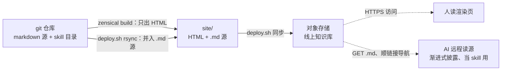

# 牛合天's wiki

用 [Zensical](https://zensical.org/) 构建、托管在对象存储上的个人知识库。

- **人看**：<https://wiki.liuhetian.work/> —— 渲染页，排版、导航、mermaid、可玩的交互 demo 齐全
- **AI 读**：<https://wiki.liuhetian.work/index.md> —— 同一份内容的 markdown 源，顺相对链接一层层走进去，把整个 wiki 当**远程 skill** 用

这个仓库特别的地方只有一件事：**构建产物不只有给人看的 HTML，还有一份随线上一起发布的 markdown 源**。为什么这样设计、"对 AI 友好"如何立成可检验的标准（人可读 / 可获取 / AI 可读 / 可寻址 / 单源），详见 [《用对象存储部署 AI 友好的个人知识库》](docs/posts/cos-wiki-deploy/index.md)。



机制上是一颗语法糖加两个写作约定：

- **语法糖**：[`deploy.sh`](deploy.sh) 里一行 rsync 把 `docs/` 的 `.md` 源树原样镜像进构建产物。`use_directory_urls` 让页面占 `/foo/index.html`，`/foo.md` 这个 key 正好空着 —— 人访问 `/foo/` 拿 HTML，AI 访问 `/foo.md` 拿同一份源，同域不撞、绝不双写
- **结构即 skill**：`docs/skills/` 按 [Anthropic skill 标准目录](https://platform.claude.com/docs/en/agents-and-tools/agent-skills/best-practices)组织（`index.md` + `reference/` + `assets/`），AI 顺 URL 读到的目录形态就是它熟悉的 skill 形态
- **代码即引用**：文章代码用 `--8<--` snippet 引用仓库里的**真实文件**（文档跟实际跑的代码永不脱节），真身软链进文章 `assets/` 随源一起发布，AI 顺 URL 走到底取到的就是最新脚本本身

## 仓库结构

```text
docs/
├── index.md          # 站点首页，也是 AI 的入口
├── posts/            # 文章（一文一目录：index.md + assets/ 真身软链 + reference/）
├── skills/           # 工作口味：按 Claude skill 标准目录组织
│   ├── fastapi/      #   FastAPI 后端开发约定（14 篇 reference）
│   ├── dashboard/    #   后台形状目录：36 形状全成文，每篇配可玩活 demo
│   └── writing/      #   写作规范（本 wiki 自己也在用）
└── vendor/           # demo 共享运行时（React UMD + htm），不走 CDN
mkdocs.yml            # Zensical 兼容配置；nav 只是给人的策展层，不在 AI 链路上
deploy.sh             # 构建 + md 源镜像 + 同步 COS（一键部署）
deploy-cert/          # HTTPS 证书自动续期（acme.sh → DNSPod → COS API）
```

## 内容导览

**文章**（[docs/posts/](docs/posts/index.md)）：

- [用对象存储部署 AI 友好的个人知识库](docs/posts/cos-wiki-deploy/index.md) —— 本仓库的定位设计与选型，配 [腾讯云 COS + acme.sh 实操手册](docs/posts/cos-wiki-deploy/reference/deploy.md)
- [建站手记](docs/posts/wiki-build-log.md) —— 过程记录，按时间做一段补一段，故意一直没写完
- [预测项目闭环](docs/posts/prediction-loop.md) —— 把「写完就扔」的脚本养成能被 AI 运维的系统

**工作口味**（[docs/skills/](docs/skills/index.md)，每套讲「怎么做、为什么这么做」，不是教程）：

- [FastAPI 后端](docs/skills/fastapi/index.md) —— 依赖注入、SQLModel 分层建模、按需参考的一整套后端约定
- [Dashboard 后台](docs/skills/dashboard/index.md) —— 不 clone 样板按「形状目录」组装：36 个页面形状，一形状一篇小文 + 一个 iframe 内嵌的可玩 React demo
- [写作口味](docs/skills/writing/index.md) —— [MkDocs Wiki 文档](docs/skills/writing/mkdocs-wiki/index.md)（本 wiki 就在用）与[报纸版 HTML](docs/skills/writing/newspaper/index.md)

## 本地开发与部署

```bash
uv sync                  # 装依赖（Python ≥3.13）
uv run zensical serve    # 本地预览
uv run zensical build    # 构建到 site/
./deploy.sh              # 构建 + md 源镜像 + 同步到 COS
```

`deploy.sh` 需要项目根有 `.env` 提供 `COS_BUCKET` / `COS_REGION` / `COS_SECRET_ID` / `COS_SECRET_KEY` / `COS_DOMAIN`（不入库）。HTTPS 证书由 [`deploy-cert/`](deploy-cert/) 的 acme.sh hook 自动续期，一次性安装跑 `deploy-cert/install.sh`，来龙去脉见[实操手册](docs/posts/cos-wiki-deploy/reference/deploy.md)。

## 写作与维护约定

规矩都沉淀在文章里，改内容前先读 [MkDocs Wiki 写作规范](docs/skills/writing/mkdocs-wiki/index.md)。几条最容易踩的：

- **引外部资料三步**：真身存档进 `assets/`（软链或 clone）+ 正文摘句 + 自己的分析；吸收整个开源项目时例外 —— 原文不本地存档，Invariants 提炼进文章、钉 commit 的 GitHub 永链指路（范例：[dashboard 的 MIRROR.md](docs/skills/dashboard/assets/open-dashboard/MIRROR.md)）
- **交互 demo**：自包含静态单页进 `assets/`，iframe 同域嵌入，逻辑不压缩（人玩交互、AI 读同一 URL 下的源码），运行时共用 `docs/vendor/`
- **nav 随便重排，链接图纹丝不动**：页面路径只由 `docs/` 里的文件位置决定，`mkdocs.yml` 的 `nav` 是纯策展层；真正动链接图的操作只有挪文件
