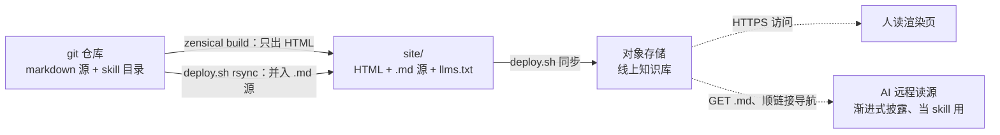

# 牛合天's wiki

用 [Zensical](https://zensical.org/) 构建、托管在对象存储上的个人知识库。

- **人看**：<https://wiki.liuhetian.work/> —— 渲染页，排版、导航、mermaid / ECharts 图、可玩的交互 demo 齐全
- **AI 读**：<https://wiki.liuhetian.work/index.md> —— 同一份内容的 markdown 源，顺相对链接一层层走进去，把整个 wiki 当**远程 skill** 用；<https://wiki.liuhetian.work/llms.txt> 是同一份首页源的 llms.txt 协议副本

这个仓库特别的地方只有一件事：**构建产物不只有给人看的 HTML，还有一份随线上一起发布的 markdown 源**。为什么这样设计、"对 AI 友好"如何立成可检验的标准（人可读 / 可获取 / AI 可读 / 可寻址 / 单源），详见 [《用对象存储部署 AI 友好的个人知识库》](docs/posts/cos-wiki-deploy/index.md)。


```mermaid
flowchart LR
    G[git 仓库<br>markdown 源 + skill 目录] -->|zensical build：只出 HTML| H[site/<br>HTML + .md 源 + llms.txt]
    G -->|deploy.sh rsync：并入 .md 源| H
    H -->|deploy.sh 同步| O[对象存储<br>线上知识库]
    O -.->|HTTPS 访问| U[人读渲染页]
    O -.->|GET .md、顺链接导航| AI[AI 远程读源<br>渐进式披露、当 skill 用]
```

机制上是一颗语法糖加两个写作约定：

- **语法糖**：[`deploy.sh`](deploy.sh) 里一行 rsync 把 `docs/` 的 `.md` 源树原样镜像进构建产物。`use_directory_urls` 让页面占 `/foo/index.html`，`/foo.md` 这个 key 正好空着 —— 人访问 `/foo/` 拿 HTML，AI 访问 `/foo.md` 拿同一份源，同域不撞、绝不双写。上传时给 `.md` 和 demo 源码（`.ts/.tsx/.jsx/.mjs/.py`）钉上文本类 Content-Type，否则 COS 按扩展名乱猜、AI 抓取工具会拒收
- **结构即 skill**：`docs/skills/` 按 [Anthropic skill 标准目录](https://platform.claude.com/docs/en/agents-and-tools/agent-skills/best-practices)组织（`index.md` + `reference/` + `assets/`），AI 顺 URL 读到的目录形态就是它熟悉的 skill 形态
- **代码即引用**：文章代码用 `--8<--` snippet 引用仓库里的**真实文件**（文档跟实际跑的代码永不脱节），真身软链进文章 `assets/` 随源一起发布，AI 顺 URL 走到底取到的就是最新脚本本身

## 仓库结构

```text
docs/
├── index.md          # 站点首页，也是 AI 的入口（浏览器里由 overrides/home.html 开屏渲染，正文仍发布为 .md 源）
├── posts/            # 文章：完整可独立阅读的复盘、观点与方法整理
├── notes/            # 笔记：概率与算法 / 统计学 / 机器学习 / Git，专业科目的学习与推导
├── skills/           # 给 AI 挂载执行的成套资产：按 Claude skill 标准目录组织
│   ├── fastapi/            #   FastAPI 后端开发约定（14 篇 reference）
│   ├── dashboard/          #   后台形状目录：36 形状全成文（35 篇），每篇配可玩活 demo
│   ├── data-visualization/ #   Lieflat Charts：48 张单色编辑型图表，每张一篇 + 一个 demo
│   ├── canvas/             #   前端画布 L1–L4 四级选型，每级一个活 demo
│   ├── writing/            #   写作口味：MkDocs Wiki（本 wiki 自用）/ 报纸版 HTML / 滚动 deck / 去 AI 味 / 檄文
│   ├── frontend-styles/    #   前端风格收集：15 种风格 + Open Design / HAOQI / ORYZO 三个官网拆解
│   └── collab/             #   和 AI 协作：CLAUDE.md 模板、盘问我、带文档盘问
├── stylesheets/      # 全站令牌层 zx-tokens.css + 皮肤层 zx-theme.css + 首页 home.css
└── vendor/           # 本地化运行时，全部不走 CDN：React UMD + htm、React ESM、three / r3f、
                      # MathJax、ECharts、Mermaid，以及 Maple Mono 字体（拉丁官方 woff2 + 自建中文子集）
overrides/            # 主题模板覆盖：home.html 首页开屏；main.html 给有 mermaid 块的页面同步引入本地真身
mkdocs.yml            # Zensical 兼容配置；nav 只是给人的策展层，不在 AI 链路上
deploy.sh             # git pull → 链路校验 → 构建 → md 源镜像 + llms.txt → 钉 Content-Type 同步 COS（一键部署）
deploy-cert/          # HTTPS 证书自动续期（acme.sh → DNSPod → COS API）
scripts/
├── check-links.py              # AI 链路闸门（父级链接 + 死链 + nav 注册），deploy.sh 构建前强制跑
├── lfs-cos-agent.py            # 自制 git-lfs custom transfer agent：媒体 blob ↔ 备份桶
├── setup-lfs.sh                # 新 clone 一次性接入上面的 LFS 后端
├── backup-media.sh             # 备份桶根下路径镜像（LFS 之前的历史双轨，仍可用）
├── fetch-vendor.sh             # 升级 MathJax / ECharts / Mermaid 版本时重拉真身
├── build-fonts.py              # 换 Maple Mono 版本时重做 woff2（中文按 GB2312 + 本站用字子集化）
└── validate-lieflat-charts.mjs # 校验 lieflat-charts 的 48 篇 reference 与 48 个 demo 一一对应
```

## 内容导览

三个顶层分区各管一类内容：**文章**把来龙去脉讲完整，**笔记**记专业科目的学习推导，**Skills** 是能直接交给 AI 执行的成套资产。

**文章**（[docs/posts/](docs/posts/index.md)）：

- [工作方法](docs/posts/methods/index.md) —— 精力管理、推进执行和做出决策
- [用对象存储部署 AI 友好的个人知识库](docs/posts/cos-wiki-deploy/index.md) —— 本仓库的定位设计与选型，配[腾讯云 COS + acme.sh 实操手册](docs/posts/cos-wiki-deploy/reference/deploy.md)与[建站手记](docs/posts/cos-wiki-deploy/reference/wiki-build-log.md)（过程记录，按时间做一段补一段，故意一直没写完）
- [用自己的对象存储做 git-lfs 后端](docs/posts/git-lfs-cos.md) —— 140 行 standalone transfer agent 替掉整个 LFS 服务
- [预测项目闭环](docs/posts/prediction-loop.md) —— 把「写完就扔」的脚本养成能被 AI 运维的系统
- [AI 时代的产品经理](docs/posts/ai-pm.md) —— 算法岗顶上 PM 缺位一个月的复盘
- [会动的网页 PPT 是怎么做出来的](docs/posts/animated-ppt/index.md) —— 关键帧图 + 首尾帧视频 + 滚动叙事引擎
- [超级轻量的自用 AI 编程 Harness 框架](docs/posts/ai-code-skeleton/index.md) —— 骨架的正逆两个方向风险相反
- [项目上线之前如何验收](docs/posts/项目上线之前如何验收.md) —— 黄金用例打底、evals 跑批、线上差评回灌离线测试集
- [让 Kindle 常显一块 Token 看板](docs/posts/kindle-dashboard/index.md) —— 墨水屏两条硬约束反推出的整套设计，附越狱、上报接口与决策日志

**笔记**（[docs/notes/](docs/notes/index.md)，每个分类有统一骨架，索引里每篇只留一行钩子）：

- [概率与算法](docs/notes/probability/index.md) —— 题 → 一句话 → 关键技巧 → 解 → 延伸
- [统计学](docs/notes/statistics/index.md) —— 从抽样设计到统计推断、统计模型与设计实务，22 篇
- [机器学习](docs/notes/machine-learning/index.md) —— 用可算的小例子拆模型概念
- [Git](docs/notes/git/index.md) —— fork 吸收上游、stash 与 worktree 的心智模型

**Skills**（[docs/skills/](docs/skills/index.md)，每套讲「怎么做、为什么这么做」，不是教程）：

- [FastAPI 后端](docs/skills/fastapi/index.md) —— 依赖注入、SQLModel 分层建模、按需参考的一整套后端约定
- [Dashboard 后台](docs/skills/dashboard/index.md) —— 不 clone 样板按「形状目录」组装：36 个页面形状，一形状一篇小文 + 一个 iframe 内嵌的可玩 React demo
- [数据可视化](docs/skills/data-visualization/index.md) —— [Lieflat Charts](docs/skills/data-visualization/lieflat-charts/index.md)：模板驱动的单色编辑型图表，基础型 / 编辑型 / 快读型 / 交互大图共 48 张
- [前端画布](docs/skills/canvas/index.md) —— 原生无限画布 → React 手写 → 数据驱动节点图 → 白板，四级比成本与实用性
- [写作口味](docs/skills/writing/index.md) —— [MkDocs Wiki 文档](docs/skills/writing/mkdocs-wiki/index.md)（本 wiki 就在用）、[报纸版 HTML](docs/skills/writing/newspaper/index.md)、[滚动 deck 工程手册](docs/skills/writing/deck/index.md)，以及吸收自开源项目的[去 AI 味](docs/skills/writing/qu-ai-wei/index.md)与[檄文](docs/skills/writing/xi-wen/index.md)
- [前端风格收集](docs/skills/frontend-styles/index.md) —— 一种风格一个可抄走的活 demo，另有 Open Design / HAOQI / ORYZO 三个官网逐效果拆解
- [和 AI 协作](docs/skills/collab/index.md) —— CLAUDE.md 初始化模板、盘问我、带文档盘问

## 本地开发与部署

**首次初始化**（新机器）：

```bash
GIT_LFS_SKIP_SMUDGE=1 git clone git@github.com:liuhetian/wiki.git && cd wiki
uv sync                          # 装依赖（Python ≥3.13）
# 放好 .env（见下）
bash scripts/setup-lfs.sh        # 接入自制 mini LFS（媒体真身在备份桶）
git lfs pull                     # 还原全部媒体（图/视频/字体/vendor 真身）
```

**日常**：

```bash
uv run zensical serve            # 本地预览
uv run zensical build            # 构建到 site/
./deploy.sh                      # git pull → check-links → 构建 → md 源镜像 + llms.txt → 同步到主 COS 桶
# 媒体不用单独管：git push 时 blob 自动上备份桶（LFS）
```

同步上线先在本地 `git commit` 并 `git push`，确保远端部署机能拉到最新版本。然后执行 `ssh lht@172.20.90.202 'export PATH=/home/lht/.local/bin:$PATH; cd /data2/work/lht/study/26.06/zensical-wiki && ./deploy.sh'`，由部署机 `git pull --ff-only` 拉取（本地有未推提交或冲突就停住，不静默合并）、构建并上传到 COS。图片等二进制媒体经 git-lfs 随 push 自动进备份桶、部署机 pull 时自动取回，不需要任何单独操作；机制与副机接入见[部署实操手册·资源备份](docs/posts/cos-wiki-deploy/reference/deploy.md#媒体备份)。

`.env` 需要（不入库）：`COS_BUCKET` / `COS_REGION` / `COS_SECRET_ID` / `COS_SECRET_KEY` / `COS_DOMAIN` / `COS_BACKUP_BUCKET`。前 5 项主桶用于部署；`COS_BACKUP_BUCKET` 是媒体真身的 LFS 桶（`lfs/` 前缀按内容寻址，历史版本永久保留，见 [`scripts/lfs-cos-agent.py`](scripts/lfs-cos-agent.py)），与部署桶隔离。只写文字的机器可以不配 `.env`（`GIT_LFS_SKIP_SMUDGE=1` clone 后照常写、push）。

**第三方真身全部本地化**，不依赖任何 CDN：MathJax / ECharts / Mermaid 由 [`scripts/fetch-vendor.sh`](scripts/fetch-vendor.sh) 拉取，Maple Mono 字体由 [`scripts/build-fonts.py`](scripts/build-fonts.py) 加工（中文字形按 GB2312 + 本站用字子集化）；两者只在升级版本时跑一次，产物经 LFS 入库，日常恢复靠 `git lfs pull`。

HTTPS 证书自动续期见 [`deploy-cert/install.sh`](deploy-cert/)，来龙去脉见[实操手册](docs/posts/cos-wiki-deploy/reference/deploy.md)。

## 写作与维护约定

规矩都沉淀在文章里，改内容前先读 [MkDocs Wiki 写作规范](docs/skills/writing/mkdocs-wiki/index.md)。几条最容易踩的：

- **引外部资料三步**：真身存档进 `assets/`（软链或 clone）+ 正文摘句 + 自己的分析；吸收整个开源项目时例外 —— 原文不本地存档，Invariants 提炼进文章、钉 commit 的 GitHub 永链指路（范例：[dashboard 的 MIRROR.md](docs/skills/dashboard/assets/open-dashboard/MIRROR.md)）
- **吸收型 skill 的 `index.md` 是上游原文照录，不许改**：本地归档的链接责任落在同目录的 `MIRROR.md` 上（范例：[xi-wen](docs/skills/writing/xi-wen/index.md)、[qu-ai-wei](docs/skills/writing/qu-ai-wei/index.md)）
- **交互 demo**：自包含静态单页进 `assets/`，iframe 同域嵌入且 `src` 写到具体 `.html` 文件，逻辑不压缩（人玩交互、AI 读同一 URL 下的源码），运行时共用 `docs/vendor/`
- **图表声明式写**：```` ```mermaid ```` 与 ```` ```echarts ```` 代码块直接渲染，真身都在本地 `vendor/`；概念配图统一白底黑色马克笔草图
- **nav 随便重排，链接图纹丝不动**：页面路径只由 `docs/` 里的文件位置决定，`mkdocs.yml` 的 `nav` 是纯策展层；真正动链接图的操作只有挪文件
- **每篇文章必须被某个祖先索引页挂一行链接**：`nav` 不在 AI 链路上，漏挂链接的文章对 AI 等于不存在。`deploy.sh` 构建前跑 [`scripts/check-links.py`](scripts/check-links.py) 强制校验（父级链接 + 死链 + nav 注册三项），不过不许部署；确实不该上链路的页在文件前 5 行写 `<!-- link-check-ok: 理由 -->` 豁免
- **不留旧地址存根页**：要保住旧 URL 就别挪文件，挪了就直接删。存根页是天生的孤儿，留着只会逼校验开豁免口子
- **首页两处同步**：`docs/index.md` 的正文发布为 AI 读的源与 `llms.txt`，浏览器开屏由 `overrides/home.html` 渲染，改首页内容要两边一起改

## 写作流程

1. 读写作规范和部署说明。
2. 写文章（可能还需要生图）、注册导航，并在父级索引页挂一行链接。
3. `python3 scripts/check-links.py` 自查链路（部署时会强制再跑一遍）。
4. git commit + push
5. SSH 主机部署。
6. 以部署脚本成功退出作为结果。

注意除非看到明确报错，否则不需要主动去浏览器或者通过网络请求查看最后的部署结果，验证这一步由人来做。
