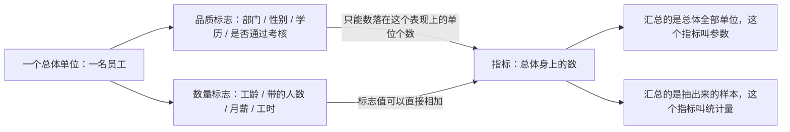

# 统计学的语法：标志是单位身上的，指标是总体身上的

> 目标：把总体、总体单位、标志、指标、变量、参数、统计量这套全书通用的词，在一张真表上一列一列认清。原书第 1 章（书页 1–18）。

## 场景

你在一家制造厂做人事口的数据。手上只有一份东西：一张 12 行的员工花名册，每行一个人，列是部门、性别、学历、工龄、带的人数、月薪、上月工时、有没有通过年度考核。表是从 HR 系统里导出来的原始登记结果，一个汇总数都没有。

四个要求同时压过来：

- 总经理要一句话：**这 12 个人的平均月薪是多少**；
- 生产总监要按部门拆：**哪个部门的人最贵**；
- 培训部要一个比例：**考核通过率**；
- 财务要你确认一件事：你报的那个平均数，**是这个厂真实的平均工资，还是只是这 12 个人的**。

前三个是算术。第四个不是 —— 它问的是你那个数字**的身份**。同一个平均数，如果这 12 人就是全厂全部员工，它是一个已经算准了的事实；如果这 12 人是从全厂 300 人里抽出来的，它就只是一个猜测，真值你根本不知道。

这一章不教任何计算。它教的是**给表上每一列、每一个汇总数起对名字**。名字起错，后面八章的每一句话都会读歪。

## 讲解

### 先定死「一个单位是什么」，总体才有形状

原书对总体的定义只有一句，但里面有两个容易滑过去的限定词：

> 总体是由客观存在的、具有某种共同性质的众多个别事物构成的整体，即在一定的研究目的下，所要研究事物的全体。总体规模用 $N$ 表示。
>
> —— 书页 8

**「在一定的研究目的下」是关键。**总体不是客观给定的，是被研究目的切出来的 —— 换个目的，同一批实物就重新分组。原书连举三例（书页 8）：研究学生学习情况，总体是全校学生、单位是一个学生；研究某市工业生产情况，单位是一个企业；研究工业生产设备情况，单位是一台设备。**注意第二例和第三例在同一个城市里，实物有重叠（设备就装在企业里），但单位不同，总体就是两个不同的总体。**

所以拿到任何一张表，第一件事是回答「一行是什么」。一行是一个人，总体就是人的集合；一行是一台设备，总体就是设备的集合。这个答案定下来，$N$ 才有意义 —— $N$ 数的是**行**，不是格子。

样本的定义跟着来（书页 8）：样本是从总体中抽出的一部分个体，容量记 $n$，且 $n$ 小于 $N$。原书特意强调了一句不对称：

> 一个样本单位必定是一个总体单位；样本是总体的代表，带来了总体的信息，与总体有同质的数量特征；样本具有随机性，而研究目的一经确定，总体就是唯一的。
>
> —— 书页 8

「总体唯一、样本随机」这条不对称是第 6 章之后全部内容的地基：同一个总体你能抽出无数个不同的样本，所以**样本算出来的数每次都不一样，总体的那个数只有一个**。本章到这里为止，样本每次抽都变、变成什么样，属于第 6 章。

### 标志是单位身上的，指标是总体身上的

这是全章最值钱的一条，也是最容易混的一条。两个定义各自都很短：

> 标志是说明总体单位特征的概念，所以也称为单位标志或单位标识，在统计调查中称为调查项目或登记项目。
>
> —— 书页 9

> 统计指标简称为指标，是反映总体数量特征的概念与具体数值。
>
> —— 书页 10

差别只在**挂在谁身上**：标志挂在一个单位身上，指标挂在整个总体身上。同一件事换个观察层级就换个名字 —— 一个人的「月薪」是数量标志，一群人的「平均月薪」是指标。所以「这是标志还是指标」这个问题根本不用背，只要问「这个数说的是一个人还是一群人」。

两者之间的通道是一句话：

> 指标与标志有密切的联系，指标数值总是汇总标志值或总体单位而得到的。
>
> —— 书页 11

**注意这句话里有两条通道，不是一条。**数量标志走「汇总标志值」—— 月薪能直接相加。品质标志走「汇总总体单位」—— 「男」「女」不能相加，只能去数有多少个单位落在「男」这个表现上。原书在同页把这条说得很死：品质标志的表现不是数值，只有把它对应的单位数汇总起来，才成为指标。



还有一条不对称值得单独记：**标志未必可量，指标一定可量**（书页 11）。任何指标都是数，哪怕它来源于一个纯文字的品质标志 —— 「男性多少人」问出来是个数，「男」本身不是。

### 品质标志、数量标志、是非标志：判据是「表现能不能用数字」

原书的判据只看**标志的具体表现**（叫标志值）长什么样，不看这列在你表里存成了什么类型：

- **品质标志** —— 具体表现只能用文字表示，表明单位的属性。书页 9 的例子：性别、籍贯、婚姻状况、所有制性质。
- **数量标志** —— 具体表现可以取不同的数字，表明单位的数量特征。书页 9–10 的例子：年龄、职工人数、固定资产、利润额。
- **是非标志** —— 品质标志的一个特例，只有「是」或者「非」两种表现（书页 9）。原书的例子是「产品合格与否」「家庭是否有电脑」。

这里有一个坑：**「只有两种表现」不等于「是非标志」**。原书把「性别」列为品质标志的例子，而不是是非标志的例子 —— 因为它的两种表现是「男」「女」，不是「是」「非」。要把性别变成是非标志，得先把提法改写成「是否为男性」。判据看的是表现的形式，不是表现的个数。

另一个坑是**代码不是数量**。书页 12 讲得很明确：为了便于计算机处理，人们可以用 0、1、2 或 A、B、C 代表定类数据，但那只是代码，「它们之间没有数量上的关系和差异」。一列部门存成 1/2/3，它还是品质标志，平均值算出来是一堆没有意义的小数。

### 变量与四个计量尺度：决定你能对这列数做什么运算

「变量」是把标志和指标名称一起收进来的上位词：

> 在统计中，我们称说明现象某种数量特征的概念为变量。按照这个定义，指标名称和标志都是变量。
>
> —— 书页 11

所以「变量」不是第三个新东西，是标志和指标名称的合称；它的具体表现叫变量值，也就是统计数据。原书图 1.2（书页 11）的分类树，按页图重排是这样：

- 定性变量 —— 定类变量、定序变量
- 定量变量 —— 定距变量、定比变量（定比变量再分离散变量、连续变量）

离散与连续的判据在同页：**离散变量是可以一一列举的量，其取值都是整数**（如机构数、学生人数、设备台数）；**连续变量是不能一一列举的量，任意两个变量值之间都有无穷多个变量值**（如重量、长度、零件尺寸误差）。

!!! warning "这把尺子有两半，而两半会打架"
    「可以一一列举」和「取值都是整数」是并列给出的两个条件，但它们**不总是同时成立**：一列记到 0.5 为止的工时（152.0、152.5、160.0…）可以一一列举，却不都是整数 —— 按前半条算离散，按后半条算连续。原书没有处理这种情形。

    **本课统一只用后半条：看这一列登记下来的取值是不是都是整数。** 全表口径一致，才谈得上对错；换口径要整表一起换，不能一列一个标准。这不是原书的规定，是本课为了让答案唯一而做的约定。

四个计量尺度真正在管的事，是**这列数你被允许做什么运算**。判据是「这些表现之间有没有高低之分」：**只有两种表现的品质标志（是／否、男／女）两种表现之间没有高低，所以落定类，不落定序**；定序要求的是能排出先后，比如学历的四档。

这是原书图 1.3（书页 14）的内容，按页图重排：

| 名称 | 数学特性 | 原书给的例子 |
|---|---|---|
| 定类尺度 | $=$、$\ne$ | 专业、性别、籍贯 |
| 定序尺度 | $=$、$\ne$、$>$、$<$ | 满意度、奖学金等级 |
| 定距尺度 | $=$、$\ne$、$>$、$<$；数值之差有意义；没有绝对 0 点 | 温度、服装和鞋的号码 |
| 定比尺度 | $=$、$\ne$、$>$、$<$、$+$、$-$、$\times$、$\div$；0 及数值之比有意义 | 成绩分数、学生人数、收入 |

四层是嵌套的，**后一层包含前一层的全部信息，能往下转换，不能往上**（书页 13–14）。三条实用后果：

- 定序数据「不能进行加、减、乘、除运算」（书页 12）—— 学历编成 1/2/3/4 再求平均，算出来那个小数不对应任何一档学历；
- 定距数据「只能计算差距，不能计算比率」（书页 14）—— 20 摄氏度不是 10 摄氏度的两倍热，因为 0 摄氏度不是「没有温度」；
- 定比数据有真正的 0 值，所以比值才有意义 —— 月薪 8000 是 4000 的两倍，这句话成立，因为月薪 0 元就是没有工资。

!!! note "原书把定距数据摘出去了"
    书页 14 的脚注①明说：后续章节不涉及定距数据，所以此后一律把定比数据称为定量数据、数值型数据。也就是说从第 2 章起，你实际只需要区分三类：定类、定序、数值型。

### 参数和统计量：同一个平均数，两个身份

这一节为第 6、7 章埋线，本章只要求认名字。两个定义都在书页 14：

> 参数是反映总体某种特征的量，是根据总体所有数据来计算的……由于实际中往往不可能收集齐总体所有的数据，所以参数的真实数值往往也是未知的，需要利用样本数据去估计或推断。
>
> —— 书页 14

> 统计量也被称为样本指标，是根据样本数据计算的、不含任何未知总体参数的量……样本是从总体中随机抽取的部分单位构成的整体，是实际进行调查登记的对象，因此其数据是可知的，统计量也是可知的。
>
> —— 书页 14

两句话对比着读，分工是干净的：**参数属于总体，通常未知；统计量属于样本，一定算得出来**。

要紧的是：**判据不在公式上，在你手里那批数据是全体还是一部分。**「平均月薪」这个算法本身既不是参数也不是统计量 —— 它的身份由「参加汇总的这批单位是不是总体的全部」决定。公式一个字没变，身份变了，能说的话就完全不同：一个是结论，另一个只是用来猜那个结论的材料。

原书顺手点了一句「常用的构造统计量有 $Z$ 统计量、$t$ 统计量、$\chi^2$ 统计量、$F$ 统计量等」（书页 15）—— 这四个东西怎么构造、各自怎么分布，属于第 6 章，本章不碰。「用统计量去估计参数，误差有多大」属于第 7 章。

### 一个能手算的小例子

三名员工，只看两列：

| 员工 | 性别 | 月薪（元） |
|---|---|---|
| 甲 | 男 | 5400 |
| 乙 | 女 | 6000 |
| 丙 | 女 | 6600 |

- **月薪**是数量标志，三个标志值是 5400、6000、6600。走「汇总标志值」这条通道：工资总额 $18000$ 元（总量指标，属数量指标）、平均月薪 $6000$ 元／人（平均指标，属质量指标）。
- **按组还原总和**：把三个人按性别分成两组，男组 1 人均 5400、女组 2 人均 6300，$(1\times5400+2\times6300)/3=18000/3=6000$ —— 跟直接平均一个数。**能还原回去的前提是权重用人数，不是组数**；拿 $(5400+6300)/2=5850$ 就错了。这是本课唯一需要的"加权"动作；把加权平均本身当成一个指标来讨论，属第 3 章。
- **性别**是品质标志，三个标志值是男、女、女，**加不起来**。只能走「汇总总体单位」那条通道：女性 2 人（总量指标，属数量指标）、女性占比 $2/3\approx66.7\%$（相对指标，属质量指标）。

一个指标要立得住，**三要素缺一不可：名称、数值、计量单位**。「平均月薪 6000」不是指标，是一个数 —— 没说单位，就没说清一元钱还是一万元、是每人还是每月。本课统一口径：总量指标写「人」或「元」，平均指标写「元／人」「年／人」这样的复合单位，相对指标写「%」。

两个指标分类方式的对应关系，是原书图 1.1（书页 10）的内容，按页图重排：

| 按表现形式 | 按反映的数量特点 |
|---|---|
| 总量指标 | 数量指标 |
| 相对指标 | 质量指标 |
| 平均指标 | 质量指标 |

最后看一眼那个 6000 元：它**恰好等于乙的月薪**，但它不是乙的标志值 —— 它是这三个人合起来的一个数，乙换成 6200，它就变成 6066.67，而乙自己的标志值只跟乙有关。这就是「指标在总体身上」的字面意思。而这 6000 元叫参数还是统计量，取决于这三个人是全体还是抽样 —— 表上看不出来，必须问清楚。

??? warning "原书这几处印刷有误 —— 对着纸书读时注意"

    每条都经过两轮独立核对：先由重排内容的人对着 300dpi 页图提出，再由另一个只拿页图、不看重排结果的人放大复核。**本页正文一律不跟随这些错处。**

    | 书页 | 原书印的 | 应该是 |
    |---|---|---|
    | 9 | 「构成一个总体的总体单位若是不可数的，即为无限总体」，紧接的例子是「连续生产线的产品产量」 | 产品件数是可列无穷、数学上属可数；同段的分类依据句又印作「是否可以计量」，与「可数」不是一回事 |
    | 11 | 图 1.2 把「离散变量／连续变量」只挂在**定比变量**下 | 定距变量同样有离散与连续之分（书页 13 自己举的服装号码与温度就是一对）。本页照原样重排、不上提一级，也刻意没据此出判断题 |
    | 13 | 表 1.1「国际」行第 5、6 格印作 `LX`、`LLX`，而第 7 格又印 `XXXL` | 通行作 `XL`、`XXL`；同表「中国」行第 7 格只有框线没有字，是全表唯一的缺格 |
    | 13 | 「0 号内衣不代表其不存在」 | 多了一重否定 —— 要否掉的是「0 号内衣代表其不存在」。同页温度例子的立场正好相反：「0 摄氏度也是温度的一种状况，绝不代表温度不存在」 |
    | 10 | 数量标志的例子同句两次印作「总额利润」 | 书页 9 另一处列举里写的是「利润额」 |
    | 12 | 「定类数据**的**只能」 | 衍字，下一段「定序数据不仅可以」无此字 |
    | 17 | 本章小结按计量尺度只列「定类、定序和数值型」三类 | 丢了定距一整类，与正文的四分法不一致（脚注①只交代了定比→数值型的改名）
## 准备

数据表一份，在本课 `assets/` 下：

- [12 名员工的原始登记表](assets/ch01-overview/staff-roster.csv) —— 每行一名员工，9 列

列名与含义：

| 列 | 含义 | 记录方式 |
|---|---|---|
| `emp_id` | 员工编号 | E01–E12 |
| `dept` | 所在部门 | 生产 / 质检 / 仓储 |
| `gender` | 性别 | 男 / 女 |
| `education` | 最高学历 | 中专 / 大专 / 本科 / 硕士 |
| `tenure_years` | 工龄 | 入职日期到今天的时长，**截断到整年** |
| `headcount_led` | 直接带的人数 | 不带人记 0；**记的是他在全厂管的人数，被管的人不一定在本表这 12 行里** |
| `monthly_salary` | 上月月薪 | 实发金额，**四舍五入到元** |
| `work_hours` | 上月工时 | 打卡时间戳相减，**截断到 0.5 小时** |
| `certified` | 年度考核是否通过 | 是 / 否 |

**「记录方式」那一列是故意写出来的，不是凑字数。**有些列的整数是登记规则压出来的（截断、四舍五入），有些列的整数是计量对象本身不可分。所以要先想清楚一件事：原书书页 11 那把尺子量的到底是**登记下来的取值**，还是**现实中那个量**？这两者在有些列上会给出不同答案。Q2 会让你逐列判，这里不先说结论。

这张表就是原书书页 12 说的**原始数据**：「主要是说明总体单位特征的数据」。你在这一课里做的全部事情，就是把它加工成书页 12 说的**综合数据** —— 「用以说明总体特征的数据即统计指标数字」。

这 12 行是全厂全部员工还是抽出来的一部分，**题目里会分别给条件**，别自己假定。

!!! info "本章不需要任何统计公式"
    所有汇总值都是计数、求和、求平均。**方差、标准差、中位数、众数属于第 3 章**，这一课不要算，也不要贴。

算工具随便挑。原书 1.4 节（书页 15–17）讲的就是 Excel，顺手用上：

| 用途 | Excel / WPS |
|---|---|
| 数一列里有几个非空单元格 | `COUNTA` |
| 按条件数个数（某部门几人、通过几人） | `COUNTIF` / `COUNTIFS` |
| 求和、求平均 | `SUM` / `AVERAGE` |
| 按条件求平均（某部门的平均月薪） | `AVERAGEIF` / `AVERAGEIFS` |
| 一次出全部交叉分组 | 数据 → 数据透视表 |

!!! warning "三个真会咬人的坑"
    **`COUNT` 不数文字。**`COUNT` 只统计数值单元格，拿它数 `dept` 或 `gender` 列会得到 0 —— 不是列空了，是函数选错了，文字列要用 `COUNTA` 或 `COUNTIF`。

    **`AVERAGE` 跳过空单元格，不跳过 0。**`headcount_led` 里不带人的记的是 0，`AVERAGE` 会把这些 0 一并算进分母；如果谁把那些 0 删成空白，同一个公式的分母就悄悄换了一批人，结果跟着变，而公式栏里一个字都没改 —— 换成了谁、结果差多少，Q5 会让你自己算出来对照。**你算任何一个平均值，都要能说出分母是几、为什么是几。**

    **中文排序把定序列弄乱。**把 `education` 列丢给 Excel 升序排，默认按拼音排；同一列交给按 Unicode 码位排序的工具（如 Python 的 `sorted`），出来的是另一套顺序。两个工具给两个结果，而其中至多一个碰巧跟学历等级对得上 —— 碰巧对上不等于工具懂等级。这说明**定序数据的等级顺序不在字符串里**，想让工具按等级排，必须自己给一张映射表。

原书 1.4.1 提到的「数据 → 数据分析」工具库（书页 15）这一课用不上：它的「描述统计」一次吐出方差、标准差、偏度这些第 3 章的量，本章还没有资格解释它们。

## 任务

把这张原始登记表读成一套名字，再加工成一组指标。

先认表：这 12 行构成的总体是什么、总体单位是什么、$N$ 是多少，以及 9 列里哪些是标志、哪些根本不是标志。然后给每个标志列贴三个标签 —— 品质还是数量、按原书判据是离散还是连续、落在四个计量尺度的哪一层。

再把标志汇总成指标：做出若干个有名字、有数值、有计量单位的指标（原书书页 10 说指标的三要素就是这三样），每个都标出它按表现形式属哪一类、按反映的数量特点属哪一类。**品质标志列和数量标志列走的通道不一样，汇总时自己分清。**

最后回答财务那个问题：你报的每个汇总数，在「这 12 人就是全厂」和「这 12 人是从 300 人里抽的」两种条件下，各自叫什么、哪一个是已知的、哪一个只是猜测。

## 验收

- 「一行是什么」有一句明确回答，$N$ 的值与表的行数对得上，且没有把列数、格子数混进来；
- 9 列每一列都被归了类，包括那个不属于任何一类的列 —— 并且能说出它为什么不属于；
- 每个「品质／数量」的判断都能指回原书的判据（表现能不能用数字），不是按 CSV 里存的是文字还是数字判的；
- 每个「离散／连续」的判断都说明了用的是哪半条判据（本课统一用「取值是不是整数」那半条），并且说清这把尺子量的是登记下来的取值、还是现实中那个量；全表口径一致，没有哪一列偷偷换成了另一半判据；
- 每个指标都写全了三要素：名称、数值、计量单位。缺计量单位的不算指标，只算一个数；
- 每个平均值都单独说出了分母是几、分母是谁给的 —— 不是把 `AVERAGE` 的结果原样贴上来；
- 交叉核对那题的两条路径都贴出了中间量（各组的组内均值和各组人数），且两条路径的最终结果**完全相等**，不是差一点点 —— 对不上就是某一组的人数或组内均值用错了；
- 「参数还是统计量」的回答落在数据范围上（这 12 人是不是全体），不落在公式上；
- 全程没有出现方差、标准差、中位数、众数，也没有出现抽样分布、区间、检验这些后面章节的词。

## 提问

```conflict
<<<<<<< courses/statistics-book/ch01-overview
Q1 先认这张表
读 staff-roster.csv，回答四问：这 12 行构成的总体是什么（用一句话把研究目的和共同性质都说进去）、总体单位是什么、N 等于几、样本容量 n 在这一题里有没有值。
然后指出：9 个列名里有一列不是标志。是哪一列？按书页 9 对标志的定义，说清它为什么不是 —— 它没有说明总体单位的什么。
最后做一次反例练习：如果研究目的换成「各部门之间的用工成本比较」，总体单位就从一名员工换成了一个部门，那时 N 等于几？这个 N 要自己从表里数出来。把两个 N 都贴出来。
=======
>>>>>>> notes
```

```conflict
<<<<<<< courses/statistics-book/ch01-overview
Q2 八个标志列各贴三个标签
把除那一列以外的 8 个标志列做成一张表，每列填三格：
一、品质标志还是数量标志；
二、按书页 11 的判据判断离散还是连续，判据只看这一列登记下来的取值是不是都是整数 —— 品质标志列这一格写「不适用」并说明为什么；
三、落在定类、定序、定距、定比哪一个尺度上。
三格填完后回答四个追问：
甲、8 列里只有一列在书页 9 的意义上是「是非标志」，是哪一列？再从剩下 7 列里挑出一列，把它的提法改写成一个是非标志（写出改写后的提法），并说清改写动了什么、没动什么。
乙、tenure_years 按上面那把尺子归了哪一类？它的真身是「入职日期到今天的时间长度」，这个量本身是连续的还是离散的？同一列两个答案并不矛盾，说清那把尺子量的到底是什么。
丙、8 列里有且只有一列，它的整数性不是登记规则造成的，而是计量对象本身不可分。是哪一列？
丁、如果公司改了记录规则，monthly_salary 从此会出现 5200.50 这样的数，这一列按同一把尺子的归类会不会变？丙那一列会不会变？两者一个变一个不变，说明这把尺子实际上依赖什么。
=======
>>>>>>> notes
```

```conflict
<<<<<<< courses/statistics-book/ch01-overview
Q3 把标志汇总成六个指标
算出下面六个指标，每个都写全三要素（名称、数值、计量单位；单位按讲解里那条口径写，除不尽的保留两位小数），并各标两类：按表现形式属总量／相对／平均指标的哪一个，按反映的数量特点属数量指标还是质量指标。
一、员工总数；二、工资总额；三、平均月薪；四、平均工龄；五、年度考核通过率；六、生产部门人数占全体的比重。
六个算完后，指出哪几个是走「汇总标志值」得到的、哪几个是走「汇总总体单位」得到的，并说清 certified 这一列为什么只能走后一条通道。
=======
>>>>>>> notes
```

```conflict
<<<<<<< courses/statistics-book/ch01-overview
Q4 两条路径回到同一个平均月薪
第一条路径：按 dept 分组，贴出三个部门各自的人数和组内平均月薪，共六个数。
第二条路径：按 gender 分组，贴出两组各自的人数和组内平均月薪，共四个数。
然后各自把组内均值按人数加权合回全体平均月薪，两条路径的结果贴出来比一比 —— 它们应当完全相等，也应当等于你在 Q3 里直接算的那个数。三个数一起贴。
最后回答：为什么「把三个部门的平均月薪直接再平均一次」得到的不是全体平均月薪？把那个错的数也算出来贴上，并指出它实际上是在给哪三个数各配多少权重。
=======
>>>>>>> notes
```

```conflict
<<<<<<< courses/statistics-book/ch01-overview
Q5 分母是谁给的
headcount_led 这一列，算出两个不同的「平均带人数」并都贴出来：一个的分母是全部 12 名员工，一个的分母只是实际带人的那几名员工。两个数值、两个分母都写出来。
然后做一次工具对照实验：把那些记 0 的单元格删成空白，再用同一个 AVERAGE 公式算一遍，把结果贴出来，说清它等于上面两个数里的哪一个、为什么。
最后分两问作答，每问指定一个平均值并给理由：① 要回答「全厂平摊下来，每名员工身上分到多少管理职责」，该用哪一个？② 要回答「带人的那几个人，平均each带多大一支队伍」，该用哪一个？两问答完再说清：分母换人等于总体换了，不是同一个指标的两种算法。
=======
>>>>>>> notes
```

```conflict
<<<<<<< courses/statistics-book/ch01-overview
Q6 同一个平均月薪，两个身份
拿你在 Q3 里算出的那个平均月薪，分两种条件回答，每种都要说出名字：
条件甲：这 12 人就是全厂全部员工。这时这个数叫什么？它是已知的还是未知的？按书页 14 的定义，它还需不需要被估计？
条件乙：这 12 人是从全厂 300 名员工里随机抽出来的。这时这个数叫什么？此时全厂真实的平均月薪叫什么、是已知还是未知、数值是多少？
然后指出一件事：从甲到乙，这张表里的数一个都没动、算法也没换。那么把这个数从一种身份改判成另一种，你依据的是**表外**的哪一个事实？这个事实能不能从 CSV 本身看出来？
最后按书页 14 对统计量的判据做一次排除：「全厂平均月薪与你算出的那个数之差」这个量，在条件乙下算不算统计量？为什么？
=======
>>>>>>> notes
```

```conflict
<<<<<<< courses/statistics-book/ch01-overview
Q7 定序列的顺序不在字符串里
把 education 列去重后升序排一次，用两个工具各排一遍（例如 Excel 的排序和任意编程语言的默认字符串排序），两个结果都贴出来。
然后贴出第三个顺序：这四档学历按等级从低到高的正确顺序。
三个顺序摆在一起后回答两问：为什么两个工具给出的顺序不一样？三个顺序里有一个碰巧与等级顺序逐项相同 —— 指出是哪一个，并说清为什么这种「碰巧」不能当成「这个工具懂等级」的证据（想不通就把「中专」改成「专科」再排一次，看它还对不对）。
最后按书页 12 对定序数据计算功能的说法做一次判断：把四档学历编成 1、2、3、4 之后算出的「平均学历」，这个数在本表上等于多少？把它算出来贴上，然后说清为什么它不对应任何一档学历 —— 并指出它和 Q3 里的平均工龄有什么本质区别。
=======
>>>>>>> notes
```

```conflict
<<<<<<< courses/statistics-book/ch01-overview
一句话
这一章教会你的最有用的一句话是什么。
=======
>>>>>>> notes
```

```conflict
<<<<<<< courses/statistics-book/ch01-overview
心智模型
用自己的话说清标志、指标、参数、统计量四个词的关系：哪个挂在单位身上、哪个挂在总体身上、后两个的分界线在哪里。不抄定义，要能解释你在 Q2、Q3、Q6 里每一格填的依据。
=======
>>>>>>> notes
```

```conflict
<<<<<<< courses/statistics-book/ch01-overview
坑
这一课你实际踩到的坑是哪个，怎么发现填错或算错了的。
=======
>>>>>>> notes
```
