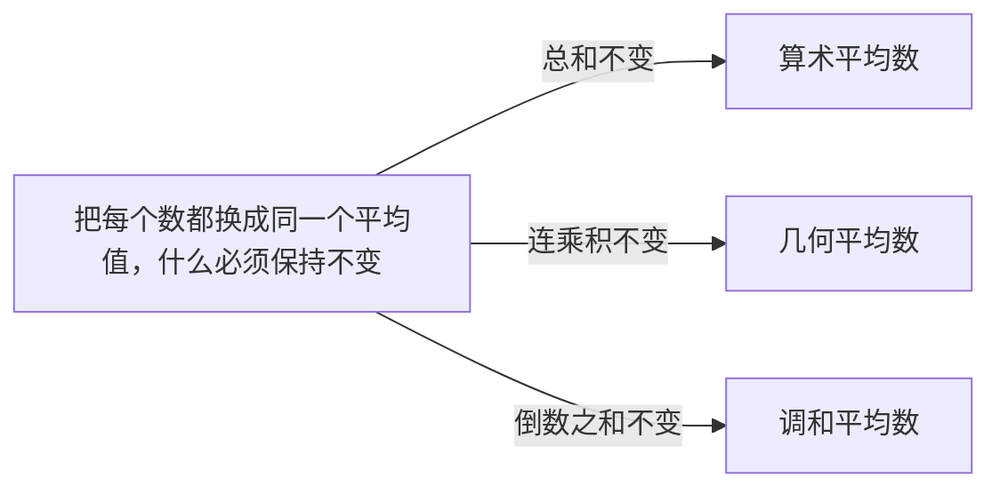

# 统计指标：每个指标回答一个不同的问题，选哪个平均数取决于什么量不变

> 目标：说清每个描述统计指标各自在回答哪个问题，以及未分组数据与分组数据为什么是两套公式。原书第 3 章（书页 39–67）。

## 场景

你在一家社区团购公司管配送网络，全市 11 个配送站。月度复盘会上老板连问了五句，每一句听起来都是"平均一下"：

- 一个站**典型**能干多少单？
- 站跟站之间**差得大不大**？是订单量差得大，还是每单配送时长差得大？
- 这四年 GMV **平均增长**多少？
- 跨城那趟车走完四段路，**平均时速**多少？
- 单位配送成本的降本计划，到底**完成没完成**？

五个"平均"要用五套不同的算法，用错一个就报一个假数。第二句还多一层麻烦：订单量以"单"计、量级在几百，配送时长以"分钟"计、量级在几十 —— 两列各自算出来的标准差，单位都不一样，不能直接比大小。

这一章就是把"平均一下"拆开，拆成一组各有分工的指标，并且说清**每个指标在回答哪个问题**。

## 讲解

### 一张表：哪个问题该找哪个指标

整章的指标不是一张要背的清单，是一组各管一件事的工具。先按"它在回答什么问题"摆开：

| 你真正想问的 | 该找的指标 | 原书式号 |
|---|---|---|
| 总量摊到每个单位是多少 | 算术平均数 $\bar x$ | (3.11) / (3.12) |
| 按增长率连着乘，平均每期乘多少 | 几何平均数 $\bar x_G$ | (3.15) / (3.16) |
| 每份"分子量"固定时的平均比率 | 调和平均数 | (3.14) |
| 排在正中间那个单位是多少 | 中位数 $M_e$ | (3.19) / (3.20) |
| 最常见的取值是什么 | 众数 $M_o$ | (3.17) / (3.18) |
| 两头拉开多远 | 极差 $R$ | (3.23) |
| 中间一半拉开多远 | 四分位差 $Q_D$ | (3.24) |
| 平均离中心多远 | 平均差 $A.D$、标准差 $\sigma$ | (3.25)–(3.28) |
| 相对于自己的水平算不算散 | 离散系数 $V_\sigma$ | (3.29) |
| 往哪边偏、偏多少 | 偏度 $Skew$ | (3.32)–(3.35) |
| 峰尖还是峰平 | 峰度 $Kurt$ | (3.36) / (3.37) |

两条一开始就得立住的规矩：

**第一，带"均"字的不一定是平均数。** 原书在讲强度相对数时专门点了这件事：

> 有些强度相对数含有"均"的字样，但它们不是平均数，与算术平均数是有区别的。
>
> —— 书页 44

人均 GDP、人口密度、每万人拥有的商店数都长着"均"字，但它们是**两个性质不同的现象之比**（式 3.5），分子分母来自两个不同的总体，谈不上"把差异抽象掉"。真正的算术平均数是同一总体内部**标志总量除单位总量**（式 3.10）—— 分母必须是分子那批单位的个数。分不清这一条，后面的加权就会把权数配错。

**第二，相对数的平均要回到相对数自己的定义式去算。** 原书用计划完成程度举了个反例：

> 计划完成相对数（程度）的计算公式是实际完成数与计划任务数之比，因此，平均计划完成程度的计算只能是所有企业的实际完成数与其计划任务数之比，不能把各个企业的计划完成百分数简单平均。
>
> —— 书页 49

这是本章最容易犯的错：手里是一列百分数，就直接把百分数平均了。但百分数是个比值，平均它必须先把分子和分母各自加总。这条规矩下面讲调和平均数时会再出现一次 —— 调和平均法就是"分母没给、得先反算出来"时的那个形状。

计划完成相对数还有一处专门的坑，原书把它写成了单独一式（书页 44）：

$$
\text{计划完成相对数}=\frac{100\%\pm\text{实际增减率}}{100\%\pm\text{计划增减率}}\times100\% \quad \text{(3.7)}
$$

**分子分母都要带上 100% 这个基数**，不能拿实际降低率直接除计划降低率。而且对**逆指标**（成本、废品率这类越小越好的），计划完成相对数**低于** 100% 才是超额完成 —— 方向跟正指标相反。

### 三个平均数：判据是"替换之后什么必须不变"

算术、几何、调和不是三种风格，是三种**保量**。选哪个，看你要平均的那批数背后**哪一个总量不许动**。



**和不变 → 算术平均数。** 简单式与加权式（书页 46）：

$$
\bar x=\frac{\sum x}{n},\qquad
\bar x=\frac{\sum xf}{\sum f} \quad \text{(3.11) (3.12)}
$$

用比重权数写出来是同一件事（式 3.13）：$\bar x=\sum x\cdot\dfrac{f}{\sum f}$。权数的实质就是"这一组占总体多大比重"，占得多的那组话语权大。它有两条数学性质（书页 49–50），都是做题时的硬自查点：

$$
\sum(x-\bar x)=0,\qquad \sum(x-\bar x)^2=\min
$$

第一条是"正离差抵掉负离差"，所以离差之和算出来不是 0 就说明均值错了。第二条说以**任何别的数为中心**，离差平方和都更大 —— 原书的证明只用了一步配方：设 $x_0-\bar x=c\neq0$，则 $\sum(x-x_0)^2=\sum(x-\bar x)^2+nc^2$，而 $nc^2>0$。这一条是"算术平均数是集中趋势最好的代表值"这句话的全部内容，不是修辞。

**积不变 → 几何平均数。** 简单式与加权式（书页 50）：

$$
\bar x_G=\sqrt[n]{x_1\cdot x_2\cdots x_n}=\sqrt[n]{\prod x},
\qquad
\bar x_G=\sqrt[\sum f]{\prod x^{f}} \quad \text{(3.15) (3.16)}
$$

增长率、合格率、利率这类量是**连着乘**起来生效的：四年的总增长等于四个增长因子 $(1+r_i)$ 的乘积，不等于它们的和。所以要平均的必须是保住这个乘积的那个数。原书给的前提条件很关键：

> 必须指出的是，社会经济统计中计算几何平均数的前提是各个变量值的乘积有经济意义。
>
> —— 书页 50

反过来用这句话就是判据：**如果把这批数连乘起来得到的东西你说不出是什么，就不该用几何平均数。** 五道工序的合格率连乘是整条线的合格率，有意义；十一个站的订单量连乘是什么？没有意义 —— 那就用算术平均数。

注意几何平均数是对**增长因子** $1+r$ 开方，不是对增长率 $r$ 开方，算完要再减 1 才是平均增长率。原书那个 12 年平均利率的例子（书页 50）就是这么写的：$\bar x_G-1=\sqrt[12]{1.03^4\times1.05^2\times1.08^2\times1.10^3\times1.15}-1\approx6.85\%$，指数上的 $4,2,2,3,1$ 就是 (3.16) 里的 $f$。

**倒数之和不变 → 调和平均数。** 原书是从"资料残缺"的角度引进它的（书页 48）：手上只有各组的变量值 $x$ 和各组的**分子量** $xf$，分母 $f$ 没给，那就得先用除法把 $f$ 反算出来，再套回基本公式：

$$
\bar x=\frac{\sum xf}{\sum\dfrac{1}{x}\,xf} \quad \text{(3.14)}
$$

分母那一项 $\dfrac{1}{x}xf$ 就是反算出来的 $f$。**所以调和平均数不是一个新概念，是加权算术平均数在"权数得先算出来"时的变形** —— 原书的原话是"在社会经济现象中，调和平均法往往是加权算术平均法的变形"（书页 48）。

它在现实里出现的判据是：**每一份的分子量固定，分母量不同**。速度就是典型 —— 每段路程固定、耗时不同，平均时速只能是总路程除总时间；单位成本也是 —— 每家采购金额固定、件数不同，平均单价只能是总金额除总件数。

三者的大小关系是固定的，同一批正数恒有 $\bar x\ge\bar x_G\ge\bar x_H$（这里用 $\bar x_H$ 记调和平均数，原书 (3.14) 里直接写作 $\bar x$）。拿 $1,2,4,8$ 试一遍最快：

$$
\bar x=\frac{15}{4}=3.75,\qquad
\bar x_G=\sqrt[4]{64}\approx2.828,\qquad
\bar x_H=\frac{4}{1+\frac12+\frac14+\frac18}=\frac{32}{15}\approx2.133
$$

所以**用错平均数不是"差一点"，是系统性地往一个方向报错**：拿算术平均数去报增长率，一定报高；拿算术平均数去报速度，也一定报高。

### 位置平均数：众数和中位数不用全部数据

众数是出现次数最多的变量值，中位数是排序后位居正中的那个。两者都只看位置，所以**不受极端值影响** —— 这正是它们在有异常值时比均值更可信的原因。

众数不是总存在的。原书给了两个前提（书页 51）：一是总体单位总量必须相当大；二是次数分布须有明显的集中趋势。频率都差不多的数列算出来的"众数"没有代表性，两处峰值差不多的数列则有两个众数。

未分组数据找众数就是数频数。中位数按项数奇偶分两种（书页 52）：

$$
M_e=\begin{cases}
X_{\left(\frac{n+1}{2}\right)}, & n\text{ 为奇数}\\[4pt]
\dfrac{1}{2}\left(X_{\frac{n}{2}}+X_{\frac{n}{2}+1}\right), & n\text{ 为偶数}
\end{cases} \quad \text{(3.19)}
$$

分位数统一按位置公式定位（书页 53）：

$$
Q_p\text{ 的位置}=(n+1)\frac{p}{M},\qquad M=4;\,10;\,100 \quad \text{(3.22)}
$$

所以下四分位数 $Q_1$ 的位置是 $\dfrac{n+1}{4}$，上四分位数 $Q_3$ 的位置是 $\dfrac{3(n+1)}{4}$，$Q_2$ 就是中位数。**位置算出来不落在某一项上时，按比例分摊两侧数据的差值**（书页 53–54）。原书 9 名学生成绩那个例子（书页 54）就是这么做的：$Q_1$ 的位置 $=\dfrac{9+1}{4}=2.5$，于是 $Q_1=\dfrac{72+73}{2}=72.5$。**注意「分摊」是按小数部分线性插值，不是一律取两项平均** —— 位置 2.5 恰好各占一半才等于取平均；若位置算成 2.75，则取第 2 项加上两项差值的 0.75 倍，$x_2+0.75(x_3-x_2)$。这一条在样本量变成偶数时就会用上。

一个免费的自查点藏在这个公式里：$Q_1$ 与 $Q_3$ 的位置之**和**恒等于 $n+1$。两个位置算完先加一下，不对就是位置公式用错了。

三个中心值的相对位置直接读出分布形状（书页 53，图 3.2）：

| 形状 | 三者关系 |
|---|---|
| 对称钟形 | $\bar x=M_e=M_o$ |
| 左偏（负偏） | $\bar x<M_e<M_o$ |
| 右偏（正偏） | $\bar x>M_e>M_o$ |

记法只有一句：**均值被长尾拽走得最远，众数在峰上一动不动，中位数在两者之间。** 尾巴在哪边，均值就被拽向哪边。

### 散布：先问差多少，再问相对谁差这么多

原书把变异指标的定位写成一句："变异指标是衡量集中趋势代表性的尺度"（书页 54）—— 数据分布越分散，前面那个平均数越不能代表这批数据。四个绝对指标（书页 55–56）：

$$
R=x_{\max}-x_{\min},\qquad Q_D=Q_3-Q_1 \quad \text{(3.23) (3.24)}
$$

$$
A.D=\frac{\sum|x-\bar x|}{n},\qquad
A.D=\frac{\sum|x-\bar x|f}{\sum f} \quad \text{(3.25) (3.26)}
$$

$$
\sigma=\sqrt{\frac{\sum(x-\bar x)^2}{n}}\ \text{（未分组）},\qquad
\sigma=\sqrt{\frac{\sum(x-\bar x)^2f}{\sum f}}\ \text{（分组）} \quad \text{(3.27) (3.28)}
$$

!!! warning "本章的 σ 除的是 n，不是 n−1"
    (3.27) 和 (3.28) 的分母是 $n$ 和 $\sum f$ —— 这一章讲的是**描述**，把手上这批数据当成总体来刻画，所以除的是 $n$。原书在讲 Excel 时专门提醒了口径差异：

    > 在这里 Excel 把数据作为样本进行处理。标准差和方差分别指样本标准差和方差
    >
    > —— 书页 63

    所以 Excel"描述统计"宏和 `STDEV.S` 给的是除 $n-1$ 的那个数，要本章的 $\sigma$ 得用 `STDEVP` / `VARP`（原书书页 63 给了这两个函数名）。**为什么有人要除 $n-1$，属于后面章节的事，本章不碰** —— 本章只需要知道两个口径不同、混用就报错数。这一点跟本站笔记[描述统计](../../notes/statistics/data-description/index.md)里的 $s^2$ 也不是一套：那一篇写的是除 $n-1$ 的样本方差。

$R$ 只看两头，中间怎么动它都不知道；$Q_D$ 只看中间一半，两头怎么动它都不知道；$A.D$ 和 $\sigma$ 用上了全部数据。这几个是互补的，不是三选一。$A.D$ 要取绝对值，代数上不好继续推，所以实践中用 $\sigma$ 更多，代价是 $\sigma$ 对离群值更敏感 —— 原书把这一点写成了一条性质（书页 57 **性质④**）：同一数列**一般**有 $\sigma\ge A.D$（原书的措辞是「一般不小于」，不是无条件恒等式）。**这是个免费的复核手段：算出来 $\sigma<A.D$，一定是哪一步错了。**

$\sigma$ 还有两条易忽略的性质，原书在书页 57 编作**性质①**（加常数 $\sigma$ 不变）和**性质②**（乘常数 $a$ 则 $\sigma_y=|a|\sigma_x$）。前一条说明 $\sigma$ 量的是"形状"不是"位置"。（原书这一页四条性质的编号：**①**加常数 $\sigma$ 不变、**②**乘常数 $\sigma_y=|a|\sigma_x$、**③**总方差分解、**④**$\sigma$ 与 $A.D$ 的大小关系 —— 后面的题会按编号引用。算术平均数自己的两条性质不在这一页，在书页 49–50。）

**变异系数为什么必须存在。** 上面四个绝对指标全都带着原变量的单位，所以它们的大小同时受两件事影响：数据真实的离散程度，和数据整体水平的高低。原书把这一条说得很明确：

> 当我们比较具有不同水平的数列的变异程度时，一般不能直接用标志变异的绝对和平均指标，而应该用标志变异的相对指标——离散系数，即标志变异的绝对或平均指标与数列集中趋势值的比值。
>
> —— 书页 58

所以有了标准差系数（书页 58）：

$$
V_\sigma=\frac{\sigma}{\bar x} \quad \text{(3.29)}
$$

它是**无量纲**的，量的是"单位平均数上的差异"。原书那个例子（书页 58）正是本课场景的原型：成绩的 $\sigma=9.79$ 分、体重的 $\sigma=6.3$ 千克，单位不同、均值不同，两个 $\sigma$ 比不了；除掉各自的均值得到 $0.129$ 与 $0.109$，才敢说体重的代表性更好。**注意"按 $\sigma$ 比"和"按 $V_\sigma$ 比"是两次独立的比较，不能拿一次的结论去套另一次** —— $\sigma$ 大的那一列，$V_\sigma$ 完全可以更小，也完全可以更大，必须各算一遍。

定性数据没有均值可除，衡量众数代表性用异众比率（书页 58）：

$$
V_{m_o}=\frac{\sum f_i-f_m}{\sum f_i}=1-\frac{f_m}{\sum f_i} \quad \text{(3.30)}
$$

$f_m$ 是众数组的次数。非众数部分占比越大，众数越不能代表这批数据。

### 分组之后换了一套公式：组中值顶替真值

这是全章最容易搅混的地方：**分组数据的公式不是未分组公式的"加权版本"这么简单，它还多了一次替换。** 原书把这次替换和它的代价一起写明了：

> 根据组距数列计算算术平均数时，要用各组的组中值作为该组的代表值，这里有一个基本假定：各组内变量值是均匀分布的。但是，实际情况往往并不如此，因此所求得的算术平均数也往往只是其真值的近似值。
>
> —— 书页 47

所以分组之后你算的不再是那批数据，而是"假定每组内均匀分布"之后的一个替身。组内实际不均匀，替身就偏。原书自己给了证据：同一批 56 个学生成绩，按组中值算出的均值是 75.71 分（书页 47），而 Excel 拿 56 个原始分数算出来是 75.375 分（书页 63 图 3.5）。差的这 0.335 分就是分组的代价。

众数和中位数在分组之后不再是"数出来"的，改成在众数组 / 中位数组内部按比例插值（书页 51、52）：

$$
M_o=L+\frac{\Delta_1}{\Delta_1+\Delta_2}\times i
=U-\frac{\Delta_2}{\Delta_1+\Delta_2}\times i \quad \text{(3.17) (3.18)}
$$

$$
M_e=L+\frac{\dfrac{\sum f}{2}-S_{m-1}}{f_m}\times i
=U-\frac{\dfrac{\sum f}{2}-S_{m+1}}{f_m}\times i \quad \text{(3.20) (3.21)}
$$

四个符号的来历要认准，写错一个整式就废了：$\Delta_1$ 是众数组次数与**变量值较小**的相邻组次数之差，$\Delta_2$ 是与**变量值较大**的相邻组之差；$S_{m-1}$ 是**向上**累计到中位数组**前一组**的次数，$S_{m+1}$ 是**向下**累计到中位数组**后一组**的次数（书页 51、52）。

下限公式和上限公式必须给出同一个数 —— **这是两条独立路径，算完对一下就是免费的复核。** 原书顺手指出了一个特例（书页 51）：众数组前后两组次数相等时，众数恰好等于众数组的组中值。

分组的另一件事跟"组"有关但用的是**原始数据**，别混：总方差可以拆成两块（书页 57 性质③）：

$$
\sigma^2=\overline{\sigma^2}+\delta^2,\qquad
\overline{\sigma^2}=\frac{\sum\sigma_i^2 f_i}{\sum f_i},\qquad
\delta^2=\frac{\sum(\bar x_i-\bar x)^2 f_i}{\sum f_i}
$$

$\overline{\sigma^2}$ 是各组**组内方差**的加权平均，$\delta^2$ 是各组**均值的方差**。这里的 $\sigma_i^2$ 和 $\bar x_i$ 都要用各组内部的真实数据算，**不是组中值** —— 所以这条恒等式跟上面 (3.28) 的加权标准差不是一回事，两者用同一个分组却读不同的东西。等号是严格的，加起来必须等于总方差，所以它天生自带复核。

### 形态：偏度看方向，峰度看尖峭，三个偏度公式给三个不同的数

先把"矩"摆出来（书页 59）：以 $a$ 为中点、离差的 $k$ 次方的平均数叫 $k$ 阶矩：

$$
\frac{\sum(x-a)^k}{n} \quad \text{(3.31)}
$$

$a=0$ 是原点矩（一阶原点矩就是算术平均数），$a=\bar x$ 是中心矩 $m_k$。一阶中心矩 $m_1=0$，二阶中心矩 $m_2=\sigma^2$ —— 前面那两个性质换个说法而已。

**偏度靠三阶中心矩。** 偶数次方把正负离差都变正，抵消不了，所以只有**奇数阶**中心矩能量对称性；奇数阶里最简单的是三阶。除以 $\sigma^3$ 是为了去掉计量单位（书页 59–60）：

$$
Skew=\frac{m_3}{\sigma^3}=\frac{\sum(x-\bar x)^3}{\sigma^3\cdot n}
\ \text{（未分组）},\qquad
Skew=\frac{\sum(x-\bar x)^3f}{\sigma^3\sum f}
\ \text{（分组）} \quad \text{(3.32) (3.33)}
$$

另外两种测法都是"用形状代替算矩"（书页 60）：

$$
Skew=\frac{\bar x-M_o}{\sigma} \quad \text{(3.34)}
$$

$$
Skew=\frac{Q_3+Q_1-2M_e}{Q_3-Q_1} \quad \text{(3.35)}
$$

(3.34) 拿"均值被拽离峰顶多少个标准差"来量，取值范围约 $-3\sim+3$；(3.35) 拿"中位数偏向哪一侧四分位数"来量，范围约 $(-1,+1)$，代价是**丢掉了两端各四分之一的数据**（书页 60 明说了这一点）。

**三个公式算同一批数据，会给出三个不同的值，而且不该相等。** 它们的量纲基准都不一样（一个是 $\sigma^3$，一个是 $\sigma$，一个是 $Q_D$），能对上的只有**符号**：三个都为正就是右偏，都为负就是左偏。只有符号是共识，数值不是。三阶矩那条对极端值最敏感，所以一个离群点能把它抬得比另两个高很多。

**峰度靠四阶中心矩**（书页 61）：

$$
Kurt=\frac{m_4}{\sigma^4}=\frac{\sum(x-\bar x)^4}{\sigma^4\cdot n}
\ \text{（未分组）},\qquad
Kurt=\frac{\sum(x-\bar x)^4f}{\sigma^4\sum f}
\ \text{（分组）} \quad \text{(3.36) (3.37)}
$$

判读基准是 **3**（书页 61）：$Kurt=3$ 正态峰、$<3$ 平顶、$>3$ 尖顶；越小于 3 越平，接近 1.8 时退化成各组等频的矩形分布，1.8 以下是 U 形分布。

!!! warning "Excel 的「峰度」和「偏度」跟本章公式不是一套"
    Excel 的 `KURT` 返回的是**超额峰度**（已经减掉 3），所以本章的"等于 3 叫正态"在 Excel 里是"等于 0 叫正态"，两个数差 3。`SKEW` 返回的是带样本修正因子的偏度，也不等于 (3.32)。原书书页 62 用组中值算出该班成绩 $Kurt\approx2.393$、$Skew\approx0.086$，而书页 63 图 3.5 里 Excel 拿原始分数给的是峰度 $0.607$、偏度 $-0.469\,99$ —— 四个数两两都对不上，**因为口径和数据都换了**（组中值 vs 原始值，总体口径 vs 样本口径，减 3 vs 不减 3）。报数之前先说清你用的是哪一套。

### 箱线图：五个数，加一条 1.5 倍的线

箱线图用**最小值、$Q_1$、$M_e$、$Q_3$、最大值**五个统计量描述分布（书页 63）。画法四步（书页 63）：算三个四分位数；以 $Q_1$ 为底、$Q_3$ 为顶画箱体；箱内画一条线代表 $M_e$；把箱体两端延长到最大值和最小值 —— **但这两条须与 $Q_1$ 或 $Q_3$ 的距离不得超过箱体长度的 1.5 倍**。

最后那半句就是异常值判据（书页 64）：

$$
\text{异常值}<Q_1-1.5Q_D\quad\text{或}\quad\text{异常值}>Q_3+1.5Q_D,
\qquad Q_D=Q_3-Q_1
$$

所以**上须的末端不一定是最大值**：最大值落在围栏外面时，须停在围栏内最远的那个实际观测值上，最大值自己被单独画成一个点。这一条做题时最常漏。

为什么用四分位数而不是 $\bar x\pm3\sigma$，原书答得很清楚：

> 箱线图的绘制依靠实际数据，不需要事先假定数据服从特定的分布形式，没有对数据做任何限制性要求，而只是真实、直观地表现数据形状的本来面貌。
>
> —— 书页 64

自指的问题是关键：$3\sigma$ 法要用 $\bar x$ 和 $\sigma$ 当基准，而**异常值本身会把 $\bar x$ 和 $\sigma$ 拉大**，于是判据被要判的东西污染了；四分位数只看位置，一个离群点动不了 $Q_1$、$Q_3$，判据才是干净的。这也是为什么本课要求你把围栏外的观测值去掉再算一遍 —— 各个指标对同一个点的敏感度差得有多远，算过才有感觉。

先拿本课**配送时长**那一列做个演示（订单量那一列留给你自己画）：

```echarts
{
  "title": {"text": "11 个站每单配送时长的箱线图与原始点", "left": "center"},
  "tooltip": {},
  "height": 360,
  "xAxis": {"type": "category", "data": ["箱线图", "11 个原始数据点"]},
  "yAxis": {"type": "value", "name": "分钟", "min": 10, "max": 40},
  "series": [
    {"type": "boxplot", "name": "五数概括", "data": [[16, 21, 24, 28, 30]]},
    {"type": "scatter", "name": "原始观测", "symbolSize": 9,
     "data": [["11 个原始数据点",16],["11 个原始数据点",20],["11 个原始数据点",21],["11 个原始数据点",22],["11 个原始数据点",23],["11 个原始数据点",24],["11 个原始数据点",25],["11 个原始数据点",26],["11 个原始数据点",28],["11 个原始数据点",29],["11 个原始数据点",30]]}
  ]
}
```

这一列没有异常值：两条须直接停在 16 和 30 上，因为两端都落在围栏之内。箱体偏上、下须偏长，说明有个站明显比其他站快 —— 箱线图能把这件事一眼给出来，而 $\bar x$ 和 $\sigma$ 两个数做不到。

??? warning "原书这几处印刷有误 —— 对着纸书读时注意"

    每条都经过两轮独立核对：先由重排内容的人对着 300dpi 页图提出，再由另一个只拿页图、不看重排结果的人放大复核。**本页正文一律不跟随这些错处。**

    | 书页 | 原书印的 | 应该是 |
    |---|---|---|
    | 55 | 「根据**例 3-4** 的计算结果，英语成绩的四分位差…」 | 例 3-4 讲的是工业企业产值计划完成程度；英语成绩出自书页 54 那个**没有例号**的 9 名学生例子 |
    | 57 | 性质①印作 $\sigma^y=\sigma^x$（上标） | 应是下标 $\sigma_y=\sigma_x$；同页性质②用的就是下标，前后不一致 |
    | 57 | 组内方差 $\sigma_i^2$ 的分子里那个 $x_i$ 没有均值横线 | 应为 $\bar x_i$ —— 同行右侧自己就定义了 $\bar x_i$（放大后与同行的横线、$\delta^2$ 三处对照，排除了扫描丢笔画）|
    | 62 | 正文说输入区域 A1:A56，图 3.4 截图显示 `$A$1:$A$55` | 图 3.5 的观测数是 56，佐证正文对、截图错 |
    | 65 | 正文说箱线图数据的排列顺序是「上四分位数、最大值、最小值、中位数、下四分位数」 | 图 3.7 截图里第 3 行是**下**四分位数、第 7 行是**上**四分位数，与正文正好相反 |
    | 65 | 第二步的区域写作 `B2:F8` | 疑为 `B2:F2` |
    | — | 两处的偏度、峰度用了不同口径而原书未加提示 | 对照 Excel 时会得到不同的数，见「准备」里那条口径警告
## 准备

四份数据都在本课 `assets/` 下：

- [11 个站的日均订单量](assets/ch03-indicators/station-daily-orders.csv) —— 列 `station,daily_orders`，单位：单，$n=11$
- [11 个站的每单平均配送时长](assets/ch03-indicators/station-delivery-minutes.csv) —— 列 `station,delivery_minutes`，单位：分钟，站号与上一份一一对应
- [近四年 GMV 与年增长率](assets/ch03-indicators/gmv-growth.csv) —— 列 `year,gmv_yi,growth_rate_pct`，2021 年是基期所以没有增长率
- [跨城那趟车的四段路](assets/ch03-indicators/route-legs.csv) —— 列 `leg,road_type,distance_km,speed_kmh`，四段路程相同

两列站点数据**都是整数，均值也都是整数**，所以离差、离差绝对值之和、离差平方和全都能用笔算完；$\sigma$、$V_\sigma$、偏度、峰度要开方和乘方，用计算器或函数。**两份 CSV 里的行都不是按大小排好的**，中位数、众数和分位数之前先自己排序。

另外两组条件数字少，不单独建表，直接写在这里：

- **降本计划**：单位配送成本上年是 5.00 元/单，今年的计划是**下降 8%**，实际**下降了 5%**。
- **承运商单价**：四家承运商各包一个片区，单位配送价分别是 3.00、4.00、6.00、12.00 元/单（远郊那家最贵），公司给**每一家的采购金额都是 12 万元**。

用 Excel / WPS 会碰到的函数与它们的口径：

| 用途 | 函数 | 与本章公式的关系 |
|---|---|---|
| 算术平均数 / 中位数 / 众数 | `AVERAGE` / `MEDIAN` / `MODE.SNGL` | 一致 |
| 几何平均数 / 调和平均数 | `GEOMEAN` / `HARMEAN` | 一致（几何要喂增长因子，不是增长率） |
| 平均差 | `AVEDEV` | 一致（书页 63 给的就是它） |
| 总体方差 / 总体标准差 | `VARP` / `STDEVP` | **与 (3.27)(3.28) 一致，除的是 n** |
| 样本方差 / 样本标准差 | `VAR.S` / `STDEV.S` | 除 $n-1$，**不是本章的 $\sigma$** |
| 四分位数 | `QUARTILE.EXC` | 与 (3.22) 的位置公式一致 |
| 四分位数（默认那个） | `QUARTILE.INC` | 位置公式是 $1+(n-1)p/M$，**跟 (3.22) 不是一套** |
| 偏度 / 峰度 | `SKEW` / `KURT` | 样本口径；`KURT` 还减过 3 |

!!! warning "三个口径陷阱，报数之前逐个确认"
    1. **除 n 还是除 n−1**：本章的 $\sigma$ 除 $n$，所以走 `STDEVP`/`VARP`，不是 `STDEV.S`。
    2. **四分位数有两种位置公式**：本章 (3.22) 的位置是 $(n+1)p/M$，对应 `QUARTILE.EXC`；Excel 默认的 `QUARTILE.INC`（以及 Python `numpy.percentile` 的默认插值）用的是另一个位置公式，两者在本课的数据上会给出**不同的** $Q_3$。本课一律按 (3.22)。
    3. **峰度减不减 3**：本章 $Kurt$ 的正态基准是 3，Excel `KURT` 的正态基准是 0。

用 Python 的话 `statistics.harmonic_mean` / `geometric_mean` 与本章一致；标准差要 `statistics.pstdev`（除 $n$），不是 `stdev`；四分位数不要直接用 `numpy.percentile` 的默认插值，按 (3.22) 自己定位。

## 任务

把老板那五句话各自落成**一个具体数值 + 它用的是哪一条公式 + 这个数在回答什么问题**，然后再做三件本章要求的事。

第一句「典型能干多少单」故意是个**没有唯一答案**的问法 —— 均值、中位数、众数三个都能叫"典型"，而这一列右偏且带一个异常值。**三个都算出来、都摆上，再说清你会拿哪一个去回答老板、为什么**；这一问考的就是"选哪个中心值"这件事本身。

1. **把两列站点数据的中心、散布、形态全套算出来**，并用三个中心值的相对位置判定分布形状（对称 / 左偏 / 右偏），跟原书图 3.2 的三种情形对上号。某一列的众数若按书页 51 的两个前提根本不成立，就直接说它不成立、并指出是哪一条前提没满足，别硬凑一个数出来。
2. **把订单量那一列按 50 单一组编成组距数列再算一遍**，逐项跟未分组的结果比对，说出每一项差了多少、往哪个方向差、以及为什么是那个方向。
3. **把订单量那一列画成箱线图，找出围栏外的观测值并去掉后重算一遍**，说出哪些指标动得多、哪些几乎没动。

三个平均数那两问（增长率、时速）每一问都要给出**两条独立路径**的结果，并且额外给出"如果错用算术平均数会报出什么数"。整个任务里**不要出现"显著""置信""估计总体参数"这类说法** —— 本章是描述，描述的对象就是手上这批数，不往外推。

## 验收

- 两列站点数据的 11 个离差之和都严格是 0；$\sum(x-\bar x)f$ 在分组之后也是 0；
- 两列各自都满足 $\sigma\ge A.D$（书页 57 性质④），不满足就是算错了；
- $Q_1$ 的位置加 $Q_3$ 的位置恰好等于 $n+1$；位置落在整数上时直接取那一项，不落在整数上时按比例分摊两侧的差值；
- $Q_D$ 不会大于极差 $R$，两个数都贴得出来；
- 变异系数是无量纲的：两列的 $V_\sigma$ 都不带单位，而两个 $\sigma$ 各自带着自己的单位，报数时单位不许省；
- 订单量那一列的三个中心值，相对位置能对上图 3.2 的三种情形之一，并且你能说出对上的是哪一种、尾巴在哪一边；
- 众数的下限公式 (3.17) 与上限公式 (3.18) 给出**同一个数**；中位数的 (3.20) 与 (3.21) 也给出同一个数 —— 四个数算完两两对一下，对不上就是 $\Delta_1/\Delta_2$ 或 $S_{m-1}/S_{m+1}$ 认错了；
- 方差分解那一问：组内方差的平均数加组间方差，必须**等于**未分组算出的那个总方差，不是"约等于"。分解式用的是各组内部的原始数据，不是组中值；
- 几何平均数那一问两条路径（四个增长因子连乘后开四次方 vs 期末水平除期初水平后开四次方）给出的是**同一个数**，因为两条路径的被开方数本来就是同一个数 —— 不一致说明有一步算错了，不是精度问题；
- 调和平均数那一问用"总路程除总时间"复核 (3.14) 的结果，两者相同；并且算术平均时速一定比它大；
- 三个偏度公式给出三个**不同**的数值，但**符号相同**；峰度是正数，并且你说清了它是跟 3 比还是跟 0 比；
- 箱线图那一问：上须和下须的末端各自落在**一个实际观测值**上（点名是哪一个），不能默认它们就是最大值和最小值 —— 有可能是，也有可能不是，取决于围栏；
- 去掉围栏外的观测值重算之后，四个指标（均值、中位数、众数、标准差）的变动幅度各自贴出来 —— 它们不该一样大，你要能用各自的公式解释为什么；
- 计划完成相对数那一问的分子分母都带着 100% 这个基数，并且你说清了成本是正指标还是逆指标、大于还是小于 100% 才算超额完成；
- 若中途用了 `QUARTILE.INC`、`STDEV.S` 或 `KURT`，报数前把口径换回本章的那一套。

## 提问

```conflict
<<<<<<< courses/statistics-book/ch03-indicators
Q1 三个中心值和分位数的位置
用订单量那份 CSV，先排序，然后贴出五个数：算术平均数、中位数、众数、下四分位数、上四分位数。
中位数和两个四分位数都要连位置一起贴出来：按式(3.22)算出的位置是多少、这个位置落在第几项上、有没有用到比例分摊。
再贴出 11 个离差的和，以及 Q1 位置与 Q3 位置之和。
最后按书页 53 的图 3.2 判定这一列属于对称、左偏还是右偏，并说清你是靠哪三个数的哪种排列判出来的。
=======
>>>>>>> notes
```

```conflict
<<<<<<< courses/statistics-book/ch03-indicators
Q2 散布五件套
还用订单量那一列，把五个散布指标全部贴出来：极差 R、四分位差 Q_D、平均差 A.D、方差、标准差，每个都注明单位。
中间量也要贴：离差绝对值之和、离差平方之和。
方差和标准差用式(3.27)，分母写的是哪个数要明确说出来（是 n 还是 n-1）；如果你用了 Excel，说清用的是哪个函数、为什么不是另一个。
标准差一律按式 (3.27) 算（除 $n$，见「准备」里那条口径警告）。最后用书页 57 的性质④核对一遍：你算出的标准差和平均差，哪个大？
=======
>>>>>>> notes
```

```conflict
<<<<<<< courses/statistics-book/ch03-indicators
Q3 为什么必须有变异系数
把配送时长那一列的均值和标准差也算出来，和订单量那一列并排贴成四个数。
然后按式(3.29)各算一个标准差系数，再贴出来。
两次比较的结论不一样：按标准差比，哪一列更散？按标准差系数比，哪一列更散？
用书页 58 那段话解释为什么两个结论都对、只是在回答两个不同的问题；并说清如果直接把两个标准差拿来比大小，错在哪一步。
再回答：如果把订单量那一列的单位从"单"换成"百单"（每个数除以 100），标准差和标准差系数各会怎么变？按书页 57 的性质②给出理由，不要靠重算一遍来猜。
最后一问：配送时长那一列的众数是多少？按书页 51 给出的"众数成立的两个前提"逐条核对这一列，说清这一列到底有没有众数、卡在哪几条上（可能不止一条）。
=======
>>>>>>> notes
```

```conflict
<<<<<<< courses/statistics-book/ch03-indicators
Q4 率不能直接算：增长率与降本计划
用 GMV 那份 CSV。
先贴出四个增长因子(1+r)，再按式(3.15)算平均增长率，把开方之前的被开方数和开方之后的结果都贴出来。
第二条路径：只用 2021 年和 2025 年两个水平值算一遍，把被开方数贴出来，和第一条路径的被开方数对一下，说清为什么这两个数必须相同。
然后故意算错一次：把四个增长率直接做算术平均，贴出这个数。它比正确答案大还是小？
接着是判据：把你算出的那个平均增长率按四年连乘回去，得到的总增长倍数是多少？把算术平均那个数也连乘四年，得到多少？用这两个结果说清"为什么增长率必须用几何平均数"——不要只说"因为教材这么规定"。
最后换个形状考同一条道理。用"准备"里的降本计划条件，按式(3.7)算出单位配送成本的计划完成相对数，分子和分母各是哪个数逐个写出来。
第二条路径复核：把上年 5.00 元/单还原成"计划单位成本"和"实际单位成本"两个绝对数，再相除，结果要和第一条路径相同。
再贴出"直接把实际降低率除以计划降低率"得到的那个数，说清它为什么没有意义——这一问和几何平均数那一问错在同一个地方，把那个共同的地方说出来。
最后：成本是正指标还是逆指标？你算出的这个数说明计划完成了还是没完成？如果实际下降的是 12% 而不是 5%，结论会翻过来吗？算一遍再答。
=======
>>>>>>> notes
```

```conflict
<<<<<<< courses/statistics-book/ch03-indicators
Q5 平均时速和平均单价
用四段路那份 CSV。
先贴出四段各自的耗时、总路程、总耗时，然后给出平均时速。
再按式(3.14)算一遍：这里的 x 是什么、xf 是什么、反算出来的 f 是什么，三者各自对应现实里的哪个量，逐个说出来；结果要和"总路程除总耗时"完全相同。
再贴出四段速度的算术平均数。它和平均时速差多少？
关键一问：把条件改掉——假设这四段路不是路程相同，而是每段都恰好开了 15 分钟，那么平均时速是多少？算出来之后，跟上面那个算术平均数比一比，你看到了什么？用这个对照说清"到底是算术还是调和，由什么决定"。
最后换一个现象试同一个判据：用"准备"里给的四家承运商单价和采购金额，算出公司的平均单位配送价，贴出结果，并用"总采购金额除总单数"复核一遍。再贴出四个单价的算术平均数，说清这两个数各自在回答什么问题。
=======
>>>>>>> notes
```

```conflict
<<<<<<< courses/statistics-book/ch03-indicators
Q6 分组把什么弄丢了
把订单量那一列按组距 50 编成组距数列，第一组从 350 起，组限一律按"上组限不在内"处理（即 350~400、400~450、450~500、500~550）。
先贴出这张表：各组的组限、组中值、次数 f、向上累计次数、向下累计次数。
然后算四个量并逐个贴出来：加权算术平均数(3.12)、众数(3.17)和(3.18)、中位数(3.20)和(3.21)、加权标准差(3.28)。
众数和中位数都要两个公式各算一遍，并说清你填进去的 Δ1、Δ2、S(m-1)、S(m+1) 分别是从表里哪一格取的。
接着把这四个量和 Q1、Q2 里未分组算出的对应值配成四对，每一对的差值贴出来，并说出方向：哪些变大了、哪些变小了。用书页 47 那句"各组内变量值是均匀分布的"解释你看到的方向。
最后一问用的是原始数据，不是组中值：按同一个分组，算出组内方差的平均数和组间方差（书页 57 性质③），两个数都贴出来，加起来跟 Q2 里那个方差对一下。
注意口径：各组的组内方差和各组均值都要用该组内部的原始观测值算，总均值用 Q1 里那个未分组的均值。说清这一问为什么不能用组中值 —— 如果换成组中值，等号还成立吗？
=======
>>>>>>> notes
```

```conflict
<<<<<<< courses/statistics-book/ch03-indicators
Q7 形态与箱线图：偏度、峰度和围栏
还用订单量那一列，未分组。
第一步，三个偏度公式各算一遍：式(3.32)的三阶矩法、式(3.34)的均值减众数法、式(3.35)的四分位数法。三个数都贴出来，中间量(离差三次方之和)也贴出来。三个数彼此差得不小，说清它们各自拿什么当基准、为什么不该相等、以及三个数里哪一个共同信息是可信的。
第二步，按式(3.36)算峰度，贴出离差四次方之和和最终结果，并说清你把它跟哪个数比、结论是尖顶还是平顶。
第三步，写出五数概括，按书页 64 的判据算出上下两条围栏的数值，把围栏外的观测值全部列出来（哪个站、值是多少；一个都没有也要明确说）。然后回答一个容易漏的问题：上须和下须的末端各自停在哪个数上？跟最大值、最小值是不是同一个数？
第四步，把围栏外的观测值全部去掉，先说清还剩几个数，再重算均值、中位数、众数、标准差，四个新值和四个旧值并排贴出来，各自变动了多少。四个变动幅度差别很大，逐个用公式里的结构解释为什么。
最后：对剩下这批数重新按式(3.22)定位中位数和两个四分位数，三个位置和三个数值都贴出来，位置不落在整数上的说明你是怎么分摊的。剩下这批数里还有围栏外的观测值吗？
=======
>>>>>>> notes
```

```conflict
<<<<<<< courses/statistics-book/ch03-indicators
一句话
这一章教会你的最有用的一句话是什么。
=======
>>>>>>> notes
```

```conflict
<<<<<<< courses/statistics-book/ch03-indicators
心智模型
用自己的话说清：算术、几何、调和三个平均数各自保住了什么量不变，以及你在 Q4 和 Q5 里是靠哪个判据挑中那一个的。不抄定义，要能解释你填进公式的每个数对应现实里的什么。
=======
>>>>>>> notes
```

```conflict
<<<<<<< courses/statistics-book/ch03-indicators
坑
这一课你实际踩到的坑是哪个，怎么发现算错了的。
=======
>>>>>>> notes
```
