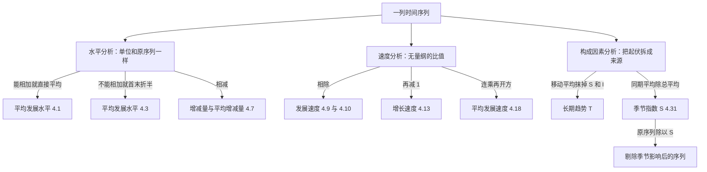

# 时间序列分析：能相加的和不能相加的，要用两种平均

> 目标：说清时期序列与时点序列为什么不能共用一条平均公式、速度指标为什么必须走几何平均，以及把序列拆成趋势和季节是为了回答什么问题。原书第 4 章（书页 69–101）。

## 场景

你在一家小家电厂做生产计划。主力产品是一款取暖器，四年 16 个季度的产量单摆在桌上，旁边还有第 4 年连续 5 个月末的成品库存台账。

季度会上要回答五句话：

- 这四年**平均每季度**产多少台？
- 仓库里**平均压着**多少台成品？
- 产量**每年长多快**？这四年"平均"长多快？
- 第 4 季度产量总是最高 —— 那是**旺季**，还是只不过因为它排在每年最后、赶上了这四年一直在涨？
- 第 5 年四个季度**各排多少产**？

第一句和第二句听起来是同一件事，都是"平均一下"，但**产量和库存不能用同一条公式**：一年四个季度的产量加起来是这一年的总产量，有意义；五个月末的库存加起来是什么？没有任何东西等于那个和。第三句同样不能把各年增长率加起来除一除 —— 增长是**连着乘**的，加起来那个数不对应任何事实。

第四句和第五句要的东西更硬：得先把"每年都在涨"这件事和"第 4 季度天生高"这件事**拆开**，才能一边排产、一边判断某个季度到底是好是坏。

## 讲解

!!! note "这一章和本站笔记走的是两条路线"
    本站笔记[时间序列](../../notes/statistics/time-series/index.md)讲现代时序分析：平稳性、自相关、ARIMA、按时间向前滚的评估。这本教材走的是另一条 —— 中国经管教材特有的**指标体系**：发展水平、序时平均数、增减量、发展速度、增长速度、平均发展速度，再加乘法模型的趋势与季节分解。两条路线几乎不重叠，所以这一课自足，不依赖那一篇。

### 心智模型一：能不能相加，决定用哪条平均公式

**发展水平**就是序列里的每一项（书页 72）。按位置分期初水平（$y_0$ 或 $y_1$）与期末水平（$y_n$），按作用分报告期水平与基期水平 —— 同一个数换个角色就换个名字，这是后面所有公式里"基期"二字的来源。不同时间上发展水平的平均数叫**平均发展水平**，也叫**序时平均数**（书页 73），算法按序列类型分三支。

**时期序列：直接加起来除项数。**因为"时期序列中各项数据相加等于现象在一段时期内的总量"（书页 73），简单算术平均就是对的（式 4.1，书页 73）：

$$
\bar y=\frac{y_1+y_2+\cdots+y_n}{n}=\frac{\sum_{t=1}^{n}y_t}{n}\qquad(t=1,2,\cdots,n) \quad \text{(4.1)}
$$

**时点序列：先取相邻两时点的中点当代表值，再按间隔长度加权。**时点数不能相加，所以要换一条路。原书把假定写得很明白：

> 对于不连续时点序列，若要计算整个考察期的平均发展水平，需要假定现象的数量在相邻两时点间是均匀变动的、上期期末数即为本期期初数，反之亦然。
>
> —— 书页 73

这句话就是式 (4.2) 的全部理由：均匀变动，所以相邻两时点的算术平均 $(y_t+y_{t+1})/2$ 能代表这一段内的水平；一段有多长，它说话就该多响，于是以间隔长度 $f_t$ 为权数（式 4.2，书页 74）；各间隔相等时把 $f$ 约掉，得到本章最容易考也最容易错的一条（式 4.3，书页 74）：

$$
\bar y=\frac{\dfrac{y_1+y_2}{2}f_1+\dfrac{y_2+y_3}{2}f_2+\cdots+\dfrac{y_{n-1}+y_n}{2}f_{n-1}}{\sum_{t=1}^{n-1}f_t}
\;\;\text{(4.2)}
\qquad
\bar y=\frac{\dfrac{y_1}{2}+y_2+\cdots+y_{n-1}+\dfrac{y_n}{2}}{n-1}
\;\;\text{(4.3)}
$$

(4.3) 就是**首末折半法**。两个要点：分母是 $n-1$（间隔数）不是 $n$（项数）；首末两项各按一半计入，因为它们各自只贴着一个间隔，中间每项都贴着两个。判别要走两步，**第一步问「加起来有没有意义」，第二步问「数是不是每天都有」**：

1. **加起来有意义** → 时期序列，走 (4.1)。产量、销售额、产值都是。
2. **加起来没意义，但每天都有数** → **连续时点序列**，原书（书页 73）同样走 **(4.1)**、分母就是项数 $n$。原书举的例子是「银行每天的存、贷款余额」—— 每天都登记，直接简单算术平均即可。
3. **加起来没意义，而且只在若干个时点上有数** → 不连续时点序列，走 (4.2)／(4.3)。库存、人口、固定资产净值这类月末或年末才盘一次的数都是。

**第 2 和第 3 支的区别不在指标本身，在登记的密度。**「存款余额」按天登记是第 2 支、只取月末是第 3 支 —— 同一个指标，换个采集频率就换一条公式。本课那 5 个月末库存属第 3 支，所以走 (4.3)、分母写 4。

**相对数或平均数序列：先各自平均，再相除。**设各期相对数 $z_t$ 由 $y_t$ 和 $x_t$ 派生，"由于各个 $z_t$ 的对比基数 $x_t$ 不尽相同，所以计算平均发展水平 $\bar z$ 时，不能将各期 $z_t$ 进行简单算术平均"（书页 75）。正确做法是 $\bar z=\bar y/\bar x$（式 4.4，书页 75）。原书紧接着点出它的实质：这等同于对各期相对数做加权算术平均，**权数是各期的对比基数** —— 所以 (4.4) 不是新规则，是第 3 章"权数必须是那个比率的分母"的换装重演。

### 心智模型二：增减量只有两种基期，两条恒等式把它们锁死

增减量是报告期水平与基期水平之差。基期选前一期叫**逐期增减量**，选固定期初叫**累计增减量**（书页 75–76）。两者的关系不是记忆项，是两条裂项恒等式（式 4.5，书页 76）：

$$
\sum_{i=1}^{t}(y_i-y_{i-1})=y_t-y_0,\qquad
(y_t-y_0)-(y_{t-1}-y_0)=y_t-y_{t-1} \quad \text{(4.5)}
$$

逐期之和等于累计，相邻累计之差等于逐期 —— 做题时是硬自查点。**平均增减量**因此有两条等价写法（式 4.7，书页 76）：

$$
\text{平均增减量}=\frac{\text{逐期增减量之和}}{\text{逐期增减量个数}}=\frac{\text{累计增减量}}{\text{时间序列项数}-1} \quad \text{(4.7)}
$$

分母是 $n-1$，跟首末折半法的分母同源：$n$ 项数据只夹出 $n-1$ 个间隔。月度、季度数据受季节影响时改用**同比增减量**（年距增减量）：同比增减量 = 报告年某期水平 − 上年同期水平（式 4.6，书页 76）。它的用处只有一个：**拿同一个季节位置去比**，把季节因素消掉。这条思路在 4.4 会升级成季节指数。

### 速度：一个比值，四种基期口径

发展速度是报告期水平与基期水平之**比**（式 4.8，书页 77）。基期取前一期是**环比发展速度**，取固定期初是**定基发展速度**、也叫发展总速度（式 4.9、4.10，书页 77），两者的关系是**连乘**而不是相加（式 4.11，书页 77）：

$$
\frac{y_t}{y_{t-1}},\quad \frac{y_t}{y_0}\;\;\text{(4.9)(4.10)}
\qquad
\frac{y_1}{y_0}\times\cdots\times\frac{y_t}{y_{t-1}}=\frac{y_t}{y_0},\quad
\frac{y_t}{y_0}\div\frac{y_{t-1}}{y_0}=\frac{y_t}{y_{t-1}}\;\;\text{(4.11)}
$$

增减速度（增减率）是增减量与基期水平之比，等价于发展速度减 1（式 4.13，书页 77），同样分环比与定基（式 4.14、4.15，书页 78）：

$$
\text{增减速度}=\frac{\text{增减量}}{\text{基期水平}}=\frac{\text{报告期水平}-\text{基期水平}}{\text{基期水平}}=\text{发展速度}-1 \quad \text{(4.13)}
$$

$$
\text{环比增减速度}=\frac{\text{逐期增减量}}{\text{前一期水平}}=\text{环比发展速度}-1\;\;\text{(4.14)}
\qquad
\text{定基增减速度}=\frac{\text{累计增减量}}{\text{固定基期水平}}=\text{定基发展速度}-1\;\;\text{(4.15)}
$$

消掉季节的那一对同样成立：同比发展速度 = 报告年某期水平 ÷ 上年同期水平（式 4.12，书页 77），同比增长速度 = 同比发展速度 − 1（式 4.16，书页 78）。

!!! warning "整章最容易错的一条：增长速度不能连乘"
    原书把它写成"需要特别注意"（书页 78）：环比**增长**速度的连乘积**不等于**定基增长速度，相邻两个定基增长速度之商也**不等于**环比增长速度。原因就在 (4.13) 减去的那个 1 —— 连乘只对"发展速度"这种纯比值成立，减掉基数之后连乘关系就断了。要换算必须走三步：**各环比增长速度分别加 1 → 连乘 → 减 1**。

### 增长 1% 的绝对量：它回答的不是"长了多少"，是"一个百分点值多少"

速度和水平必须一起看。原书的理由是一句大白话：

> 一般而言，基期水平低，容易产生高速度；基期水平高，速度就相对低。因此，高速度可能掩盖低水平，而低速度又可能隐藏高水平。
>
> —— 书页 81

补充指标就是**增长 1% 的绝对量**：增长的绝对量除以增长的百分比，化简之后等于基期水平的百分之一（式 4.23，书页 81）：

$$
\text{增长 1\% 的绝对量}=\frac{y_t-y_{t-1}}{\left(\dfrac{y_t-y_{t-1}}{y_{t-1}}\right)\times100}=\frac{y_{t-1}}{100}\qquad(t=1,2,\cdots,n) \quad \text{(4.23)}
$$

它回答的问题是：**同样再长 1%，这一期要拿出多少实物量**。基数小的年份 1% 是个零头，基数大的年份同一个 1% 是笔大数 —— 所以两期速度相同不代表两期一样"使劲"，这个指标就是把那个差别换成台、吨、元摆出来。注意它的单位是实物量单位，不是百分数。

### 心智模型三：平均发展速度用几何平均，因为速度是连乘出来的

平均增减速度与平均发展速度只差一个基数：平均增减速度 = 平均发展速度 − 1（式 4.17，书页 78）。但平均发展速度本身不能用算术平均，原书的判据就是 (4.11)：

> 由于现象发展的总速度不等于各期环比发展速度的总和，而是等于各期环比发展速度的连乘积，因此，对这些环比发展速度求平均数不能采用算术平均法而应采用几何平均法。
>
> —— 书页 78

这正好接上第 3 章几何平均数的判据（"连乘积有意义才用几何平均"）：环比发展速度连乘起来是发展总速度，是个有意义的东西。三条等价写法（式 4.18–4.20，书页 79，$R$ 是总速度）：

$$
\bar x_G=\sqrt[n]{x_1\times x_2\times\cdots\times x_n}=\sqrt[n]{\prod_{i=1}^{n}x_i}\;\;\text{(4.18)}
\qquad
\bar x_G=\sqrt[n]{R}\;\;\text{(4.19)}
\qquad
\bar x_G=\sqrt[n]{\frac{y_n}{y_0}}\;\;\text{(4.20)}
$$

三式"实质上是一回事"（书页 79），因为被开方数本来就是同一个数 —— 所以三条路径算出来必须**完全相等**，不一致就是某一步错了，不是精度问题。$n$ 是**环比发展速度的项数**，也就是间隔数，不是序列项数。由 (4.20) 直接看出它的性质，也是它的盲点：

> 因此，几何平均法计算平均发展速度的特点是着眼于考察期末水平，所以也称为"水平法"。在基期确定的情况下，不论中间变化过程如何，平均速度的快慢就只取决于期末水平的高低了。
>
> —— 书页 80

**把中间各期换成任意别的数，只要首末不动，水平法给出的平均发展速度一个字都不变。**这既是它好用的地方（两头数据就够），也是它的局限（中间塌一个坑看不见）。想让全期水平总和说话就改用**方程式法**（累计法）：解 $(\bar x_F)+(\bar x_F)^2+\cdots+(\bar x_F)^n=\sum_{i=1}^{n}y_i\big/y_0$ 的正根（式 4.22，书页 80）。选哪一个按现象特点定 —— 按期末水平做规划（产值、人口、平均工资）用水平法，按全期累计做规划（基建投资、培训总人数、造林）用累计法（书页 81）。

几何平均法还给出年度与季度、月度增长率之间的换算（式 4.21，书页 80；原书正文把季度增长率记作 $z_s$、式子里印的是 $z_x$，同一个量）：

$$
z_y=(1+z_s)^4-1=(1+z_m)^{12}-1 \quad \text{(4.21)}
$$

用法是双向的：由年推季月，或者由季月的实际速度验算年度目标。注意它同样只认首末两头。

### 心智模型四：分解序列，是为了把不同季节放到同一把尺子上

一列数的起伏被归结为四个因素：**长期趋势 $T$**（沿某一方向持续变化）、**季节变动 $S$**（周期固定、一年或更短）、**循环变动 $C$**（周期一年以上且长短不固定）、**不规则变动 $I$**（剩余变动）。实际中最常用乘法模型（式 4.24，书页 83）：

$$
Y_t=T_t\times S_t\times C_t\times I_t \quad \text{(4.24)}
$$

乘法模型里只有 $T$ 跟 $Y$ 同单位，其余三个都是**以趋势值为基准的相对幅度**，在 100% 上下波动；因此"对各因素的分离则采用除法"（书页 83）—— 要剔掉季节就算 $Y_t/S_t$。这一句就是整个 4.4 的目的：**把季节剥掉，不同季节的数才能直接比大小**。不剥的话，"第 4 季度比第 3 季度高"永远分不清是真的干得好，还是第 4 季度本来就高。四因素不必齐全，于是有趋势模式 $Y=T\times I$、趋势季节模式 $Y=T\times S\times I$、趋势季节循环模式 $Y=T\times S\times C\times I$ 三种组合（书页 83）。本教材只测 $T$ 和 $S$。



测 $T$ 有三种方法。**移动平均法**逐项递移地平均若干项，实操规矩（书页 86–87 列了六条，这里挑最常踩的几条）：

- **项数 $k$ 要等于周期长度**才抹得干净 —— 季度数据用 4 项，月度数据用 12 项。$k$ 取错，削掉的是一部分波动而不是那个周期。
- **$k$ 为奇数一次平均即可；$k$ 为偶数必须再做一次 2 项平均**（中心化移动平均），否则平均值对不到任何一期上。中心化后 4 项移动平均的实际权数是 $\tfrac18,\tfrac14,\tfrac14,\tfrac14,\tfrac18$ 摊在 5 期上。
- **新序列比原序列短**：$k$ 为奇数首尾各少 $(k-1)/2$ 项，$k$ 为偶数首尾各少 $k/2$ 项 —— 所以 $k$ 不宜过大。
- **$k$ 越大修匀越强**，但滞后偏差也越大；移动平均预测只能推一期，且只适用于水平趋势的序列。

第二条和第三条摆在一张表上最清楚。原书表 4.4（书页 84）拿某大学四年多的月度用电量同时算了 5 项和 12 项移动平均，摘它的头 8 行：

| 年份 | 月份 | 用电量（千瓦） | 5 项移动平均 | 12 项移动平均 |
|---|---|---|---|---|
| 第一年 | 1 月 | 826 400 | | |
| | 2 月 | 573 600 | | |
| | 3 月 | 444 400 | 731 200 | |
| | 4 月 | 988 000 | 787 920 | |
| | 5 月 | 823 600 | 894 000 | |
| | 6 月 | 1 110 000 | 919 760 | |
| | 7 月 | 1 104 000 | 849 440 | 821 517 |
| | 8 月 | 573 200 | 831 120 | 831 567 |

两列的**起点位置就是规矩本身**：5 项那一列从 3 月起，正是首尾各丢 $(5-1)/2=2$ 项；12 项那一列从 7 月起，正是首尾各丢 $12/2=6$ 项。第一个 5 项值 731 200 是 1—5 月的平均，写在中间那一期 3 月。第一个 12 项值 821 517 **不是** 1—12 月的平均 —— 1—12 月的平均是 818 200，原书把它放在第 (4) 列的 12 月，那是 Excel 的末期口径；821 517 是 1—12 月与 2 月至次年 1 月这两个 12 项平均再平均一次（$(818\,200+824\,833)/2$）的结果，所以落在 7 月。**偶数项必须再平均一次**的理由就在这里：12 个月的中间落在第 6 与第 7 个之间，不在任何一期上。

**指数平滑法**是加权移动平均的改进，权数按"近大远小"自动生成：$E_t=\alpha y_t+(1-\alpha)E_{t-1}$（式 4.25，书页 88），展开后 $E_t=\alpha\sum_{i=1}^{t}(1-\alpha)^{t-i}y_i+(1-\alpha)^tE_0$（式 4.26，书页 88），权数呈指数递减 —— 这就是名字的来源。$\alpha$ 大则跟踪快、修匀弱，$\alpha$ 小则反之；一次指数平滑值可直接当下一期预测值（式 4.27，书页 89）。**趋势方程拟合法**把时间序号当解释变量做回归：$\hat y_t=a+bt$（式 4.28，书页 90），$a$ 是 $t=0$ 时的趋势值，$b$ 是"时间每多一个单位趋势值平均变动多少"，系数用最小二乘由正规方程组 (4.29) 解出 (4.30)（书页 91）。选哪种函数形式，原书的实操判据里最有用的是**数据特征分析**（书页 90）：逐期增长量（一次差）大致相同配线性方程，$k$ 次差大致相同配 $k$ 次曲线，**逐期发展速度或增长速度大体相同配指数方程** —— 这一条把 4.2、4.3 的指标直接接到了模型选择上。

测 $S$ 靠**季节指数**，两种算法。**同期平均法**（书页 93）三步：算同期平均数 $\bar y_i$（消掉 $I$）、算总平均数 $\bar y$（代表水平趋势）、相除（式 4.31）；季节指数还必须满足一个平衡关系（式 4.32），不满足就按调整系数归一化，实质是把误差平摊到各期（式 4.33，三式均在书页 93）：

$$
S_i=\frac{\bar y_i}{\bar y}\times100\%\;\;\text{(4.31)}
\qquad
\sum_{i=1}^{L}S_i=L\;\;\text{或}\;\;\bar S=\frac1L\sum_{i=1}^{L}S_i=100\%\;\;\text{(4.32)}
\qquad
\text{调整系数}=\frac{1}{\bar S}=L\div\sum_{i=1}^{L}S_i\;\;\text{(4.33)}
$$

$S_i>100\%$ 是旺季，$<100\%$ 是淡季。同期平均法的适用条件是"呈水平趋势的时间序列"，原书点出它在有趋势时的偏向（书页 95）：

> 所以，按同期平均法计算，当现象呈现明显上升趋势时，总会高估年末季节指数，相应地低估年初季节指数；相反，若现象呈现明显的下降趋势，则会高估年初季节指数，相应地低估年末季节指数。
>
> —— 书页 95

**注意这句话里的"趋势"指的是一年之内的爬升。**同期平均法把每个季节位置在各年的值平均，再除以全体平均；关键在于**趋势在一年之内有没有爬**：年内平坦时，同季平均和总平均会同比例放大，那个比例在相除时约掉；年内持续爬升时，排在年末的季节位置会多分到一截趋势。真正把它带偏的是年内的持续爬升 —— 那会让排在年末的季节多分到一截趋势。所以判断该用哪种方法，看的是**趋势在周期内部有没有爬**，不是"整条线是不是在涨"。

**趋势剔除法**适合趋势季节模式 $Y=T\cdot S\cdot I$，四步（书页 95）：① 算项数等于周期长度 $L$ 的中心化移动平均 $M$，它已消掉 $S$ 和 $I$，所以 $M=T$；② 用原序列除以它剔掉趋势，$Y/M=(T\cdot S\cdot I)/T=S\cdot I$；③ 把各年同期的比率简单算术平均，消掉 $I$，得季节指数；④ 按 (4.33) 归一化。它的前提藏在第 ① 步里：**移动平均要能代表趋势**。如果趋势不是平滑漂移，跨过突变处的那几个移动平均值就不再代表趋势，剔出来的比率里会混进本不属于季节的东西。**这份数据的趋势长什么样、两种方法在它身上谁准，Q7 让你自己算出来判。**

两种方法的季节指数含义不同，预测公式也就不同：同期平均法的指数相对于**平均水平**（式 4.34，书页 94），趋势剔除法的指数相对于**长期趋势值**（式 4.35，书页 97）：

$$
\hat y_{t+i}=\hat a\times\hat S_i\;\;\text{(4.34)}
\qquad
\hat y_t=\hat T_t\times\hat S_{\text{对应季节}}\;\;\text{(4.35)}
$$

**季节影响的调整**就是拿季节指数去除原序列（书页 98）。剔完之后剩下的序列里没有季节形状，趋势和异常才看得见 —— 这是 4.4 全部工作的交付物。

### 图：3 项移动平均在这份数据上抹不掉季节

下面这张图画的就是本课的 16 个季度产量，叠一条 **3 项**移动平均线：

```echarts
{
  "title": {"text": "取暖器季度产量与 3 项移动平均", "left": "center"},
  "tooltip": {"trigger": "axis"},
  "legend": {"data": ["季度产量", "3 项移动平均"], "top": 28},
  "grid": {"top": 70, "left": 70, "right": 30, "bottom": 50},
  "height": 360,
  "xAxis": {"type": "category", "name": "年-季",
            "data": ["1Q1","1Q2","1Q3","1Q4","2Q1","2Q2","2Q3","2Q4","3Q1","3Q2","3Q3","3Q4","4Q1","4Q2","4Q3","4Q4"]},
  "yAxis": {"type": "value", "name": "台"},
  "series": [
    {"name": "季度产量", "type": "line", "symbolSize": 7,
     "data": [1800,1600,2200,2400,3600,3200,4400,4800,7200,6400,8800,9600,14400,12800,17600,19200]},
    {"name": "3 项移动平均", "type": "line", "symbolSize": 5, "lineStyle": {"type": "dashed"},
     "data": [null,1866.67,2066.67,2733.33,3066.67,3733.33,4133.33,5466.67,6133.33,7466.67,8266.67,10933.33,12266.67,14933.33,16533.33,null]}
  ]
}
```

虚线确实比实线平一些 —— 上下折返其实**被抹掉了**（原序列有 4 处下降，3 项平均之后一路单调上升）。但**周期性并没有消失，只是换了个藏身处**：它跑进了斜率里，相邻两项的比值仍然精确地 4 期一循环。这正是「$k$ 必须等于周期长度」的意思 —— $k=3$ 抹平了幅度，没抹掉周期。按上面那条规矩，季度数据的周期长度是 4，$k$ 必须取 4，还得再做一次 2 项平均把位置摆正。把 $k$ 换成 4 之后这条线会变成什么样，是 Q6 的事。虚线首尾各缺一项，正是 $(k-1)/2=1$。

### 一个能手算的小例子

先看时点序列（这不是本课数据，是三个数的演示）。某仓库 1 月末、2 月末、3 月末的库存是 100、140、120 台，间隔都是一个月：

- 错的做法：$(100+140+120)/3=120$ 台 —— 把三个瞬间数当成三段时期的总量加了起来；
- 对的做法（式 4.3）：$\bar y=\dfrac{100/2+140+120/2}{3-1}=\dfrac{50+140+60}{2}=125$ 台。

两个数差 5 台，方向由被减半的那两项决定：首末两项（100、120）都比中间那项（140）小，减半之后它们的分量下去了，所以结果比简单平均大。分母也换了 —— 3 项数据只夹出 2 个间隔。

再看速度为什么必须连乘：某指标两期环比分别是 $150\%$ 和 $80\%$。算术平均是 $115\%$，连乘回去 $1.15^2=1.3225$；实际总速度是 $1.5\times0.8=1.2$。几何平均 $\sqrt{1.2}\approx109.54\%$，连乘回去恰好 $1.2$。**判据就是这个：把你算出的平均速度按期数连乘回去，必须还原总速度。**

??? warning "原书这几处印刷有误 —— 对着纸书读时注意"

    每条都经过两轮独立核对：先由重排内容的人对着 300dpi 页图提出，再由另一个只拿页图、不看重排结果的人放大复核。**本页正文一律不跟随这些错处。**

    | 书页 | 原书印的 | 应该是 |
    |---|---|---|
    | 76 | 表 4.3 第 (8) 行 2014 年的「增长 1% 的绝对量」印作 **−10.8** | 应为 **10.8**。用原书自己的算式就能验：$-168\div(-15.6)=10.8$；负号形制与同表的「− 168」「− 15.6」一致，不是破折号 |
    | 80 | (4.21) 正文记 $z_s$、式中印 $z_x$ | 同一个量两种写法，本页统一用 $z_s$（放大后字形清晰可辨，不是识别问题）|
    | 75 | 「报告期水平**与和**基期水平之差」 | 多一字 |
    | 96 / 97 | 书页 97 那张趋势图与书页 94 的季节指数图**同编号图 4.5**，书页 96「由图 4.5 可见」指到了后一张 | 书页 97 那张应为**图 4.6**，书页 96 那句应作「由图 4.6 可见」。（书页 92 另有一张图 4.4，确实存在，所以不是漏号）|
    | 79 | 例 4-6 写 $\bar x-1$ | 应为 $\bar x_G-1$，漏了几何平均的下标 |
    | 99 / 100 | 小结第 4 点与思考题 4-7 把「同期平均法」改称「**原资料平均法**」 | 而 §4.4.3 正文一律用「同期平均法」，全章没有一处交代这是同义词 |
    !!! note "另有一处原书自身的计算错误，本页没有重排那两张表"
        表 4.7 的「同月平均」栏 7—12 月全部不等于「合计 ÷ 4」（12 月最明显：$3.9974/4=0.9994$ 印成 $1.0005$），这批错数把总和顶到 12.0066，归一化系数因此被算成 0.99945（真值 0.99996），12 个季节指数被整体压低约 0.0005，连带表 4.8 的第 (3) 栏 12 个月**全部**对不上第 (2) 栏。这不是舍入显示问题，是真实的计算错误。本页没有重排这两张表，所以不影响你算的结果。

## 准备

两份数据都在本课 `assets/` 下：

- [取暖器 16 个季度的产量](assets/ch04-time-series/heater-quarterly-output.csv) —— 列 `period,year,quarter,output_units`，单位：台，$n=16$（第 1 年第 1 季度到第 4 年第 4 季度）。这是**时期序列**。
- [第 4 年 5 个月末的成品库存](assets/ch04-time-series/heater-month-end-stock.csv) —— 列 `month_end,stock_units`，单位：台，5 月末到 9 月末，**间隔都是一个月**。这是**时点序列**。

两份表的数都是整数，而且这份数据是**设计过**的：下面这六项全部落在整数或有限小数上 —— 产量的平均发展水平、平均增减量、库存的首末折半平均数、13 个 4 项移动平均值、12 个中心化值、同期平均法的 4 个季节指数及其和。**这六项里只要出现了循环小数，先怀疑自己的项数、分母或对齐位置搞错了，再怀疑数据。**

反过来，另外几项**本来就是循环小数**，算出来别慌：部分环比发展速度（写成分数是整的，写成小数写不尽）、3 项移动平均、趋势剔除法的 $Y/M$ 比率。这几项保留四位小数够用，但**中间量别提前四舍五入**，否则连乘核对和归一化都会对不上。开方那几步（平均发展速度、年季换算）要用计算器或函数。

用 Excel / WPS 会碰到的函数与它们的口径：

| 用途 | 函数 | 与本章公式的关系 |
|---|---|---|
| 平均发展水平（时期序列） | `AVERAGE` | 就是 (4.1) |
| 平均发展水平（时点序列） | 没有现成函数 | (4.3) 要自己把首末两项减半、分母写 $n-1$ |
| 平均发展速度 | `GEOMEAN` | 就是 (4.18)，**喂的是环比发展速度（发展因子），不是增长速度** |
| 开 $n$ 次方 | `=A1^(1/n)` 或 `POWER(A1,1/n)` | (4.19)(4.20) 那两个根号 |
| 移动平均 | 「数据」→「数据分析」→「移动平均」 | **结果放在所平均期的末尾一期**，不居中；要中心化得自己再做一次 2 项平均 |
| 指数平滑 | 「数据分析」→「指数平滑」 | 对话框里填的是**阻尼系数 $1-\alpha$**，不是 $\alpha$ |
| 线性趋势方程 | 「数据分析」→「回归」，或图上「添加趋势线」+「显示公式」 | (4.28)(4.30) |

!!! warning "三个口径陷阱，报数之前逐个确认"
    1. **`GEOMEAN` 喂什么**：要喂 $1.5$、$0.8$ 这样的环比发展速度，不能喂 $0.5$、$-0.2$ 这样的增长速度。算完得到的是平均发展速度，再按 (4.17) 减 1 才是平均增长速度。
    2. **Excel 的移动平均不居中**：它把每次平均的结果写在所平均数据的**末尾一期**（原书表 4.4 第 (4) 列就是这个口径），而本章测定趋势要求放在**中间一期**。偶数项还要再做一次 2 项平均。两个口径的数值和位置都不一样，混着用会让季节指数整体错位。
    3. **平均发展速度的 $n$ 是间隔数**：16 项数据的季度环比只有 15 个，开的是 15 次方；4 个年度合计的年环比只有 3 个，开的是 3 次方。$n$ 用成项数是本章最高频的错。

用 Python 的话 `statistics.geometric_mean` 与 (4.18) 一致（同样要喂发展速度）；移动平均用 `pandas` 的 `rolling(4).mean()` 得到的是**末尾对齐**的值，要居中得再 `.rolling(2).mean()` 并自己把索引往前挪一格。

## 任务

把季度会上那五句话各自落成**一个具体数值 + 它用的是哪一条公式 + 这个数在回答哪个问题**，然后再做四件事：

1. **把产量序列的全套水平与速度指标算出来**：平均发展水平、15 个逐期增减量、15 个累计增减量、平均增减量、15 个环比发展速度、16 个定基发展速度、对应的增长速度、12 个同比发展速度、15 个"增长 1% 的绝对量"。每一项都要能指回原书的式号。
2. **把库存序列单独算一遍**，并且说清它为什么不能用产量那条公式 —— 这一条要给出判据，不是"因为教材这么分"。
3. **把产量序列拆成趋势和季节**：4 项中心化移动平均、两种方法的季节指数、以及用季节指数剔除季节影响之后的新序列。两种方法算出来的结果不一样，你要判定哪一套对，并给出判定的依据。
4. **用拆出来的趋势和季节给第 5 年排产**，四个季度各一个数，并说清你用的是 (4.34) 还是 (4.35)、为什么。

全程**不要出现"显著""置信""区间""检验""估计总体参数"这类说法** —— 本章是描述统计，描述的对象就是手上这 16 个季度和 5 个月末，不往外推。第 5 年那一问是按模型外推，不是统计推断。

## 验收

- 15 个逐期增减量之和严格等于累计增减量的末项；相邻两个累计增减量之差严格等于对应的逐期增减量；
- 平均增减量两条路径（逐期之和除以逐期个数、累计除以项数减 1）给出**同一个数**；
- 库存那一问的分母是间隔数不是项数，而且你贴出了两个数（简单算术平均和首末折半），并能说出哪个大、大的原因来自哪两项被减半；
- 产量和库存用的是两条**不同**的式子，两个式号都写得出来，判据是"这一列数加起来有没有意义"而不是名词分类；
- 任意一段连续环比发展速度的连乘积**等于**同期的定基发展速度，不是约等于；
- 增长速度那一问：把各期环比增长速度直接连乘得到的数与定基增长速度**不相等**，两个数都贴出来了，并且你给出了正确的三步换算路径；
- 12 个同比发展速度全部贴出来了，并且你就「这个特征是本份数据的性质，还是同比指标的通性」给出了明确判断和理由；
- 每个"增长 1% 的绝对量"都等于上一期水平的百分之一，单位是台，不写成百分数；
- 平均发展速度三条路径（(4.18)(4.19)(4.20)）给出**同一个数**，不是"约等于"——三条路径的被开方数本来就是同一个数，不一致说明有一步错了；
- 平均增长速度和平均发展速度是两个数，相差恰好 1（或 100%），报数时不混用；
- 每一处开方的次数都等于**间隔数**，你能对每一个开方说出"几项数据夹出几个间隔"；
- 13 个 4 项移动平均值和 12 个中心化值**全部落在整数上**；出现小数说明项数、分母或对齐位置有一处错了；
- 中心化移动平均对齐到的期号连续，首尾各缺同样多项，缺的项数与 $k$ 的关系你说得出来；
- 同期平均法里，4 个同期平均数各是 4 个数的平均、总平均数是 16 个数的平均，两者的关系你能用一句话说清；
- 两套季节指数各自的**和**都贴出来了，并且你对每一套都回答了"要不要按 (4.33) 归一化"，判据是拿它跟哪个数比；
- 用两套季节指数各剔除一遍季节影响，两条新序列（各 16 项）都贴了出来；你按 Q7 那条判据（年内四个比值是否年年一致）逐年对比过，并据此判定哪一套指数更准；
- 第 5 年四个季度的排产数加起来等于你给出的第 5 年趋势总量，四个数与四个季节指数的对应关系没有错位；
- 全篇没有出现推断统计的词。

## 提问

```conflict
<<<<<<< courses/statistics-book/ch04-time-series
Q1 两条平均公式：产量和库存不能共用一条
用产量 CSV 算 16 个季度的平均发展水平，贴出数值并注明用的是哪一条式子。
用库存 CSV 算第 4 年 5 月末到 9 月末的平均库存，贴出数值并注明式号；同时贴出把这 5 个数直接简单算术平均得到的那个数。
两个库存平均数差多少？哪个大？说清大的那个为什么大 —— 要落到"哪两项被减半、分母换成了什么"上。
再故意做错一次：把第 4 年那 4 个季度的产量当成时点数据，用首末折半法算一遍，把这个数和第 4 年季度平均产量的正确值都贴出来。
最后用一句话给出判据：怎么一眼看出一列数该用哪条公式。
=======
>>>>>>> notes
```

```conflict
<<<<<<< courses/statistics-book/ch04-time-series
Q2 增减量的两条恒等式
贴出产量序列的 15 个逐期增减量和 15 个累计增减量（都以第 1 年第 1 季度为固定基期）。
用式(4.5)的两条关系各核对一次，中间量都要贴：15 个逐期增减量之和是多少，它等于哪一个累计增减量；随便挑两个相邻的累计增减量相减，看等不等于对应的逐期增减量。
平均增减量走两条路径算出来，两个数都贴。
逐期增减量里有几个是负的？把它们逐个列出来，并说清为什么它们全都落在同一个季节位置上 —— 注意这个位置上的产量和上一年同期比其实是涨的，把同比增减量算出来佐证。
=======
>>>>>>> notes
```

```conflict
<<<<<<< courses/statistics-book/ch04-time-series
Q3 四种基期口径，和为什么增长速度不能连乘
以第 2 年第 3 季度为报告期，把四个速度都算出来贴上：环比发展速度、定基发展速度（固定基期取第 1 年第 1 季度）、环比增长速度、定基增长速度。四个数各注明式号。
核对式(4.11)：从第 2 期到第 7 期的 6 个环比发展速度连乘，结果等不等于第 7 期的定基发展速度？两个数都贴出来。
再做反例：把那 6 个环比增长速度直接连乘，把结果和定基增长速度并排贴出来，说清差在哪、以及正确的换算要走哪三步。
最后贴出 12 个同比发展速度（式 4.12），说出你看到的特征，并指明这个特征是本份数据的性质还是同比指标的通性。
=======
>>>>>>> notes
```

```conflict
<<<<<<< courses/statistics-book/ch04-time-series
Q4 同样增长 1%，差多少台
按式(4.23)算出全部 15 个"增长 1% 的绝对量"，贴出来，注明单位。
环比发展速度在这份数据里会重复出现。找出环比发展速度等于 150% 的那几期，把它们各自的"增长 1% 的绝对量"并排贴出来，算出最大的一个是最小的一个的几倍。
再取第 1 年第 2 季度和第 4 年第 4 季度两期，把它们的环比增长速度和"增长 1% 的绝对量"四个数都贴出来。
最后回答：如果只看环比增长速度这一个数，你会漏掉什么？用你刚算出的数举一个具体例子。
=======
>>>>>>> notes
```

```conflict
<<<<<<< courses/statistics-book/ch04-time-series
Q5 平均发展速度：三条路径、被换掉的中间年份、被污染的端点
先按年汇总，贴出 4 个年合计。
用式(4.18)(4.19)(4.20)三条路径各算一次年平均发展速度，三个数都贴出来，并注明每一条开的是几次方、这个次数是怎么数出来的。再给出年平均增长速度。
对照一：把 15 个季度环比发展速度做算术平均，贴出这个数，然后把它按 15 次方连乘回去，和真实的总发展速度并排比较。说清为什么算术平均在这里是错的。
对照二：把第 2 年和第 3 年的年合计改成 12000 和 20000（首末两年不动），重算年平均发展速度。变了还是没变？用式(4.20)解释，并说出这个性质什么时候是优点、什么时候是陷阱。
对照三：算两个季度平均发展速度 —— 一个从第 1 年第 1 季度到第 4 年第 4 季度，一个从第 1 年第 1 季度到第 4 年第 1 季度，两个数都贴。再用式(4.21)把"年平均发展速度"换算成季度平均发展速度，看它和上面哪一个对得上。
最后把 y_n / y_0 拆成"趋势部分 × 季节指数之比"，指出对不上的那一个里混进了什么，以及要避开这件事，端点该怎么选。
=======
>>>>>>> notes
```

```conflict
<<<<<<< courses/statistics-book/ch04-time-series
Q6 移动平均：为什么必须再平均一次
算产量序列的 4 项移动平均，13 个值全部贴出来。
再做中心化，12 个值全部贴出来，并逐个标明它对齐到第几期。
挑其中任意一个中心化值，把它写成 5 期原始数据的加权和，贴出这 5 个数和它们各自的权数，并验算一遍。
回答三问：为什么 k 取 4 时必须再做一次 2 项平均，k 取 3 时不用？这条新序列首尾各少了几项，这个数跟 k 是什么关系？讲解里那张图用的是 3 项移动平均，上下折返被抹掉了但周期跑进了斜率 —— 换成 4 项中心化之后，这 12 个数还剩不剩上下折返？用你算出的数说明。（周期有没有被彻底消掉是 Q7 的事，这里只看折返。）
=======
>>>>>>> notes
```

```conflict
<<<<<<< courses/statistics-book/ch04-time-series
Q7 两套季节指数打起来了，用剔除季节影响判胜负
路径一，同期平均法（式 4.31）：贴出 4 个同季平均数、总平均数、4 个季节指数，以及 4 个季节指数之和。说清这一套要不要按式(4.33)归一化。
路径二，趋势剔除法：用 Q6 的 12 个中心化值算出 12 个 Y/M 比率全部贴出来，按季分组做简单算术平均，贴出未调整的 4 个指数和它们的和，再按式(4.33)算调整系数并给出调整后的 4 个指数。
两套指数差得不小，这不是你算错了。现在判胜负：把 16 期原始产量各自除以对应的季节指数，两套各做一遍，两条 16 项的新序列都贴出来。判据不要用「看起来平不平」（两条都可能是平滑的），用这一条：**把每年四个季度的值除以该年的季度平均，得到四个比值；逐年对比这四个比值，是否年年完全一致。** 季节成分被干净剔除的那一套，年内形状不会再留下任何以 4 为周期重复的痕迹。两套各算四年、共 16 个比值贴出来，据此说出哪一套更准。
最后解释偏的那一套为什么偏 —— 对着这份数据说，不要只背书页 95 那句结论。两个提示：先看看这份数据的趋势在一年之内是爬升的还是平的；再看看 4 项中心化移动平均在跨过年与年交界的地方，代表的到底是哪一年的水平。
接着给第 5 年排产：先给出第 5 年的趋势水平（说清它是怎么推出来的、用了哪个速度指标，**以及它是年合计还是季度量级** —— 这两个数差 4 倍，乘季节指数之前必须先统一），再乘上对应季节指数，四个季度各一个数。注明你用的是式(4.34)还是式(4.35)，为什么。
=======
>>>>>>> notes
```

```conflict
<<<<<<< courses/statistics-book/ch04-time-series
一句话
这一章教会你的最有用的一句话是什么。
=======
>>>>>>> notes
```

```conflict
<<<<<<< courses/statistics-book/ch04-time-series
心智模型
用自己的话说清三件事的关系：为什么时期序列和时点序列的平均发展水平是两条公式、为什么平均发展速度必须走几何平均、以及把序列拆成趋势和季节之后你多知道了什么。不抄定义，要能解释你在 Q1、Q5、Q7 里填进去的每一个分母和每一次开方。
=======
>>>>>>> notes
```

```conflict
<<<<<<< courses/statistics-book/ch04-time-series
坑
这一课你实际踩到的坑是哪个，怎么发现算错了的。
=======
>>>>>>> notes
```
