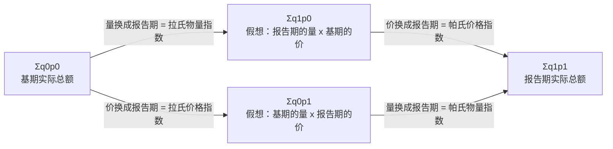

# 统计指数：同度量因素把东西变成钱，钉住哪一期权重决定你拿到哪个指数

> 目标：说清指数为什么要引入同度量因素、为什么必须把它固定在某一期，以及指数体系的乘法关系凭什么能严格闭合。原书第 5 章（书页 103–126）。

## 场景

你在一家连锁餐饮企业管经营分析。季度会前，三份材料压在你桌上，每一份都是「几个数摆在一起没法直接比」。

**第一份是中央厨房的采购台账。** 四样主料 —— 猪肉、鸡蛋、大米、食用油 —— 这季度总共花了 13200 元，去年同季是 10000 元，多花了 32%。老板要的不是这个 32%，是这 32% 里**多少是买贵了、多少是买多了**。麻烦在于：四样东西的量分别是 kg、kg、kg、L，加不起来；四样东西的价格虽然都是「元」，但「元/kg」和「元/L」也加不起来。

**第二份是两家门店的客单价。** 甲店在写字楼、乙店在社区，两家的客单价这季度**都涨了 10%**。可把两家合起来算，公司的总平均客单价比上季度**降了**。财务已经问过三遍这张表是不是算错了。

**第三份是四家店的月度记分表。** 四个指标：人均产出（元/人·天）、毛利率（%）、食材损耗率（%）、翻台率（次/天）。单位四个都不一样，方向还不一致 —— 损耗率越低越好。要排出一个先后次序，就得先回答：**凭什么能把 900 元和 56% 加在一起**。

三份材料是同一件事的三种形态：**一组不能直接相加的数，怎么变成一个能比大小的数**。这一章就在回答它。

## 讲解

### 指数解决的唯一问题：不能相加的东西怎么比

原书把指数分成广义和狭义两层，狭义那层才是这一章的主角：

> 狭义的指数是指综合反映复杂现象总体数量变动或差异程度的特殊相对数。所谓复杂现象总体是指那些由许多度量单位不同、性质各异的个体组成、数量上不能直接加总的现象总体。
>
> —— 书页 104

判据落在**「不能直接加总」**四个字上。单看一种商品，报告期价格除以基期价格就完事了，那叫**个体指数**，跟第 4 章的发展速度是一回事，不需要任何新方法。只有当篮子里有多个度量单位不同的个体、你还想给出一个总数时，才需要指数这套东西。所以这一章所有公式的出发点都不是「怎么算平均」，而是**「先想办法让它们能相加」**。

指数还有第二个特点，原书叫**平均性**：

> 由于各个个体的变动是参差不齐的，指数反映的这种总变动实际上是将个体差异抽象，反映总体中各个个体变动的一般程度。
>
> —— 书页 104

这一条是读数的纪律。你算出来的「价格总指数 120%」不表示任何一样东西涨了 20% —— 篮子里完全可以一样涨 50%、一样跌 20%。它只是那一组参差不齐的涨跌按某个权重摊出来的代表值，**而权重是谁给的，就是这一章剩下的全部内容**。

### 同度量因素：把物量换算成钱，顺手就变成了权重

不能相加，是因为单位不同。解法是找一个乘数把它们统一成同一种东西 —— 原书叫**同度量因素**，来源是现象之间本来就有的经济方程式（书页 106）：$\text{销售总额}=\sum(\text{销售量}\times\text{价格})$、$\text{总成本}=\sum(\text{产量}\times\text{单位成本})$。等号右边一个是数量指标（$q$），一个是质量指标（$p$），两者互为同度量因素：要给一堆 kg 和 L 求总指数，就乘上价格，全都变成钱；要给一堆「元/kg」和「元/L」求总指数，就乘上数量，同样变成钱。钱是同度量的，于是能加。

但这一乘顺手带来了第二件事，而且比第一件更要紧：

> 同度量因素不仅具有同度量的作用，还具有权数的作用。因此，同度量因素也称为权数。
>
> —— 书页 107

想清楚为什么：给销售量求总指数时乘上价格，价格高的那样东西乘出来的钱多，它的量变一个百分点，对总指数的推动就大。**同度量因素既是换算尺，又是权重表 —— 一个乘数干了两件事。** 这也是整章最容易糊掉的地方：后面拉氏、帕氏的全部分歧，都不在「要不要乘」，而在「乘哪一期的那张权重表」。

### 拉氏与帕氏：差别只有一个 —— 权重钉在哪一期

乘完了还有个漏洞：$\sum q_1p_1$ 比 $\sum q_0p_0$ 大，可能是量变了，也可能是价变了，混在一起。所以必须**把同度量因素的时期固定下来**，指数才只反映你想看的那一个因素。固定在基期叫拉氏（Laspeyres，1864），固定在报告期叫帕氏（Paasche，1874）：

$$
\text{拉氏数量指标指数：}\bar I_q=\frac{\sum q_1p_0}{\sum q_0p_0}\quad \text{(5.1)}
\qquad
\text{拉氏质量指标指数：}\bar I_p=\frac{\sum q_0p_1}{\sum q_0p_0}\quad \text{(5.2)}
$$

$$
\text{帕氏数量指标指数：}\bar I_q=\frac{\sum q_1p_1}{\sum q_0p_1}\quad \text{(5.3)}
\qquad
\text{帕氏质量指标指数：}\bar I_p=\frac{\sum q_1p_1}{\sum q_1p_0}\quad \text{(5.4)}
$$

四个公式一个都不用背。**看下标：指数化指标（你要测的那个）从 0 换成 1，同度量因素（另一个）上下两行保持同一个下标。** 那个保持不动的下标是 0 就是拉氏，是 1 就是帕氏。$\sum q_1p_0$ 的含义写成一句话就是「报告期的量按基期的价格算出来的钱」—— 一个假想的总额，它存在的唯一目的是当参照物。

#### 一个能手算的两样东西的例子 { #mini }

篮子里只有米和油，基期各花 500 元，一共 1000 元：

| | 基期量 | 报告期量 | 基期价 | 报告期价 | 量个体指数 | 价个体指数 |
|---|---|---|---|---|---|---|
| 米 | 100 kg | 120 kg | 5 元/kg | 6 元/kg | 120% | 120% |
| 油 | 10 桶 | 6 桶 | 50 元/桶 | 75 元/桶 | 60% | 150% |

四个总额（前两个真实、后两个假想）与两个价格总指数：

$$
\sum q_0p_0=1000,\quad \sum q_1p_1=1170,\quad \sum q_1p_0=900,\quad \sum q_0p_1=1350
$$
$$
\text{拉氏}=\frac{1350}{1000}=135\%,\qquad
\text{帕氏}=\frac{1170}{900}=130\%
$$

同一组数据，差 5 个百分点，差别只来自权重期。追一下就明白：基期米油各占 50%，报告期油的份额是 $450/1170=38.46\%$ —— **油涨价最猛（+50%）可量砍掉了 40%，在报告期的权重表里它的话语权掉了，于是帕氏指数听它的少一些。** 原书把这条写成一个一般规律（书页 109）：

> 因为消费者面对相对价格的变化时，他们会用相对便宜的货物和服务替代那些相对昂贵的货物和服务，因此，用报告期销售量作为权数，价格上涨率比较高的商品其权重比基期有所下降。
>
> —— 书页 109

所以通常 $\text{拉氏}>\text{帕氏}$，原书写成 (5.5) 式，称为「帕歇效应」。注意它是**倾向不是恒等式** —— 它成立的条件是价比与量比负相关；构造一组正相关的数据（涨价的东西反而卖得更多），不等号就反过来。判别时别去记不等号方向，去看这一篮子里涨得最凶的那几样量是升还是降。

权重期还有第三种选法：钉在跟这两期都无关的某个特定时期 $p_n$ 上，得到 $\bar I_q=\frac{\sum q_1p_n}{\sum q_0p_n}$（(5.8) 式，书页 110）。$p_n$ 叫**不变价格**（固定价格）。它换来的好处是**各个时期的指数可以互相直接比**（分母那张权重表所有年份共用一张），代价是它不参与任何指数体系 —— 跟价值指数对不上，所以做不了因素分析。

### 指数体系：乘法能闭合，靠的是两个指数各挑了不同的权重期

四个总额之间只有两条路能从 $\sum q_0p_0$ 走到 $\sum q_1p_1$，一条先换量后换价，一条先换价后换量：



走上面那条路，中间量 $\sum q_1p_0$ 约掉，就是原书的指数体系（书页 115）：

$$
\frac{\sum q_1p_1}{\sum q_0p_0}=\frac{\sum q_1p_0}{\sum q_0p_0}\times\frac{\sum q_1p_1}{\sum q_1p_0}
\quad \text{(5.14)}
$$
$$
\sum q_1p_1-\sum q_0p_0=\left(\sum q_1p_0-\sum q_0p_0\right)+\left(\sum q_1p_1-\sum q_1p_0\right)
\quad \text{(5.15)}
$$

相对数和绝对数两种形式，闭合的机制是同一个：**中间那个量被用了两次，一次当分子、一次当分母。** 这也解释了原书那条看着像惯例、其实是硬约束的规定：

> 为了指数体系的成立和进行因素分析，在计算数量指标指数时，通常将同度量因素固定在基期，即用拉氏公式；计算质量指标指数时，通常将同度量因素固定在报告期，即用帕氏公式。
>
> —— 书页 110

拿两个拉氏指数相乘是**乘不出**价值指数的：$\dfrac{\sum q_1p_0}{\sum q_0p_0}\times\dfrac{\sum q_0p_1}{\sum q_0p_0}$ 里根本没有能约掉的中间量。**两个因素必须各挑一头** —— 一个用基期权重、一个用报告期权重，体系才闭合。至于「哪个因素挑基期」，走另一条路（拉氏价格 × 帕氏物量，原书 (5.7) 式）同样严格闭合，所以这是个约定，不是定理。约定的代价是实在的：**同一个总额变动，两条路分给「价格」的绝对额不一样**，中间那块交叉项被整块塞给了后替换的那个因素。这一章不解决这个分配问题，只要求你知道它存在、并且报数时说清你走的是哪条路。

多因素（三个及以上）是同一件事重复做，原书叫**连锁替代法**：从 $\sum a_0b_0c_0$ 出发，一次只换一个因素，换到哪一步就用那一步的总量除以前一步（书页 117）。规矩只有一条：**已经换过的因素保持在报告期，还没换的保持在基期** —— 所以先替换的那个因素的同度量因素全在基期，最后替换的那个全在报告期。

指数体系还能倒着用来**推算**（书页 115）：三个指数知道两个就能算第三个。同样多的钱报告期只能买到基期 95% 的东西，价格指数就是 $100\%/95\%\approx105.26\%$。CPI 的一个常见用法正是这个倒数 —— 原书说「货币购买力指数通常就是用居民消费价格指数的倒数来计算的」（书页 113）。

### 平均法指数：换个形状，同一个数

前面是「先加总再对比」。反过来也行 —— 先算出每样东西的个体指数，再加权平均，原书叫**平均法指数**。加权算术平均法配基期总额作权数（书页 110）：

$$
\bar I_q=\frac{\sum \dfrac{q_1}{q_0}q_0p_0}{\sum q_0p_0}\quad \text{(5.9)}
\qquad
\bar I_p=\frac{\sum \dfrac{p_1}{p_0}q_0p_0}{\sum q_0p_0}\quad \text{(5.10)}
$$

加权调和平均法配报告期总额作权数（书页 112）：

$$
\bar I_q=\frac{\sum q_1p_1}{\sum \dfrac{1}{\dfrac{q_1}{q_0}}q_1p_1}\quad \text{(5.12)}
\qquad
\bar I_p=\frac{\sum q_1p_1}{\sum \dfrac{1}{\dfrac{p_1}{p_0}}q_1p_1}\quad \text{(5.13)}
$$

这四个式子也不用背，**把权数约进去看分子分母是什么**就行：(5.9) 的分子 $\sum\frac{q_1}{q_0}q_0p_0=\sum q_1p_0$、分母 $\sum q_0p_0$ —— 它就是拉氏 (5.1)，一个字都没差；(5.13) 的分母 $\sum\frac{p_0}{p_1}q_1p_1=\sum q_1p_0$，于是它就是帕氏 (5.4)。所以原书那两句「计算结果完全相同」不是巧合，是同一个式子的两种写法。

要记的只有配对关系，而且它有理由：**算术平均配基期权数（拉氏），调和平均配报告期权数（帕氏）**，为的是「让分子分母有明确的经济意义」—— 配错了，分子分母就不是任何一期的真实或假想总额，那个数不对应任何综合法指数，也算不出绝对额差。四种「平均方法 × 权数期」组合里只有这两种能还原成综合法指数。

平均法真正的用处是**手上没有量、只有金额和个体指数**的时候 —— 现实中这是常态。我国 CPI 走的就是这条路：原书说它「采用固定加权算术平均指数方法编制」，权数是各类支出占全部支出的比重，按小类→中类→总指数逐级加权（书页 113）。权数用比重 $w$ 而不是金额时形状是 $\bar I=\frac{\sum Iw}{\sum w}$（(5.11) 式，书页 111），代价原书写得很直白：**「无法根据分子与分母之差反映指数所引起的总额变化的绝对差额」**（书页 112）—— 比重加权只给相对数，绝对额那一半丢了。

### 总平均数变成两件事：组水平变了，还是结构变了

分组的数据上，总平均数（客单价、平均工资、劳动生产率）的变动来自两股力量，原书把它拆成两个指数（书页 119）：

$$
\frac{\dfrac{\sum x_1f_1}{\sum f_1}}{\dfrac{\sum x_0f_0}{\sum f_0}}
=\frac{\dfrac{\sum x_1f_1}{\sum f_1}}{\dfrac{\sum x_0f_1}{\sum f_1}}
\times
\frac{\dfrac{\sum x_0f_1}{\sum f_1}}{\dfrac{\sum x_0f_0}{\sum f_0}}
\quad \text{(5.18)}
$$

左边是**总平均数指数**，右边第一项是**组平均数指数（固定构成指数）**，第二项是**结构影响指数**。仍然是上一节那个套路：中间量 $\dfrac{\sum x_0f_1}{\sum f_1}$ —— 「各组水平还是基期的，但人数结构已经换成报告期」—— 被当了两次，一次分子一次分母，所以乘法闭合。对应的绝对数体系是 (5.19) 式，三个差额同样严格相加。

这里 $x$ 是质量指标、$f$ 是数量指标，所以按上一节的约定：**固定构成指数用报告期的 $f$ 作权数，结构影响指数用基期的 $x$ 作权数**。

这个分解的现实价值在于它能解释一件看着矛盾的事：**每一组的水平都涨了，总平均数照样可以降。** 两个班次时薪一个 40→46（+15%）、一个 20→21（+5%），人数结构从 80:20 翻成 20:80，总平均时薪从 36 元掉到 26 元 —— 组平均数指数 108.33%（落在 +5% 和 +15% 之间，是两组涨幅按报告期人数加权的结果），结构影响指数 66.67%，后者把前者压过去了。这时候该报哪个数是有定论的，原书的话是：

> 这两个影响因素中，组平均数指数真实反映了各企业实际劳动生产率水平的变动程度。
>
> —— 书页 120

也就是说，**总平均数指数不能当成「水平变动」来读** —— 它是水平和结构的合成。要说「我们的效率提高了没有」，看固定构成指数；总平均数指数降了，先去查是不是结构在动。

### 综合评价：权重从哪来，量纲怎么消

最后一节换了问题：不再是一个指标的两期对比，而是**多个不同量纲的指标合成一个数**。听着像换了主题，其实卡在同一个点上 —— 原书一句话点明：

> 要将反映客观现象总体不同内容、具有不同表现形式和不同计量单位的众多指标进行综合，使其得到一个反映总体状况的综合评价指标，这只能在不同指标同度量的基础上才可能实现。
>
> —— 书页 123

**「只能在同度量的基础上」** —— 跟 5.2 节一模一样的判据。差别在于 5.2 有一条现成的经济方程式（量 × 价 = 钱）可以当换算尺，而「人均产出 900 元」和「毛利率 56%」之间没有任何方程式，所以换算尺必须人为造。造尺子有两个动作，缺一个结果就是错的（书页 122）：**同向化** —— 损耗率越低越好、跟别的指标反着走，不处理就直接相加，两个方向的效果互相抵消；原书给了倒数法（正逆指标相乘为 1）、对应指标转换法（相加为 1）、最大定额法（拿定额标准比实际值）三条路，损耗率这一类既可以走对应指标转换法（完好率 = 1 − 损耗率），也可以走最大定额法（用 $X_i/x_i$ 代替 $x_i/X_i$，方向就翻过来）—— **两条路给出的名次可能不一样**，所以同向化的方法必须事先声明，不能算到哪儿算哪儿。本课统一用**最大定额法**，Q7 按这个口径做。**无量纲化** —— 把「元」「%」「次/天」都换成没有单位的评价值，原书列了打分法、比率法、标准化法三类。下面三种常用方法就是这两个动作的三种做法。

**排队计分法**（(5.20) 式，书页 123）只用名次，不用数值：

$$
y_i=100-\frac{k-1}{n-1}\times100 \quad \text{(5.20)}
$$

$k$ 是名次、$n$ 是参评单位数。它**一次解决两件事**：排名次时方向已经考虑进去了（逆向指标从小到大排），所以不用同向化；得分天生落在 0～100，所以不用无量纲化。代价是第一名和第二名可能差一大截、第二名和第三名只差一点，但名次差一样得分差就一样 —— **它扔掉了数值本身**。

**加权指数法**（(5.21) 式，书页 123）用比率：

$$
\bar k=\frac{\sum\left(\dfrac{x_i}{X_i}\right)w_i}{\sum w_i} \quad \text{(5.21)}
$$

$x_i$ 是实际值，$X_i$ 是对比标准值（基期值、行业平均、规划值都行），$w_i$ 是权数。它必须先同向化。它的坑原书点名了：**「单项评价指数没有明确的、统一的取值范围（即理论上无上下限）。若存在极大值时，单项评价值过大，在计算综合评价指数时，就会夸大该评价指标对总评价值的影响作用」**（书页 124）。这不是理论洁癖 —— 做完 $X_i/x_i$ 的逆向指标没有上限，某一项表现特别好就能一个人把整个综合值抬起来，哪怕它的权数只有零点几。

**改进的功效系数法**（(5.22) 式，书页 124）用线性映射：

$$
y_i=\frac{x_i-x_i^s}{x_i^h-x_i^s}\times40+60 \quad \text{(5.22)}
$$

$x_i^h$ 是满意值、$x_i^s$ 是不容许值，实际值落在两者之间时得分落在 60～100。它**不需要先同向化** —— 逆向指标的满意值小于不容许值，分母 $x_i^h-x_i^s$ 是负的，于是「实际值越小、得分越高」自动成立。范围被 40 分的跨度框住，极端值抬不起整体，正是加权指数法那个坑的补丁。代价是要事先定两个标准，而且换一组标准结果就变。

三种方法的取值范围、对极端值的敏感度、要不要同向化各不相同，所以**同一批数据排出不同名次是常态**，不是谁算错了。原书把这一条放在局限性里（书页 121）：

> 评价的结果不具有唯一性，选择不同的方法，可能有不同的结果，即使采用同样的方法，由于各指标的赋权不同，也有可能使评价的结果不同。
>
> —— 书页 121

所以交综合评价结果时，**方法、标准值、权数三样必须跟结论一起报出来**。权数在这里不是技术参数，是判断 —— 原书说主观赋权法「由若干专家或分析人员根据他们各自的专业知识和经验来分析和确定」（书页 122），意思就是那串权数是有人拍下来的，换个人拍就是另一个名次。同理，原书提醒「如果指标之间相关程度过高，实际上就等于加大了这类指标的权重」（书页 121）—— 选指标时往里塞两个高度相关的，等于偷偷把那一块的权数翻倍。

!!! note "这一章没有抽样，也没有「大概率不是巧合」这一说"
    本章从头到尾是描述统计：手上的数就是全部的数，指数算出来是多少就是多少，不存在「换一个样本会算出别的数」这件事。所以这一课的题**不会要求你判断任何差异是不是偶然** —— 「拉氏比帕氏高 5 个点」只有一个含义：这两个式子的权重期不同。推断那一套要到第 6 章之后。

??? warning "原书这几处印刷有误 —— 对着纸书读时注意"

    每条都经过两轮独立核对：先由重排内容的人对着 300dpi 页图提出，再由另一个只拿页图、不看重排结果的人放大复核。**本页正文一律不跟随这些错处。**

    | 书页 | 原书印的 | 应该是 |
    |---|---|---|
    | 111 / 112 | 同一组舍入后的个体指数，书页 111 的算术平均法老实用舍入值（印 $0.833\times2400+1.2\times800+1.316\times114=3109.224$），书页 112 的调和平均法却把精确值搬了过来（印 3783.12，照舍入值实算是 3784.20）| 相邻两页对同一组数两种处理，是原书内部的不一致。照舍入值算得 3784.20 不是你算错了 |
    | 105 / 109 | 表 5.1 的三种商品记作「A 件 / B 台 / C **吨**」，表 5.2 同一组数据记作「甲 件 / 乙 **支** / 丙 **台**」 | 两表数据同源（$\sum q_0p_0=3314$、$\sum q_1p_1=3542$ 全同），代号和计量单位却都换了 |
    | 110 | (5.5) 两处都用严格不等号 $>$、不带任何条件 | 正文说的是「一般说来」「往往」—— 那是个经验倾向，不是无条件的不等式 |
    | 110 | 例 5-3 写「根据**表 5.2**」，却用到只在表 5.1 出现的 3110 | 可从表 5.2 推导出来，所以不影响计算，但表号指错了 |
    | 107 / 123 | 正文说综合评价的权数「之和为 1」，练习 5-11 给的权数合计是 100 | 两种口径都通行，但同一章里没交代过换算 |
## 准备

三份数据表，都在本课 `assets/` 下：

- [四样主料采购台账](assets/ch05-index-numbers/food-basket.csv) —— `item,unit,q_base,q_report,p_base,p_report`，四行。基期总额恰好 10000 元、报告期恰好 13200 元，**四个总额（$\sum q_0p_0$、$\sum q_1p_0$、$\sum q_0p_1$、$\sum q_1p_1$）全是整数，所有量价个体指数都是整百分数**，整张表能用笔算完。
- [两家门店客单价与订单数](assets/ch05-index-numbers/store-ticket.csv) —— `store,x_base_yuan_per_order,x_report_yuan_per_order,f_base_orders,f_report_orders`，两行。基期总订单 1000 单、报告期 1100 单。
- [四家店四指标记分表](assets/ch05-index-numbers/store-scorecard.csv) —— 一行一个指标，列里给齐了 `direction`（正向/逆向）、`weight`（权数，四个加起来正好 1）、`industry_avg`（行业平均数，加权指数法的对比标准值 $X_i$）、`satisfactory` / `unacceptable`（满意值 $x^h$ / 不容许值 $x^s$），以及 A/B/C/D 四家店的实际值。

三张表都不需要查任何表格或调用任何分布函数 —— **本章全部是四则运算**，唯一要小心的是别把权重期搞错。

工具随便挑。Excel / WPS 里只会用到两个函数：

| 用途 | 函数 |
|---|---|
| 一列量乘一列价再求和（$\sum q_1p_0$ 这类） | `SUMPRODUCT` |
| 加权平均（平均法指数、综合评价值） | `SUMPRODUCT` ÷ `SUM` |

!!! warning "调和平均不要用 `HARMEAN`"
    `HARMEAN` 算的是**等权**调和平均，而 (5.12)/(5.13) 是**加权**调和平均。加权调和平均在 Excel 里没有现成函数，得手写成 `SUM(报告期额) / SUMPRODUCT(报告期额, 1/个体指数)`。用 `HARMEAN` 会得到一个既不是拉氏也不是帕氏的数，而且它长得很像对的 —— 不会报错，只会差几个百分点。

!!! warning "逆向指标在两种方法里的处理完全不同，别用同一套"
    加权指数法 (5.21) **必须先同向化**，逆向指标写成 $X_i/x_i$；功效系数法 (5.22) **不要同向化**，直接把负数分母 $x^h-x^s$ 代进去。两处都按各自的规矩来，才能对上本页讲解里说的性质。判别手段：功效系数法做完，实际值落在满意值和不容许值之间的那些项，得分必须都在 60～100 之间；掉出这个区间的说明你多做了一次同向化。

用 Python 的话 `pandas` 的 `.mul().sum()` 够了；分母涉及除法的建议用 `fractions.Fraction` 或 `decimal`，四个总额都是整数，全程可以不出现浮点数。

## 任务

把三份材料各自落成一组**能闭合的数**，而不是一串孤立的百分数。

采购台账那份：先把四个总额算出来（其中两个是假想总额，要说清假想在哪），再分别给出五个指数 —— 价值指数、拉氏物量、拉氏价格、帕氏物量、帕氏价格 —— 以及每个指数对应的绝对额差。然后用**两条不同的分解路径**各写一遍指数体系，相对数的乘积和绝对数的加和都必须严格对上，并说清两条路分给「价格」的绝对额差多少。最后换成平均法（算术配基期额、调和配报告期额）把其中两个指数重算一遍，验证跟综合法一分不差。

客单价那份：把总平均客单价的变动拆成组平均数指数和结构影响指数，三个指数和三个绝对额都要闭合，并回答「每家店都涨了、合起来却降了」到底是谁造成的。

记分表那份：用两种方法各排一次名次，把中间的单项评价值全部贴出来，指出名次在哪里发生了对调、以及是哪一个指标的量纲处理造成的。

**每一步都要能指回原书的公式编号**，并说清这个式子里保持不动的那个下标是 0 还是 1、为什么。

## 验收

- 四个总额里，$\sum q_1p_0$ 和 $\sum q_0p_1$ 都能用一句话说清「哪一期的量配哪一期的价」，并且两者不相等；
- 五个指数各自的分子分母都单独贴得出来，不是只给一个百分数；
- 每个指数配的绝对额差，都是**它自己那个分数的分子减分母**，不是拿别的两个总额相减；
- 两条分解路径的相对数乘积**都精确等于**价值指数（本课数据下不出现四舍五入误差，凑不上就是算错了），两条路的绝对额加和也都精确等于总差额；
- 两条路分给「价格」的两个绝对额之差，与分给「物量」的两个绝对额之差之间有一个简单关系，你自己算出来并说清它为什么必然成立；
- 平均法算出的两个指数与综合法**完全相同**（不是「接近」）；若算出来只是接近，先查是不是用了 `HARMEAN`、或者把算术平均配了报告期权数；
- 客单价那份里，三个指数的乘积闭合，三个绝对额的加和闭合，且**组平均数指数大于 100%、结构影响指数小于 100%**；
- 记分表的单项评价值：功效系数法那一套全部落在 60～100 之间（含端点）；加权指数法那一套**有一项高达 200%**，你要能指出是哪家店的哪个指标、以及为什么这套方法不给它设上限（另有一项恰好落在 150%，别跟它混了）；
- 两种方法排出的名次**不完全相同**，你能指出差别落在哪几家身上；
- 全程没有出现任何需要查表的数。一旦发现自己在找分位数表，说明串到了后面的章节。

## 提问

```conflict
<<<<<<< courses/statistics-book/ch05-index-numbers
Q1 四个总额，两个是假想的
用采购台账那份 CSV，把四列算出来并贴出全部 16 个数和 4 个合计：q0p0、q1p1、q1p0、q0p1。
再贴出四样主料各自的量个体指数 q1/q0 和价个体指数 p1/p0，八个百分数。
然后挑出四个合计里哪两个是现实中真发生过的金额、哪两个是假想的，逐个用一句话说清那个假想总额假想了什么（哪一期的量配哪一期的价）。
最后一问：这四样东西的量分别是 kg 和 L，本来加不起来。把它们变成能加起来的那个乘数是什么？这个乘数除了换单位还干了什么？
=======
>>>>>>> notes
```

```conflict
<<<<<<< courses/statistics-book/ch05-index-numbers
Q2 两个价格指数，权重期不同
按 (5.2) 和 (5.4) 算出这一篮子的拉氏价格指数和帕氏价格指数，各贴出分子、分母和结果。
两个数不一样。指出每一个的权重是哪一期的量，然后用数据解释为什么帕氏比拉氏低：贴出四样主料在基期总额里的占比和在报告期总额里的占比（两组各四个百分数），指出份额掉得最多的是哪一样、它的价格涨了多少。
再按 (5.1) 和 (5.3) 算出拉氏物量指数和帕氏物量指数，同样贴出分子分母。这两个之间的大小关系和价格那两个是同向还是反向？
最后：如果把这一篮子改成「涨价最猛的那样东西销量也涨得最猛」，拉氏和帕氏的大小关系会怎么变？不用真算，说清判据。
=======
>>>>>>> notes
```

```conflict
<<<<<<< courses/statistics-book/ch05-index-numbers
Q3 同一个体系，两条路
先按原书书页 110 的约定（数量指标用拉氏、质量指标用帕氏）写出这一篮子的指数体系：贴出 (5.14) 的三个百分数和 (5.15) 的三个金额，乘积和加和都要精确闭合。
再换成另一组搭配（拉氏价格 × 帕氏物量，即原书 (5.7) 式那条路）算一遍，同样贴出三个百分数和三个金额，同样要精确闭合。
然后回答两问：
第一，两条路分给「价格」的绝对额分别是多少？差多少？这个差额和两条路分给「物量」的绝对额之差是什么关系？
第二，为什么不能拿拉氏物量指数乘拉氏价格指数？把这两个分数写出来，指出缺了什么才乘不成价值指数。
=======
>>>>>>> notes
```

```conflict
<<<<<<< courses/statistics-book/ch05-index-numbers
Q4 平均法：四种组合里只有两种能还原
用加权算术平均法配基期总额权数 (5.9)，算这一篮子的物量总指数；用加权调和平均法配报告期总额权数 (5.13)，算价格总指数。两个都要贴出展开后的分子和分母（四项相加的形式写出来）。
把结果和 Q2 的综合法结果对照，哪一个等于拉氏、哪一个等于帕氏？
接着把「平均方法 × 权数期」的另外四种组合都算出来贴上（注意其中一格跟你上面刚算的是同一个数，指出是哪一格）：
 (a) 算术平均配基期额算价格指数
 (b) 调和平均配基期额算价格指数
 (c) 算术平均配报告期额算物量指数
 (d) 调和平均配基期额算物量指数
四个数里哪两个能在 Q2/Q3 的结果里找到？另两个呢 —— 把它们的分子和分母都展开成四项相加的形式，指出是分子还是分母对不上任何一期的真实或假想总额（提示：对不上，这个指数就没法给出绝对额差，因为分子减分母不是钱）。
最后：改用比重权数形式 (5.11)，拿基期占比当权数重算物量总指数，结果变不变？按书页 112 的说法，改用比重之后你失去了什么？
=======
>>>>>>> notes
```

```conflict
<<<<<<< courses/statistics-book/ch05-index-numbers
Q5 只给两个指数，推算第三个
**这一题用的是另一家门店的数据，跟前面那份 CSV 无关** —— 不查表，只用指数体系做三次推算，每次都写出用的是哪两个指数、推的是哪一个：
 (1) 某店采购额指数 189%、按基期价格算的物量总指数 135%，价格总指数是多少？这是拉氏还是帕氏？
 (2) 同一家店，采购额指数 189%、按基期量算的价格总指数 140%，物量总指数是多少？这是拉氏还是帕氏？
 (3) 按 (1) 算出的价格总指数，货币购买力指数是多少（书页 113 说它就是价格指数的倒数）？用一句话说清这个百分数的含义。
然后拿你在 Q2/Q3 里那份 CSV 的五个指数做一次同样的推算，验证这条体系在两组完全不同的数据上都成立。
最后：(1) 和 (2) 里，给定的那个指数和推出来的那个指数各属哪个权重期？在一个指数体系里给定了拉氏那一头，推出来的为什么必然是帕氏那一头，不可能也是拉氏？
=======
>>>>>>> notes
```

```conflict
<<<<<<< courses/statistics-book/ch05-index-numbers
Q6 每家店都涨了，合起来降了
用客单价那份 CSV。先贴出三个平均数：基期总平均客单价、报告期总平均客单价，以及中间那个假想的总平均客单价（各组水平还是基期的、订单结构已换成报告期）。三个数都要写出「分子 ÷ 分母」的形式。
再贴出总平均数指数、组平均数指数（固定构成指数）、结构影响指数三个百分数 —— 三个式子的形状讲解里都给了：总平均数指数是报告期总平均 ÷ 基期总平均，另两个各把一半换成假想的那个中间值，以及三个绝对额（元/单）。乘积和加和都要精确闭合。
然后回答：
 (1) 两家店各自的客单价分别涨了百分之几？组平均数指数是多少？两者什么关系？
 (2) 结构影响指数小于 100%。贴出两家店在基期和报告期各占的订单比重（四个百分数），指出是哪家店的比重变化把总平均数拉下来的、为什么是这家。
 (3) 老板问「我们的客单价到底是涨了还是降了」。按书页 120 的说法，三个指数里哪一个才回答了这个问题？另两个各自回答的是什么问题？
最后一步：这两家店的总订单数基期 1000 单、报告期 1100 单。算出总销售额指数，并验证它等于总平均数指数乘订单数指数。
=======
>>>>>>> notes
```

```conflict
<<<<<<< courses/statistics-book/ch05-index-numbers
Q7 两种方法，两个名次
用记分表那份 CSV，对 A/B/C/D 四家店各算两次综合评价值。
第一次用加权指数法 (5.21)，对比标准值取表里的行业平均数。贴出 16 个单项评价指数（四家店 × 四个指标）和 4 个综合评价指数。逆向指标要先同向化，**按讲解里钉死的那种方法**（不是任选一种 —— 换一种名次可能就变了），把那一列的式子写出来。
第二次用改进的功效系数法 (5.22)，满意值和不容许值取表里给的。贴出 16 个单项评价分和 4 个综合评价值。这次不要同向化。
然后回答：
 (1) 两套名次分别是什么？哪两家对调了？
 (2) 加权指数法那 16 个数里，有一个明显大得离群。是哪家店的哪个指标？它是多少？按书页 124 的说法，这个数为什么会「夸大该评价指标的影响」？
 (3) 功效系数法那 16 个数全部落在什么区间？这个区间是式子里哪两个常数决定的？
 (4) 逆向指标在两种方法里的处理完全不同。说清功效系数法为什么不用先同向化 —— 把那个指标的 x^h - x^s 算出来，指出它的符号。
最后：老板只要一个名次。你交哪一套？把方法、对比标准（或满意值/不容许值）、权数一起写进结论，并说清换一组权数名次会不会变。
=======
>>>>>>> notes
```

```conflict
<<<<<<< courses/statistics-book/ch05-index-numbers
一句话
这一章教会你的最有用的一句话是什么。
=======
>>>>>>> notes
```

```conflict
<<<<<<< courses/statistics-book/ch05-index-numbers
心智模型
用自己的话说清同度量因素为什么必须被固定在某一期，以及指数体系的乘法凭什么能严格闭合。不抄定义，要能解释你在 Q3 里写出的那两条分解路径为什么都成立，以及它们为什么给「价格」分了不一样的绝对额。
=======
>>>>>>> notes
```

```conflict
<<<<<<< courses/statistics-book/ch05-index-numbers
坑
这一课你实际踩到的坑是哪个，怎么发现算错了的。
=======
>>>>>>> notes
```
