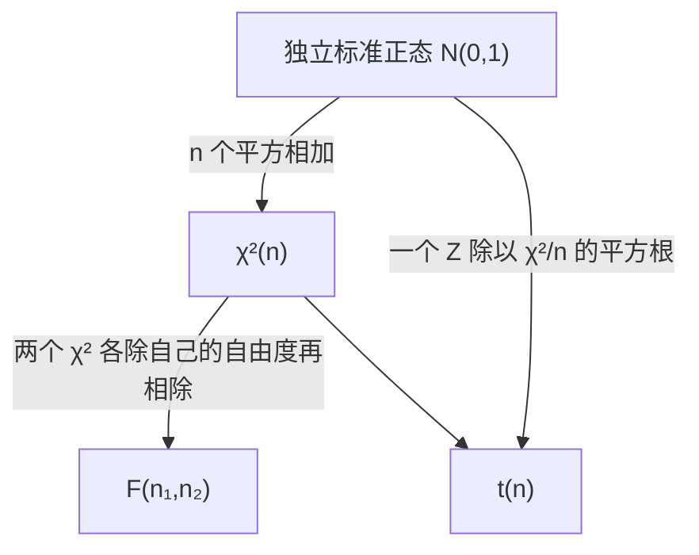

# 统计量与抽样分布：三大分布都是拿标准正态拼出来的

> 目标：说清样本算出来的量为什么本身是随机变量，以及 χ²、t、F 各自的构造方式怎么决定了自由度。原书第 6 章（书页 127–144）。

## 场景

你在一家饮料厂管质量。两条灌装线灌同一款瓶装水，瓶签上的标称净含量是 498 ml，A 线的灌装标准差历史上标定为 $\sigma = 3$ ml。今天早班你从 A 线抽了 10 瓶、B 线抽了 8 瓶，逐瓶称重换算成毫升数。

四个问题压在你桌上：

- A 线的**波动**是不是比标定的 3 ml 大了（要不要停机校阀）；
- A 线的**均值**是不是已经偏离 498 ml（要不要调灌装量）；
- 两条线的**稳定性**是不是一个水平（能不能混着排产）；
- 两条线灌得**一样多**吗（要不要把其中一条的设定值往另一条靠）。

你手上只有 18 个数。这 18 个数算出来的任何一个量 —— 均值、方差、它们的比 —— 换一个班次再抽一遍就会变成别的数。所以真正的问题是：**这些会变的量，各自按什么规律变**。这一章就在回答这件事。

## 讲解

### 样本是随机的，所以样本算出来的量也是随机变量

原书对统计量的判据只有两条：

> 统计量有以下两个特征：统计量是样本的函数，因而统计量通常为随机变量；统计量不能含有未知的参数，含有未知参数就不是统计量。
>
> —— 书页 131

第一条是整个推断统计的起点。抽样之前，抽中哪 10 瓶是不确定的，所以样本 $(X_1,\dots,X_n)$ 是一组随机变量；测完之后才落成一组确定的数 $(x_1,\dots,x_n)$。由 $X_i$ 算出来的 $T=T(X_1,\dots,X_n)$ 继承了这份随机性 —— 它有自己的概率分布，**这个分布就叫抽样分布**。

第二条是条实用闸门。$\sum_{i=1}^{n}(X_i-\mu)^2$ 在 $\mu$ 已知时是统计量，$\mu$ 未知时不是 —— 因为你根本算不出它的值。这就是为什么整章后半在反复做同一件事：**把公式里算不出来的 $\mu$ 和 $\sigma$，换成能从样本算出来的 $\bar X$ 和 $S$**，代价是分布从正态换成 $t$、换成 $\chi^2$。

两个最常用的统计量（书页 132）：

$$
\bar X=\frac1n\sum_{i=1}^{n}X_i,\qquad
S^2=\frac{1}{n-1}\sum_{i=1}^{n}(X_i-\bar X)^2
$$

它们的两条性质（书页 132）：

$$
E(\bar X)=E(X),\quad D(\bar X)=\frac{D(X)}{n};\qquad E(S^2)=D(X)
$$

分母写 $n-1$ 不是习惯，是为了让第二条成立。分母写 $n$ 得到的是**未修正方差** $S_n^2$（书页 133）：

$$
S_n^2=\frac1n\sum_{i=1}^{n}(X_i-\bar X)^2=\frac{n-1}{n}S^2
$$

所以 $S_n^2$ 一定比 $S^2$ 小，比例固定是 $(n-1)/n$。这是个好用的自查点：两个数算出来，比一下比例对不对。

### 三大分布的构造方式决定了自由度从哪来

三个分布不是三条独立的记忆项，是**同一个零件（独立标准正态）的三种拼法**。



**χ² 分布（定义 6-1，书页 134）** —— 若 $X_1,\dots,X_n$ 独立同服从 $N(0,1)$，则

$$
\chi^2=\sum_{i=1}^{n}X_i^2\sim\chi^2(n)
$$

平方和拼出来的东西只能是非负的，所以 $\chi^2$ 分布的取值区域是 $(0,+\infty)$、右偏。它的期望与方差（式 6.5，书页 134）：

$$
E(X)=n,\qquad D(X)=2n
$$

自由度就是加进去的独立正态的**个数**，加得越多期望和方差都越大。可加性（式 6.7，书页 135）直接从"平方和继续相加还是平方和"来：$X\sim\chi^2(n_1)$、$Y\sim\chi^2(n_2)$ 独立，则

$$
X+Y\sim\chi^2(n_1+n_2)
$$

**t 分布（定义 6-2，书页 136）** —— 若 $X\sim N(0,1)$、$Y\sim\chi^2(n)$ 且两者独立，则

$$
t=\frac{X}{\sqrt{Y/n}}\sim t(n)
$$

分子是一个标准正态，分母是"一个 $\chi^2$ 除以自己的自由度再开根"。分母是随机的、有时偏小，所以 $t$ 比标准正态更容易取到尾部值 —— 这就是 $t$ 尾厚峰低的来源。它的期望与方差（式 6.10，书页 137）：

$$
E(t)=0,\qquad D(t)=\frac{n}{n-2}\quad(n>2)
$$

$n\to\infty$ 时方差趋于 1，$t$ 退回标准正态。**$t$ 的自由度来自分母那个 $\chi^2$，不来自分子。**

**F 分布（定义 6-3，书页 138）** —— 若 $X\sim\chi^2(n_1)$、$Y\sim\chi^2(n_2)$ 且两者独立，则

$$
F=\frac{X/n_1}{Y/n_2}\sim F(n_1,n_2)
$$

两个 $\chi^2$ 各自先除掉自己的自由度（变成"每条自由度摊多少"），再相除。所以 F 有两个自由度，且**顺序不能换**：分子的那个叫第一自由度。分子分母能整体对调，于是（式 6.15、6.16，书页 139）

$$
\frac1F\sim F(n_2,n_1),\qquad
F_{1-\alpha}(n_1,n_2)=\frac{1}{F_{\alpha}(n_2,n_1)}
$$

这一条是查表的实用工具：附表只给较小的 $\alpha$，左尾分位数靠倒数换过去算。原书例 6-7（书页 139）就是这么做的：$F_{0.05}(20,15)=2.328$，所以 $F_{0.95}(15,20)=1/2.328=0.4296$。

期望只跟第二自由度有关（式 6.13，书页 139）：

$$
E(F)=\frac{n_2}{n_2-2}\quad(n_2>2)
$$

$n_2$ 越大，$E(F)$ 越接近 1 —— 分母那个方差估得越准，比值就越靠拢 1。

### 自由度是独立信息的条数，不是记忆项

原书给了自由度的严格定义和一句大白话：

> 如果变量 $X_1,\dots,X_n$ 中存在 $k$ 个独立的线性约束条件，则 $X_i\,(i=1,2,\cdots,n)$ 中独立变量的个数 $(n-k)$ 称为自由度。自由度也可粗略解释为可以自由选择数值的变量个数。
>
> —— 书页 135

把它当成**独立信息的条数**来数，所有自由度都不用背了：

- $\sum_{i=1}^{n}X_i^2$ 的自由度是 $n$ —— 没有任何约束，$k=0$；
- $\sum_{i=1}^{n}(X_i-\bar X)^2$ 的自由度是 $n-1$ —— 算它必须先用 $\bar X$，而 $\bar X$ 自带一条约束 $\sum_{i=1}^{n}(X_i-\bar X)=0$。前 $n-1$ 个离差任意取，第 $n$ 个就被这条等式钉死了，失去了"自由"。

这条约束在做题时是硬指标：**你算出的 $n$ 个离差加起来必须是 0**，不是 0 说明均值算错了。

### 上侧 α 分位数：查表查的是哪个数 { #quantile }

三个分布的分布函数都没有初等表达式，所以实用上一律查表。表给的是**上侧 $\alpha$ 分位数**，原书对 F 的定义写得最清楚（书页 139）：

> 满足 $p(F(n_1,n_2)\ge F_\alpha(n_1,n_2))=\alpha$ 的 $F_\alpha(n_1,n_2)$ 称为自由度为 $n_1,n_2$ 的 F 分布上侧 $\alpha$ 分位数。

读法是**从右往左**数面积：$F_{0.05}(9,7)$ 就是"右边还剩 5% 概率"的那个点，$\chi^2$ 和 $t$ 同理。三件实用后果跟着这个定义来：

- **附表只印较小的 $\alpha$**（原书在书页 139 明说了这一点），要左尾就靠 (6.16) 的倒数性质换过去；
- **Excel 的函数分两套尾向**，混用必错（见下面「准备」里那条 warning）；
- **附表的值只有三位有效数字**，所以"倒数路径"和"函数路径"算出来第四位往往就分家 —— 那不是算错，是表的精度到顶了。

!!! note "本章到分位数为止，判不判显著是第 8 章的事"
    把统计量的值和同自由度的上侧分位数摆在一起比大小，这一章能做到的就是这一步。「拒绝域」「显著性水平」「单侧还是双侧」属于原书第 8 章「假设检验与方差分析」。所以这一课的题**一律不要求你下"拒绝／接受"的结论** —— 只要求你说出两个数谁大、以及算出的上侧概率是什么意思。

### 抽样分布定理：把算不出来的参数换成算得出来的统计量

四条定理是一条链，每一条都在换掉一个算不出来的东西。

**定理 6-1（书页 140）**，单总体 $N(\mu,\sigma^2)$ 的样本：

$$
\bar X\sim N\!\left(\mu,\frac{\sigma^2}{n}\right) \quad \text{(6.17)}
$$

$$
\frac{\sum_{i=1}^{n}(X_i-\bar X)^2}{\sigma^2}
=\frac{(n-1)S^2}{\sigma^2}
=\frac{nS_n^2}{\sigma^2}
\sim\chi^2(n-1) \quad \text{(6.18)}
$$

外加第三条：$\bar X$ 与 $S^2$ **相互独立**。(6.17) 用来推断均值（$\sigma$ 已知时），(6.18) 用来推断方差 —— 自由度 $n-1$ 正是上一节数出来的那条约束扣掉的。第三条独立性是后面能把 $Z$ 和 $\chi^2$ 拼成 $t$ 的前提，不是可有可无的附注。

**定理 6-2（书页 141）**，$\sigma$ 未知，用 $S$ 顶上：

$$
t=\frac{\bar X-\mu}{S/\sqrt n}\sim t(n-1) \quad \text{(6.19)}
$$

推导就是照 $t$ 的定义把两个零件拼起来：分子是原书 (6.20) 的 $Z=\dfrac{\bar X-\mu}{\sigma/\sqrt n}\sim N(0,1)$，分母是 (6.21) 的 $Y=\dfrac{(n-1)S^2}{\sigma^2}\sim\chi^2(n-1)$，$\sigma$ 在 $Z/\sqrt{Y/(n-1)}$ 里上下约掉，剩下的就是 (6.19)。**$\sigma$ 换成 $S$ 的代价，就是分布从 $N(0,1)$ 变成 $t(n-1)$。**

**定理 6-3（书页 142）**，两个独立正态总体比均值。$\sigma_1^2,\sigma_2^2$ 已知时：

$$
Z=\frac{\bar X-\bar Y-(\mu_1-\mu_2)}{\sqrt{\dfrac{\sigma_1^2}{n_1}+\dfrac{\sigma_2^2}{n_2}}}\sim N(0,1) \quad \text{(6.22)}
$$

$\sigma_1^2=\sigma_2^2$ 但未知时，两组的离差平方和合起来估同一个方差：

$$
t=\frac{\bar X-\bar Y-(\mu_1-\mu_2)}{S_w\sqrt{\dfrac{1}{n_1}+\dfrac{1}{n_2}}}\sim t(n_1+n_2-2),
\qquad
S_w=\sqrt{\frac{(n_1-1)S_1^2+(n_2-1)S_2^2}{n_1+n_2-2}} \quad \text{(6.23)}
$$

自由度 $n_1+n_2-2$ 是两个 $\chi^2$ 用可加性拼出来的：$(n_1-1)+(n_2-1)$。$S_w^2$ 是两个 $S^2$ 按自由度加权的平均 —— 谁的自由度多，谁的话语权大。

**定理 6-4（书页 143）**，两个正态总体比方差：

$$
F=\frac{S_1^2/\sigma_1^2}{S_2^2/\sigma_2^2}\sim F(n_1-1,\;n_2-1) \quad \text{(6.24)}
$$

两个 $\chi^2$ 各除自己的自由度再相除，正是 F 的定义。注意 (6.24) 的分子分母各自还除着自己的 $\sigma^2$ —— 只有在"两总体方差相等"这个待检验的假定下，那两个 $\sigma^2$ 才约掉、$S_1^2/S_2^2$ 才直接是 F 统计量。**这就是拿它比较两个方差的逻辑：先假定相等，再看 $S_1^2/S_2^2$ 离 1 有多远。**「多远算远」原书在书页 144 收尾时点到、正式做法在第 8 章。

### 一个能手算的小例子

$n=5$ 的样本 $2,4,4,4,6$：$\bar x=4$，离差 $-2,0,0,0,2$，和为 0（自查通过）。$\sum(x_i-\bar x)^2=8$，所以 $S^2=8/4=2$，$S_n^2=8/5=1.6$，比例 $1.6/2=0.8=(5-1)/5$ ✓。

若总体是 $N(\mu,\sigma^2)$ 且 $\sigma^2=1$，则 $\dfrac{(n-1)S^2}{\sigma^2}=\dfrac{4\times2}{1}=8\sim\chi^2(4)$；期望是 4，实测 8 偏大，说明这批数据比标定的 $\sigma$ 更散。三个数（统计量值、自由度、期望）摆在一起，结论才读得出来。

??? warning "原书这几处印刷有误 —— 对着纸书读时注意"

    下面每一条都经过两轮独立核对：先由重排公式的人对着 300dpi 页图提出，再由另一个只拿页图、不看重排结果的人放大复核。**本页正文一律不跟随这些错处。**

    | 书页 | 原书印的 | 应该是 |
    |---|---|---|
    | 134 | $\Gamma(1/2)=\pi$ | $\Gamma(1/2)=\sqrt\pi$（页图上确实没有根号） |
    | 141 | 「(6.20) 主要用于单总体且总体方差**未知**时推断总体均值」 | (6.20) 是 $\sigma$ **已知**的 $Z$；方差未知那条是 (6.19) |
    | 143 | 定理 6-3 化简末式的分母 $S_w\sqrt{1/n_1+1/n_1}$ | $S_w\sqrt{1/n_1+1/n_2}$ —— 与同章 (6.23) 自相矛盾，本页和 Q5 按 (6.23) 写 |
    | 133 | 最小顺序统计量 $\min\{X_1,X_2,\cdots,X_3\}$ | 末项应是 $X_n$ |
    | 142 | 例 6-9 引「定理 5-1」 | 应为本章的定理 6-1 |
    | 134 / 136 | 人名 Hermert、W. C. Gosset | 通行作 Helmert、W. S. Gosset |

    另有书页 142 定理 6-3 推导过程里 $\sigma$ 的下标时有时无（排版不一致，数学上不影响）。

## 准备

数据表两份，都在本课 `assets/` 下，一列 `unit` 一列 `volume_ml`：

- [A 线 10 瓶净含量](assets/ch06-sampling-distribution/line-a-fill-ml.csv) —— $n_1=10$
- [B 线 8 瓶净含量](assets/ch06-sampling-distribution/line-b-fill-ml.csv) —— $n_2=8$

两份表的数值都是整数，均值也是整数，**所有统计量本身都能用笔和纸算完**（离差、平方和、$S^2$、$F$、$S_w^2$ 全是好看的数）。但**分位数和上侧概率必须靠 Excel 函数或附表** —— 本页不附表，所以那几个数得自己调函数。已知条件：标称净含量 498 ml，A 线历史标定 $\sigma=3$ ml（即 $\sigma^2=9$）。

算工具随便挑，但每道要求交叉核对的题必须用**两条独立路径**各算一遍。Excel / WPS 里会用到的函数：

| 用途 | 函数 |
|---|---|
| 样本方差（除 $n-1$）／未修正方差（除 $n$） | `VAR.S` ／ `VAR.P` |
| $\chi^2$ 上侧 $\alpha$ 分位数／上侧概率 | `CHISQ.INV.RT` ／ `CHISQ.DIST.RT` |
| $t$ 分位数（左尾累积）／双侧临界值 | `T.INV` ／ `T.INV.2T` |
| $F$ 分位数（左尾累积）／上侧概率 | `F.INV` ／ `F.DIST.RT` |

!!! warning "Excel 的分位数函数有两套尾向，别混"
    `CHISQ.INV.RT(0.05, df)` 给的是**上侧** 0.05 分位数，和原书 $\chi^2_{0.05}(n)$ 的记法一致；而 `T.INV(p, df)` 和 `F.INV(p, df1, df2)` 给的是**左尾累积到 $p$** 的分位数，要上侧 0.05 得填 0.95。原书例 6-7 用的老函数 `FINV` 是上侧口径，和 `F.INV` 正好相反 —— 两条路径算出来差得很远，先查是不是尾向填错了。

用 Python 的话 `scipy.stats` 的 `chi2.ppf` / `t.ppf` / `f.ppf` 全是左尾累积口径，`.sf` 是上侧概率。

## 任务

把四个现场问题各自落成一个统计量的**具体数值 + 自由度 + 一个查表得到的比较基准**，然后说清每个统计量落在它的基准的哪一侧。**"要不要真动设备"这一步本章还答不了** —— 那要等第 8 章把检验的判据学完，这一课只负责把量算对、把分布和自由度认对。

顺序上，先把两条线的 $\bar x$、$S^2$、$S_n^2$ 算干净，再分别构造方差用的 $\chi^2$、均值用的 $t$、两线对比用的 $F$ 和合并 $t$。每个统计量都要能指回原书的公式编号，并说清它的自由度是由哪一组数据的什么量扣出来的。最后做一次样本量对照：把 A 线样本人为翻倍，看哪些量变、往哪个方向变。

## 验收

- A 线 10 个离差之和、B 线 8 个离差之和，都严格是 0；
- 每条线的 $S_n^2$ 都小于 $S^2$，且两者之比等于用 $n$ 写出来的那个固定比例；
- 每个 $\chi^2$ 值都是正数；每个自由度都能说出是**哪一条约束**扣出来的，不是照着样本量减一填的；
- 每个 $t$ 值都能写成"分子是一个差、分母是一个标准误"，分母的数值单独贴得出来；
- $F$ 的两个自由度顺序写对：分子那条线的自由度在前；
- Q2 到 Q5 每个统计量都配了同自由度的上侧 0.05 分位数，并说清统计量值落在它的哪一侧 —— **不要求下"显著／不显著"的结论**，理由见[上侧 α 分位数](#quantile)那节；
- $F_{0.95}(9,7)$ 两条路径算出的值**小数点后三位一致**。第四位对不上是正常的：附表印的 $F_{0.05}(7,9)$ 只有三位有效数字，取倒数会把这点误差放大。要四位全对，得先用函数把 $F_{0.05}(7,9)$ 算到四位以上再取倒数；
- 样本量翻倍那题里，三个量的升降方向都能用公式里 $n$ 出现的位置解释，不是靠观察数字得出的。

## 提问

```conflict
<<<<<<< courses/statistics-book/ch06-sampling-distribution
Q1 两条线的均值和方差
用两份 CSV 算出 A、B 两条线的样本均值、样本方差 S²（除 n-1）和未修正方差 S_n²（除 n），六个数全部贴出来。
再贴出 A 线那 10 个离差 (x_i - x̄) 的和，以及两条线各自 S_n²/S² 的比值。
=======
>>>>>>> notes
```

```conflict
<<<<<<< courses/statistics-book/ch06-sampling-distribution
Q2 A 线的波动超标了吗
按定理 6-1 的 (6.18) 式构造 A 线方差的卡方统计量：σ 取历史标定的 3 ml。贴出 (n-1)S²/σ² 的数值和自由度。
然后用两条路径给出判断依据，两个数都贴出来：一是同自由度的上侧 0.05 分位数（Excel 的 CHISQ.INV.RT），二是你算出的那个统计量值对应的上侧概率（CHISQ.DIST.RT）。
最后用一句话说清你算出的那个上侧概率是什么意思 —— 它说的是"如果 σ 真的就是 3 ml，抽到比这更散的一组样本有多大机会"。本章不要求你下显著／不显著的结论。
=======
>>>>>>> notes
```

```conflict
<<<<<<< courses/statistics-book/ch06-sampling-distribution
Q3 A 线均值偏离标称几个标准误
标称净含量 498 ml。按定理 6-2 的 (6.19) 式算 A 线的 t 统计量。
三个数分别贴出来：分母 S/√n 的数值、t 的数值、自由度。
再用 T.INV 交叉核对同自由度的上侧 0.05 临界值，说清 t 落在临界值的哪一侧。
=======
>>>>>>> notes
```

```conflict
<<<<<<< courses/statistics-book/ch06-sampling-distribution
Q4 F 的两个自由度各是谁给的
以 A 线为分子、B 线为分母，算 F = S_A²/S_B² 的数值和两个自由度。
逐个指认：第一自由度是由哪一条线的什么量算出来的，第二自由度是由哪一条线的什么量算出来的，各扣掉了几条独立信息、为什么扣。
然后给出两个基准，都贴出来：右侧的 F_0.05(9,7)，和左侧的 F_0.95(9,7)。左侧那个走两条路径——一条用书页 139 的 (6.16) 倒数性质（先给出你算的 F_0.05(7,9)），一条用 Excel 的 F.INV——两个结果贴出来比一比，小数点后三位该是一致的。
最后说清：你算出的 F 落在这两个基准之间，还是落在某一侧？为什么一个比 1 大的 F 要跟右侧那个基准比，跟左侧那个比是没意义的。
=======
>>>>>>> notes
```

```conflict
<<<<<<< courses/statistics-book/ch06-sampling-distribution
Q5 两条线的均值差
假定两条线方差相等，按定理 6-3 的 (6.23) 式算两线均值差的 t 统计量。
四个数贴出来：合并方差 S_w²、S_w、分母 S_w√(1/n₁+1/n₂) 的数值、t 的数值，以及自由度。
再说清 S_w² 是怎么把两个 S² 加权平均的，A 线和 B 线的权重分别是多少。
最后给出同自由度的上侧 0.05 分位数 t_0.05(16)，说清你算的 t 落在它的哪一侧 —— 注意你算出的 t 是负的，所以先说清你比的是 t 本身还是 |t|，以及为什么。
=======
>>>>>>> notes
```

```conflict
<<<<<<< courses/statistics-book/ch06-sampling-distribution
Q6 样本量翻倍的对照
把 A 线那 10 个数各复制一遍，当成一个 n=20 的样本，重算 Q2 和 Q3。
贴出新的 S²、新的 χ² 值、新的 t 值和它们的自由度，逐个说出相对原来是升还是降 —— 三个量里一个降、两个升。
分别指出：公式里的哪个 n 造成了降的那一个，哪个 n 造成了升的那两个。
最后一问最要紧：复制数据根本不是合法的抽样，但照这么做 t 值明显变大了。用 (6.19) 的分母说清"真去多抽 10 瓶"和"把同 10 瓶抄两遍"在公式里为什么长得一模一样，而在现实里根本不是一回事。
=======
>>>>>>> notes
```

```conflict
<<<<<<< courses/statistics-book/ch06-sampling-distribution
Q7 换个中心，平方和差多少
还用 A 线那 10 个数，算出两个平方和并贴出来：Σ(x_i-498)² 和 Σ(x_i-x̄)²。
两者相差多少？这个差值恰好等于 n 乘以什么量？用你算出的数验证一遍。
最后按书页 131 的判据回答：把 498 换成未知的 μ 之后，Σ(X_i-μ)² 为什么就不是统计量了，而 Σ(X_i-X̄)² 为什么是。
=======
>>>>>>> notes
```

```conflict
<<<<<<< courses/statistics-book/ch06-sampling-distribution
一句话
这一章教会你的最有用的一句话是什么。
=======
>>>>>>> notes
```

```conflict
<<<<<<< courses/statistics-book/ch06-sampling-distribution
心智模型
用自己的话说清 χ²、t、F 三者的构造关系，以及每个分布的自由度为什么是那个数。不抄定义，要能解释你在 Q2/Q3/Q4 里填进去的自由度。
=======
>>>>>>> notes
```

```conflict
<<<<<<< courses/statistics-book/ch06-sampling-distribution
坑
这一课你实际踩到的坑是哪个，怎么发现算错了的。
=======
>>>>>>> notes
```
