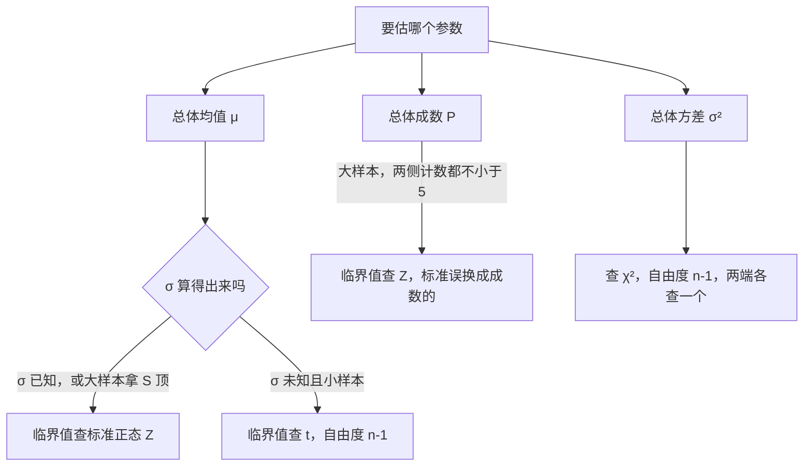

# 参数估计：区间是一套程序，不是参数的概率

> 目标：说清点估计的三条判据各自否掉什么毛病，以及置信区间那句"95%"到底是在说哪件事的 95%。原书第 7 章（书页 145–166）。

## 场景

还是上一课那家饮料厂，还是那条 A 线。瓶签标称净含量 498 ml，A 线的灌装标准差历史上标定为 $\sigma = 3$ ml。

上一课你把统计量算出来了，也认出了它们各自服从什么分布。今天车间主任问的是另一种问题，一句话都不关心分布的名字：

- 这条线现在**到底灌多少**？给一个数，再给一个范围；
- 这批货的**欠量率**（净含量低于 498 ml 的比例）是多少？上下能差到哪；
- 要把欠量率的估计误差压到 ±1 个百分点，**得抽几瓶**？抽 900 瓶够不够；
- 质检科有两套抽样方案 —— 按三条线分层抽 200 瓶，或者整托盘拉 5 个托盘全测（10 000 瓶）。**哪个更准**？

第一类问题给一个数，叫**点估计**；给范围的，叫**区间估计**。这一章就是这两件事，加上"范围要多窄就得抽多少"的换算。

上一课讲的是[统计量服从什么分布](ch06-sampling-distribution.md) —— 三大分布怎么拼出来的、自由度从哪来、[上侧 $\alpha$ 分位数](ch06-sampling-distribution.md#quantile)怎么读。那些这一课全部当已知直接用，不重讲。**这一课是反方向：拿那些已知的分布，去把未知参数圈进一个范围里。**

## 讲解

### 点估计：三条判据各自否掉一种不同的毛病

点估计的做法原书讲了两种（矩估计法、极大似然估计法），但真正值钱的是第三小节的**判据** —— 同一个参数，不同方法给出的估计量不一样，你得有本事说哪个更好。判据是三条（书页 150–152）：**无偏性、有效性、一致性**。

**无偏性**（式 7.5，书页 150）：$E(\hat\theta)=\theta$，或者写成 $E(\hat\theta)-\theta=0$。读法是：换一批样本 $\hat\theta$ 就变一个值，有时偏高有时偏低，但**长期平均下来正好落在真值上**。不满足就叫有系统偏差 —— 不是运气不好，是这个估计量本身歪。

**有效性**（书页 152）：两个估计量期望一样时，方差小的那个更有效。原书的原话是

> 若参数 $\theta$ 有两个估计量 $\hat\theta_1$ 与 $\hat\theta_2$，如果满足 $E(\hat\theta_1)=E(\hat\theta_2)$ 并且 $D(\hat\theta_1)<D(\hat\theta_2)$，则称 $\hat\theta_1$ 比 $\hat\theta_2$ 有效。
>
> —— 书页 152

为什么还需要这一条？因为**无偏估计量不唯一，而且可以是无限多个**：原书在书页 151 指出，$\hat\theta_1$、$\hat\theta_2$ 都无偏时，任何满足 $\alpha_1+\alpha_2=1$ 的加权 $\alpha_1\hat\theta_1+\alpha_2\hat\theta_2$ 也无偏。光靠无偏挑不出一个来，得再拿方差筛一遍。原书衡量偏差程度的通用尺子是均方误差 $\mathrm{MSE}(\hat\theta)=E(\hat\theta-\theta)^2$，它拆成方差加偏差平方两块；**无偏时偏差那块是 0，MSE 就退化成方差** —— 这就是"有效性只比方差"的来历。

**一致性**（式 7.6，书页 152）：

$$
\lim_{n\to\infty}P(|\hat\theta_n-\theta|>\varepsilon)=0
\quad\text{或者}\quad
\lim_{n\to\infty}P(|\hat\theta_n-\theta|\le\varepsilon)=1 \quad \text{(7.6)}
$$

书页 153 给了一条好用得多的等价路子（切比雪夫不等式）：**期望对（或极限对）+ 方差趋于 0，就一致**。判一致性通常不用碰 (7.6) 本身，算个 $D(\hat\theta_n)$ 看它是不是带着 $n$ 往下掉就行。

三条判据不是三种说法，是**三个独立的筛子**。本章自带两个反例，恰好各漏一个：

| 估计量 | 无偏 | 有效 | 一致 | 漏在哪 |
|---|---|---|---|---|
| $X_1$（只用抽到的第一瓶估 $\mu$） | ✅ | ❌ | ❌ | $D(X_1)=\sigma^2$，不随 $n$ 变 —— 多抽一万瓶也不见好 |
| $S_n^2=\frac1n\sum(X_i-\bar X)^2$（$\sigma^2$ 的矩估计） | ❌ | — | ✅ | $E(S_n^2)=\frac{n-1}{n}\sigma^2$，系统性低估 |

这个「只用一瓶」的估计量是原书例 7-5（书页 152）拿来跟 $\bar X$ 对比的那一个（原书记作 $X_i$，这里为了跟表里对齐写成 $X_1$）：两者都无偏，但 $D(\bar X)=\sigma^2/n$ 比 $D(X_1)=\sigma^2$ 小 $n$ 倍。**无偏只保证不歪，不保证准。**

$S_n^2$ 这一条更值得停一下。原书例 7-1（书页 147）用矩估计法求出 $\sigma^2$ 的估计量正是 $\hat{\sigma^2}=\frac1n\sum X_i^2-\bar X^2=\frac1n\sum(X_i-\bar X)^2$，也就是[上一课的未修正方差](ch06-sampling-distribution.md) $S_n^2$；而三页之后的例 7-4（书页 150–151）证明的是 $S^2$（除 $n-1$ 的那个）才无偏。**同一章里，第一种方法交出来的答案，被第三小节的判据判成有偏。** 这不是排印矛盾，是矩估计法的真实代价 —— 它只用总体矩的信息，不用分布。原书把它归为"渐进无偏"：$n\to\infty$ 时 $E(S_n^2)\to\sigma^2$，样本大了就不计较。**所以"除 $n$ 还是除 $n-1$"不是口味问题，是你选了哪条判据。**

### 区间估计是一套造区间的程序，不是参数的概率 { #procedure }

这是全章最容易讲错的一条，也是最值钱的一条。

置信区间的定义（式 7.7，书页 154）：对给定的 $\alpha$，用样本构造两个统计量 $\hat\theta_L(X_1,\cdots,X_n)$、$\hat\theta_U(X_1,\cdots,X_n)$，使

$$
p(\hat\theta_L\le\theta\le\hat\theta_U)=1-\alpha \quad \text{(7.7)}
$$

**先看清 (7.7) 里哪个字母是随机的。** 两端 $\hat\theta_L$、$\hat\theta_U$ 写成了大写 $X$ 的函数 —— 它们是统计量，换一批样本就变。中间的 $\theta$ 是总体参数，它是个未知但**固定**的数，不会变。所以 (7.7) 这句概率是在说"两端这对随机的钳子夹住那个固定靶子"的概率，**不是"靶子在某处"的概率**。

原书对这件事给了一句很干净的解释：

> 例如，抽样 100 次，可以得到 100 个这样的区间，在这 100 个区间中，有的包含真实值 $\theta$，有的不包含 $\theta$，包含 $\theta$ 的频率可能为 $1-\alpha$。
>
> —— 书页 154

关键在"**100 个区间**"这四个字：$1-\alpha$ 是给**这套造区间的办法**的评分，评的是它长期的成功率，而不是给你手上这一个区间的评分。等你把观测值代进去、算出 $[498.04,\ 501.96]$ 这么一对具体的数，随机性就已经用完了 —— 这时候 $\mu$ 要么在里面要么不在，是 0 或 1，没有 95% 这种中间状态。**"参数落在这个区间里的概率是 95%"之所以说不通，不是因为它不严谨，是因为它里面已经没有任何东西还是随机的。**

原书自己也把这一条挂成了思考题：

> 7-3　如何理解参数估计中置信水平 $1-\alpha$ 的含义，是否可认为"总体参数落在置信区间的概率是$(1-\alpha)$"？
>
> —— 书页 165

另外原书那句"包含 $\theta$ 的频率**可能**为 $1-\alpha$"里的"可能"并非含糊其辞：100 个区间里究竟命中几个本身也是随机的，只是长期看会收敛到 $1-\alpha$ —— 真去数 100 个 95% 区间，恰好 95 个命中的机会还不到两成。

!!! note "本章到「算出区间、说清区间的含义」为止"
    这一章只要求你把区间算对、把它的含义说对。**"这条线到底有没有偏离标称 498 ml"这种下结论的活，本章答不了** —— 那要等原书第 8 章「假设检验与方差分析」。这一课的题一律只问数值和含义。

### 一个区间的三个零件，只有一个能花钱买

所有均值区间都长成同一个形状：**点估计 ± 临界值 × 标准误**。原书把标准误叫**抽样平均误差**（式 7.8，书页 154），把后两项的乘积叫**抽样极限误差**（式 7.10，书页 155）：$\sigma_{\bar x}=\dfrac{\sigma}{\sqrt n}$，$\Delta_{\bar x}=Z_{\alpha/2}\sigma_{\bar x}$。于是区间宽度 $=2\Delta_{\bar x}$，由三件事定死：

- **置信水平** —— 决定临界值。要更有把握，临界值变大，区间变宽。这是一道跷跷板：原书在书页 154 明说"提高区间估计的精确性往往要降低估计的把握程度"。
- **数据本身有多散** —— $\sigma$（或用 $S$ 顶上）。这不是你能改的，是这条生产线的物理事实。
- **样本量 $n$** —— 只有这一件能拿钱换。而且它进公式的方式是 $\sqrt n$：**要把区间压窄一半，得抽四倍的样本。**

不重复抽样（抽了不放回）时标准误要乘一个小于 1 的因子（式 7.9，书页 154）：$\sigma_{\bar x}=\sqrt{\dfrac{\sigma^2(N-n)}{n(N-1)}}$。原书指出总体大时可以把 $\frac{N-n}{N-1}$ 换成 $1-\frac nN$，$\sqrt{1-\frac nN}$ 就是**不重复抽样的修正因子**（书页 155）。它总小于 1，所以**不重复抽样的误差更小** —— 每抽一个不放回，剩下的池子里就少一份重复，样本铺得更匀。$n/N$ 很小时这个因子接近 1，两种抽样就没差别了。

### 四种参数四条路，分岔点只有两个

原书 7.2.2 分了四种情形（书页 155–157），但分岔点其实只有两个：**估的是什么参数**，以及**算不算得出总体的 $\sigma$**。



四条路的公式（书页 155–157），注意下标一律是 $\alpha/2$ —— 区间是双侧的：

$$
[\bar X-Z_{\alpha/2}\sigma_{\bar x},\ \bar X+Z_{\alpha/2}\sigma_{\bar x}] \quad \text{(7.11)}
$$

$$
\left[\bar X-t_{\alpha/2}(n-1)\frac{S}{\sqrt n},\ \bar X+t_{\alpha/2}(n-1)\frac{S}{\sqrt n}\right] \quad \text{(7.12)}
$$

$$
\sigma_p=\sqrt{\frac1n P(1-P)},\qquad
[p-Z_{\alpha/2}\sigma_p,\ p+Z_{\alpha/2}\sigma_p] \quad \text{(7.13)}
$$

$$
\left[\frac{(n-1)S^2}{\chi^2_{\alpha/2}(n-1)},\ \frac{(n-1)S^2}{\chi^2_{1-\alpha/2}(n-1)}\right] \quad \text{(7.14)}
$$

(7.12) 的分布依据就是上一课定理 6-2 的 (6.19)：$\dfrac{\bar X-\mu}{S/\sqrt n}\sim t(n-1)$。两者的宽度比能拆成两份：一份是 $t_{\alpha/2}(n-1)/Z_{\alpha/2}>1$（$t$ 尾更厚，这一份**永远**把区间撑宽），一份是 $S/\sigma$（这一批数据碰巧散一点还是紧一点）。

!!! warning "t 区间并不「一定」更宽"
    第二个因子可以小于 1。本例 $S=4>\sigma=3$，所以 $t$ 区间确实更宽；但若这 9 瓶抽出 $S=2$，宽度比就是 $\dfrac{2.306}{1.96}\times\dfrac{2}{3}=0.784<1$ —— $t$ 区间反而**更窄**。「$\sigma$ 未知就得付更宽的代价」这句话只在平均意义上成立，落到某一个具体样本上不一定。

(7.13) 那个成数区间的总体服从二点分布，大样本下样本成数渐进正态，只是标准误换了个算法；$P$ 未知就用样本比率 $p$ 顶上。适用前提原书写得很明确：大样本，且 $np\ge5$、$n(1-p)\ge5$ —— 用之前先验一遍，别默认成立。注意 $P(1-P)$ 这条抛物线在 $P=0.5$ 处最大（等于 0.25），**离 0.5 越远，同样的 $n$ 给出的区间越窄**；这一条在下一节算样本量时会变成一条硬规矩。

### 方差的区间为什么两头不对称，而且分位数是交叉的

(7.14) 和前三条长得完全不一样：没有"± 谁"，两端是两个不同的除法。原因全在它的来路 —— 它是把上一课定理 6-1 的 (6.18) 那个 $\dfrac{(n-1)S^2}{\sigma^2}\sim\chi^2(n-1)$ 夹在两个分位数之间，再把 $\sigma^2$ **解出来**：

$$
p\!\left(\chi^2_{1-\alpha/2}(n-1)\le\frac{(n-1)S^2}{\sigma^2}\le\chi^2_{\alpha/2}(n-1)\right)=1-\alpha
$$

$\sigma^2$ 在分母，解出来时**不等号翻个个儿**，于是大的那个分位数 $\chi^2_{\alpha/2}$ 落到了**下端**的分母上，小的那个落到上端。这就是 (7.14) 看起来"交叉"的全部原因 —— 记不住就现推一遍，两行的事。两头不对称则是因为 $\chi^2$ 本身右偏（上一课讲过：平方和拼出来的东西非负、右偏），所以 $S^2$ 不在区间正中间，**离上端总比离下端远**。

标准差怎么办？原书给了一条大样本近似（式 7.15，书页 157），前提是 $n$ 足够大时 $S$ 近似服从 $N(\sigma,\sigma^2/2n)$：$[S-Z_{\alpha/2}S/\sqrt{2n},\ S+Z_{\alpha/2}S/\sqrt{2n}]$。但原书例 7-10（$n=15$，书页 157）并没有用它，而是**把方差区间的两个端点直接开了根号**。这一步是对的，而且是区间才享有的便宜：开根号是单调变换，能把 $\sigma^2$ 的区间原样搬成 $\sigma$ 的区间，覆盖率一分不丢。**但同一招对点估计不成立** —— 原书书页 151 明确说了：$S^2$ 是 $\sigma^2$ 的无偏估计，$S$ 却**不是** $\sigma$ 的无偏估计。区间可以随便套单调函数，点估计的无偏性套不过去。

### 样本量：$\Delta$ 在分母上还带平方，所以精度是四倍价

把 (7.10) 的 $\Delta_{\bar x}=Z_{\alpha/2}\dfrac{\sigma}{\sqrt n}$ 反解出 $n$，就是必要抽样数目（式 7.16、7.17，书页 157）：

$$
n=\frac{Z_{\alpha/2}^2\sigma^2}{(\Delta_{\bar x})^2} \quad \text{(7.16)}
\qquad\qquad
n=\frac{Z_{\alpha/2}^2\sigma^2N}{(\Delta_{\bar x})^2N+Z_{\alpha/2}^2\sigma^2} \quad \text{(7.17)}
$$

前者是重复抽样，后者是不重复抽样。估成数就把 $\Delta_{\bar x}$ 换成 $\Delta_p$、把 $\sigma^2$ 换成 $P(1-P)$，公式一字不改。

看 $n$ 和 $\Delta$ 在 (7.16) 里的位置，四条结论直接读得出来，一条都不用背：

- $\Delta$ 在**分母**且**带平方** —— 允许误差砍一半，$n$ 变四倍；砍到十分之一，$n$ 变一百倍。**精度是平方定价的**，这是抽样调查预算失控最常见的来源。
- $\sigma^2$ 在**分子** —— 总体越散要抽越多。$\sigma^2$ 通常也不知道，原书给的办法是拿同类调查的旧资料代，且**有多个值可选时取最大的那个**（书页 157），宁可多抽。
- 估成数而没有任何先验资料时，取 $P=0.5$（书页 158）—— 因为 $P(1-P)$ 在 0.5 处最大，这是最坏情况，按它算出的 $n$ 对任何真实 $P$ 都够用。原书例 7-11（书页 158）就是这个逻辑的小号版本：给了 95%、90%、92% 三个历史合格率，选 **90%**，因为它离 0.5 最近、方差最大。
- (7.17) 的分母比 (7.16) 多了一项，所以**不重复抽样算出来的 $n$ 总比重复抽样小**，跟上一节修正因子那条完全一致。

### 换一种抽样组织方式，只是换掉标准误的算法

7.3 讲了抽样框、重复/不重复抽样，以及分层、等距、整群、多阶段几种组织方式。看着是新一摊东西，其实这一节对区间估计的全部影响只有一处：**换掉 $\sigma_{\bar x}$ 的算法，(7.10) 和 (7.11) 那两步一个字不改。**

$$
\underbrace{\sqrt{\frac{\overline{\sigma^2}}{n}}}_{\text{分层等比例，式 7.18}}
\qquad
\underbrace{\sqrt{\frac{\overline{\sigma^2}}{n}\Big(1-\frac nN\Big)}}_{\text{分层等比例、不重复，式 7.19}}
\qquad
\underbrace{\sqrt{\frac{\delta_{\bar x}^2}{r}\Big(\frac{R-r}{R-1}\Big)}}_{\text{整群，式 7.20}}
$$

其中层内方差的平均数与群间方差分别是（书页 160、162）

$$
\overline{\sigma^2}=\frac{\sum\sigma_i^2N_i}{\sum N_i}\quad\text{或}\quad\frac{\sum\sigma_i^2n_i}{\sum n_i},
\qquad
\hat\delta_{\bar x}^2=\frac{\sum_{i=1}^{r}(\bar X_i-\bar X)^2}{r-1}
$$

**这三个公式里最要紧的是：装进去的是哪个方差、除的是哪个数。** 对着看一遍，两种方式押的注正好相反：

| | 公式里装的方差 | 除以 | 于是设计时要 |
|---|---|---|---|
| 分层抽样 | $\overline{\sigma^2}$：各**层内**方差的加权平均 | 样本单位数 $n$ | 层内尽量齐、层间尽量分得开 |
| 整群抽样 | $\delta_{\bar x}^2$：各**群间**（群均值之间）的方差 | 抽中的**群数** $r$ | 群内可以乱，群间尽量像 |

分层抽样的公式里**根本没有层间那一项** —— 所以三层的均值差得再远也一分钱不影响 $\sigma_{\bar x}$，而这正是原书说"组内方差平均数小于总方差，分层抽样的抽样误差小于简单随机抽样"（书页 160）的来处。

整群抽样反过来：分母是**群数 $r$**，不是测了多少个单位。所以拉 5 个托盘把 10 000 瓶全测了，$\sigma_{\bar x}$ 的分母也只是 5。**整群抽样省的是跑腿钱，不是样本量的钱**；群间差异一大，测再多单位也换不来精度。原书书页 162 的对照说得最直白：简单随机抽样取决于 $\sigma^2$ 和 $n$，整群抽样取决于 $\delta_{\bar x}^2$ 和 $r$。

其余两种原书归得很干脆（书页 161）：**有关标志排队等距抽样**相当于每层抽一个的分层抽样，误差按分层的公式近似算；**无关标志排队等距抽样**效果接近简单随机抽样，按简单随机的公式近似算。多阶段抽样（式 7.21，书页 163）是原书打星号的选读内容，形状是两段方差各带自己的抽样比例相加，阶段越多误差越大。

### 一个能手算的小例子

一条别的产线，抽了 4 件，$\bar x=100$，总体标准差已知 $\sigma=6$，按 (7.11) 取 $Z_{\alpha/2}=2$：

$$
\sigma_{\bar x}=\frac{6}{\sqrt4}=3,\quad
\Delta_{\bar x}=2\times3=6,\quad
[94,\ 106]\ \text{（宽 12）}
$$

只改一件事：样本量翻到 $n=16$（四倍）。$\sigma_{\bar x}=6/\sqrt{16}=1.5$，$\Delta_{\bar x}=3$，区间 $[97,\ 103]$，宽 6 —— 正好一半。**四倍的样本换来一半的宽度**，这就是 $\sqrt n$ 在 (7.8) 分母上那个根号的全部含义，也是 (7.16) 里 $\Delta$ 带平方的另一个说法。想把宽度做到 12 的十分之一，得抽 $4\times100=400$ 件。

要注意两个区间的中心都写成了 100 —— 那是因为这个例子把 $\bar x$ 按住不动了。真去多抽 12 件，$\bar x$ 也会变，区间会整体挪位置。**样本量只买宽度，买不到位置。**

??? warning "原书这几处对不上 —— 对着纸书读时注意"

    下面每条都经过两轮独立核对：先由重排公式的人对着 300dpi 页图提出，再由另一个只拿页图、不看重排结果的人放大复核。**本页正文一律不跟随这些错处。**

    | 书页 | 原书印的 | 应该是 |
    |---|---|---|
    | 164 | 例 7-14 的 $\bar X=2.613$ | $2.616$ —— 8 个城市均值之和 20.93，除以 8 得 2.616 25；同一段 $S_1^2$ 的算式里用的也是 2.616 |
    | 164 | 表 7.3 标题「某商品日销售额**分层**抽样调查」 | 例 7-14 是两阶段抽样（先抽城市再抽网点），不是分层抽样 |
    | 157 | 例 7-10「方差为 38 **千克**」 | 方差的单位应是千克²；抗断强度本身以千克计，$S^2=38$ 是方差没错，单位漏了平方 |

    另有两处是表述而非印错，读的时候自己补上条件即可：**书页 152** 有效性的定义只要求 $E(\hat\theta_1)=E(\hat\theta_2)$，没要求两者等于 $\theta$，照字面两个同样有偏的估计量也能比有效性（通行做法是在无偏估计里比）；**书页 159** 说不重复抽样"每次抽样时总体单位被抽中的概率……分别为 $1/N,1/(N-1),\cdots$"，这串是"在前面没被抽中"条件下的条件概率，原文没写条件。

## 准备

四组数，都在本课 `assets/` 下。**没有一组需要计算机才能算** —— 均值全是整数、离差之和严格为 0、离差平方和能被 $n-1$ 整除。**分位数必须查表或调函数**（本页不附表），另外几处开根号（标准误、$\sqrt{P(1-P)/n}$ 之类）拿计算器按一下就行。

!!! warning "必要抽样数目「向上取整」有个浮点坑"
    本课那几档样本量的中间结果本来就是整数（900、3600、14400、3000），但直接写成一行浮点表达式会出岔：`math.ceil(4*0.1*0.9/0.01**2)` 给出的是 **3601**，因为 $0.36/0.0001$ 在二进制里落成了 3600.0000000000005；Excel 的 `ROUNDUP` 同理。**先约分再取整，或者先看一眼有没有小数**，别把浮点残渣当成"需要向上进一位"。

- [A 线 9 瓶净含量](assets/ch07-estimation/line-a-fill-ml.csv) —— 一列 `unit` 一列 `volume_ml`，$n=9$，小样本
- [三条线分层抽样汇总](assets/ch07-estimation/three-line-strata.csv) —— 每层的 `n_i`、`mean_ml`、`sd_ml`，等比例分层，合计 $n=200$，大样本
- [5 个托盘的整群抽样结果](assets/ch07-estimation/pallet-clusters.csv) —— 抽中托盘的 `pallet_id` 和该托盘 `mean_ml`（托盘内全测）
- [早班欠量抽检与产量口径](assets/ch07-estimation/underfill-inspection.csv) —— 抽检瓶数、欠量瓶数、当日产量、托盘数、每托盘瓶数、抽中托盘数

其余已知条件，一次说清，后面的题都用这一套：

- 瓶签标称净含量 **498 ml**；A 线历史标定 $\sigma=3$ ml（即 $\sigma^2=9$）
- 当日产量 $N=18\,000$ 瓶，装在 $R=9$ 个托盘上，每托盘 $M=2\,000$ 瓶，质检拉走 $r=5$ 个托盘
- 「欠量」的定义是净含量低于 498 ml
- 除特别说明外，置信水平取 **95%**（$Z_{\alpha/2}=1.96$）。凡是题里写「按原书 95.45% 的口径」的，取 $Z_{\alpha/2}=2$ —— 原书例 7-9、例 7-11、例 7-12、例 7-13 全用这个口径，数字会漂亮很多

Excel / WPS 里会用到的函数：

| 用途 | 函数 |
|---|---|
| 样本方差（除 $n-1$）／未修正方差（除 $n$） | `VAR.S` ／ `VAR.P` |
| 正态分位数（左尾累积） | `NORM.S.INV` |
| $t$ 分位数（左尾累积）／双侧临界值 | `T.INV` ／ `T.INV.2T` |
| $\chi^2$ 上侧 $\alpha$ 分位数 | `CHISQ.INV.RT` |
| 二项分布的点概率（Q7 用） | `BINOM.DIST`（末位参数填 `FALSE`） |

!!! warning "两套尾向混用是这一课最容易出的错"
    区间估计要的是**双侧**临界值，下标写 $\alpha/2$ —— 95% 的区间用的是 $Z_{0.025}=1.96$、$t_{0.025}(n-1)$，**不是** $Z_{0.05}=1.645$。原书 (7.11)~(7.13) 的下标都是 $\alpha/2$，抄的时候别掉了那个 2。**(7.14) 是唯一的例外** —— 方差区间的两个端点用的是 $\alpha/2$ 和 $1-\alpha/2$ 两个不同的分位数，而且是交叉着用的，见下面那一节。

    尾向上：`CHISQ.INV.RT(0.025, df)` 给的是**上侧** 0.025 分位数，和原书 $\chi^2_{0.025}(n-1)$ 的记法一致；而 `T.INV(p, df)` 和 `NORM.S.INV(p)` 给的是**左尾累积**到 $p$ 的分位数，要上侧 0.025 得填 0.975。`T.INV.2T(0.05, df)` 直接给双侧 0.05 的临界值，等于 $t_{0.025}(df)$ —— 括号里填 0.05 还是 0.025，先想清楚再敲。

    用 Python 的话 `scipy.stats` 的 `norm.ppf` / `t.ppf` / `chi2.ppf` 全是左尾累积口径，`.sf` 是上侧概率。

## 任务

把四个现场问题各自落成**一个点估计 + 一个区间 + 一句"这个区间是什么意思"**。

顺序上：先把 A 线 9 个数的 $\bar x$、$S^2$、$S$、$S_n^2$ 算干净，用它们把点估计的三条判据各自落到一个能算的数上；再给 A 线的均值造两个区间（$\sigma$ 已知一条、$\sigma$ 未知一条）和方差、标准差的区间；然后处理欠量率的区间与"要抽几瓶"的反算；最后把分层和整群两套方案的抽样平均误差算出来摆在一起比。

每一个区间都要能指回原书的公式编号，并说清它的临界值是从哪个分布、哪个自由度、哪一侧查来的。**"这条线到底该不该调灌装量"这一步本章答不了** —— 那要等第 8 章。这一课只负责把数算对、把区间的含义说对。

## 验收

- A 线 9 个离差之和严格是 0；离差平方和能被 $n-1$ 整除，$S^2$ 和 $S$ 都是整数；
- $S_n^2$ 小于 $S^2$，两者之比等于用 $n$ 写出来的那个固定比例（这个比例上一课已经出现过）；
- 三条判据每一条都落到了一个**具体数字**上，不是只复述定义 —— 每条都能回答"这个数多大算过关、本例过没过"；
- 两个均值区间的宽度比，用"临界值比 × 标准误比"拆开后乘回去，和直接相除的结果**小数点后四位一致**（这一条是能严格一致的：两条路径算的是同一个乘积，不经过任何查表取舍）；
- 方差区间的两个端点，你能说出每一端的分母用了哪个分位数、以及为什么是那一个（不是照着记忆填的）；
- 点估计 $S^2$ 落在方差区间内，但**不在正中间** —— 偏向哪一端、偏多少倍都算出来了，并能说出是哪个分布的什么性质造成的；
- 成数区间算之前先验过 $np\ge5$ 和 $n(1-p)\ge5$，两个数都贴出来了；
- 所有必要抽样数目都向上取整到整瓶，且每一个都能说出用的是 (7.16) 还是 (7.17)；
- 允许误差减半那一组，$n$ 的倍数关系能用 (7.16) 里 $\Delta$ 的**位置和次数**解释，不是靠观察两个数得出的；
- 分层那一组，改层均值和改层内标准差这两遍，每一遍都明确回答了 $\bar X$ 和 $\sigma_{\bar x}$ 各自变没变，且结论是从 (7.18) 与 $\overline{\sigma^2}$ 的公式里读出来的，不是比出来的；
- 整群那一组，「两套方案测到的瓶子数之比」和「两个 $\sigma_{\bar x}$ 之比」两个倍数都单独贴出来了，且各自能指到 (7.18)、(7.20) 里的一个具体位置；
- 每个区间后面都跟了一句含义，句子里**没有**"参数有 95% 的概率落在……"这种说法；理由见[区间估计是一套程序](#procedure)那节。

## 提问

```conflict
<<<<<<< courses/statistics-book/ch07-estimation
Q1 三条判据各自否掉了谁
用 A 线那 9 个数算出并贴出五个数：x̄、9 个离差之和、离差平方和、S²（除 n-1）、S_n²（除 n，也就是原书例 7-1 的矩估计值）。
再贴出两个方差：D(X̄) 和 D(X₁)（只用抽到的第一瓶估 μ），σ 取历史标定的 3 ml。两者之比是多少？
然后逐条判：
(1) 无偏性 —— S_n² 的期望是 σ² 的几分之几？把 σ²=9（历史标定）代进去，E(S_n²) 和它相对 σ² 的偏差各是多少 ml²？同样问 S²。
(2) 有效性 —— X₁ 和 X̄ 都是 μ 的无偏估计，按原书书页 152 的定义哪个更有效，凭哪两个数判的？
(3) 一致性 —— 用书页 153 给的那条"期望对 + 方差趋于 0"的路子，说清 X₁ 为什么不一致、X̄ 为什么一致。X₁ 的方差里有 n 吗？
最后一问，把 n 从 9 改成 900、其余条件全不变，重算三个数贴出来：E(S_n²) 相对 σ² 的偏差、D(X₁)、D(X̄)。三个数里哪些被 n 救了、哪些没被救？照这个结果说清"多抽样本"能修好三条判据里的哪一条毛病、修不好哪一条。
=======
>>>>>>> notes
```

```conflict
<<<<<<< courses/statistics-book/ch07-estimation
Q2 同一批数据，两个均值区间
还用 A 线那 9 个数，置信水平 95%，造两个 μ 的置信区间，两条都要贴出四个数：标准误、临界值（写清是哪个分布、哪个自由度、下标是多少）、区间上下端、区间宽度。
(1) 按 (7.11)，σ 取历史标定的 3 ml；
(2) 按 (7.12)，σ 当作未知，用样本的 S 顶上。
然后交叉核对宽度比：先直接把两个宽度相除，再把这个比拆成"临界值之比 × 标准误之比"，两个临界值之比和两个标准误之比分别贴出来，乘回去。两条路径的结果应当完全一致 —— 注意这个「一致」是乘法结合律保证的恒等式，**它检不出你有没有查错尾向**（两个临界值都错，比值照样对）。所以它只能证明你拆对了，不能证明你查对了；尾向要单独核。
最后回答：第 (2) 条的区间更宽，宽出去的部分里，"S 比 σ 大"和"t 的尾比正态厚"各贡献了多少倍？哪一个贡献更大？
=======
>>>>>>> notes
```

```conflict
<<<<<<< courses/statistics-book/ch07-estimation
Q3 方差的区间，两头为什么不对称
还用 A 线那 9 个数，95% 置信水平，按 (7.14) 求 σ² 的置信区间。
贴出六个数：(n-1)S²、自由度、两个卡方分位数（各自写清是上侧还是左尾、α 是多少）、区间的两个端点。
指认：两个分位数里哪一个进了下端的分母、哪一个进了上端的分母？把 (6.18) 那个统计量夹在两个分位数之间、再把 σ² 解出来的过程写两行，用它解释为什么是这个交叉顺序。
然后贴出点估计 S² 到下端的距离和到上端的距离，两个数相差几倍？这件事是 χ² 分布的什么性质造成的？
再求 σ 的置信区间，两条路走：
(a) 把 σ² 区间的两个端点直接开根号；
(b) 按 (7.15) 的大样本公式算，S ± Z·S/√(2n)。
两个结果都贴出来，并算出两端各差百分之几。它们差得很远 —— 说清是哪一条的前提在本例不成立（提示：讲解里写过它依赖一个关于 $n$ 的条件），再回答：本例的 $n$ 是多少，你凭什么判断它不满足那个条件。
最后一问：开根号这一招对区间成立，为什么对点估计不成立？原书书页 151 对 S 和 σ 的关系说了什么？
=======
>>>>>>> notes
```

```conflict
<<<<<<< courses/statistics-book/ch07-estimation
Q4 欠量率的区间与"要抽几瓶"
早班抽检 900 瓶，其中 90 瓶欠量。
(1) 先验前提：贴出 np 和 n(1-p) 两个数，确认都不小于 5。
(2) 按 (7.13) 算 σ_p 和欠量率的置信区间，95%（Z=1.96）和按原书 95.45% 的口径（Z=2）各算一遍，四个端点都贴出来。
(3) 反算样本量，一律按原书 95.45% 的口径、重复抽样、用本次算出的 p 当 P，(7.16) 的成数版本：允许误差 Δp 分别取 2%、1%、0.5% 时各需要多少瓶？三个数贴出来。
(4) 这三个数两两之间是几倍关系？用 (7.16) 里 Δ 出现的位置和次数解释这个倍数，不要用"观察到的"。900 瓶对应的 Δp 恰好是三个里的哪一个？
(5) 把 Δp=1% 那一档改成不重复抽样，N 取当日产量 18 000 瓶，按 (7.17) 重算。比重复抽样多还是少？差几瓶？为什么是这个方向？
(6) 假设你没有任何历史资料、连 p=10% 这个数都不知道，Δp 仍要求 1%、Z 仍取 2，按书页 158 那条规矩该拿哪个 P 来算？算出的 n 是多少？它比第 (3) 问 1% 那一档大还是小，为什么这个方向是"安全"的？
=======
>>>>>>> notes
```

```conflict
<<<<<<< courses/statistics-book/ch07-estimation
Q5 分层抽样：层间差异进不进公式
用三条线分层抽样那张表，按原书 95.45% 的口径（Z=2）。
(1) 贴出四个数：合计 n、加权后的总均值 X̄、层内方差的平均数 σ̄²（按 (7.18) 下面那个公式）、抽样平均误差 σ_x̄。再贴出三条线各自的权重。
(2) 按 (7.18) 给出全厂平均净含量的置信区间。
(3) 把 C 线的 mean_ml 从 494 改成 520，其他一律不动，重算 X̄ 和 σ_x̄，两个数都贴出来。哪个变了、哪个没变？在 (7.18) 和 σ̄² 的公式里指出没变的那个为什么不可能变。
(4) 把 C 线的 sd_ml 从 3 改成 9，其他一律不动（mean_ml 改回 494），重算 σ̄² 和 σ_x̄，两个数都贴出来。
(5) 综合 (3)(4)：分层抽样的抽样误差只跟层内差异有关还是只跟层间差异有关？照这个结论，划分层的时候该让层间差异大还是小？
(6) 改成不重复抽样，N 取 18 000，按 (7.19) 重算 σ_x̄，并单独贴出修正因子的数值。它让误差变大还是变小？变了百分之几？
=======
>>>>>>> notes
```

```conflict
<<<<<<< courses/statistics-book/ch07-estimation
Q6 整群抽样：瓶子测得多了几十倍，精度反而更差
5 个托盘那张表：当日 18 000 瓶装在 R=9 个托盘上，每托盘 M=2 000 瓶，抽中 r=5 个托盘并把托盘内的瓶子全测了。按原书 95.45% 的口径（Z=2）。
(1) 贴出五个数：样本均值 X̄、5 个离差之和、离差平方和、群间方差 δ̂²（按书页 162 那个公式）、按 (7.20) 算出的 σ_x̄。再按 (7.11) 给出全厂平均净含量的置信区间。
(2) 这次一共测了多少瓶？和 Q5 那 200 瓶比是几倍？两个方案的 σ_x̄ 之比又是几倍？两个倍数都贴出来。
(3) 逐个指认 (7.20)：分母上那个数是抽中的群数还是测到的瓶数？公式里装的是群间方差还是群内方差？用这两处指认解释第 (2) 问那个"测得多反而更差"的结果。
(4) 把 5 个托盘均值改成 499、501、500、499、501（群间差异变小，R、M、r 全不变），重算 δ̂² 和 σ_x̄，两个数贴出来。和改之前差几倍？
(5) 照 (7.18) 和 (7.20) 对比：分层抽样设计时要压小哪种差异，整群抽样要压小哪种差异？这两句话是一样的还是相反的？
=======
>>>>>>> notes
```

```conflict
<<<<<<< courses/statistics-book/ch07-estimation
Q7 区间是程序，不是概率
拿 Q2 第 (1) 条那个区间（A 线、σ 已知、95%）来做这一题。
(1) 把它写成"x̄ 加减一个定数"的一般式，那个定数是多少？它依赖具体抽到哪 9 瓶吗？依赖 x̄ 吗？为什么？
(2) 现在假装有人告诉你真值：先设 μ=499.5，你算出的那个具体区间套住它了吗？再设 μ=503.5，套住了吗？两次回答各是什么。
(3) 用 (2) 的两个回答说清一件事：把观测值代进去之后，"μ 落在这个区间里"这个说法还剩几种可能的取值？"95%"这个数在这一步还能安在哪个词上？
(4) 那么 95% 是在说谁的 95%？用原书书页 154「抽样 100 次得到 100 个区间」那段话回答，并指出 (7.7) 里哪些符号是随机的、哪个不是。
(5) 原书书页 154 说"包含 θ 的频率可能为 1-α"，用了"可能"两个字。假定造区间的办法确实是 95% 可靠的，那么 100 次里落空的次数期望是多少？"恰好 95 次命中"的概率是多少（提示：命中次数服从二项分布）？算出来的这个概率，能不能给原书那个"可能"作辩护？
(6) 最后用自己的话回答原书书页 165 的思考题 7-3。
=======
>>>>>>> notes
```

```conflict
<<<<<<< courses/statistics-book/ch07-estimation
一句话
这一章教会你的最有用的一句话是什么。
=======
>>>>>>> notes
```

```conflict
<<<<<<< courses/statistics-book/ch07-estimation
心智模型
用自己的话说清：点估计的三条判据为什么缺一不可（各举本课算过的一个反例）；以及一个置信区间的宽度由哪三件事决定、其中哪一件是你花钱能买到的、买的时候是什么定价。不抄定义，要能解释你在 Q2 到 Q6 里填进去的每一个临界值和标准误。
=======
>>>>>>> notes
```

```conflict
<<<<<<< courses/statistics-book/ch07-estimation
坑
这一课你实际踩到的坑是哪个，怎么发现算错了的。
=======
>>>>>>> notes
```
