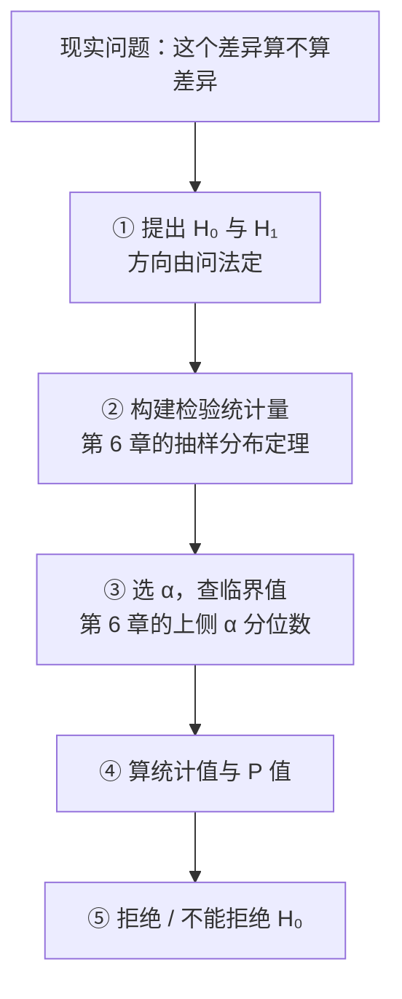

# 假设检验与方差分析：判据要在看数据之前就定好

> 目标：说清一次检验的判据（零假设、显著性水平、单双侧、拒绝域、P 值）各自是谁定的，以及方差分析怎么把一个平方和劈成两半再相除。原书第 8 章（书页 167–192）。

## 场景

还是那家饮料厂，你还在管质量。标称净含量 498 ml，A 线的灌装标准差历史上标定为 $\sigma = 3$ ml —— [第 6 章](ch06-sampling-distribution.md)算过这条线的统计量，[第 7 章](ch07-estimation.md)给过它的区间估计。这个月桌上摆了四份新数据：

- **A 线本月复检 8 瓶，均值比 B 线高出一截。** 两条线到底是不是灌得不一样多？
- **A 线那 9 个灌装头，上月和本月各测了一次。** 上月均值 500 ml —— 跟第 6 章那批 A 线数据同一个水平；本月看着更高了。是阀件在磨损漂移，还是抽样波动？
- **给 A 线校完阀，又抽了 25 瓶。** 校阀有没有把灌装量拉回标称？顺带一问：$\sigma = 3$ ml 这个标定，现在还站得住吗？
- **采购送来三种阀型的试灌数据，每种 4 瓶。** 三种阀型灌出来的平均量有没有差别？

第 6 章能做到的只是把统计量的值和上侧分位数摆在一起比大小，第 7 章能给出一个区间，**但"要不要真动设备"这一步两章都答不了** —— 差多少算差得够多，得有个判据。这一章就是把判据补上。

同时它也是第一次给你**判错的机会**：四份数据里，有一份会让你在同一组数上得出两个相反的结论 —— 而且同一份数据接着还会把你刚才依赖的那个前提本身推翻。

## 讲解

### 反证法 + 小概率原理：零假设是被保护的一方

一次检验的推理只有两步：**先假定被检验的陈述是真的，再看在这个假定下手上的样本有多离谱**。离谱到"这种事一次抽样里本不该发生"，就回头否定那个假定 —— 原书把这套推理叫做带概率性质的反证法，判"离谱"的尺子是小概率原理（书页 169）。所以原假设 $H_0$ 不是"我猜是这样"，而是**被保护的一方**。原书给的建立原则很明确：

> 常常是采取"不轻易拒绝原假设"的原则，即把没有充分理由就不能轻易否定的命题作为原假设，这样一旦拒绝原假设而接受备择假设时，理由是很充分的。
>
> —— 书页 170

这条原则决定了两件事。一是**你想证明的东西要写进 $H_1$**，反过来写等于让自己的主张不劳而获。二是"不拒绝"和"成立"不是一件事 —— 原书为此专门换了措辞：

> 统计量没有落入拒绝域，并不能很有把握地相信原假设时，一般不说"接受 $H_0$"而采用"不能拒绝 $H_0$"的表述。
>
> —— 书页 174

理由在下面第二类错误那节：$\beta$ 通常算不出来，所以"没拒绝"这个结果**你不知道它有多可靠**。措辞上的这点讲究，护住的是一条实质结论：证据不足只能保持原判，不能反过来当成对原判的支持。

### 一次检验就是五步，第 6、7 章的零件都在里面

原书把流程拆成五步（书页 170–172）：提出假设 → 构建检验统计量 → 选定 $\alpha$ 并确定临界值 → 算出统计值和 $P$ 值 → 下结论。



第二步和第三步是**第 6 章的直接复用**：检验统计量就是把点估计量标准化（定理 6-1 到 6-4），临界值就是第 6 章[上侧 $\alpha$ 分位数](ch06-sampling-distribution.md#quantile)那节查的那个数。原书明说了这一点 ——「实质上与参数估计中用于构建置信区间的变量的选择是一致的」（书页 170）。**区间估计和假设检验是同一个统计量的两种用法**：第 7 章把它反解成一个区间，这一章把它跟一个临界值比大小。唯一新增的零件是把参数换成假设值 $\theta_0$ —— 统计量里再没有未知参数，于是能算出具体的数。

### 拒绝域在哪一侧，由问法定，不由数据定

临界值把统计量的取值范围切成拒绝域和不能拒绝区域两块，切几刀、切在哪边，取决于假设怎么写（书页 171，图 8.1）：

| 检验类型 | 假设 | 拒绝域（以 Z 检验为例） | 判别规则 |
|---|---|---|---|
| 双侧 | $H_0:\theta=\theta_0$；$H_1:\theta\ne\theta_0$ | $(-\infty,-Z_{\alpha/2})$ 和 $(Z_{\alpha/2},+\infty)$ | $\lvert Z\rvert\ge Z_{\alpha/2}$ 则拒绝 |
| 左侧 | $H_0:\theta=\theta_0$（或 $\theta\ge\theta_0$）；$H_1:\theta<\theta_0$ | $(-\infty,-Z_{\alpha})$ | $Z\le-Z_{\alpha}$ 则拒绝 |
| 右侧 | $H_0:\theta=\theta_0$（或 $\theta\le\theta_0$）；$H_1:\theta>\theta_0$ | $(Z_{\alpha},+\infty)$ | $Z\ge Z_{\alpha}$ 则拒绝 |

三件容易错的事：

- **$\alpha$ 是两侧总共的面积。** 双侧检验每侧只分到 $\alpha/2$，所以查的是 $Z_{\alpha/2}$，不是 $Z_\alpha$。这条对 $\chi^2$ 和 $F$ 一样成立 —— 原书例 8-9 做 $\alpha=0.1$ 的双侧 $F$ 检验，查的是 $F_{0.05}(10,8)=3.347$（书页 183）。
- **单侧检验只针对边界值检。** 原假设写成 $\theta\le\theta_0$ 这样一个区域，实际算的时候只代 $\theta_0$，因为「若能否定 $\theta=\theta_0$，则其余假设值就更有理由被否定」（书页 170）。
- **单侧还是双侧，是问法的性质，不是数据的性质。** 原书建议「将样本信息所显示的方向作为备择假设 $H_1$ 的方向」（书页 170），这话只在**方向本来就由现实问题给定**时才安全：你关心的是"有没有变少"，那就是左侧检验，样本恰好偏高也不改。反过来，算出统计值发现双侧过不了、于是改成单侧再过一遍 —— 那是**把 $\alpha$ 偷偷翻了一倍**，本页的题里会让你亲手看到这个倍数。

!!! warning "三个数必须在看数据之前写下来"
    假设的方向、$\alpha$、检验统计量。这三个定了，结论就只是算术。看完数据再回去调其中任何一个，得出来的"显著"都是自己给自己发的。

### $\alpha$ 是你自己选的容错额度，两类错误此消彼长

检验会错，而且错法有两种（书页 173，表 8.1 重排）：

| 决策 | $H_0$ 为真 | $H_0$ 不真 |
|---|---|---|
| 拒绝 $H_0$ | 第一类错误（概率为 $\alpha$） | 正确决策 |
| 不拒绝 $H_0$ | 正确决策 | 第二类错误（概率为 $\beta$） |

第一类错误是"弃真"，$\alpha=P(\text{拒绝 }H_0\mid H_0\text{ 为真})$ —— 注意这个等式的方向：**显著性水平就是你事先给犯第一类错误设的上限**，它是你的风险偏好，不是数据算出来的量。原书说得直白：$\alpha$「并没有统一的规定，而是由研究者根据实际问题的背景及其风险偏好来确定的」（书页 170）；到底取多少，看两类错误哪一类代价大（书页 174）。

第二类错误是"取伪"，概率 $\beta$。两者的关系是本节唯一需要记的结论：

> 进行假设检验时我们总希望犯两类错误的可能性都尽可能小。然而，在其他条件不变的情况下，$\alpha$ 和 $\beta$ 是此消彼长的关系，两者不可能同时减小。若要同时减小 $\alpha$ 和 $\beta$，只能增大样本量 $n$。
>
> —— 书页 173

"其他条件不变"指的就是样本量。临界值往外挪，拒绝域变小，$\alpha$ 降了但漏判变多，$\beta$ 升 —— 这是同一条分界线的两侧，挪一边另一边必然反向。**唯一能同时改善两者的操作是加样本**：$n$ 变大，两条分布曲线各自变窄，重叠部分变小，两块尾部面积一起缩（书页 173，图 8.3）。这也是为什么"样本量不够"不能靠调 $\alpha$ 补救。

还有一条实用后果：$\beta$ 一般算不出来 —— $H_1$ 通常是一个区域（比如 $\mu>498$），每个具体的 $\mu$ 对应一个 $\beta$，只有 $H_1$ 指定成一个点时才有确切数值（书页 173）。$\beta$ 不明确，"不拒绝"的可靠性就无从报告，上面那条措辞规矩正是从这里来的。

### $P$ 值是"更极端结果出现的概率"，不是"零假设为真的概率"

原书的定义逐字抄在这里，因为这句话每个字都在防一种误读：

> 假设检验的 $P$ 值是指当原假设为真时所得到的样本观察结果以及更加背离原假设的观察结果出现的概率。
>
> —— 书页 171

拆开看：条件是"当原假设为真时"，事件是"这个样本以及更极端的样本"。所以 $P$ 值是**给定 $H_0$ 之后算出的、关于数据的概率**，不是 $H_0$ 的概率 —— $H_0$ 在这套框架里没有概率，它是个被当作前提的陈述。把 $P=0.04$ 读成"零假设只有 4% 的可能是真的"，等于把条件和结论调了个头。"更加背离"这四个字给出计算方向，方向随 $H_1$ 走（书页 171–172）：右侧 $P=P(Z\ge z)$，左侧 $P=P(Z\le z)$，双侧 $P=2\times$ 单侧的 $P$ 值。

两条判别路径永远同结论：

$$
\text{统计量落入拒绝域} \iff P\text{ 值}<\alpha
$$

原书把这条等价关系画成图 8.2（书页 172）。既然等价，$P$ 值多出来的价值在于**它是连续的**：同样都拒绝，$P=0.049$ 和 $P=0.0001$ 的可靠性差着量级，而"落入拒绝域"这个二值结果把这点差别抹平了。所以统计软件一律输出 $P$ 值，让不同的决策者各自拿自己的 $\alpha$ 去比。

### 检验统计量总表：换掉一个未知量，换来一个分布

8.2 和 8.3 两节一共给了十个检验统计量，是同一个模式的十次填空：**（估计量 − 假设值）÷ 估计量的标准误** —— 分母里凡是算不出来的参数就换成样本量，代价是分布从 $N(0,1)$ 退成 $t$。

| 检验对象 | 条件 | 检验统计量 | 分布 | 式号 |
|---|---|---|---|---|
| 一个均值 | 正态，$\sigma^2$ 已知 | $Z=\dfrac{\bar X-\mu_0}{\sigma/\sqrt n}$ | $N(0,1)$ | (8.1) |
| 一个均值 | 正态，$\sigma^2$ 未知 | $t=\dfrac{\bar X-\mu_0}{S/\sqrt n}$ | $t(n-1)$ | (8.2) |
| 一个方差 | 正态 | $\chi^2=\dfrac{(n-1)S^2}{\sigma_0^2}$ | $\chi^2(n-1)$ | (8.3) |
| 一个成数 | 大样本 | $Z=\dfrac{p-P_0}{\sqrt{P_0(1-P_0)/n}}$ | $N(0,1)$ | (8.4) |
| 两均值之差 | 两正态总体，独立，两 $\sigma^2$ 已知 | $Z=\dfrac{(\bar X_1-\bar X_2)-D_0}{\sqrt{\dfrac{\sigma_1^2}{n_1}+\dfrac{\sigma_2^2}{n_2}}}$ | $N(0,1)$ | (8.5) |
| 两均值之差 | 两正态总体，独立，$\sigma^2$ 未知但相等 | $t=\dfrac{(\bar X_1-\bar X_2)-D_0}{\sqrt{S_w^2\left(\dfrac{1}{n_1}+\dfrac{1}{n_2}\right)}}$ | $t(n_1+n_2-2)$ | (8.6) |
| 两均值之差 | 两正态总体，独立，$\sigma^2$ 未知不一定相等 | $t=\dfrac{(\bar X_1-\bar X_2)-D_0}{\sqrt{\dfrac{S_1^2}{n_1}+\dfrac{S_2^2}{n_2}}}$ | 近似 $t(v)$，$v$ 由 (8.9) 给 | (8.8) |
| 两均值之差 | 成对样本，差值总体正态 | $t=\dfrac{\bar d-D_0}{\sqrt{S_d^2/n}}=\dfrac{\bar d-D_0}{S_d/\sqrt n}$ | $t(n-1)$ | (8.10) |
| 两方差之比 | 两正态总体 | $F=\dfrac{S_1^2}{S_2^2}$ | $F(n_1-1,\,n_2-1)$ | (8.11) |
| 两成数之差 | 大样本 | 形状同 (8.4)，式子见下 | $N(0,1)$ | (8.12) |

其中合并方差、Welch 自由度与两成数之差的统计量（书页 179、180、184）：

$$
S_w^2=\frac{(n_1-1)S_1^2+(n_2-1)S_2^2}{n_1+n_2-2} \quad \text{(8.7)}
$$

$$
v=\frac{\left(\dfrac{S_1^2}{n_1}+\dfrac{S_2^2}{n_2}\right)^2}
{\dfrac{(S_1^2/n_1)^2}{n_1-1}+\dfrac{(S_2^2/n_2)^2}{n_2-1}} \quad \text{(8.9)}
$$

$$
Z=\frac{(p_1-p_2)-D_0}{\sqrt{\dfrac{p_1(1-p_1)}{n_1}+\dfrac{p_2(1-p_2)}{n_2}}} \quad \text{(8.12)}
$$

$v$ 算出来不是整数时取最接近的自然数（书页 181）。这张表里三处值得单独记：

- **(8.6) 的自由度 $n_1+n_2-2$ 是两个 $\chi^2$ 用可加性拼出来的**，$S_w^2$ 是按自由度加权的平均 —— 第 6 章定理 6-3 已经推过，这里只是给它配上临界值。
- **(8.11) 的分子分母顺序不能换**，第一自由度属于分子那个样本。做双侧检验时习惯把较大的样本方差放分子（书页 183），这样只需查右尾一个临界值。
- **(8.10) 的 $n$ 是对子数，不是观测数。** 成对样本先做减法变成一个样本，$2n$ 个观测值塌成 $n$ 个差值，自由度也就只剩 $n-1$。这是本章最容易被算错的自由度。

### 方差分析：把总平方和劈成组间加组内

三个以上总体的均值要一起比，两两做 $t$ 检验是错的做法（每比一次就多一次犯第一类错误的机会）。**但这一课的 Q6 偏偏会让你两两做一次** —— 那不是让你拿它下结论，是为了看两件事：$k=2$ 时 $t^2$ 与 $F$ 在代数上是同一个量，以及「整体拒绝了」并不等于「每一对都不同」。做完那道题就该明白为什么正经路子是方差分析。原书改的路子是：**先把全部观测值的差异量出来，再看这份差异里有多少能归给分组**。

假设写成（书页 185）：$H_0:\mu_1=\mu_2=\cdots=\mu_k$；$H_1:\mu_1,\mu_2,\cdots,\mu_k$ 不全相等。模型只有一行（书页 186）：

$$
x_{ij}=\mu_i+\varepsilon_{ij}\quad(i=1,2,\cdots,k;\;j=1,2,\cdots,n_i) \quad \text{(8.13)}
$$

一个观测值离总平均有多远，可以拆成"它离自己组的平均多远"加上"它那组的平均离总平均多远"（书页 186）：

$$
(x_{ij}-\bar{\bar x})=(x_{ij}-\bar x_i)+(\bar x_i-\bar{\bar x}) \quad \text{(8.14)}
$$

两边平方再全部加起来，交叉项恰好为 0，于是恒等式变成平方和的分解（书页 186）：

$$
\sum_{i=1}^{k}\sum_{j=1}^{n_i}(x_{ij}-\bar{\bar x})^2
=\sum_{i=1}^{k}\sum_{j=1}^{n_i}(x_{ij}-\bar x_i)^2
+\sum_{i=1}^{k}\sum_{j=1}^{n_i}(\bar x_i-\bar{\bar x})^2 \quad \text{(8.15)}
$$

三项分别叫总离差平方和 SST、组内（误差）平方和 SSE、组间（因素 A 的效应）平方和 SSA。组间那项每组内部是同一个数，所以可以收起来写成 $\displaystyle\sum_{i=1}^{k}n_i(\bar x_i-\bar{\bar x})^2$（书页 187）—— 各组均值离总均值的离差，按组容量加权。

**SST = SSA + SSE 是恒等式，不是近似**，所以它天生是一个自查点：三个数算完加一下，不等就是有一个算错了。

两项误差的分工（书页 186–187）：SSE 只反映随机误差（同组内部的波动，与分组无关）；SSA 反映随机误差**加上**可能存在的系统误差。所以比较两者就能回答"有没有系统误差"，但平方和的大小跟项数有关，必须先各除自己的自由度（书页 187）：

$$
\mathrm{MSA}=\frac{\text{组间平方和}}{\text{自由度}}=\frac{\mathrm{SSA}}{k-1} \quad \text{(8.16)}
$$

$$
\mathrm{MSE}=\frac{\text{组内平方和}}{\text{自由度}}=\frac{\mathrm{SSE}}{n-k} \quad \text{(8.17)}
$$

在 $\varepsilon_{ij}$ 相互独立、同服从 $N(0,\sigma^2)$ 的假定下，$H_0$ 为真时两个均方之比服从 $F$ 分布（书页 187）：

$$
F=\frac{\mathrm{MSA}}{\mathrm{MSE}}=\frac{\mathrm{SSA}/(k-1)}{\mathrm{SSE}/(n-k)}\sim F(k-1,\;n-k) \quad \text{(8.18)}
$$

**这一步跟第 6 章的 $F$ 分布定义严丝合缝。** 定义 6-3 的 $F=\dfrac{X/n_1}{Y/n_2}$ 要的就是"两个独立 $\chi^2$ 各除自己的自由度再相除"，(8.18) 的分子分母正是这两个东西：$\mathrm{SSA}/\sigma^2\sim\chi^2(k-1)$、$\mathrm{SSE}/\sigma^2\sim\chi^2(n-k)$，相除时 $\sigma^2$ 上下约掉。所以 $F$ 的两个自由度不用记 —— 它们就是平方和分解出来的那两个，而且自由度本身也是分解的：

$$
(n-1)=(k-1)+(n-k)
$$

**平方和分几份，自由度就分几份，份数还一一对应。** 这是全章最好用的一条自查：$k$ 组、共 $n$ 个观测值，三个自由度必须凑得上。

方差分析表就是把这套算式摆成一张表（书页 188，表 8.5 重排）：

| 差异来源 | 平方和 (SS) | 自由度 (df) | 方差 (MS) | $F$ 值 | $P$ 值 | $F$ 临界值 |
|---|---|---|---|---|---|---|
| 组间 | SSA | $k-1$ | MSA | MSA/MSE | | |
| 组内 | SSE | $n-k$ | MSE | | | |
| 总计 | SST | $n-1$ | | | | |

它是右侧检验，因为只有"组间方差显著地大"才说明有系统误差：$F>F_\alpha(k-1,n-k)$ 或 $P<\alpha$ 则拒绝 $H_0$。$F$ 小于 1 只意味着组间差异还不如组内波动，左尾那半永远不是拒绝域。最后一条边界原书专门提醒过（书页 189）：拒绝 $H_0$ 只能说"各水平的总体均值不完全相同"，**不能说它们全部互不相同，也判断不出是哪几组不同** —— 本页的题里会让你用数字亲自撞一次这条边界。

### 一个能手算的小例子

三组，每组 2 个数：$\{1,3\}$、$\{3,5\}$、$\{8,10\}$。组均值 2、4、9，总均值 $30/6=5$。$\mathrm{SST}=16+4+4+0+9+25=58$，$\mathrm{SSA}=2(2-5)^2+2(4-5)^2+2(9-5)^2=18+2+32=52$，$\mathrm{SSE}=1+1+1+1+1+1=6$。

$52+6=58$ ✓。自由度：$k-1=2$、$n-k=3$、$n-1=5$，$2+3=5$ ✓。于是 $\mathrm{MSA}=26$、$\mathrm{MSE}=2$、$F=13$，查 $F_{0.05}(2,3)=9.55$，$13>9.55$。

$\mathrm{MSE}=2$ 值得多看一眼：三组内部的离差平方和都是 $1+1=2$，每组都"自带 $\pm1$ 的波动"，$\mathrm{MSE}$ 正是这份共同波动的估计 —— $F=13$ 的意思就是组间差异比这份波动大了 13 倍。

??? warning "原书这几处印刷有误 —— 对着纸书读时注意"

    每条都经过两轮独立核对：先由重排公式的人对着 300dpi 页图提出，再由另一个只拿页图、不看重排结果的人放大复核。**本页正文一律不跟随这些错处。**

    | 书页 | 原书印的 | 应该是 |
    |---|---|---|
    | 181 | 「当式 **(8.10)** 计算的自由度 $v$ 不是整数时…」 | 自由度 $v$ 的式子编号是 **(8.9)**；(8.10) 是成对样本的 $t$，与 $v$ 无关，而且排在这句话后面 |
    | 181 | 「$n_1$ 和 $n_2$ 充分大时，式 **(8.9)** 的检验统计量 $t$ 也近似服从标准正态分布」 | 应为 **(8.8)**。(8.9) 是自由度不是统计量 —— 与上一条连着看，这一段的交叉引用整体串了一号 |
    | 184 | 例 8-10 正文两处写 $Z=-0.667$，$P$ 值 $=0.252$ | 同页算式印的 $-0.677$ 才对（复算 $-0.677\,13$），相应 $P=0.249$；书上的 0.252 是跟着错值走的。结论方向不受影响 |
    | 186 | 「$n_1=n_2=6,\ n_3=5$」 | 应为 $n_1=n_3=6,\ n_2=5$ —— 与表 8.4 及书页 188 的 SSA 代入式矛盾 |
    | (8.6)(8.7) 与例 8-7 | 合并方差的下标一处小写 $S_w^2$、一处大写 $S_W^2$ | 纯排版不一致，数学含义相同 |

## 准备

四份数据、五个文件（两条线各占一份），都在本课 `assets/` 下，列名已在表头写明：

| 数据 | 文件 | 规模 | 已知条件 |
|---|---|---|---|
| A 线校阀后抽检 | [line-a-after-calib-25.csv](assets/ch08-hypothesis-anova/line-a-after-calib-25.csv) | 25 瓶 | 标称 498 ml，历史标定 $\sigma=3$ ml |
| A 线本月复检 | [line-a-monthly-8.csv](assets/ch08-hypothesis-anova/line-a-monthly-8.csv) | 8 瓶 | 两线方差均未知 |
| B 线本月复检 | [line-b-monthly-8.csv](assets/ch08-hypothesis-anova/line-b-monthly-8.csv) | 8 瓶 | 同上 |
| 9 个灌装头两个月对照 | [fill-heads-two-months.csv](assets/ch08-hypothesis-anova/fill-heads-two-months.csv) | 9 对 | 同一批灌装头，逐头对应 |
| 三种阀型试灌 | [valve-models-3x4.csv](assets/ch08-hypothesis-anova/valve-models-3x4.csv) | 3 组 × 4 瓶 | 三组容量相等 |

所有数值都是整数。**三份小数据（8+8、9 对、3×4）的每个平方和与均方都能用笔算完**（统计量本身有几个要开根号或除不尽，拿计算器按一下），方差分析那组的 SST、SSA、SSE、MS、$F$ 全是整数；25 瓶那组的均值是两位小数、$\sum(x_i-499)^2$ 是整数，$S^2$ 要用函数。**临界值和 $P$ 值一律靠函数或附表**，本页不附表。

除特别说明，一律取 $\alpha=0.05$。

Excel / WPS 会用到的函数（原书用的是旧版函数名，新版有对应的新名，尾向不同，混用必错）：

| 用途 | 原书用的旧函数 | 新版函数 | 尾向 |
|---|---|---|---|
| 标准正态累积概率 | `NORMSDIST(z)` | `NORM.S.DIST(z, TRUE)` | 左尾累积 |
| 正态分位数 | `NORMSINV(p)` | `NORM.S.INV(p)` | 左尾累积 |
| $t$ 的上侧概率 | `TDIST(x, df, tails)` | `T.DIST.RT(x, df)` | 上侧（`TDIST` 的 $x$ 必须填正数） |
| $t$ 分位数 | `TINV(p, df)` | `T.INV.2T(p, df)` ／ `T.INV(p, df)` | 双侧 ／ 左尾累积 |
| $\chi^2$ 上侧概率 | `CHIDIST(x, df)` | `CHISQ.DIST.RT(x, df)` | 上侧 |
| $\chi^2$ 分位数 | `CHIINV(p, df)` | `CHISQ.INV.RT(p, df)` | 上侧 |
| $F$ 上侧概率 | `FDIST(x, df1, df2)` | `F.DIST.RT(x, df1, df2)` | 上侧 |
| $F$ 分位数 | `FINV(p, df1, df2)` | `F.INV.RT(p, df1, df2)` ／ `F.INV(...)` | 上侧 ／ 左尾累积 |

!!! warning "双侧检验要填 $\alpha/2$，Excel 不会替你除"
    除了 `T.INV.2T`，上表所有分位数函数都只认单尾。双侧检验 $\alpha=0.05$ 要的是 $Z_{0.025}$、$t_{0.025}(df)$、$\chi^2_{0.025}$、$F_{0.025}$ —— 原书在 $F$ 检验处专门加了一条脚注说明这件事（书页 183）。填成 0.05 会把临界值算小，于是该不拒绝的拒绝了。

用 Python 的话 `scipy.stats` 里 `.ppf` 是左尾累积口径（上侧 $\alpha$ 要填 $1-\alpha$）、`.isf` 直接是上侧分位数、`.sf` 是上侧概率。`scipy.stats.f_oneway` 能一步给出 $F$ 和 $P$，但**它不输出平方和**，所以不能拿它替代自己填表。

## 任务

把四个现场问题各自走完五步，每一步都留下可核对的痕迹：

1. 写出 $H_0$ 与 $H_1$（含方向）、$\alpha$、检验统计量的式号 —— **在动手算之前**；
2. 算出检验统计量的值和自由度；
3. 给出同自由度的临界值（注意单双侧决定填 $\alpha$ 还是 $\alpha/2$）和 $P$ 值；
4. 用临界值和 $P$ 值两条路径各下一次结论，确认一致；
5. 写出这个结论管什么、不管什么。

方差分析那组要交出一张**完整的方差分析表**：SS、df、MS、$F$、$P$、$F$ 临界值六列全部自己填满，不许留空，也不许直接贴 `f_oneway` 的输出。

另外做两次对照：同一组数据换一次问法（单侧 ↔ 双侧），以及同一组数据换一次前提（$\sigma$ 已知 ↔ 未知）。两次对照都要说清结论变了还是没变、为什么。

## 验收

- 每道题的 $H_0$、$H_1$、$\alpha$、式号都写在统计量数值的**前面**，而不是算完补上；
- 每个临界值都能说清它是单侧还是双侧的、查表时填进去的概率是 $\alpha$ 还是 $\alpha/2$；
- 每个自由度都能指认是哪一组数据的什么量扣出来的，成对样本那题的自由度尤其要说清分母上的 $n$ 数的是什么；
- 每道题的临界值路径与 $P$ 值路径结论一致；不一致时先查尾向填错没有，别改结论；
- 凡是右侧检验，临界值必须在统计量分布的右尾 —— 自查方法：把统计量的值和临界值画在同一条数轴上，看拒绝域的方向对不对；
- 方差分析表里 $\mathrm{SSA}+\mathrm{SSE}=\mathrm{SST}$ 严格成立，且三个自由度也满足同样的加法；
- 方差分析表的六列没有空着的格子，$F$ 临界值那列填的是右侧临界值；
- 交叉核对那题的两个数**完全相等**（不是"接近"）—— 它们在代数上本来就是同一个数，差出来就是有一步算错了。用浮点算会在第 15 位上有残渣（$t^2$ 与 $F$ 差 $3.6\times10^{-15}$），那是二进制舍入，不算差出来；用分数算就是严格相等；
- 两次对照里"结论变了"的那些，都能指出是公式里哪一项造成的，不是靠观察数字得出的。

## 提问

```conflict
<<<<<<< courses/statistics-book/ch08-hypothesis-anova
Q1 同一组数，两个问法，两个结论
用 A 线校阀后那 25 瓶数据。标称 498 ml，历史标定 σ = 3 ml，取 α = 0.05，按 (8.1) 做 Z 检验。
先贴三个中间量：样本均值、σ/√n、Z 的值。
然后分别按两个问法各走一遍，每遍都要给出 H₀、H₁、临界值、P 值、结论：
(a) 成本口径问「校阀后还在系统性多灌吗」；
(b) 监管口径问「有没有偏离标称 498」。
两个结论不一样。用一句话说清：数据一个字没改，为什么结论会反过来，两个 P 值之间差的那个倍数是从哪来的。
最后把 α 改成 0.01 再报一次两个结论，并回答：α 从 0.05 改到 0.01，是数据变了还是你变了。
=======
>>>>>>> notes
```

```conflict
<<<<<<< courses/statistics-book/ch08-hypothesis-anova
Q2 σ = 3 这个前提还站得住吗
还用那 25 瓶。这次假装不知道 σ。
(a) 按 (8.2) 做 t 检验，问法同 Q1(a) 的成本口径。贴出 Σ(xᵢ - x̄)²、S²、S/√n、t 的值、自由度、临界值、P 值和结论。
(b) 跟 Q1(a) 的 Z 检验对比：同一组数、同一个问法、同一个 α，两个结论不一样。把 Z 和 t 的分母各自贴出来，指出是哪个数造成了差别。
(c) 于是问题变成「σ = 3 还对吗」。按 (8.3) 做方差检验，H₀ 取 σ² = 9。工艺要求写的是「A 线的灌装标准差不超过 3 ml」，所以先说清该查哪一侧的临界值、为什么，再贴出 χ² 的值、自由度、临界值、P 值和结论。
然后换一次问法：如果问的是中性的「σ² 到底是不是 9」（双侧），临界值有几个、各是多少，P 值变成多少，结论变不变。
(d) 综合回答：如果 (c) 的结论是 σ² = 9 已经站不住，那 Q1 用 σ = 3 算出来的那个 Z 和它的结论，还能不能用？
=======
>>>>>>> notes
```

```conflict
<<<<<<< courses/statistics-book/ch08-hypothesis-anova
Q3 先查前提，再比均值
用 A 线和 B 线本月各 8 瓶的数据，问「两条线的平均灌装量有没有显著差异」（双侧，α = 0.05）。
(a) (8.6) 要求两个总体方差未知但相等，所以先按 (8.11) 检验齐性。α 取 0.10（原书例 8-9 就是这么放宽的），把较大的样本方差放分子。贴出两条线的 S²、F 的值、两个自由度（说清哪个自由度属于哪条线），以及右侧临界值——这里要回答一个问题：α = 0.10 的双侧 F 检验，你查表时填进去的概率是多少，为什么。
(b) 齐性过关后按 (8.7) 和 (8.6) 做均值检验。贴出 S_w²、S_w、分母 √(S_w²(1/n₁+1/n₂)) 的值、t 的值、自由度、临界值、P 值、结论。
(c) 指认 S_w² 里 A 线和 B 线各占多少权重，以及自由度 14 是怎么由两个样本各自的自由度拼出来的。
(d) 假设你在 (a) 里拒绝了齐性假定，接下来该换哪个式号的统计量、自由度该用哪个式子算？（只需说出式号和它为什么不是整数，不必真算。）
=======
>>>>>>> notes
```

```conflict
<<<<<<< courses/statistics-book/ch08-hypothesis-anova
Q4 同样的数，成对和独立差出一个量级
用 9 个灌装头上月/本月的数据，问「这批灌装头本月的平均灌装量比上月多了吗」（右侧，α = 0.05）。
(a) 按成对样本的 (8.10) 做。先贴出 9 个差值 dᵢ、d̄、Σ(dᵢ - d̄)²、S_d²、S_d、分母 S_d/√n、t 的值、自由度、临界值、P 值、结论。
(b) 现在故意用错方法：把上月 9 个数和本月 9 个数当成两个独立样本，按 (8.7) 和 (8.6) 再算一遍。贴出两个月各自的均值和 S²、S_w²、分母、t 的值、自由度、临界值、P 值、结论。
(c) 两个 t 值差出好几倍，而两组均值之差是同一个数。把两个分母摆在一起，说清差别出在哪 —— 提示：先看看上月那 9 个数本身散得有多开，再看 9 个差值散得有多开。
(d) 两个自由度也不一样（一个 8，一个 16）。分别说清它们各是怎么数出来的，以及为什么成对做法会"少掉"一半自由度、这笔代价换来了什么。
(e) 最后一问：如果这 9 个数不是同一批灌装头逐头对应、而是两个月各随机抽 9 瓶，(a) 还能不能做？为什么。
=======
>>>>>>> notes
```

```conflict
<<<<<<< courses/statistics-book/ch08-hypothesis-anova
Q5 完整的方差分析表，六列一个不许空
用三种阀型各 4 瓶的数据，α = 0.05，检验「阀型对平均灌装量有没有显著影响」。
(a) 写出 H₀ 和 H₁（H₁ 要用原书那种表述，不要写成"三个均值互不相同"）。
(b) 贴出三个组均值和总均值。
(c) 自己填出完整的方差分析表：差异来源（组间/组内/总计）、SS、df、MS、F 值、P 值、F 临界值，六列全满。**P 值至少给到小数点后六位** —— 这一组的 P 值和 α 只差不到万分之一，四位看不出那个距离。
(d) 交出两条自查的结果：SSA + SSE 是不是严格等于 SST；三个自由度是不是也满足同样的加法。
(e) 用 (c) 里的 P 值回答：α 取 0.05 时你的结论是什么，α 取 0.01 时呢？这两个结论之间的距离有多近，说明了什么。
(f) 指认 MSE 这个数在现实里代表什么 —— 它是从哪些数算出来的，为什么它跟"阀型不同"这件事完全无关。
=======
>>>>>>> notes
```

```conflict
<<<<<<< courses/statistics-book/ch08-hypothesis-anova
Q6 F 检验和 t 检验其实是同一个检验
还用三种阀型那份数据，但每次只拿其中两组。
(a) 只取 M1 和 M3 两组，按 (8.7) 和 (8.6) 做双侧 t 检验（α = 0.05）。贴出 S_w²、t 的值、自由度、临界值、P 值。
(b) 还是这两组，只拿它们做一次单因素方差分析（k = 2）。贴出完整的 SSA、SSE、df、MSA、MSE、F 值、P 值。
(c) 把 (a) 的 t 平方一下，和 (b) 的 F 比较：两个数应当完全相等，两个 P 值也应当完全相等。贴出来核对，并说清两组自由度是怎么对上的（t 的 n₁+n₂-2 对应 F 的哪一个自由度，F 的第一自由度为什么是 1）。
(d) 现在改成只取 M1 和 M2 两组，重做 (a)。这一对显著吗？
(e) 关键一问：Q5 里三组一起做，F 检验在 α = 0.05 下拒绝了 H₀。把 (d) 算出的那一对的结论摆在旁边，用这两个数字说清"拒绝 H₀"到底允许你宣布什么、不允许你宣布什么。
=======
>>>>>>> notes
```

```conflict
<<<<<<< courses/statistics-book/ch08-hypothesis-anova
一句话
这一章教会你的最有用的一句话是什么。
=======
>>>>>>> notes
```

```conflict
<<<<<<< courses/statistics-book/ch08-hypothesis-anova
心智模型
用自己的话说清三件事，都要落到你在 Q1–Q6 里填过的具体数字上：为什么"不拒绝 H₀"不等于"H₀ 成立"；α 和 β 为什么此消彼长、而加样本量为什么能同时压住两者；方差分析的 F 为什么是右侧检验、它的两个自由度为什么正好是平方和分解出来的那两个。
=======
>>>>>>> notes
```

```conflict
<<<<<<< courses/statistics-book/ch08-hypothesis-anova
坑
这一课你实际踩到的坑是哪个，怎么发现算错了的。
=======
>>>>>>> notes
```
