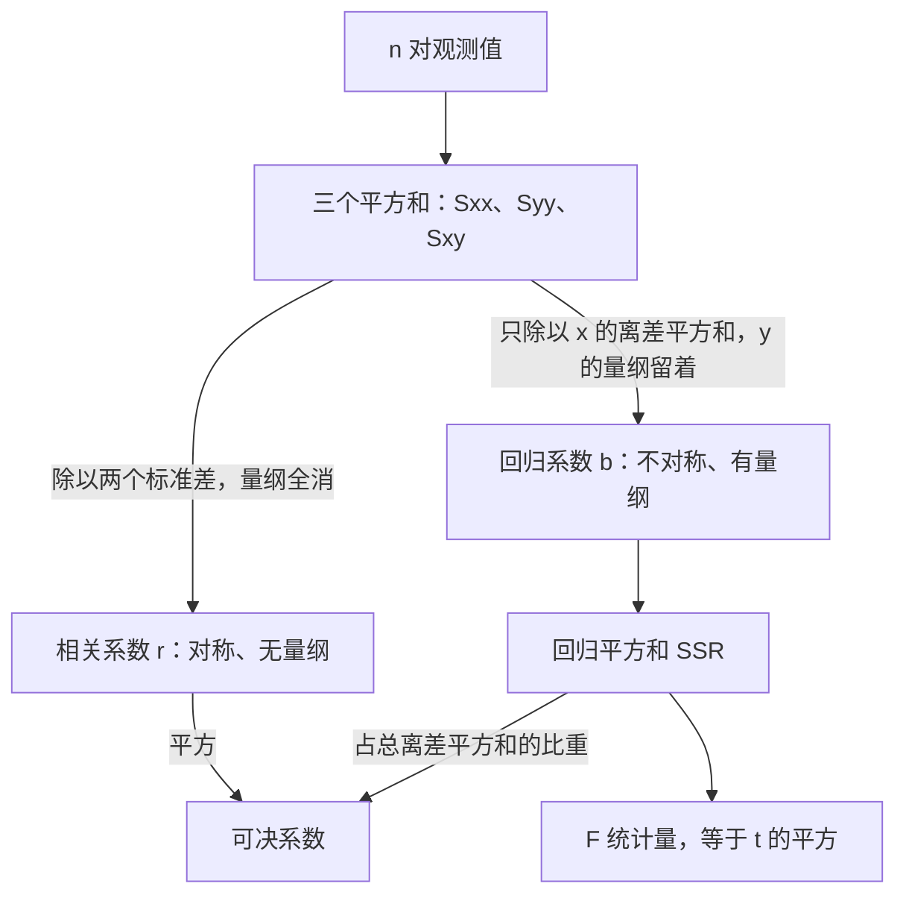

# 相关与回归：$r$ 和 $b$ 是同一件事的两个刻度

> 目标：说清相关系数与回归系数差的正好是一个标准差的比，以及总变差怎么分解成回归变差和剩余变差。原书第 9 章（书页 193–216）。

## 场景

你在一个连锁品牌的市场部。上个月十家直营店的两列数摆在你桌上：每家店自己花掉的**广告投入**（万元），和每家店当月的**销售额**（万元）。各店的广告预算由店长在总部给的额度内自己定，所以这两列数确实是"一对一对"抓出来的。

老板要四样东西：

- 广告和销售额到底**跟得有多紧** —— 一个能跨部门比、不受"万元还是元"影响的数；
- **多投 1 万元广告，销售额平均多几万** —— 这个数带单位，是做预算表要往里填的那个；
- 这条线**解释掉了销售额波动的多大一块** —— 剩下那块归谁；
- 这条线**本身靠不靠得住** —— 会不会只是十个点碰巧排成了一条线。

第五件事老板没说，但你必须自己想清楚：算出来的那个"多投一万多卖几万"，**能不能读成"广告带来了销售"**。这一章最容易被用错的就是这一步。

## 讲解

通用理论本站已有两篇笔记 —— [简单线性回归](../../notes/statistics/linear-regression/index.md)讲效应估计、均值响应、个体预测和残差诊断，[多元回归](../../notes/statistics/multiple-regression/index.md)讲"其他变量不变时"的条件解释。这一课是**教材伴读**，走原书的路线（相关系数先行、最小二乘、可决系数、回归的显著性），重叠的理论一句话带过，价值全押在一件事上 —— **$r$ 和 $b$ 为什么是同一件事的两个刻度**。

### 相关分析和回归分析问的不是同一个问题

原书把两者的分工说得很干净：

> 仅就两个变量而言，相关分析中的两个变量是完全对等的，都被看作随机变量，不必区分自变量与因变量。而回归分析旨在通过一个变量去解释或预测另一个变量，因此回归分析首先要将所研究变量区分为自变量和因变量。
>
> —— 书页 197

这一句就是本章所有不对称性的源头。**相关分析里没有"谁解释谁"，所以它的答案必须是对称的、无量纲的；回归分析一开口就指定了谁是自变量，所以它的答案必然是有量纲的、换个方向就变。** 后面所有公式的形状都是这句话的后果。



### 相关系数：把协方差的量纲除干净

总体相关系数就是协方差除以两个标准差：$\rho=\sigma_{XY}/(\sigma_X\sigma_Y)$（式 9.1，书页 198）。样本相关系数把三个量都换成样本对应物，约掉共同的 $1/(n-1)$ 之后就是离差形式（式 9.2，书页 198）：

$$
r=\frac{S_{xy}}{S_xS_y}
=\frac{\sum(x-\bar x)(y-\bar y)}{\sqrt{\sum(x-\bar x)^2}\,\sqrt{\sum(y-\bar y)^2}} \quad \text{(9.2)}
$$

为免逐个算离差，同一个东西可以写成只用五个原始合计量的形式（式 9.3，书页 198）：

$$
r=\frac{n\sum xy-\sum x\sum y}{\sqrt{n\sum x^2-\left(\sum x\right)^2}\,\sqrt{n\sum y^2-\left(\sum y\right)^2}} \quad \text{(9.3)}
$$

(9.2) 和 (9.3) 是同一个数的两条路径，都是整数运算，**算出来不一致就是某个合计量抄错了**，这是本课最好用的自查手段。下面统一用简写 $S_{xx}=\sum(x-\bar x)^2$、$S_{yy}=\sum(y-\bar y)^2$、$S_{xy}=\sum(x-\bar x)(y-\bar y)$，于是 $r=S_{xy}/\sqrt{S_{xx}S_{yy}}$。

$r$ 的四条性质（书页 198–199）里最要紧的是第三、四条：**无量纲**（换计量单位 $r$ 不变）和**地位对等**（$x$、$y$ 互换 $r$ 不变）。这两条恰好是回归系数**都没有**的。

$r$ 只吃定量变量。变量是定序的、或者数值里有极端值时，改用斯皮尔曼等级相关系数 —— 先把两列各自排出位次，算每个单位的位次差 $d_i$（式 9.5，书页 201）：

$$
r_S=1-\frac{6\sum d_i^2}{n(n^2-1)} \quad \text{(9.5)}
$$

原书说得明白：「式(9.5)是在变量值表示为等级或位次时由式（9.2）导出的」（书页 201）—— **它不是另一个指标，就是把 (9.2) 喂上位次而已**。所以它只认顺序、不认数值间隔，代价是丢掉了"大多少"的信息，好处是不怕极端值。位次并列时取并列名次的均值。

### 回归系数：只除一半，所以带着量纲和方向

样本回归直线是 $\hat Y_i=a+bX_i$（式 9.9，书页 204），最小二乘准则是"竖直方向的离差平方总和最小"（式 9.10，书页 204）：

$$
\sum_{i=1}^{n}(y_i-\hat y_i)^2=\sum_{i=1}^{n}\left[y_i-(a+bx_i)\right]^2=\text{最小} \quad \text{(9.10)}
$$

对 $a$、$b$ 求偏导并令其为零，得两个正规方程（式 9.11，书页 204）：

$$
\sum y=na+b\sum x,
\qquad
\sum xy=a\sum x+b\sum x^2 \quad \text{(9.11)}
$$

**这两个方程不必当公式记 —— 它们就是两句话。** 对 $a$ 求导那条化开是 $\sum(y_i-a-bx_i)=0$，即 $\sum e_i=0$：**残差加起来必须是零**。对 $b$ 求导那条化开是 $\sum x_i(y_i-a-bx_i)=0$，即 $\sum x_ie_i=0$：**残差里不许再剩下任何与 $x$ 成比例的成分**。解出来就是（式 9.12，书页 205）：

$$
b=\frac{\sum(x-\bar x)(y-\bar y)}{\sum(x-\bar x)^2}
=\frac{n\sum xy-\sum x\sum y}{n\sum x^2-\left(\sum x\right)^2}
=\frac{S_{xy}}{S_{xx}} \quad \text{(9.12)}
$$

$$
a=\frac{\sum y}{n}-b\times\frac{\sum x}{n}=\bar y-b\bar x
$$

$a$ 的式子顺带说明了一件事：**回归直线一定过点 $(\bar x,\bar y)$**。

把 (9.12) 和 (9.2) 摆在一起看，差别只有分母：

$$
r=\frac{S_{xy}}{\sqrt{S_{xx}}\sqrt{S_{yy}}},\qquad b=\frac{S_{xy}}{S_{xx}}
$$

$r$ 把 $S_{xy}$ 用**两个**变量的离差规模各除一次，量纲全消；$b$ 只用 **$x$ 一个**变量除，$y$ 的量纲原封不动留着。两者只差一个标准差的比：

$$
b=r\cdot\frac{S_y}{S_x},\qquad r=b\cdot\frac{S_x}{S_y}
$$

（因为 $S_y/S_x=\sqrt{S_{yy}/S_{xx}}$，共同的 $1/(n-1)$ 约掉了。）这一条把两个量彻底串起来：

- $b$ 的单位是「$y$ 的单位／$x$ 的单位」，所以换一次计量单位 $b$ 就跟着变，$r$ 一动不动；
- **两个方向的回归线不是同一条**：$y$ 对 $x$ 的斜率是 $S_{xy}/S_{xx}$，$x$ 对 $y$ 的斜率是 $S_{xy}/S_{yy}$。前者的倒数是 $S_{xx}/S_{xy}$，跟后者根本不是一个数（除非 $|r|=1$）。原因很朴素：最小二乘最小化的是**竖直方向**的离差平方和，把 $x$、$y$ 换个位置，"竖直"的含义就换了。而 $r$ 对称，换位置不变。

原书的思考题 9-9(4)「若要根据海水温度来估计空气温度，又该怎么办」（书页 216）问的就是这件事 —— 答案不是取倒数，是重新做一次回归。

### 平方和分解：可决系数为什么恰好是 $r$ 的平方

每个观测值对均值的离差都能劈成两段（式 9.13，书页 207）：

$$
(y_i-\bar y)=(\hat y_i-\bar y)+(y_i-\hat y_i) \quad \text{(9.13)}
$$

前一段是**回归离差**，方向和大小能由 $x$ 的变化解释；后一段是**残差** $e_i$，是 $x$ 以外的因素造成的。两边平方求和，交叉项因为 $\sum e_i=0$ 且 $\sum x_ie_i=0$ 而整体消掉 —— **这正是上面那两条正规方程的用处** —— 于是（式 9.14，书页 207）：

$$
\sum(y_i-\bar y)^2=\sum(\hat y_i-\bar y)^2+\sum(y_i-\hat y_i)^2 \quad \text{(9.14)}
$$

三项依次叫总离差平方和 SST、回归平方和 SSR、残差平方和 SSE。回归平方和占的比重就是判定系数（可决系数）（式 9.15，书页 207）：

$$
r^2=\frac{\sum(\hat y_i-\bar y)^2}{\sum(y_i-\bar y)^2}
=1-\frac{\sum(y_i-\hat y_i)^2}{\sum(y_i-\bar y)^2}
=\frac{\text{SSR}}{\text{SST}}=1-\frac{\text{SSE}}{\text{SST}} \quad \text{(9.15)}
$$

原书接着给了一条性质，只有一句话：

> 在一元线性回归中，判定系数就等于相关系数 $r$ 的平方。
>
> —— 书页 208

这句话不用背，两行就能看出来。因为 $\hat y_i-\bar y=b(x_i-\bar x)$，所以

$$
\text{SSR}=\sum b^2(x_i-\bar x)^2=b^2S_{xx}=\frac{S_{xy}^2}{S_{xx}}=b\,S_{xy}
$$

代进 (9.15)：

$$
\frac{\text{SSR}}{\text{SST}}=\frac{b^2S_{xx}}{S_{yy}}=\left(\frac{S_{xy}}{S_{xx}}\right)^2\frac{S_{xx}}{S_{yy}}=\frac{S_{xy}^2}{S_{xx}S_{yy}}=\left(\frac{S_{xy}}{\sqrt{S_{xx}S_{yy}}}\right)^2=r^2
$$

**「可决系数等于相关系数的平方」不是巧合，就是上一节那个标准差的比在平方之后把量纲抵消掉的结果。** 顺带得到 $\text{SSR}=b\,S_{xy}$ —— 一个乘法就能拿到 SSR，比逐个算 $\hat y_i$ 快得多。

倒过来也能从平方和算 $r$（式 9.16，书页 208）：

$$
r=\sqrt{\frac{\sum(\hat y_i-\bar y)^2}{\sum(y_i-\bar y)^2}}=\sqrt{1-\frac{\sum(y_i-\hat y_i)^2}{\sum(y_i-\bar y)^2}}=\sqrt{\frac{\text{SSR}}{\text{SST}}}=\sqrt{1-\frac{\text{SSE}}{\text{SST}}} \quad \text{(9.16)}
$$

但这条路**丢了符号** —— 根号开出来永远非负，正负相关只能回头看 $b$ 的符号或散点图。Excel 回归输出里的 `Multiple R` 就是这么来的，在一元回归里它是 $|r|$ 而不是 $r$。

### 回归估计标准误差：残差的自由度是 $n-2$

把残差平方平均一下得到均方误差（式 9.17，书页 208）：

$$
\text{MSE}=\frac{\sum_{i=1}^{n}(y_i-\hat y_i)^2}{n-2}=\frac{\sum_{i=1}^{n}e_i^2}{n-2}=\frac{\text{SSE}}{n-2},
\qquad
S_e=\sqrt{\text{MSE}}=\sqrt{\frac{\text{SSE}}{n-2}} \quad \text{(9.17)(9.18)}
$$

分母写 $n-2$ 不是习惯：残差被两条正规方程钉住了两次（$\sum e_i=0$ 和 $\sum x_ie_i=0$），$n$ 个残差里只有 $n-2$ 条是自由的。这跟第 6 章数 $\sum(x_i-\bar x)^2$ 的自由度是同一套数法 —— 一条约束扣一个自由度，见[第 6 章](ch06-sampling-distribution.md)那节。

$S_e$ 跟 $S_y$（$y$ 自己的样本标准差）差的也正好是 $\sqrt{1-r^2}$ 那个因子，但**中间夹着一个自由度的比**（书页 209）：

$$
r^2=1-\frac{S_e^2}{S_y^2}\cdot\frac{n-2}{n-1}
$$

大样本下 $(n-2)/(n-1)\approx1$，于是有常见的近似式（式 9.19、9.20，书页 209）：

$$
r^2\approx1-\frac{S_e^2}{S_y^2}\quad\text{或}\quad r\approx\sqrt{1-\frac{S_e^2}{S_y^2}},
\qquad
S_e\approx S_y\sqrt{1-r^2} \quad \text{(9.19)(9.20)}
$$

样本量只有十来个的时候，那个自由度的比离 1 还差得远 —— **所以精确式和近似式在小样本上算出来明显不一样，对不上不是算错**。

### 显著性检验：$F$ 和 $t$ 是同一个数（判据来自第 8 章）

待检验的假设是 $H_0:\beta=0$、$H_1:\beta\neq0$（书页 209）。第一条路是把方差分析搬过来。在 $H_0$ 成立时 $\text{SSR}/\sigma^2\sim\chi^2(1)$、$\text{SSE}/\sigma^2\sim\chi^2(n-2)$ 且两者独立，各除自己的自由度再相除（式 9.21，书页 210）：

$$
F=\frac{(\text{SSR}/\sigma^2)/1}{(\text{SSE}/\sigma^2)/(n-2)}=\frac{\text{SSR}}{\text{SSE}/(n-2)}\sim F(1,\,n-2) \quad \text{(9.21)}
$$

$\sigma^2$ 上下约掉，所以这个统计量算得出来。第一自由度是 1（一个待估的斜率），第二自由度是 $n-2$。写成方差分析表（表 9.3，书页 210）：

| 离差来源 | 平方和（SS） | 自由度（df） | 均方差（MS） | $F$ 值 |
|---|---|---|---|---|
| 回归 | $\text{SSR}=\sum(\hat y_i-\bar y)^2$ | $1$ | $\text{SSR}/1$ | $F=\dfrac{\text{SSR}}{\text{SSE}/(n-2)}$ |
| 残差 | $\text{SSE}=\sum(y_i-\hat y_i)^2$ | $n-2$ | $\text{SSE}/(n-2)$ | |
| 总计 | $\text{SST}=\sum(y_i-\bar y)^2$ | $n-1$ | | |

!!! note "这张表跟原书有一处不同"
    原书书页 210 的表 9.3 里，**回归行的平方和印成了 $\sum(y_i-\bar y)^2$、漏掉 $\hat y$ 的帽子**，与同表总计行一字不差。两轮独立核对确认是印刷错误（把 SS 列三行并排放大到 7 倍：回归行减号后那个 $y$ 顶上是水平横线，而残差行是尖角折线，两种记号形状截然不同）。本页按**带帽**的排 —— 否则 SSR 就等于 SST，分解根本不成立。对照纸书时别以为自己看错了。

**三个自由度 $1+(n-2)=n-1$ 必须加得上**，加不上就是某一行抄错了。

第二条路直接检验 $b$。由 $D(b)=\sigma^2/\sum(x_i-\bar x)^2$（书页 205），$\sigma^2$ 用 $S_e^2$ 顶上（式 9.22，书页 211）：

$$
t=\frac{b}{S(b)}=\frac{b}{S_e\big/\sqrt{\sum(x_i-\bar x)^2}}\sim t(n-2) \quad \text{(9.22)}
$$

$b$ 的标准误分母上带着 $\sqrt{S_{xx}}$ —— **$x$ 铺得越开，斜率估得越准**，这跟后面"预测别外推"是同一个道理的两面。原书给了两条路的关系：

> 实质上，在一元线性回归分析中，$F=t^2$，所以 $F$ 检验与 $t$ 检验是等价的。
>
> —— 书页 211

这不是巧合：$F$ 的分子 $\text{SSR}=b^2S_{xx}$、分母是 $S_e^2$，所以 $F=b^2S_{xx}/S_e^2=(b/S(b))^2=t^2$，代数上就是一回事。**在多元回归里两者才分家** —— $F$ 管"所有自变量合起来"，$t$ 管"每个自变量单独"，见[多元回归](../../notes/statistics/multiple-regression/index.md)。还有第三条路，相关系数的 $t$ 检验（式 9.4，书页 201）：

$$
t=\frac{r\sqrt{n-2}}{\sqrt{1-r^2}}\sim t(n-2) \quad \text{(9.4)}
$$

算出来跟 (9.22) 是同一个数 —— 因为 $r^2=\text{SSR}/\text{SST}$，代进去化简就回到 $b/S(b)$。**「相关显著」和「回归斜率不为零」在一元线性场合是同一句话的两种说法。**

!!! warning "临界值、拒绝域、P 值的判据是第 8 章的，不是这一章的"
    这一章只负责把 $F$ 和 $t$ **构造出来、算出来**。「给定 $\alpha$ 查表得临界值」「$F\ge F_\alpha(1,n-2)$ 就拒绝 $H_0$」「$P$ 值 $\le\alpha$ 就拒绝」这套判据属于原书第 8 章「假设检验与方差分析」，这一课**引用**它而不重讲，要核对判据请回 [第 8 章](ch08-hypothesis-anova.md)。两个容易记反的尾向：$F$ 检验查的是**右尾单侧**的 $F_\alpha(1,n-2)$（原书书页 210 专门强调了「只有当 SSR 充分大才能说明变量间的线性相关性显著」），而 $t$ 检验查的是**双侧**的 $t_{\alpha/2}(n-2)$。

### 预测：区间的宽度会张成喇叭口

把 $x_f$ 代进回归方程 $\hat y_f=a+bx_f$ 就是点预测（式 9.23，书页 211），它实质上是对**均值** $E(Y_f)$ 的点估计。个别值 $Y_f$ 还带着 $\varepsilon$，所以要给区间 $(\hat y_f-\Delta,\ \hat y_f+\Delta)$（式 9.24，书页 212），半宽是（式 9.28，书页 212）：

$$
\Delta=t_{\alpha/2}(n-2)\cdot S_e\cdot\sqrt{1+\frac1n+\frac{(x_f-\bar x)^2}{\sum(x-\bar x)^2}} \quad \text{(9.28)}
$$

根号里三项各有来头：$1$ 是个别值自带的随机扰动，$1/n$ 是回归线的高度估不准，第三项是斜率估不准 —— **$x_f$ 离 $\bar x$ 越远，斜率的那点误差被放得越大**，所以区间在 $x_f=\bar x$ 处最窄，往两边张成喇叭口（图 9.8，书页 213）。这一节原书标了 `*`（选学），本课只要求算一次、看一眼宽度怎么变。

### 相关不是因果 —— 这一章最容易被用错的一步

原书在三处讲同一件事。第一处是相关系数的性质里那条（书页 195）：

> 现象之间存在因果关系，就必然存在相关关系，但相关关系不一定都是因果关系。例如，人的身高与体重之间存在密切的相关关系，但不能认为是因果关系。

**这是个单向箭头**：因果 ⇒ 相关，相关 ⇏ 因果。所以 $r$ 大只能否掉"毫无关系"这一种可能；剩下的三类解释 —— **共同原因、反向因果、纯巧合** —— 它一个都排不掉。第二处更直接（书页 199）：

> 相关系数更不能说明变量之间存在因果关系。要判断有无因果关系，往往需要理论分析，甚至需要比较实验。

**「比较实验」这四个字是整章唯一给出的正面办法**，而且它不是统计技巧，是"数据怎么来的"这个层面的事：观测数据里自变量不是被指派的，所以 $r$ 和 $b$ 算到小数点后四位也换不来因果结论。第三处在收尾（书页 214）：

> 如果对本来没有内在联系的现象，仅凭数据进行分析，就可能是一种“伪相关”或“伪回归”，这样不仅没有实际的意义，而且会导致荒谬的结论。

落到本课这十家门店上，"广告多 ⇒ 卖得多"这个读法最现实的一种失效方式是**反向因果**：如果这个品牌的广告额度是按**上一期销售额**的百分比分给各店的，那么因果箭头是销售额 → 广告投入，跟你写的回归方程正好反着。要紧的是**这件事不会在 $r$ 或 $b$ 上留下任何痕迹** —— $r$ 完全对称，它对箭头方向一无所知；$b$ 虽然不对称，但它的不对称只来自"谁在竖直方向上被最小化"，跟现实里谁导致谁毫无关系。同一组数、同一个 $r$、同一个 $b$，箭头朝哪边只能去问总部的预算规则，问不出来就不下结论。

所以这一课的结论只能写到这个份上：**在这十家店这个月的数据范围内，广告投入每高 1 万元，销售额平均高出若干万元**。"投广告能换来销售"是另一个命题，这组数据答不了。

### 一个能手算的小例子

四对数：$x=1,2,3,4$，$y=3,5,4,8$。$\bar x=2.5$、$\bar y=5$，于是 $S_{xx}=5$、$S_{yy}=14$、$S_{xy}=7$。

$b=7/5=1.4$，$a=5-1.4\times2.5=1.5$，回归方程 $\hat y=1.5+1.4x$。四个估计值 $2.9,4.3,5.7,7.1$，四个残差 $0.1,0.7,-1.7,0.9$ —— 加起来是 $0$（第一条正规方程），乘上 $x$ 再加起来也是 $0$（第二条）。

$\text{SST}=14$，$\text{SSR}=b\,S_{xy}=1.4\times7=9.8$，$\text{SSE}=14-9.8=4.2$，对上了 $\sum e_i^2=0.01+0.49+2.89+0.81=4.2$。可决系数 $9.8/14=0.7$，$r=\sqrt{0.7}\approx0.8367$，与 $S_{xy}/\sqrt{S_{xx}S_{yy}}=7/\sqrt{70}$ 一致。

顺手看一眼不对称：$y$ 对 $x$ 的斜率是 $7/5=1.4$，它的倒数是 $5/7\approx0.714$；而 $x$ 对 $y$ 的斜率是 $S_{xy}/S_{yy}=7/14=0.5$。**两个数差得很远，所以"把回归线反过来用"是错的。**

??? warning "原书这几处印刷有误 —— 对着纸书读时注意"

    每条都经过两轮独立核对：先由重排内容的人对着 300dpi 页图提出，再由另一个只拿页图、不看重排结果的人放大复核。**本页正文一律不跟随这些错处。**

    | 书页 | 原书印的 | 应该是 |
    |---|---|---|
    | 208 / 209 / 213 | 三处把回归例题引作「**例 9-2**」 | 应为**例 9-3**。例 9-2（书页 201–202）是等级相关题、$r_S=0.970$，没有回归方程；例 9-3（书页 205）才是 $\hat Y=189.754+5.3096X$。书页 210／211 同类引用写的都是例 9-3 |
    | 194 | 图 9.2 的轴标注「广告费(千元)／销售额(万元)」 | 图上那八个散点就是表 9.1（书页 199）的数，而表头是「广告费（万元）／销售额（十万元）」。全章一贯用万元／十万元，只有这张图的轴标签孤立 |
    | 212 | 「由于式(9.26)中 $\sigma^2$ 而只能用…」 | 漏了「未知」二字 |
    | 211 | $t$ 检验段落把 $P$ 值的列名写作 `Significance F` | 那是方差分析栏的列名；$t$ 检验的 $P$ 值在 `Coefficients` 区的 `P-value` 列 |
    | 196 | 「垂直距离越接近」 | 语病，距离只能越小不能越「接近」 |
    | 200 | 把「显著／不显著」当成假设的内容来陈述 | 假设说的是总体参数（$\rho=0$ 与否），「显著」是检验结论不是假设 |
    | — | (9.26) 用 $x_i$ 而 (9.27)(9.28) 用 $x$ | 同一组预测式的记号不统一，纯排版 |
    | 210 | 表 9.3 回归行漏了 $\hat y$ 的帽子 | 见上文那张表旁边的说明
## 准备

数据一份，在本课 `assets/` 下，三列 `store`、`ad_wan`、`sales_wan`：

- [十家门店的广告投入与销售额](assets/ch09-regression/store-ad-sales.csv) —— $n=10$，广告投入与销售额都以万元计，都是整数

这份表是**为笔算设计**的：$\sum x$、$\sum y$、$\sum xy$、$\sum x^2$、$\sum y^2$ 全是整数，两个均值都是整数，三个平方和 $S_{xx}$、$S_{yy}$、$S_{xy}$ 也都是整数，$b$ 是整数、$a$ 是整数、可决系数是一个整百分数、$S_e$ 是整数、$F$ 是整数。**所以任何一步算出带零碎小数的结果，先怀疑自己抄错了数，再怀疑公式。** 不是整数的只有几个：$r$ 本身、两个标准差 $S_x$、$S_y$、$b$ 的标准误 $S(b)$、$t$，以及预测区间。

需要查表或调函数的只有三个基准：$t_{\alpha/2}(n-2)$、$F_\alpha(1,n-2)$，以及 $P$ 值。本页不附表。

=== "Excel / WPS"

    | 用途 | 函数 |
    |---|---|
    | 相关系数 $r$ | `CORREL(y, x)`（对称，两个参数顺序无所谓） |
    | 斜率 $b$ ／ 截距 $a$ | `SLOPE(known_y, known_x)` ／ `INTERCEPT(known_y, known_x)` |
    | 可决系数 | `RSQ(known_y, known_x)` |
    | 回归估计标准误差 $S_e$ | `STEYX(known_y, known_x)` |
    | $y$ 的样本标准差 $S_y$ | `STDEV.S` |
    | 一次拿到全套（含 ANOVA 表） | 「数据」→「数据分析」→「回归」 |
    | $t$ 双侧临界值 ／ $F$ 上侧临界值 | `T.INV.2T(α, df)` ／ `F.INV.RT(α, df1, df2)` |
    | $t$ 双侧 $P$ 值 ／ $F$ 上侧 $P$ 值 | `T.DIST.2T(t 的绝对值, df)` ／ `F.DIST.RT(F, 1, df2)` |

=== "Python"

    ```python
    from scipy import stats
    res = stats.linregress(x, y)
    res.slope, res.intercept, res.rvalue, res.stderr   # b, a, r, S(b)
    stats.t.ppf(0.975, n - 2)    # 双侧 0.05 的临界值
    stats.f.sf(F, 1, n - 2)      # F 的上侧 P 值
    ```

    `linregress` 的 `rvalue` 是 $r$ 不是 $r^2$，`stderr` 是 $S(b)$ 不是 $S_e$ —— 两个都容易拿错。

!!! warning "四个真会踩的坑"
    - **`SLOPE` / `RSQ` / `STEYX` 的参数顺序是 $y$ 在前、$x$ 在后**，跟散点图的直觉正好相反。顺序填反了 `RSQ` 一点不变（它是 $r^2$，对称），但 `SLOPE` 给你的是 $x$ 对 $y$ 的那条线 —— **错得静悄悄**。这一课正好要算两个方向的斜率，别把它们搞混。
    - **`STEYX` 除的是 $n-2$，`STDEV.S` 除的是 $n-1$**，分别对应 $S_e$ 和 $S_y$。混用会让 (9.19) 两边永远对不上。
    - **Excel 回归输出的 `Multiple R` 是 $|r|$，丢符号**（原书书页 208 明说）。正负要看 `Coefficients` 里 $b$ 的符号。
    - **$F$ 查右尾单侧、$t$ 查双侧**。`F.INV` 和 `T.INV` 都是左尾累积口径，要上侧得填 $1-\alpha$，或者直接用 `F.INV.RT` / `T.INV.2T`。

## 任务

把老板要的四件事各落成一组**具体数值**，每个数都要能指回原书的公式编号：

1. 先把五个原始合计量和三个平方和算干净 —— 后面每一步都从这三个数里长出来，错一个全盘错。
2. 相关系数走 (9.2) 和 (9.3) 两条路径；回归系数走 (9.12) 的离差式和原始数据式两条路径。四个结果自己对账。
3. 把十个估计值和十个残差列出来，做完 (9.14) 的平方和分解，再用两条路径核对可决系数。
4. 显著性算到 $F$、$t$ 和它们的自由度为止，**并把它们各自该跟哪个基准比、基准在哪一侧说清楚** —— 判不判显著用的是第 8 章的判据，这一课只要求你引用它、把数摆对位置。
5. 最后做两次对照：一次是把 $x$、$y$ 的角色调过来，看哪些量变、哪些不变；一次是往样本里加一个点，看同一条回归线能被一个点改成什么样。

顺带一件事：算一次 $x_f=50$ 的点预测和 0.95 的预测区间，再把 $x_f$ 换成 150 算一遍，只看宽度的变化。

## 验收

- $\sum(x-\bar x)$ 和 $\sum(y-\bar y)$ 都严格是 $0$；十个残差之和也严格是 $0$，$\sum x_ie_i$ 也是 $0$ —— 后两条不是巧合，各对应 (9.11) 的一个方程，能说出是哪一个；
- $r$ 的两条路径 (9.2) 和 (9.3) 结果完全一致，$b$ 的两条路径也完全一致 —— 这四个数全是整数运算得来的，**不该出现"第四位小数不一样"这种事**，不一致就是某个合计量抄错了；
- $\text{SSR}+\text{SSE}$ **精确**等于 $\text{SST}$，不是约等于；三个自由度 $1$、$n-2$、$n-1$ 也加得上；
- 用 $b\,S_{xy}$ 算的 SSR 和用 $\sum(\hat y_i-\bar y)^2$ 逐项算的 SSR 是同一个数；
- 可决系数走 $\text{SSR}/\text{SST}$、$1-\text{SSE}/\text{SST}$ 和 $r$ 的平方三条路径，都落到同一个整百分数上；
- $F$ 与 $t^2$ 一致到小数点后四位；(9.4) 从 $r$ 算出的 $t$ 与 (9.22) 从 $b$ 算出的 $t$ 也一致到小数点后四位 —— 这三个数是同一个数的三种写法，对不上说明有一处的自由度或分母写错了；
- 书页 209 那条无编号的精确式和 (9.19) 的大样本近似式算出来**明显不一样**（(9.19) 本身就是近似式）；两条式子里**被减掉的那一项**之比恰好是一个只跟 $n$ 有关的分数，能把它写出来（注意是被减掉的那一项之比，不是两个可决系数之比）；
- 交换 $x$、$y$ 的角色，或把广告投入的单位从万元换成元 —— 每一种改动之后哪些量变、哪些不变，都要能用 (9.2) 和 (9.12) **分母上的那点差别**解释出来，不是靠观察数字得出的；
- 加进第 11 家店之后，**恰好有一个主要结果一点没动**，能说出它没动的原因出自 (9.12) 的哪一处；
- 预测区间在 $x_f=\bar x$ 处最窄，$x_f=150$ 那个区间要能说出为什么不该信 —— 理由有两条，一条来自 (9.28) 的根号，一条来自书页 214。

## 提问

```conflict
<<<<<<< courses/statistics-book/ch09-regression
Q1 三个平方和
用 CSV 算出五个原始合计量并全部贴出来：n、Σx、Σy、Σxy、Σx²、Σy²。
再贴出 x̄、ȳ 和三个平方和 Sxx = Σ(x-x̄)²、Syy = Σ(y-ȳ)²、Sxy = Σ(x-x̄)(y-ȳ)。
最后贴出 Σ(x-x̄) 和 Σ(y-ȳ) 这两个数，作为均值算对了的自查凭证。
=======
>>>>>>> notes
```

```conflict
<<<<<<< courses/statistics-book/ch09-regression
Q2 回归方程
按 (9.12) 算 b 和 a，两条路径各算一遍并把四个数都贴出来：离差式 Sxy/Sxx 的 b、原始数据式 (nΣxy-ΣxΣy)/(nΣx²-(Σx)²) 的 b，以及 a 和最终的回归方程。
原始数据式的分子和分母这两个整数也单独贴出来。
然后用一句话说清 a 和 b 在这个现场的含义，各自带上单位。再回答：这里的 a 能不能读成「不投广告时的销售额」？为什么这个读法在这份数据上尤其不牢靠（看一眼 x 的取值范围就知道）。
=======
>>>>>>> notes
```

```conflict
<<<<<<< courses/statistics-book/ch09-regression
Q3 r 和 b 差的那个比
按 (9.2) 和 (9.3) 两条路径算相关系数 r，两个结果都贴出来。
再贴出 Sx 和 Sy（x 和 y 各自的样本标准差，除 n-1 的那个），验证 b = r·Sy/Sx，把等式两边的数值都写出来。
然后算 x 对 y 的那条回归线：斜率 Sxy/Syy 和截距，写出完整方程。把两条线的斜率摆在一起，并回答两问：一，y 对 x 的斜率取倒数，跟 x 对 y 的斜率是不是同一个数，差多少；二，两条斜率的乘积是多少，这个数恰好等于你在 Q4 里算出的哪一个量。
再做一次单位对照：把广告投入的单位从万元改成元（每个 x 乘 10000）重算一遍，贴出新的 r 和新的 b，说清为什么一个变一个不变。
最后换一把只认顺序的刻度：按 (9.5) 算斯皮尔曼等级相关系数，把两列位次、十个 d_i、Σd_i² 和 r_S 都贴出来。r_S 比 r 大还是小？用这十行数据里的一个具体现象解释这个方向（提示：看一眼哪几家店的位次在两列里是反过来的，以及它们在数值上差多少）。
=======
>>>>>>> notes
```

```conflict
<<<<<<< courses/statistics-book/ch09-regression
Q4 平方和分解与可决系数
把十个回归估计值 ŷ_i 和十个残差 e_i 列成一张表贴出来，末行给出 Σe_i 和 Σx_i·e_i。
然后贴出 SST、SSR、SSE 三个数，并验证 (9.14) 的等号是精确成立的。SSR 要用两条路径各算一遍：一条逐项算 Σ(ŷ_i-ȳ)²，一条用 b·Sxy，两个结果都贴出来。
可决系数走三条路径贴三个数：SSR/SST、1-SSE/SST、以及 Q3 算出的 r 的平方。
最后贴出 MSE 和 Se，并说清 (9.17) 的分母为什么是 n-2 而不是 n —— 要指认是哪两条约束扣掉的，这两条约束就是你在本题开头贴出的那两个合计数。
=======
>>>>>>> notes
```

```conflict
<<<<<<< courses/statistics-book/ch09-regression
Q5 三种写法算同一个 t
填出表 9.3 那张方差分析表的全部格子：回归行和残差行的 SS、df、MS，总计行的 SS 和 df，以及 F 值。三个自由度加起来要等于 n-1。
然后走三条路算检验统计量，三个数都贴出来（它们代数上是同一个量的三种写法，所以**不是独立证据**，只能验你有没有算错，不能互相印证结论）：
一，(9.21) 的 F；
二，(9.22) 的 t —— 分母 S(b) = Se/√Sxx 的数值单独贴出来；
三，(9.4) 的 t —— 只用 Q3 的 r 和 n，不碰 b。
把 F 的平方根和后两个 t 摆在一起比，说清它们为什么必须相等。
最后把基准摆上：给出 α=0.05 时的 F 上侧临界值 F_0.05(1, n-2) 和 t 双侧临界值 t_0.025(n-2)，说清每个统计量该跟哪个基准比、基准在它的哪一侧，以及为什么 F 只查右尾而 t 要查双侧。这一步的判据出自第 8 章，注明你引用的是哪一条。
另外贴出 Sy（y 的样本标准差），用书页 209 那条带自由度比的精确式和 (9.19) 的大样本近似式各算一次可决系数，两个数都贴出来。再指出这两条式子里被减掉的那一项差了哪一个因子，并写出这个因子在 n=10 时的具体数值。哪一个结果跟你在 Q4 算出的可决系数一致？
=======
>>>>>>> notes
```

```conflict
<<<<<<< courses/statistics-book/ch09-regression
Q6 加进第 11 家店
品牌新开一家旗舰店，当月广告投入 40 万元、销售额 320 万元。把它并进样本变成 n=11，整套重算。
六个数贴出来：新的 b、新的 a、新的可决系数、新的 Se、新的 F，以及新的残差自由度。
然后回答三问：
一，这五个统计量里恰好有一个一点没变，是哪一个？对着 (9.12) 说清它为什么必须一点不变 —— 关键在新加的这个点的 x 坐标恰好是什么。
二，剩下四个各自变成了原来的几倍，四个倍数都贴出来；再指出**变化最剧烈**的是哪一个 —— 口径按倍率算（即把小于 1 的倍数取倒数之后再比谁大），别按「倍数减 1」的加减距离比，两种口径会给出不同答案。
三，新的 F 跟 F_0.05(1, 9) 比是大还是小？把两个数贴出来。所以一个点就能让「这条线靠得住吗」这个问题换答案，而「多投 1 万元多卖几万」这个答案一动不动 —— 用一句话说清这两件事为什么可以分开变。
=======
>>>>>>> notes
```

```conflict
<<<<<<< courses/statistics-book/ch09-regression
Q7 这个 b 能不能读成广告的效果
先做一次可算的事。CSV 里销售额最高的那家店，把它的销售额代进 Q3 算出的那条 x 对 y 的回归线，反推它的广告投入，和这家店实际的广告投入比一比，差多少。
再用错的办法算一遍作对照：拿 y 对 x 那条线的斜率取倒数去反推，得到的又是多少？两个数都贴出来，说清为什么后一个是错的。
然后回答两问。讲解里已经给了「反向因果」这一种失效方式，这两问要你自己补上另外两块：
一，举一个具体的、在这十家门店上确实可能存在的共同原因（写得出名字、能在现实里去查到的那种，不要写「其他因素」「随机误差」这类空话）。说清它同时怎么把广告投入和销售额两列都顶上去，以及为什么它存在时你算出的 b 量到的不是广告的效果。再说一句：这个共同原因如果能测到，在回归里该怎么处理？一元回归做不到这件事，缺的是什么？
二，书页 199 那条性质里点到了一个判断因果的正面办法。把它落到这个连锁品牌的现场，写成一份能交给运营去执行的三行方案：怎么分组、每组怎么处理、一个月后比的是哪两个数。然后说清这套方案分别是怎么切断「反向因果」和你在第一问里举的那个共同原因的 —— 以及为什么现有这十行数据无论怎么算都切不断它们。
=======
>>>>>>> notes
```

```conflict
<<<<<<< courses/statistics-book/ch09-regression
一句话
这一章教会你的最有用的一句话是什么。
=======
>>>>>>> notes
```

```conflict
<<<<<<< courses/statistics-book/ch09-regression
心智模型
用自己的话说清 r 和 b 的关系：它们各自除掉了什么、留下了什么，为什么一个对称一个不对称，以及为什么可决系数恰好是 r 的平方。不抄公式，要能解释你在 Q3 和 Q4 里算出的那几个数之间的关系。
=======
>>>>>>> notes
```

```conflict
<<<<<<< courses/statistics-book/ch09-regression
坑
这一课你实际踩到的坑是哪个，怎么发现算错了的。
=======
>>>>>>> notes
```
