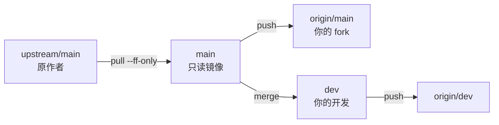

# fork 别人的仓库，还要持续吸收上游

## 场景

fork 一个还在活跃更新的开源项目，改成自己要的样子，同时希望随时把上游的新 commit 吃进来。

## 一句话

**把 `main` 当成上游的只读镜像**——自己的 commit 一行都不落在上面。同步上游因此永远是 fast-forward，零冲突；冲突只在你主动把上游往自己分支合的时候出现，时间点完全由你挑。

## 心智模型

三个 ref 始终指向同一个 commit：`upstream/main`（原作者的）、`main`（你本地的）、`origin/main`（你 fork 上的）。



`main` 的职责因此退化成两件事：**上游历史的落地点**、**切新分支的基准**。它不再是"我的主线"。

反过来在 `main` 上直接开发会怎样：`main` 同时长着你和上游两条历史，每次 `git pull upstream main` 都变成一次真正的三方合并——不是"偶尔有冲突"，是每次都要处理，而且冲突堆在同一条你无法回退的主线上，久了收拾不动。

## 操作

fork 完初始化一次（此时 `main` 还是纯净的，正是最佳时机）：

```bash
git remote add upstream https://github.com/<原作者>/<仓库>.git
git fetch upstream
git switch -c dev
git push -u origin dev
```

之后同步上游，两段分开做——先喂 `main`，再往 `dev` 合：

```bash
# 1. 喂 main：纯 fast-forward，不可能有冲突
git switch main
git pull --ff-only upstream main
git push origin main

# 2. 吸收进开发分支：冲突只可能发生在这一步
git switch dev
git merge main          # 或 git rebase main
```

## 给 main 上锁

靠自觉不如靠配置。这条让 `main` 上的非 fast-forward 合并直接失败：

```bash
git config branch.main.mergeoptions --ff-only
```

作用域比"仓库级"还要窄一层，三点讲清（实测 git 2.34.1）：

- 没带 `--global` → 写进本仓库 `.git/config` 的 `[branch "main"]` 段，不影响其他仓库
- 只在**当前 checkout 的分支是 `main`** 时生效 → 在 `dev` 上 `git merge main` 照常产生 merge commit，不受影响
- `pull` 内部就是调 `merge` → `git merge` 和 `git pull` 一起被管住，两者都报 `fatal: Not possible to fast-forward, aborting.`

三个相近配置别选错：

| 配置 | 范围 | 影响命令 |
|---|---|---|
| `branch.main.mergeoptions=--ff-only` | 本仓库，**仅 main 分支** | merge + pull |
| `merge.ff=only` | 本仓库**所有分支** | merge + pull |
| `pull.ff=only` | 本仓库所有分支 | 仅 pull |

**不要用 `merge.ff only`**——它会连 `dev` 一起管住，而 `dev` 上 `git merge main` 恰恰需要产生真正的 merge commit，会被直接拒绝。

顺手再堵一个方向，禁掉 `upstream` 的 push 地址，避免手滑往原作者仓库推：

```bash
git remote set-url --push upstream DISABLED
```

## 坑

**上锁只防 merge / pull，防不住 `git commit`。** 在 `main` 上手动提交依然会成功，得靠自觉或者上 `pre-commit` hook。

其余三个会打破"`main` 等于上游"的常见操作：

- 在 GitHub 网页上直接编辑文件——默认提交到 `main`
- 把自己的 PR 合并进 fork 的 `main`（自己的改动该合到 `dev`）
- 在 `main` 上手滑 `commit`

真的偏离了也不难救。`main` 上本来就没有值得保留的东西，直接对齐上游：

```bash
git switch main
git fetch upstream
git reset --hard upstream/main
git push --force-with-lease origin main
```

## 顺带白拿的两个好处

**一眼看清自己到底改了什么。** 因为 `main` 就是上游，两条命令就够：

```bash
git log --oneline upstream/main..dev        # 我的所有 commit
git diff --stat upstream/main...dev         # 我碰过的所有文件
```

**给上游提 PR 时干净。** 从纯净的 `main` 切一个专门分支（`fix/xxx`），只放那一个改动——不要拿混着全部私有修改的 `dev` 去提。

## 比分支策略更管用的：改动落点

分支策略只决定冲突什么时候暴露，**改动落在哪些文件才决定冲突有多少**。优先走项目自己的扩展点，你的代码就全是新增文件，跟上游改动天然不重叠。

活例：fork [PawzoChat](https://github.com/iwyxdxl/PawzoChat) 做二次开发时，三个扩展点是 `data/plugins/`（插件可注册通道、注册工具、复用 LLM）、`data/theme/`（纯 CSS 叠加）、`data/mcp_servers/`（MCP 工具）；而 `pawzochat/services/chat.py`、`pawzochat/web/app.py`、`pawzochat/core/config.py` 是上游高频改动区，非改不可时把改动切成小而独立的 commit，rebase 时才能逐个处理。

规律是通用的：**先找项目的官方扩展点，找不到再改核心文件，改核心文件就把 commit 切碎。**
