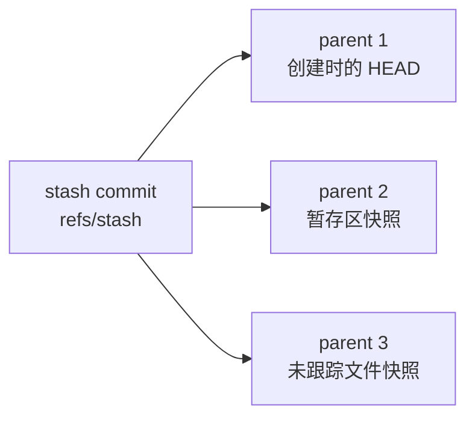

# stash 不是剪贴板，是个游离的 merge commit

## 场景

活干到一半，突然要切去处理别的事。半成品既不能提交（污染历史），也不能丢（白干）。

## 一句话

`git stash` 把工作区打包成一个**游离的 merge commit**，挂在 `refs/stash` 的 reflog 上；`apply` / `pop` 以这个 commit 的**第一个 parent 为 base 做三方合并**。整个过程 HEAD 不动 —— 所以它不是 merge 状态，冲突时 `git merge --abort` 直接报错，该用 `git checkout HEAD -- <file>` 回退。

## 心智模型

### 一个 stash 是一个 commit，带 2~3 个 parent



| parent | 内容 | 何时存在 |
|---|---|---|
| 1 | 创建 stash 时的 HEAD | 总是（**三方合并的 base 就是它**） |
| 2 | 暂存区快照 | 总是 |
| 3 | 未跟踪文件快照 | 只有用了 `-u` / `-a` |

实测（git 2.34.1）一个 `stash -u` 的 commit：

```console
$ git log --format='%h %p %s' -1 refs/stash
cf62bf4 1da5053 a83366f d4dfbf6 On main: demo
```

三个 parent 的 message 分别是 `base`、`index on main: ...`、`untracked files on main: ...`。这解释了另一件事：`git fsck --unreachable` 里一个 stash 会留下 2~3 个游离对象，不是 1 个。

### `stash@{0}` 就是 reflog 语法

```console
$ git rev-parse 'stash@{0}' refs/stash
cf62bf4c9214ca3f5a2f0c9f1dfdf08a3ae17a4c
cf62bf4c9214ca3f5a2f0c9f1dfdf08a3ae17a4c
```

两者同值 —— stash 栈的本质就是 `refs/stash` 这个 ref 的 reflog。由此推出三件事，不用背：

- **`stash@{0}` 是最新存的**，不是最早的 —— 所以不带参数的 `git stash pop` 弹的是刚存的那个
- **drop 之后编号会重排** —— reflog 条目被删，后面的往前挪。别写 `while ... git stash drop stash@{1}` 这种循环
- **空仓库不能 stash** —— 没有 HEAD 就没有 parent 1，没有 base 就无从比较。报错原文：`You do not have the initial commit yet`

### `apply` 是三方合并，不是打补丁

这两种语义差别很大，决定了 apply 安不安全：

- **patch 语义**（`git apply`）：「在第 4 行插入一行」是一串**操作**，执行两遍就插两遍
- **merge 语义**（`git stash apply`）：比的是**目标状态**，状态已经达到就没事可做

所以 **`apply` 是幂等的，手抖敲两次不会把改动叠加两遍**。实测三种情形：

| 第一次 apply 后的工作区 | 再 apply 一次的结果 |
|---|---|
| 还脏着（没提交） | **拒绝**：`local changes would be overwritten by merge`，退出码 1，文件一个字节没动 |
| 已提交，工作区干净 | **成功但零变化**：`nothing to commit, working tree clean` |
| stash 里含未跟踪文件 | **部分失败**：`xxx already exists, no checkout` |

第二行最能说明 merge 语义：命令成功了，但什么都没发生。

第一行那句报错措辞容易误读 —— `would be overwritten by merge` 听着像 git 想覆盖你的东西，其实它是**提前中止来保护你**。

## 操作

### 存

```bash
git stash push -m "改到一半的说明"   # 带描述，栈里堆多个时能认出来
git stash -u -m "..."               # 连未跟踪文件一起收（日常默认用这个）
git stash -p                        # 交互式，只挑一部分改动收起来
```

`git stash` 是 `git stash push` 的简写，只是没描述。git 没有重命名 stash 的命令，真要改只能取出来重存。

### 看（下手前先看清，全是只读）

```bash
git stash list
git stash show -p -u stash@{0}      # -p 看完整 diff，-u 才显示未跟踪文件
```

### 取

```bash
git stash apply stash@{0}           # 恢复，stash 留在栈里
git stash pop                       # 恢复 + 删掉 stash
git stash branch <name> stash@{0}   # 在 stash 的原 base 上开分支恢复，零冲突
```

**默认用 `apply`，确认结果对了再 `git stash drop`。** 多敲一条命令，换掉一整类事故 —— `pop` 在无冲突成功时立刻删 stash，这时若发现弹错了（最常见是弹到了错误的分支上），改动已经和工作区搅在一起，而备份没了。

`git stash branch` 是 stash 太老、base 已经跑远、pop 必然大面积冲突时的救命招：它直接回到当初那个 base 上开分支，所以不可能冲突。

### 冲突了怎么收拾

`pop` 遇到冲突会**保留 stash 不删**（`The stash entry is kept in case you need it again.`）。冲突标记的两边是：

- `<<<<<<< Updated upstream` → 当前 HEAD
- `>>>>>>> Stashed changes` → stash 里的内容

三条出路：

```bash
# A. 手动改完
git add <file> && git stash drop        # drop 不会自动做，必须手动

# B. 直接选一边（ours = 当前 HEAD，theirs = stash，容易记反）
git checkout --ours <file>
git checkout --theirs <file>

# C. 放弃，回到 pop 之前
git checkout HEAD -- <file>             # 只回退这个文件；stash 还在，随时重试
```

出路 C 不要用 `git reset --hard` 代替 —— 它会连带丢掉工作区里**所有**不相关的改动，范围比你想要的大得多。

排查复杂冲突时把标记换成三段式，多出共同祖先那一段：

```bash
git checkout --conflict=diff3 -- <file>
```

## 坑

**默认不收未跟踪文件。** 这是最常踩的一个。stash 的本质是「相对 HEAD 的差异」，而未跟踪文件既不在 HEAD 也不在索引里，不构成差异，于是被无视。危害不止「少收一个文件」：

- 你以为工作区干净了，切分支去跑构建 —— 残留的新文件参与了编译，排查半天找不到原因
- 更狠的：stash 之后顺手 `git clean -fd`，那个文件**永久删除**，stash 里根本没有它的备份

三档收纳范围：

| 命令 | 已跟踪的改动 | 未跟踪文件 | 被 `.gitignore` 忽略的 |
|---|---|---|---|
| `git stash` | ✓ | ✗ | ✗ |
| `git stash -u` | ✓ | ✓ | ✗ |
| `git stash -a` | ✓ | ✓ | ✓ |

`-a` 要谨慎 —— 它会把 `node_modules/`、`build/`、`.env` 一股脑吞进去，又慢又容易出事。日常用 `-u`。

**`git merge --abort` 在 stash 冲突里用不了。** 普通 merge 冲突养成的肌肉记忆在这里失效，很多人卡在这一步。实测（git 2.34.1）：

| 检查项 | 结果 |
|---|---|
| `.git/MERGE_HEAD` | **不存在** |
| `git merge --abort` | `fatal: There is no merge to abort (MERGE_HEAD missing)` |
| `git stash pop --abort` | `error: unknown option 'abort'` —— 没这个选项 |

原因：`stash apply` 借用了合并算法，但**故意不写 `MERGE_HEAD`** —— 语义上它不是在合并两条历史，只是搬运改动，HEAD 全程没动。`merge --abort` 完全依赖 `MERGE_HEAD` 才知道退回哪儿。

所以结论要反过来说：**不是「撤不回」，而是压根不需要撤销一个 merge**，只需要把文件恢复原样。

**解决完冲突要手动 `git stash drop`。** git 不会替你做。忘了就在栈里留一个已经用过的 stash，下次 `git stash list` 看到它一头雾水。

**`git stash show` 默认既不显示未跟踪文件，也只给 diffstat。** 一个纯 `-u` 存下的 stash（里面只有未跟踪文件），`git stash show stash@{0}` 输出是**空的**，看着像个空 stash —— 别急着 drop。顺手的检视命令固定用 `git stash show -p -u stash@{n}`。

**drop / pop 掉的 stash 能救回来，但有时效。** git 在删的时候把 hash 打给你了，那就是留的后路：

```console
$ git stash pop
...
Dropped stash@{0} (c38ce147a99f2d1f09e00f9e9cd94be21a864bd4)
```

拿 hash 当 stash 用即可：`git stash apply c38ce147a`。hash 已经滚屏丢了就捞游离对象：

```bash
git fsck --unreachable | awk '/commit/ {print $3}' | xargs -I% git log -1 --format='% %s' %
```

stash 的 commit message 有固定格式（`WIP on ...` / `On ...`），据此认出要的那个。

**但这条路会被 `git gc` 断掉** —— 不可达对象默认宽限 90 天，`git gc --prune=now` 立刻就没了。它是急救手段，不是保险箱。这也正是「默认用 `apply` 而不是 `pop`」的理由。

!!! tip "顺带撞到的：文本文件结尾留一个换行符"
    读 diff 时如果出现「这行我明明没动」的困惑，先看有没有 `\ No newline at end of file`。**`功能2`（无 `\n`，文件到此为止）和 `功能2\n` 在 git 眼里是两个不同的行**，字节不同就匹配不上，只能一删一增。

    补上结尾换行符后，那行立刻被认成没动过的上下文。`echo` 会自动加，很多编辑器默认不加。不加会让最后一行的每次改动都显示成「删一行加一行」。

    另一个成因是 **最短编辑脚本可能不止一个，git 挑哪个不由你决定** —— 两种改法代价相同时纯看算法选择，偶尔就会看到反直觉的对齐。stash pop 的冲突标记里也会出现同样的困惑，八成是同一个原因。

## 拿 `-p` 挑一部分：hunk 是什么

`git stash -p` 逐个问你要不要收某处改动，单位是 **hunk** —— **改动行 + 周围 3 行上下文**构成的一块。上下文重叠的两处改动会被合并成一个 hunk，于是没得挑。

交互界面里按 `s` 能把一个 hunk 拆开，只要两处改动之间有没被改过的行。实测（git 2.34.1）两处改动之间隔 3 行未改动时，`s` 拆得开：

```console
(1/1) Stage this hunk [y,n,q,a,d,s,e,?]? s
Split into 2 hunks.
```

而**默认 diff 输出**的自动分块要求严一些：两处改动之间超过 6 行未改动才会分成两个 `@@` 块。所以「`git diff` 只看到一个 hunk」不代表 `-p` 里挑不动。

hunk 这个概念在 `git add -p`、`git checkout -p` 里通用，`s` / `y` / `n` / `q` 那套按键也一样。
