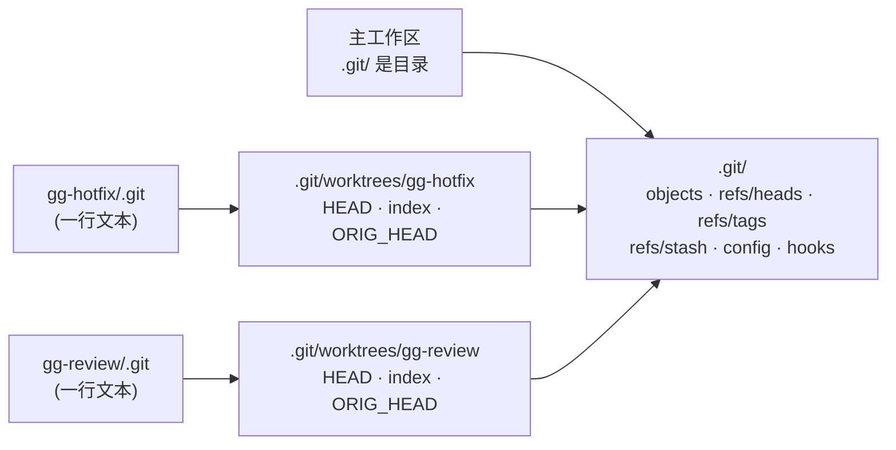

# worktree 不是第二个 clone，是同一个仓库的第二个 HEAD

## 场景

活干到一半，线上要救火；同事推了个分支要 review；想跑一遍老版本做对比。`git checkout` 帮不上忙 —— 一个仓库只有一个工作区，切分支是**就地**把这堆文件换掉，没干完的活会被拖着一起走，而且你没法同时看见两个版本。

## 一句话

`git worktree` 给同一个仓库挂多个工作区：**对象库、分支、tag、stash、remote、hooks 共享一份，只有 HEAD 和 index 每个工作区各一份**。所以第二个工作区里的提交主仓库立刻可见，不用 `push` / `fetch` 倒一趟；代价是 git 强制「一个分支只能被一个工作区检出」，这条约束是保护而不是限制。

## 心智模型

### 一份 `.git`，多个 HEAD



第二个工作区里的 `.git` 不是目录，是**一行文本**：

```console
$ cat ../gg-hotfix/.git
gitdir: ~/lab/gg/.git/worktrees/gg-hotfix
```

注意那个目录名取自**路径的 basename**，不是分支名 —— `git worktree add -b feat ../gg-hotfix` 建出来的元数据目录叫 `gg-hotfix`。

`.git/worktrees/<name>/` 里只有这么几样东西，看一眼就知道什么是"各自一份"：

```console
$ ls .git/worktrees/gg-hotfix/
commondir  gitdir  HEAD  index  logs  ORIG_HEAD
```

| | 放在哪 | 共享 |
|---|---|---|
| 对象库、`refs/heads`、`refs/tags`、`refs/remotes`、`refs/stash` | 主 `.git/` | ✓ |
| `config`、`hooks/` | 主 `.git/` | ✓ |
| `HEAD`、`index`、`ORIG_HEAD`、`logs/`、`refs/bisect` | `.git/worktrees/<name>/` | ✗ |
| 未跟踪文件、`node_modules/`、`.env`、构建产物 | 各自的磁盘 | ✗ |

第一行推出了最实用的那条结论:**stash 是共享的**。在主仓库 `git stash`，到另一个工作区 `git stash list` 一样看得见，可以在这边存那边取。

最后一行是最常踩的：新开的工作区**跑不起来**，因为没装依赖、没有 `.env`。共享的只是 git 管的东西，git 不管的一样都不会给你。

### 为什么「一个分支只能检出一次」

假设两个工作区检出同一分支：这边一提交，那边的 HEAD 就凭空落后，index 和磁盘上的文件全部错位 —— 一个 ref 配不了两个 index。所以 git 在**三个入口**都拦（实测 git 2.34.1）：

```console
$ git worktree add ../gg-dup main
fatal: 'main' is already checked out at '~/lab/gg'

$ cd ../gg-hotfix && git switch main          # checkout 同样报错
fatal: 'main' is already checked out at '~/lab/gg'

$ git branch -d feat                          # 连 -D 都拦得住
error: Cannot delete branch 'feat' checked out at '~/lab/gg-hotfix'
```

第三条值得记：平时 `-D` 是「别管了，删」，这里它照样失败。**分支被某个工作区占着，就删不掉** —— 想删先把工作区 `remove` 掉。

想知道谁占着什么，`git branch -vv` 会直接告诉你，被别的工作区检出的分支前面是 `+`（当前工作区仍是 `*`），后面还带路径：

```console
$ git branch -vv
+ colleague f1dfe6d (~/lab/gg-review) [origin/colleague] cx
* main      8676d09 c2
```

### 跟"再 clone 一份"差在哪

看着像两份代码，实质差三件事：

| | 再 clone 一份 | worktree |
|---|---|---|
| 对象库 | 两份，体积翻倍 | 一份 |
| 分支 / tag / stash / remote / config / hooks | 各自独立，要重新配 | 共享，开箱即用 |
| 两边互通提交 | 要 `push` + `fetch` | 立刻可见，同一个 `git log --all` |
| 同一分支检出两次 | 允许，然后你会改出分叉 | 直接报错拦住 |
| 创建成本 | 大仓库几分钟、几个 G | 秒级 |

写脚本时要留神：worktree 里 `--git-dir` 和 `--git-common-dir` **不再是同一个目录**。

```console
$ git rev-parse --git-dir --git-common-dir    # 在主工作区
.git
.git

$ cd ../gg-hotfix && git rev-parse --git-dir --git-common-dir
~/lab/gg/.git/worktrees/gg-hotfix
~/lab/gg/.git
```

凡是硬编码 `.git/hooks`、`.git/config` 路径的工具，在 worktree 里都会找错地方。要拿共享区就用 `git rev-parse --git-common-dir`。

## 操作

### 建

```bash
git worktree add -b hotfix ../gg-hotfix main   # 从 main 开新分支，检出到新目录 ← 最常用
git worktree add ../gg-review colleague        # 检出已有分支
git worktree add --detach ../gg-v1 v1.0        # 只要某个快照，不建分支
git worktree add ../gg-tmp                     # 分支名 = 目录 basename，起点 = 当前 HEAD
```

第二条有个省事的 DWIM：本地**没有** `colleague` 这个分支、但恰好一个 remote 有同名分支时，git 自动替你建好追踪分支，等价于 `git worktree add --track -b colleague ../gg-review origin/colleague`：

```console
$ git worktree add ../gg-review colleague
Preparing worktree (new branch 'colleague')
Branch 'colleague' set up to track remote branch 'colleague' from 'origin'.
HEAD is now at f1dfe6d cx
```

触发条件是「本地无同名分支 + 只有一个 remote 命中 + 没用 `-b` / `-B` / `--detach`」。别忘了先 `git fetch`,DWIM 认的是本地已有的 `origin/*` 引用，`add` 自己不会去联网。

第三条的 `--detach` 其实可以省 —— 给一个 tag 或裸 hash 时 git 本来就会 detached（实测 `git worktree add ../gg-v1 v1.0` 也输出 `Preparing worktree (detached HEAD 8676d09)`,退出码 0）。写上只是把意图讲明白，省得读命令的人以为你想建一个叫 `v1.0` 的分支。

第四条的默认行为可以改：`git config worktree.guessRemote true` 之后，省略分支名时 git 会先去找同名远端分支来追踪，而不是直接从 HEAD 开叉。

另外两个偶尔用得上的开关：`--no-checkout` 只建元数据不落文件（先建后手动稀疏检出用），`--lock` 建完立刻上锁（见下面 lock 那节）。

### 看

```bash
git worktree list              # 谁在哪儿、检出了什么
git worktree list -v           # 多显示 lock 原因
git worktree list --porcelain  # 给脚本读的稳定格式
git branch -vv                 # 从分支的角度看：+ 号标出被别的工作区占着的
```

```console
$ git worktree list
~/lab/gg          8676d09 [main]
~/lab/gg-review   f1dfe6d [colleague]
~/lab/gg-v1       8676d09 (detached HEAD)
```

### 删

```bash
git worktree remove ../gg-tmp          # 正确姿势：删目录 + 清元数据
git worktree remove --force ../gg-tmp  # 工作区不干净时才需要
git branch -d gg-tmp                   # 分支得自己删，remove 不管
git worktree prune                     # 手动 rm -rf 之后收尸
```

工作区里有改动时 `remove` 会拒绝，**未跟踪文件也算**（实测）：

```console
$ git worktree remove ../gg-hotfix
fatal: '../gg-hotfix' contains modified or untracked files, use --force to delete it
```

主工作区删不掉,它是那份 `.git` 的所在地：

```console
$ git worktree remove .
fatal: '.' is a main working tree
```

### 锁：防止被 prune 掉

工作区放在移动硬盘、网络盘上时，路径暂时访问不到会被 `prune` 判定为"没了"。上锁挡住它：

```bash
git worktree lock --reason "挂在移动硬盘上" ../gg-v1
git worktree unlock ../gg-v1
```

上锁后 `list -v` 会显示 `locked: 挂在移动硬盘上`，`prune` 不再动它，`remove` 也需要更狠的参数：

```console
$ git worktree remove ../gg-v1
fatal: cannot remove a locked working tree, lock reason: 挂在移动硬盘上
use 'remove -f -f' to override or unlock first
```

### 搬家：`move` 和 `repair`

工作区的 `.git` 文件和 `.git/worktrees/<name>/gitdir` 互相记着**绝对路径**，所以用 `mv` 搬会两头对不上。正规做法是让 git 自己搬：

```bash
git worktree move ../gg-tmp ../gg-renamed
```

已经用 `mv` 搬了（或者主仓库改了名）就用 `repair`，它按你现在站的位置决定修哪一头（实测两个方向都好使）：

```console
$ git worktree repair            # 在主仓库里跑：修所有 worktree 的 .git 文件
repair: .git file broken: ~/lab/gg-v1
repair: .git file broken: ~/lab/gg-review

$ cd ../gg-review && git worktree repair    # 在被搬走的 worktree 里跑：修主仓库的记录
repair: gitdir incorrect: ~/lab/gg/.git/worktrees/gg-review/gitdir
```

## 坑

**`remove` 和 `prune` 都不删分支。** 它们只管工作区。清理完记得 `git branch -d`，不然攒一堆早就没有工作区的分支，`git branch -vv` 里前面那个 `+` 消失就是信号。

**detached 工作区里的提交，`remove` 一声不吭就删。** 这是最该记住的一条。分支上的提交是安全的（分支还在，提交自然还在），但 detached HEAD 上的提交没有任何 ref 指着，`remove` 不检查、不警告、退出码 0（实测 git 2.34.1）：

```console
$ cd ../gg-v1 && git commit -am "会丢的提交"   # 工作区随后是干净的
$ cd ../gg && git worktree remove ../gg-v1
$ echo $?
0
```

那个提交立刻变成不可达对象 —— `git fsck --unreachable` 还捞得到，但过了 gc 宽限期就真没了。对比一下 `branch -d`：它会因为「提交没被合并」而拒绝你。**`worktree remove` 没有这层保护。**

所以规矩很简单：**在 detached 工作区里要改东西，先 `git switch -c 某个分支名`。** 只读用途（跑老版本、对比行为）才用 detached。

**新工作区跑不起来是正常的。** 未跟踪文件不共享，`node_modules/`、`.venv/`、`.env`、构建产物都得重新准备一份。这是 worktree 相比 clone 唯一没省下来的成本，也是实际用起来最烦的一点 —— 挂 `git worktree add` 的后置脚本（复制 `.env` + 装依赖）能省掉大半麻烦。

**放在仓库目录内部要记得 ignore。** `git worktree add .worktrees/x` 之后主仓库 `git status` 会多出一行：

```console
$ git status -s
?? .worktrees/
```

要么把工作区放到仓库**外面**（推荐，`../项目名-用途` 这种命名），要么把 `.worktrees/` 写进 `.gitignore`。

**主仓库目录一改名，所有 worktree 全挂。** 因为它们记的是绝对路径：

```console
$ cd ../gg-review && git status
fatal: not a git repository: ~/lab/gg/.git/worktrees/gg-review
```

不是坏了，用上面的 `git worktree repair` 一条命令就修回来。

**per-worktree 的配置要先开开关。** `config` 默认整个仓库共享，想让某个工作区用不同的 `user.email` 之类，得先声明：

```bash
git config extensions.worktreeConfig true    # 只需一次
git config --worktree user.email "x@y.com"   # 写进 .git/worktrees/<name>/config.worktree
```

**rebase / bisect / merge 的进行中状态是各自的。** `refs/bisect`、`ORIG_HEAD` 都在 `.git/worktrees/<name>/` 下，所以一个工作区在 bisect，另一个照常干活互不干扰 —— 这反过来也是个用法:拿一个专用工作区跑 `git bisect`,主工作区继续写代码。

!!! tip "什么时候真该用 worktree"
    - **救火**:手头的活一个字都不用动，另开一个目录改 hotfix
    - **review**:同事的分支和自己的代码同屏对照，不用来回 checkout
    - **跑对比**:两个版本同时在磁盘上，一边跑基线一边跑新版
    - **长跑任务**:构建 / 测试 / bisect 占着一个工作区，另一个继续写
    - **给 AI 用**:多个 agent 各占一个工作区并行改同一个仓库，互不踩踏 —— 分支互斥这条硬约束正好当护栏

    反过来，只是想看一眼别的分支的某个文件，`git show 分支:文件` 就够了，不用开工作区。

## 练法

这篇和 [stash 那篇](stash.md) 一样是练出来的，分工同样卡死：AI 只负责搭现场、埋坑、当提示官，命令全自己敲。这次的现场是一个仓库里同时压着四件事 —— 手上没干完的活、线上配置写错要救火、同事推了个本地还没有的分支、想对着 `v1.0` 看老版本 —— 四件事刚好对应 worktree 的四种建法。

多做对了一件事:**文件名直接叫任务名**（`手头的活.md`、`线上配置.md`、`同事的功能.md`）。练到第三个工作区时，`ls` 一眼就知道自己站在哪个场景里，不用回头对照 `func1.md` 是什么。

两个当时没想明白、后来靠实测才敢下结论的地方，都写进上面的"坑"了:`remove` 对 detached 提交零保护，以及主仓库改名后 `repair` 要在哪一头跑。
