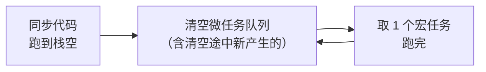

# 输出顺序不是代码顺序：一条栈、两级队列

## 场景

一段代码里混着 `setTimeout` 和 `Promise.then`，猜不准 `console.log` 出来的先后。经典面试题的答案背下来了，换个写法照样错——因为背的是结论，不是引擎做的动作。

## 一句话

同步代码一口气跑到**栈空**，然后**清空整个微任务队列**，才取**一个**宏任务；跑完这一个，再清空微任务队列，如此循环。`await` 之后的代码是微任务，不是同步代码。

## 心智模型

### 栈没空之前，谁都插不进来

"JS 是单线程"的真实含义是：只有一条调用栈，一段同步代码开始跑，就会一路跑到栈空为止。这期间队列里排了什么都不重要——定时器到点了、Promise 早就 resolve 了，全都得等。

所以下面这段的 `while` 会把定时器整整堵死 3 秒，而不是"3 秒里它先响一下"——「到点了」排在同步代码后面出来：

```{.js .run}
setTimeout(() => console.log('到点了'), 0)
const end = Date.now() + 3000
while (Date.now() < end) {}      // 栈被占死，队列全饿着
console.log('同步代码终于跑完')
```

### 两级队列，微任务清空到底

栈空之后，引擎去队列里取活干。队列有两级，优先级不同：

| | 谁会进这个队列 | 一轮取多少 |
|---|---|---|
| **微任务** microtask | `Promise.then/catch/finally`、`await` 之后的代码、`queueMicrotask`、`MutationObserver` | **全部**，清到空为止 |
| **宏任务** macrotask | `setTimeout`、`setInterval`、`MessageChannel`、I/O、各类事件回调 | **一个** |

真正决定顺序的是右边那一列。微任务不是"排在后面等着"，而是**插在下一个宏任务之前，而且会连锁**——清空过程中新产生的微任务，也算在这一次清空里，一并跑掉。



这张图解释了本篇几乎所有现象：**微任务和宏任务不是同一个量级的东西**。宏任务是"下一轮"，微任务是"这一轮的尾巴"。

### `await` 就是 `.then` 的另一种写法

把 `await` 读成"这行之后的代码，包成一个 `.then` 回调"，async 函数就不再特殊了：

```js
async function f() {
  console.log('B')
  await null           // 等价于：Promise.resolve(null).then(() => {
  console.log('D')     //   console.log('D')
}                      // })
```

注意 `await null` —— 等的是个**非 Promise 的普通值**，照样要过一遍微任务队列。`await` 花不花时间跟等的是什么无关，它总是至少让出一个微任务 tick。

## 自己跑一遍

每段都先自己猜顺序，再点运行核对。猜错的地方才是真正学到东西的地方。

### 基础四步

```{.js .run}
console.log('1 同步')
setTimeout(() => console.log('5 宏任务'), 0)
Promise.resolve().then(() => console.log('3 微任务'))
queueMicrotask(() => console.log('4 微任务'))
console.log('2 同步')
```

两个同步的先出，两个微任务按注册顺序跟上，`setTimeout` 哪怕写 `0` 也垫底。把 `setTimeout` 挪到第一行，输出顺序也不会变——**代码位置不影响它属于哪个队列**。

### `await` 让出的那一下

```{.js .run}
async function f() {
  console.log('B')
  await null
  console.log('D')
}
console.log('A')
f()
console.log('C')
```

`A B C D`。`f()` 是**同步调用**的，所以 `B` 紧跟 `A`；`await` 一让出，控制权就回到调用处继续跑 `C`；`D` 要等这一轮同步代码跑完、进微任务清空阶段才出来。

把 `await null` 去掉，输出就变成 `A B D C`——那一下让出没了，整个函数变回同步。

### 微任务连锁，宏任务干等

```{.js .run}
setTimeout(() => console.log('timeout 1'), 0)
setTimeout(() => console.log('timeout 2'), 0)
Promise.resolve()
  .then(() => console.log('micro 1'))
  .then(() => console.log('micro 2'))
  .then(() => console.log('micro 3'))
```

三个微任务是**依次产生**的：跑 `micro 1` 时 `micro 2` 还没进队列。但它们仍然全部排在 `timeout 1` 前面——因为"清空微任务队列"的清空过程会把途中新产生的一并算进去。这就是那句"清到空为止"的实际后果。

## 坑

### 微任务能饿死宏任务

上一条的连锁没有出口，就是一个不用 `while` 也能写出的死循环：

```{.js .run}
setTimeout(() => console.log('我永远轮不到'), 0)
function starve() { queueMicrotask(starve) }
starve()
```

这段会跑到 5 秒保护把它砍掉，`setTimeout` 的回调一次都不会执行。栈是空的、CPU 也没闲着，但宏任务队列永远等不到"微任务清空"这个前提。递归 `queueMicrotask` 或在 `.then` 里无条件返回新 Promise 时要留个出口。

### `setTimeout(fn, 0)` 不是 0

`0` 只是"尽快"，实际有下限。HTML 规范规定：**嵌套层数超过 5 层后，小于 4ms 的延迟一律钳到 4ms**。

```{.js .run}
let depth = 0
const t0 = Date.now()
function tick() {
  depth++
  if (depth <= 10) {
    console.log(`第 ${depth} 层，累计 ${Date.now() - t0}ms`)
    setTimeout(tick, 0)
  }
}
setTimeout(tick, 0)
```

看累计耗时的斜率（Chromium 实测）：前 6 层挤在 1ms 内，第 7 层起每层稳定 +4ms。

```console
第 6 层，累计 1ms
第 7 层，累计 5ms
第 8 层，累计 9ms
```

钳制是按**嵌套层数**触发的，不是按经过的时间——所以"第一次 `setTimeout(fn, 0)` 很快"和"循环里的 `setTimeout(fn, 0)` 每次 4ms"可以同时成立。要"这一轮结束就跑"，该用 `queueMicrotask`，别拿 `setTimeout(fn, 0)` 当"立刻"。

### `return` 一个 Promise 要多吃 2 个 tick

`.then` 回调里返回普通值，下一环就是 1 个 tick；返回 Promise 则要多花 2 个 tick 去展开它。拿两条链赛跑就能看出来：

```{.js .run}
Promise.resolve()
  .then(() => { console.log('A1'); return Promise.resolve() })   // 对照组：换成 return 1
  .then(() => console.log('A2'))

Promise.resolve()
  .then(() => console.log('B1'))
  .then(() => console.log('B2'))
  .then(() => console.log('B3'))
  .then(() => console.log('B4'))
```

`A2` 落在 `B3` 之后。换成 `return 1`，`A2` 就提前到 `B1` 和 `B2` 之间——差出的正好是 2 个 tick。`async` 函数里 `await` 另一个 async 函数时同理，这是 `await` 链看起来"莫名慢半拍"的来源。

### 宏任务不止一个队列

规范里宏任务是**多个任务源**（timer、网络、用户交互……），每个源有自己的队列，事件循环每轮"挑一个源"——挑哪个由实现决定。所以 `setTimeout` 和 `MessageChannel` 的相对顺序**不由规范保证**，跨浏览器可能不同，别把某次实测的顺序当契约。微任务只有一个队列，所以微任务之间的顺序是确定的。

### 本篇看不到渲染

上面的代码跑在 Web Worker 里，那里没有渲染流水线，也没有 `requestAnimationFrame`。真实页面里，"清空微任务"和"下一个宏任务"之间还夹着浏览器决定要不要重排重绘的时机——那一层是渲染问题，不在这条队列模型里，得另开一篇。
