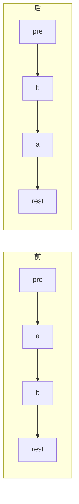

# 24. 两两交换链表中的节点

[LeetCode 24](https://leetcode.cn/problems/swap-nodes-in-pairs/) · 中等 · 链表

## 题

把链表里相邻的节点两两对调（第 1、2 个换，第 3、4 个换……），落单的最后一个不动。只能改指针，不能改节点里的值。

例：`1→2→3→4` → `2→1→4→3`；`1→2→3` → `2→1→3`。

## 一句话

`pre` 指着每一对前面的节点，对调 `a = pre.next`、`b = a.next` 这一对要改三根 `next`，然后 `pre` 跳到 `a`。

## 关键技巧

**交换一对要动三根线，循环变量选「这一对的前驱」。** 交换 `a→b` 不只是 `a`、`b` 之间的事——前面那个节点原来指 `a`，现在要指 `b`。所以循环里拿着的必须是前驱 `pre`：



三根线：`pre.next = b`，`a.next = b.next`（即 `rest`），`b.next = a`。先存 `rest` 就不会因为改线顺序丢失后路。

**dummy 让第一对和其他对一样。** 第一对的前驱不存在，补一个 `dummy`；交换后 `a` 变成这一对的末尾，正好是下一对的前驱。

## 解

```python
class Solution:
    def swapPairs(self, head: Optional[ListNode]) -> Optional[ListNode]:
        dummy = ListNode(0, head)
        pre = dummy
        while pre.next and pre.next.next:
            a, b = pre.next, pre.next.next
            rest = b.next
            pre.next, b.next, a.next = b, a, rest
            pre = a  # a 已换到后面，是下一对的前驱
        return dummy.next
```

时间 $O(n)$，空间 $O(1)$。

## 延伸

- **一般化**：[25. K 个一组翻转链表](0025-reverse-nodes-in-k-group.md)，这题是 $k = 2$；每组内部用 [206. 反转链表](0206-reverse-linked-list.md)。
- 递归写法很短：`b = head.next; head.next = swapPairs(b.next); b.next = head; return b`。
- **坑**：循环条件要同时判 `pre.next` 和 `pre.next.next`，奇数长度的最后一个节点不能动。

??? note "自测"

    ```python
    s = Solution()
    assert list_vals(s.swapPairs(build_list([1, 2, 3, 4]))) == [2, 1, 4, 3]
    assert s.swapPairs(None) is None
    assert list_vals(s.swapPairs(build_list([1]))) == [1]
    assert list_vals(s.swapPairs(build_list([1, 2, 3]))) == [2, 1, 3]
    ```
