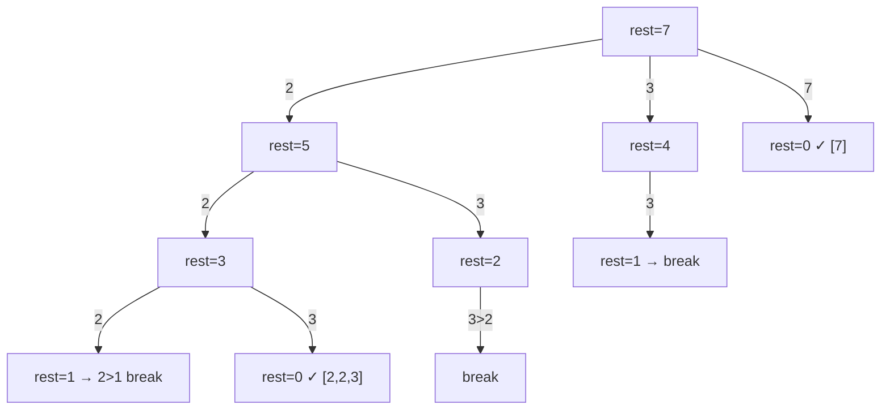

# 39. 组合总和

[LeetCode 39](https://leetcode.cn/problems/combination-sum/) · 中等 · 回溯

## 题

给一个元素互不相同的正整数数组 `candidates` 和目标 `target`，找出所有和为 `target` 的组合；同一个数可以选任意多次，组合内元素的多重集不同才算不同组合。

例：`candidates = [2, 3, 6, 7], target = 7` → `[[2,2,3],[7]]`。

## 一句话

子集模板里把「下一层从 `i+1` 开始」改成「从 `i` 开始」，同一个数就能反复选；排好序后剩余额度不够就直接 `break`。

## 关键技巧

**`start` 控制去重，`i` vs `i+1` 控制能否重用。** 路径里的下标单调不减——`[2,2,3]` 只会以这一种顺序出现，`[2,3,2]`、`[3,2,2]` 永远走不到，所以不会重复。递归调用 `dfs(i, ...)` 允许下一个元素仍是自己，这就是「无限重复」。

**排序 + break 剪枝。** 候选升序时，若 `candidates[i] > rest`，后面的只会更大，整层都不用再试——`break` 而不是 `continue`。

**为什么会终止。** 元素全为正，每下一层 `rest` 严格减小，深度不超过 $target / \min(c)$。



## 解

```python
class Solution:
    def combinationSum(self, candidates: List[int], target: int) -> List[List[int]]:
        candidates = sorted(candidates)
        res, path = [], []

        def dfs(start, rest):
            if rest == 0:
                res.append(path[:])
                return
            for i in range(start, len(candidates)):
                c = candidates[i]
                if c > rest:
                    break  # 升序，后面只会更大
                path.append(c)
                dfs(i, rest - c)  # 传 i：允许重复选自己
                path.pop()

        dfs(0, target)
        return res
```

时间是输出敏感的，粗略上界 $O(n^{T/m})$（$T$ 为 target，$m$ 为最小候选）；空间 $O(T/m)$ 递归深度。

## 延伸

- **每个数只能用一次且有重复**（LeetCode 40）：递归改 `dfs(i+1, ...)`，同层 `i > start and c == candidates[i-1]` 跳过。
- **只问方案数、不要方案**：这是完全背包，DP $O(n \cdot T)$——同类见 [322. 零钱兑换](0322-coin-change.md)（求最少个数）。
- 骨架来自 [78. 子集](0078-subsets.md)，对照记忆最省事。

??? note "自测"

    ```python
    s = Solution()
    norm = lambda xs: sorted(sorted(x) for x in xs)
    assert norm(s.combinationSum([2, 3, 6, 7], 7)) == [[2, 2, 3], [7]]
    assert norm(s.combinationSum([2, 3, 5], 8)) == [[2, 2, 2, 2], [2, 3, 3], [3, 5]]
    assert s.combinationSum([2], 1) == []
    assert norm(s.combinationSum([7, 3, 2], 7)) == [[2, 2, 3], [7]]
    ```
