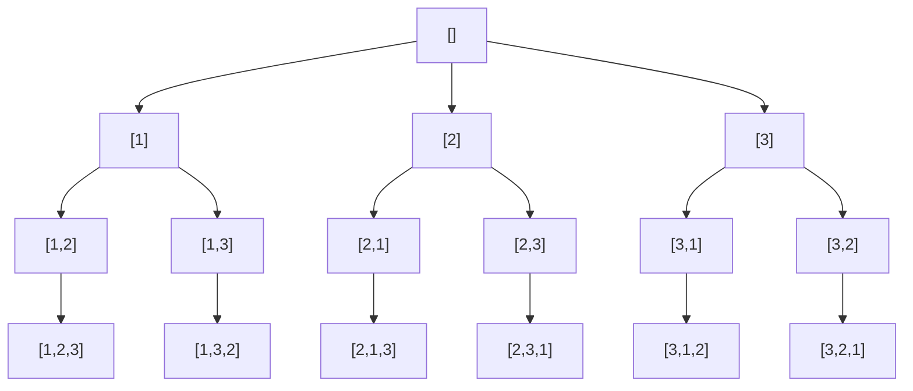

# 46. 全排列

[LeetCode 46](https://leetcode.cn/problems/permutations/) · 中等 · 回溯

## 题

给一个元素互不相同的整数数组，返回它所有可能的排列，顺序任意。

例：`nums = [1, 2, 3]` → `[[1,2,3],[1,3,2],[2,1,3],[2,3,1],[3,1,2],[3,2,1]]`。

## 一句话

一层填一个位置，每层把「还没用过的数」挨个放上去、递归、再拿下来——决策树的每条根到叶路径就是一个排列。

## 关键技巧

**回溯 = 在决策树上做 DFS，并在回退时撤销选择。** 状态只有三样：已选的路径 `path`、还能选什么、何时收集答案。排列的「还能选什么」是「不在 `path` 里的数」，用一个 `used` 布尔数组 $O(1)$ 判定。



**为什么对。** 第 $k$ 层恰好有 $n-k$ 个可选分支，叶子数 $n!$，且每条路径上元素两两不同——不重不漏。

**撤销必须对称。** 递归前 `append` + `used[i]=True`，递归后 `pop` + `used[i]=False`；收集答案时要拷贝 `path[:]`，否则收进去的是同一个会被继续修改的列表。

**交换法**省掉 `used`：把 `nums[first:]` 当作候选区，把第 `i` 个换到 `first` 位置即表示「这一位选它」，递归完再换回来。

## 解

=== "used 数组"

    ```python
    class Solution:
        def permute(self, nums: List[int]) -> List[List[int]]:
            n = len(nums)
            res, path, used = [], [], [False] * n

            def dfs():
                if len(path) == n:
                    res.append(path[:])
                    return
                for i in range(n):
                    if used[i]:
                        continue
                    used[i] = True
                    path.append(nums[i])
                    dfs()
                    path.pop()
                    used[i] = False

            dfs()
            return res
    ```

=== "原地交换"

    ```python
    class Solution:
        def permute(self, nums: List[int]) -> List[List[int]]:
            nums, res = nums[:], []

            def dfs(first):
                if first == len(nums):
                    res.append(nums[:])
                    return
                for i in range(first, len(nums)):
                    nums[first], nums[i] = nums[i], nums[first]
                    dfs(first + 1)
                    nums[first], nums[i] = nums[i], nums[first]

            dfs(0)
            return res
    ```

时间 $O(n \cdot n!)$（$n!$ 个叶子，每个拷贝 $O(n)$），空间 $O(n)$（递归栈与路径，不计输出）。

## 延伸

- **有重复元素**（LeetCode 47）：先排序，同一层里 `nums[i] == nums[i-1] and not used[i-1]` 时跳过——保证相同值只按固定次序出场。
- **排列 vs 组合 vs 子集**：排列每层从头扫、靠 `used` 去重；组合/子集每层从 `start` 往后扫、靠顺序去重——对比 [78. 子集](0078-subsets.md)、[39. 组合总和](0039-combination-sum.md)。
- 只要「下一个」排列而不是全部，用 [31. 下一个排列](0031-next-permutation.md) 的 $O(n)$ 原地法。

??? note "自测"

    ```python
    s = Solution()
    assert sorted(s.permute([1, 2, 3])) == sorted([[1,2,3],[1,3,2],[2,1,3],[2,3,1],[3,1,2],[3,2,1]])
    assert sorted(s.permute([0, 1])) == [[0, 1], [1, 0]]
    assert s.permute([1]) == [[1]]
    assert len(s.permute([1, 2, 3, 4, 5])) == 120
    ```
