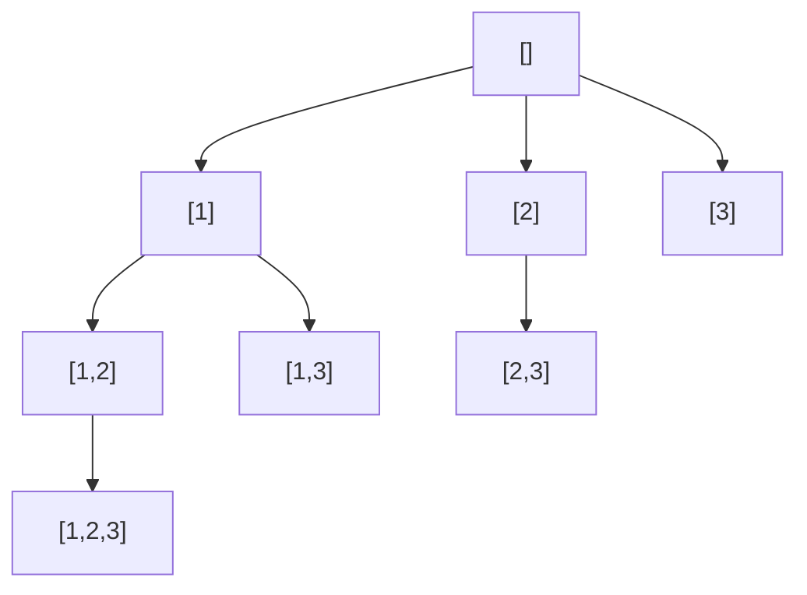

# 78. 子集

[LeetCode 78](https://leetcode.cn/problems/subsets/) · 中等 · 回溯

## 题

给一个元素互不相同的整数数组，返回它的全部子集（幂集），不能有重复子集，顺序任意。

例：`nums = [1, 2, 3]` → `[[],[1],[2],[1,2],[3],[1,3],[2,3],[1,2,3]]`。

## 一句话

决策树上**每个节点**都是一个子集，不只是叶子；下一层只从当前下标往后挑，就不会出现 `[2,1]` 这种和 `[1,2]` 重复的。

## 关键技巧

**两种看法，同一棵树。**

- **选或不选**：对第 $i$ 个元素做二选一，$n$ 层二叉树，$2^n$ 个叶子一一对应子集。
- **从 start 往后挑**：路径 `path` 里的下标严格递增，每个子集只有唯一一种递增写法——于是在每个节点都收集 `path`，不重不漏。



**位运算版**：`mask` 从 $0$ 到 $2^n-1$，第 $i$ 位为 1 表示选 `nums[i]`——无递归，适合 $n$ 小（这题 $n \le 10$）。

## 解

=== "回溯"

    ```python
    class Solution:
        def subsets(self, nums: List[int]) -> List[List[int]]:
            res, path = [], []

            def dfs(start):
                res.append(path[:])  # 每个节点都是一个子集
                for i in range(start, len(nums)):
                    path.append(nums[i])
                    dfs(i + 1)
                    path.pop()

            dfs(0)
            return res
    ```

=== "位掩码"

    ```python
    class Solution:
        def subsets(self, nums: List[int]) -> List[List[int]]:
            n = len(nums)
            return [[nums[i] for i in range(n) if mask >> i & 1] for mask in range(1 << n)]
    ```

时间 $O(n \cdot 2^n)$，空间 $O(n)$（不计输出）。

## 延伸

- **有重复元素**（LeetCode 90）：先排序，同层 `i > start and nums[i] == nums[i-1]` 时跳过。
- 同一个「start 往后挑」骨架，加一个和的约束就是 [39. 组合总和](0039-combination-sum.md)；换成 `used` 数组就是 [46. 全排列](0046-permutations.md)。
- 「选或不选」的视角直通 0-1 背包——[416. 分割等和子集](0416-partition-equal-subset-sum.md) 就是在问是否存在和为一半的子集，只是 $2^n$ 太大，要 DP。

??? note "自测"

    ```python
    s = Solution()
    norm = lambda xs: sorted(sorted(x) for x in xs)
    assert norm(s.subsets([1, 2, 3])) == norm([[], [1], [2], [1, 2], [3], [1, 3], [2, 3], [1, 2, 3]])
    assert norm(s.subsets([0])) == [[], [0]]
    assert len(s.subsets(list(range(10)))) == 1024
    ```
