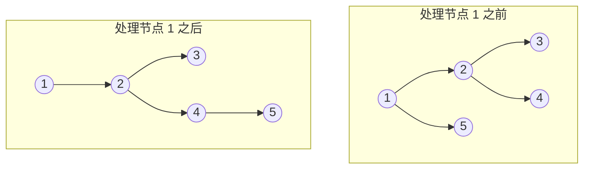

# 114. 二叉树展开为链表

[LeetCode 114](https://leetcode.cn/problems/flatten-binary-tree-to-linked-list/) · 中等 · 二叉树

## 题

把二叉树**原地**展开成一条「链表」：用 `right` 指针串起所有节点，`left` 全部置空，顺序与前序遍历一致。

例：`root = [1, 2, 5, 3, 4, null, 6]` → `[1, null, 2, null, 3, null, 4, null, 5, null, 6]`。

## 一句话

对当前节点：若有左子树，找到左子树的最右节点，把原右子树挂到它后面，再把左子树整个搬到右边；然后沿 `right` 往下走，重复。

## 关键技巧

**前序里，右子树紧跟在左子树的最后一个节点之后。** 左子树前序的最后一个节点就是左子树里「一直往右走到底」的那个（记作 `pre`）。所以在 `cur` 处做三步：

1. `pre.right = cur.right`——原右子树接到左子树末尾；
2. `cur.right = cur.left`——左子树搬到右边；
3. `cur.left = None`。

做完后，以 `cur` 为根的前序顺序没变，只是 `cur` 不再有左孩子。`cur = cur.right` 继续，直到链尾。



**为什么是 $O(n)$：** 找 `pre` 走的是左子树的右链。每条右链上的边被找 `pre` 走一次，之后它们被搬到主链上、再被 `cur` 走一次，不会被重复找——总步数 $O(n)$。这与 Morris 遍历同源，同样 $O(1)$ 额外空间。

**递归版：** 反向前序（右 → 左 → 根），维护「已展开链表的头」`prev`，每个节点 `right = prev, left = None, prev = node`。倒着构造链表，不会丢指针。

## 解

=== "原地（O(1) 空间）"

    ```python
    class Solution:
        def flatten(self, root: Optional[TreeNode]) -> None:
            cur = root
            while cur:
                if cur.left:
                    pre = cur.left
                    while pre.right:       # 左子树前序的最后一个节点
                        pre = pre.right
                    pre.right = cur.right
                    cur.right, cur.left = cur.left, None
                cur = cur.right
    ```

=== "反向前序递归"

    ```python
    class Solution:
        def flatten(self, root: Optional[TreeNode]) -> None:
            prev = None

            def dfs(node):  # 右 → 左 → 根，倒着头插
                nonlocal prev
                if not node:
                    return
                dfs(node.right)
                dfs(node.left)
                node.right, node.left = prev, None
                prev = node

            dfs(root)
    ```

时间 $O(n)$；空间原地版 $O(1)$，递归版 $O(h)$。

## 延伸

- 「先找前驱再改指针」和 Morris 中序是同一招，见 [94. 二叉树的中序遍历](0094-binary-tree-inorder-traversal.md) 的关键技巧。
- 反向遍历 + 头插法建链表，与 [206. 反转链表](0206-reverse-linked-list.md) 里「维护已处理部分的头」是同一种思路。
- 坑：先递归左子树再处理右子树时，如果提前改了 `right`，原右子树就丢了——要么先存下来，要么反着遍历。

??? note "自测"

    ```python
    s = Solution()
    t = build_tree([1, 2, 5, 3, 4, None, 6])
    s.flatten(t)
    assert tree_vals(t) == [1, None, 2, None, 3, None, 4, None, 5, None, 6]
    t = build_tree([0])
    s.flatten(t)
    assert tree_vals(t) == [0]
    s.flatten(None)
    t = build_tree([1, 2, None, 3])  # 只有左链
    s.flatten(t)
    assert tree_vals(t) == [1, None, 2, None, 3]
    ```
