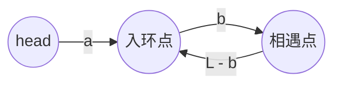

# 142. 环形链表 II

[LeetCode 142](https://leetcode.cn/problems/linked-list-cycle-ii/) · 中等 · 链表

## 题

单链表如果有环，返回环的第一个节点（从头走第一次进入环的那个节点）；没有环返回空。不许改动链表。

例：`3→2→0→-4`，`-4` 指回 `2` → 返回值为 `2` 的节点。

进阶：$O(1)$ 空间。

## 一句话

先用快慢指针找到相遇点；再让一个指针从头出发、一个从相遇点出发，都一步一格，碰面处就是入环点。

## 关键技巧

**把路程写成等式。** 设头到入环点距离 $a$，入环点到相遇点距离 $b$，环长 $L$。相遇时慢指针走了 $a + b$，快指针走了 $a + b + kL$（多绕了 $k \ge 1$ 圈）。快指针路程是慢的两倍：

$$2(a + b) = a + b + kL \;\Rightarrow\; a = kL - b = (k-1)L + (L - b)$$

**读这个等式**：$L - b$ 恰好是从相遇点继续往前走回到入环点的距离。所以从头走 $a$ 步，等于从相遇点走 $L - b$ 步再绕 $k-1$ 整圈——**两者同时落在入环点**。



**为什么慢指针进环后不到一圈就被追上**（上式里慢指针只走了 $a+b$ 而不是 $a+b+$ 若干圈）：慢指针刚进环时，快指针在它前方某处，追及距离小于 $L$，相对速度 1，所以慢指针走不满一圈就被追上。这个事实不影响等式本身，但保证了复杂度是 $O(n)$。

## 解

```python
class Solution:
    def detectCycle(self, head: Optional[ListNode]) -> Optional[ListNode]:
        slow = fast = head
        while fast and fast.next:
            slow, fast = slow.next, fast.next.next
            if slow is fast:
                p = head  # a 步 == (k-1)L + (L-b) 步
                while p is not slow:
                    p, slow = p.next, slow.next
                return p
        return None
```

时间 $O(n)$，空间 $O(1)$。

## 延伸

- 只判有无环：[141. 环形链表](0141-linked-list-cycle.md)。
- **同一段代码的数组版**：[287. 寻找重复数](0287-find-the-duplicate-number.md)——把 `i → nums[i]` 看成链表，重复的数就是入环点，一字不改地套这个解。
- 同样靠「路程相等」对齐两个指针的还有 [160. 相交链表](0160-intersection-of-two-linked-lists.md)。
- 求环长：相遇后让一个指针再绕一圈计数即可。

??? note "自测"

    ```python
    s = Solution()
    head = build_list([3, 2, 0, -4])
    head.next.next.next.next = head.next
    assert s.detectCycle(head) is head.next

    head = build_list([1, 2])
    head.next.next = head
    assert s.detectCycle(head) is head

    assert s.detectCycle(build_list([1])) is None
    assert s.detectCycle(None) is None

    # 长尾巴 + 小环：a = 5, L = 2
    head = build_list(list(range(7)))
    node5 = head.next.next.next.next.next
    node5.next.next = node5
    assert s.detectCycle(head) is node5
    ```
