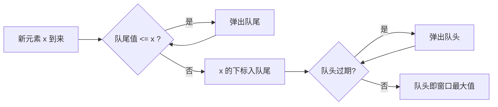

# 239. 滑动窗口最大值

[LeetCode 239](https://leetcode.cn/problems/sliding-window-maximum/) · 困难 · 子串

## 题

长度为 `k` 的窗口从数组左端滑到右端，每次右移一格，输出每个位置窗口内的最大值。

例：`nums = [1, 3, -1, -3, 5, 3, 6, 7], k = 3` → `[3, 3, 5, 5, 6, 7]`。

## 一句话

双端队列存下标、对应值单调递减；进队前从尾部弹掉所有不比它大的，队头过期就弹，队头就是答案。

## 关键技巧

**「被支配」的元素永远不会成为答案。** 若 `i < j` 且 `nums[i] <= nums[j]`，那么只要 `i` 还在窗口里，`j` 也在（`j` 更晚离开），而且 `j` 不比 `i` 小——`i` 这辈子都当不了最大值，可以直接扔。

扔掉所有被支配的元素后，剩下的下标从左到右、值严格递减，这就是单调队列：

- **队尾进**：新元素 `x` 进来前，把队尾所有 `<= x` 的弹掉（它们被 `x` 支配）；
- **队头出**：队头下标 `<= r - k` 时已经滑出窗口，弹掉；
- **取答案**：队头是窗口里最早且最大的幸存者。

**复杂度是均摊的。** 内层 while 看起来是嵌套循环，但每个下标至多进队一次、出队一次，总操作 $O(n)$。



## 解

```python
class Solution:
    def maxSlidingWindow(self, nums: List[int], k: int) -> List[int]:
        q = deque()  # 下标，对应值单调递减
        res = []
        for r, x in enumerate(nums):
            while q and nums[q[-1]] <= x:
                q.pop()
            q.append(r)
            if q[0] <= r - k:
                q.popleft()
            if r >= k - 1:
                res.append(nums[q[0]])
        return res
```

时间 $O(n)$，空间 $O(k)$。

## 延伸

- 堆也能做：最大堆存 `(-值, 下标)`，取堆顶前把过期的弹掉。$O(n \log n)$，好写但不是最优。
- 单调**栈**是它的近亲，只从一端进出：[739. 每日温度](0739-daily-temperatures.md)、[84. 柱状图中最大的矩形](0084-largest-rectangle-in-histogram.md)、[42. 接雨水](0042-trapping-rain-water.md)。
- 单调队列还常用来优化 DP 的「窗口内取最值」转移，如「跳跃游戏 VI」（[LeetCode 1696](https://leetcode.cn/problems/jump-game-vi/)）。
- 坑：队列里存**下标**不存值，否则判断不了过期。

??? note "自测"

    ```python
    s = Solution()
    assert s.maxSlidingWindow([1, 3, -1, -3, 5, 3, 6, 7], 3) == [3, 3, 5, 5, 6, 7]
    assert s.maxSlidingWindow([1], 1) == [1]
    assert s.maxSlidingWindow([1, -1], 1) == [1, -1]
    assert s.maxSlidingWindow([9, 8, 7, 6], 2) == [9, 8, 7]
    assert s.maxSlidingWindow([4, 4, 4], 3) == [4]
    ```
