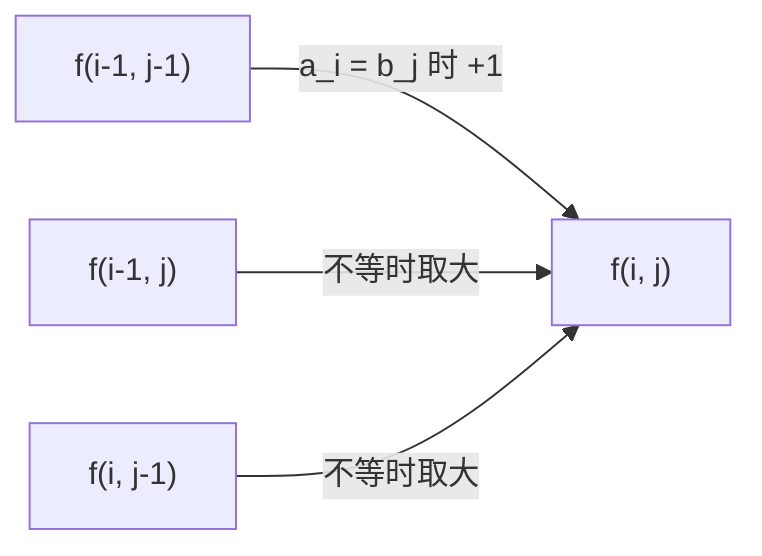

# 1143. 最长公共子序列

[LeetCode 1143](https://leetcode.cn/problems/longest-common-subsequence/) · 中等 · 多维动态规划

## 题

给两个字符串 `text1`、`text2`，求它们最长公共子序列的长度（子序列可以不连续，但要保持原顺序）；没有就返回 0。

例：`text1 = "abcde", text2 = "ace"` → `3`（`"ace"`）；`text1 = "abc", text2 = "def"` → `0`。

## 一句话

比较两个前缀的最后一个字符：相等就一起用上，`dp[i-1][j-1] + 1`；不等就扔掉其中一个，`max(dp[i-1][j], dp[i][j-1])`。

## 关键技巧

**双序列 DP：状态是两个前缀长度。**

- 状态：$f(i,j)$ = `text1[:i]` 与 `text2[:j]` 的 LCS 长度。
- 转移：
    - $a_i = b_j$：$f(i,j) = f(i-1,j-1) + 1$；
    - 否则：$f(i,j) = \max\big(f(i-1,j),\ f(i,j-1)\big)$。
- 初值：$f(0,\cdot) = f(\cdot,0) = 0$，空串与谁都没有公共部分。用「前缀长度」而非下标当状态，就是为了让这一行一列当哨兵。
- 顺序：逐行、行内从左到右。

**为什么相等时直接对角线 +1 不亏。** 若 $a_i = b_j$，存在一个最优 LCS 以它们配对结尾——假如最优解没用 $a_i$，把它的最后一个字符换成 $a_i$ 与 $b_j$ 的配对，长度不变。所以不必再比较 $f(i-1,j)$ 和 $f(i,j-1)$。

**滚动数组要多存一个对角值。** 一维 `dp[j]` 覆盖前是 $f(i-1,j)$，`dp[j-1]` 已是 $f(i,j-1)$，而 $f(i-1,j-1)$ 在更新 `dp[j-1]` 时被冲掉了——用变量 `diag` 暂存。



## 解

```python
class Solution:
    def longestCommonSubsequence(self, text1: str, text2: str) -> int:
        n = len(text2)
        dp = [0] * (n + 1)
        for a in text1:
            diag = 0                                # f(i-1, 0)
            for j in range(1, n + 1):
                diag, dp[j] = dp[j], (diag + 1 if a == text2[j - 1] else max(dp[j], dp[j - 1]))
        return dp[n]
```

时间 $O(mn)$，空间 $O(n)$。`diag, dp[j] = dp[j], …` 右边先求值：新 `diag` 取的是旧 `dp[j]`，也就是下一格要用的 $f(i-1,j)$。

## 延伸

- **加上操作代价就是编辑距离**：[72. 编辑距离](0072-edit-distance.md)，同一张表，转移多一个「替换」方向。
- **单序列版**：[300. 最长递增子序列](0300-longest-increasing-subsequence.md)——LIS 等于原数组与其排序去重后的 LCS。
- **回文子序列**：`s` 与 `s[::-1]` 的 LCS，见 [5. 最长回文子串](0005-longest-palindromic-substring.md) 的延伸。
- **最长公共子串**（要求连续）：不等时置 0 而不是取大，答案取全表最大。

??? note "自测"

    ```python
    s = Solution()
    assert s.longestCommonSubsequence("abcde", "ace") == 3
    assert s.longestCommonSubsequence("abc", "abc") == 3
    assert s.longestCommonSubsequence("abc", "def") == 0
    assert s.longestCommonSubsequence("a", "a") == 1
    assert s.longestCommonSubsequence("bsbininm", "jmjkbkjkv") == 1
    ```
