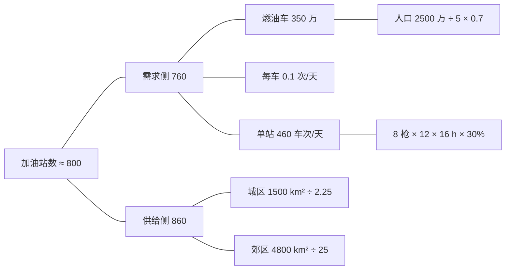

# Fermi 估算：上海有多少加油站

## 题

不许查资料，估算上海有多少座加油站。面试官要的不是一个数，是**拆解过程和量级**。

## 一句话

**约 800 座，量级 $10^3$**——需求侧（车要加多少次油 ÷ 一座站能加多少次）得 760，供给侧（面积 ÷ 每座站的覆盖范围）得 860，两条独立路径差 13%，互相印证。

## 关键技巧

**一、拆成能拍脑袋的因子。** 没人知道加油站数，但每个人对"几个人一辆车""多久加一次油""加一次几分钟"都有感觉。把目标写成这些因子的乘除，每个因子估错两倍也不怕。

**二、误差在对数尺度上相消。** 设真值 $N = \prod_i x_i$，估计 $\hat N = \prod_i \hat x_i$，则

$$
\ln \frac{\hat N}{N} = \sum_{i=1}^{k} \ln \frac{\hat x_i}{x_i}
$$

各因子的对数误差若独立、有正有负，和的标准差按 $\sqrt{k}\,\sigma$ 增长，而不是最坏情况的 $k\sigma$。5 个因子各自有 90% 把握在两倍以内，乘积 90% 落在 **4.7 倍**以内——最坏情况是 $2^5 = 32$ 倍。这就是 Fermi 估算"每步都粗、结果不粗"的原因。

**三、没感觉的因子用几何平均。** 只知道"大概在 100 到 10000 之间"，取 $\sqrt{100 \times 10000} = 1000$，不取算术中点 5050——量级估算的误差是乘性的，中点要在对数轴上找。

**四、两条独立路径交叉核对。** 同一个量从两个互不共享假设的方向估，结果若差出一个量级，至少有一条路径里藏着错误假设；差在两倍以内，就可以放心报数。

## 解

下面所有输入都是**量级假设**，不是统计数据。

**路径一：需求侧**

$$
N_1 = \frac{\text{燃油车数} \times \text{每车每天加油次数}}{\text{单站每天服务车次}}
$$

- 常住人口约 2500 万，每 5 人一辆车 → 500 万辆；新能源车占比高，燃油车按七成 → **350 万辆**。
- 私家车一周开 200 km、百公里 8 L，半箱就加——平均每 10 天加一次；出租、货车更频繁，私家车里也有很少开的，统一按 **1/10 次/天** → 每天 35 万车次。
- 一座站 8 支油枪，每车占枪 5 分钟（每枪每小时 12 车），有效营业 16 小时，平均利用率 30%（早晚高峰排队、深夜空转）→ $8 \times 12 \times 16 \times 0.3 \approx$ **460 车次/天**。

$$
N_1 = \frac{350\,\text{万} \times 0.1}{460} \approx 760
$$

**路径二：供给侧**

$$
N_2 = \sum_{\text{区域}} \frac{\text{面积}}{\text{每站覆盖面积}}
$$

- 全市约 6300 km²，按城区 1500 km²、郊区 4800 km² 两档。
- 城区开车 1–2 公里就能碰到一座，按网格间距 1.5 km → 每站 2.25 km²，得 **670**。
- 郊区间距 5 km → 每站 25 km²，得 **190**。

$$
N_2 \approx 670 + 190 = 860
$$

**核对**：两条路径没有共享任何输入——一条用人口、车辆、油枪，一条用面积、间距。$N_2 / N_1 = 1.13$，几何平均 $\sqrt{760 \times 860} \approx$ **810**。报"八百座左右，量级一千"即可。本文没有拿官方统计来对答案——这里只核两条路径是否自洽。



## 延伸

- **面试时先报拆解式，再代数**。面试官最想看的是公式结构和每个假设的依据；数字可以被纠正，结构错了才是硬伤。
- **敏感性分析**：乘积对每个因子的对数弹性都是 1，谁的相对误差大谁就主导总误差。本例最没谱的是"利用率 30%"——它翻倍，答案砍半。把最不确定的因子挑出来说明，比多报一位有效数字有用。
- **常见错误一**：因子的估计误差明明相关却当独立。比如"车有多少"和"加油多频繁"都凭同一个"上海人人开车"的印象去估，两个误差会同向偏，$\sqrt{k}$ 的相消就不成立；误差负相关反而相消得更好。
- **常见错误二**：单位混乱。每步写上单位（辆、次/天、车次/站/天），约分后只剩"座"，才算拆对了。
- **经典同类题**：芝加哥有多少钢琴调音师（相传是 Fermi 本人出的）、北京一年卖多少杯咖啡、一架波音 747 能装多少个高尔夫球。结构都是"需求 ÷ 单位供给"或"总容量 ÷ 单位体积"，都能找第二条路径核对。
- **与做市的关系**：量化面试里的 [做市游戏](market-making.md) 常用 Fermi 题当标的——你先报一个区间，面试官在你的区间上成交，你再更新。区间宽度就是你对自己拆解误差的诚实估计。

??? note "数值验证"

    先复算两条路径，再用对数正态蒙特卡洛展示误差相消：每个因子的估计独立地以 90% 概率落在真值两倍以内（对数误差 $\sim N(0, \sigma^2)$，$\sigma = \ln 2 / 1.645$）。

    ```python
    import math, random

    cars = 25e6 / 5 * 0.7              # 人口、每 5 人一车、七成烧油（量级假设）
    per_day = cars / 10                # 每 10 天加一次
    cap = 8 * (60 / 5) * 16 * 0.3      # 单站每天服务车次
    N1 = per_day / cap
    N2 = 1500 / 1.5 ** 2 + 4800 / 5 ** 2
    print(round(cars), round(per_day), round(cap), round(N1))   # 3500000 350000 461 760
    print(round(N2), round(math.sqrt(N1 * N2)), round(N2 / N1, 2))  # 859 808 1.13

    random.seed(0)
    s = math.log(2) / 1.645
    for k in (1, 3, 5, 8):
        T = 200000
        errs = sorted(abs(sum(random.gauss(0, s) for _ in range(k))) for _ in range(T))
        q90 = math.exp(errs[int(.9 * T)])
        within3 = sum(e < math.log(3) for e in errs) / T
        print(k, round(q90, 2), round(math.exp(1.645 * s * math.sqrt(k)), 2), 2 ** k, round(within3, 3))
    # 因子数  90%误差倍数(模拟)  理论 2^sqrt(k)  最坏 2^k  P(误差<3倍)
    # 1  2.0   2.0   2    0.991
    # 3  3.33  3.32  8    0.867
    # 5  4.71  4.71  32   0.757
    # 8  7.12  7.1   256  0.643
    ```

    理论列就是 $2^{\sqrt{k}}$：对数误差的标准差按 $\sqrt{k}$ 放大，换回倍数就是两倍的 $\sqrt{k}$ 次方。
