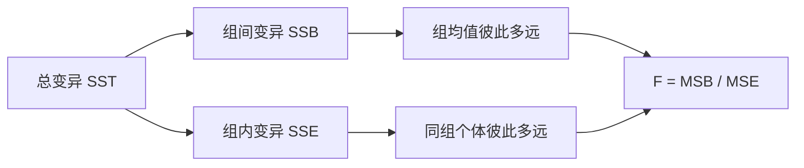
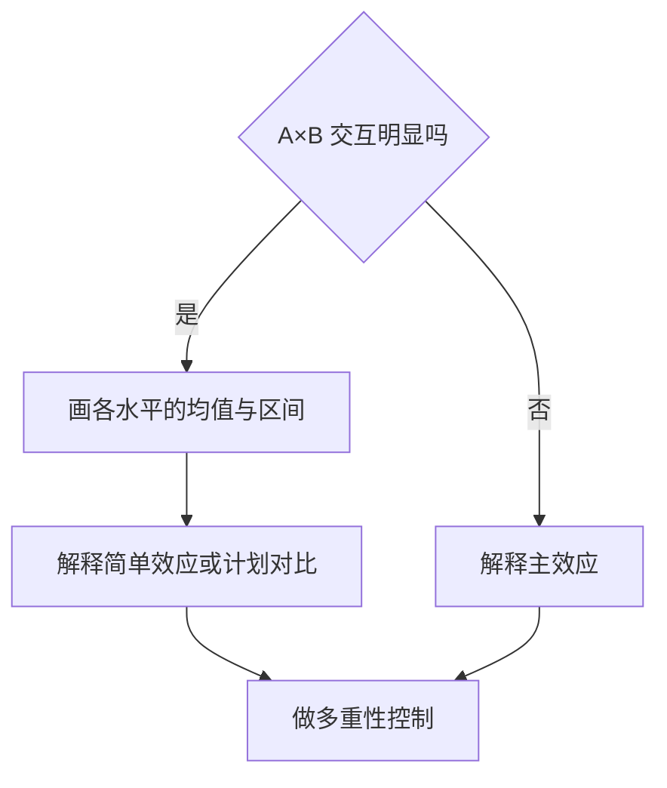

# 方差分析：比较均值，核心是拆分变异

方差分析（ANOVA）比较多个组的均值是否超出组内随机波动。**它的核心不是“方差相不相等”，而是把总变异拆成模型解释的部分与残差部分。**



## 单因素 ANOVA 检验所有组均值相等

设第 $j$ 组有 $n_j$ 个观测 $Y_{ij}$，共 $k$ 组、总样本量 $N=\sum_jn_j$。模型写成：

$$
Y_{ij}=\mu+\alpha_j+\varepsilon_{ij}
$$

$\mu$ 是总体基线，$\alpha_j$ 是第 $j$ 组相对基线的效应。常用约束是 $\sum_j\alpha_j=0$，也可选一个参考组编码；拟合值相同，参数解释不同。

总体检验为：

$$
H_0:\mu_1=\mu_2=\cdots=\mu_k
$$

备择只说“至少有一组均值不同”，不说哪几组不同，也不说差异多大。

## 平方和把总离差拆开

记总体均值为 $\bar Y_{\cdot\cdot}$，第 $j$ 组均值为 $\bar Y_{\cdot j}$：

$$
\operatorname{SST}
=\sum_j\sum_i(Y_{ij}-\bar Y_{\cdot\cdot})^2
$$

组间平方和与组内平方和为：

$$
\operatorname{SSB}
=\sum_jn_j(\bar Y_{\cdot j}-\bar Y_{\cdot\cdot})^2
$$

$$
\operatorname{SSE}
=\sum_j\sum_i(Y_{ij}-\bar Y_{\cdot j})^2
$$

恒有：

$$
\operatorname{SST}=\operatorname{SSB}+\operatorname{SSE}
$$

除以各自自由度得到均方：

$$
\operatorname{MSB}=\frac{\operatorname{SSB}}{k-1},
\qquad
\operatorname{MSE}=\frac{\operatorname{SSE}}{N-k}
$$

检验统计量为：

$$
F=\frac{\operatorname{MSB}}{\operatorname{MSE}}
$$

在 $H_0$ 和模型假设成立时，$F\sim F_{k-1,N-k}$。$F$ 很大表示组间差异相对组内噪声过大，不像由共同均值产生。

## ANOVA 与回归是同一个模型

把组别编码成 $k-1$ 个虚拟变量，线性回归与单因素 ANOVA 会给出相同的拟合值、残差平方和和总体 $F$ 检验。

```echarts
{
  "title": {"text": "组间差异要与组内波动一起看", "left": "center"},
  "tooltip": {},
  "xAxis": {"type": "category", "data": ["A", "B", "C"], "name": "组别"},
  "yAxis": {"type": "value", "name": "结果"},
  "series": [
    {"type": "scatter", "symbolSize": 12, "data": [["A",4],["A",5],["A",6],["A",5.5],["B",6],["B",7],["B",8],["B",7.5],["C",9],["C",10],["C",11],["C",10.5]]},
    {"type": "line", "step": "middle", "showSymbol": true, "data": [5.125,7.125,10.125], "name": "组均值"}
  ]
}
```

两组时，单因素 ANOVA 的 $F$ 等于等方差双样本 $t$ 检验的 $t^2$。多组不用反复做两两 $t$ 检验——那会积累第一类错误。

## 效应量回答差异有多大

$p$ 值回答数据与“所有均值相等”有多冲突，不回答差异的实际量级。常见效应量为：

$$
\eta^2=\frac{\operatorname{SSB}}{\operatorname{SST}}
$$

偏 $\eta^2$ 在多因素设计中写成：

$$
\eta_p^2=
\frac{\operatorname{SS}_{\text{effect}}}
{\operatorname{SS}_{\text{effect}}+\operatorname{SS}_{\text{error}}}
$$

$\eta^2$ 在小样本中偏大。单因素 ANOVA 可报告较保守的：

$$
\omega^2=
\frac{\operatorname{SSB}-(k-1)\operatorname{MSE}}
{\operatorname{SST}+\operatorname{MSE}}
$$

效应量仍依赖研究设计和样本构成。不要脱离领域尺度机械套“小、中、大”阈值；同时报告各组均值、标准差和均值差区间。

## 显著以后，用计划对比或事后比较定位

总体 $F$ 显著只说明并非全相等。接下来有两条路：

- 计划对比：研究前就定义少量有意义的线性组合，解释最直接
- 事后比较：查看所有或一组未预先指定的两两差异，需要校正多重性

线性对比写成：

$$
L=\sum_{j=1}^k c_j\mu_j,
\qquad
\sum_jc_j=0
$$

例如三组中比较对照组与两个处理组平均值，可取 $(-1,\tfrac12,\tfrac12)$。

常见选择：

| 情形 | 方法 |
|---|---|
| 所有两两比较、方差齐 | Tukey HSD |
| 只与一个对照组比较 | Dunnett |
| 任意多个检验、需强控制 | Holm 校正 |
| 方差不齐且样本量不等 | Welch ANOVA 后配 Games–Howell |

Bonferroni 简单但可能保守；Holm 在同样控制 family-wise error rate 时通常更有力。不要先看结果再把探索性比较包装成计划对比。

## 多因素 ANOVA 先看交互

两因素模型可写成：

$$
Y_{ijk}
=\mu+\alpha_i+\beta_j+(\alpha\beta)_{ij}+\varepsilon_{ijk}
$$

交互表示因素 A 的效应随因素 B 的水平改变。交互明显时，单独说“A 的主效应”可能把相反方向的简单效应平均掉。



不平衡设计里，Type I、II、III 平方和可能给出不同检验。选哪一种取决于模型层级、交互和 estimand；不能把软件默认值当成统计原则。

## 假设针对误差，不是原始分数必须正态

经典 ANOVA 主要依赖：

- 独立性：由抽样与实验设计保证，最关键
- 方差齐性：各组误差方差近似相同
- 残差近似正态：小样本推断更依赖它
- 模型形式正确：遗漏交互、时间趋势或区组会污染误差项

样本量相近时，ANOVA 对轻度非正态和方差差异通常较稳健；样本量严重不等且大方差落在小组时风险更高。方差不齐可用 Welch ANOVA，不能只因正态性检验显著就机械换非参数方法。

Kruskal–Wallis 检验比较秩分布；只有各组分布形状相近时，才可近似解释为位置差异。它不是“无假设版均值 ANOVA”。

## 重复测量必须承认同一个人会相似

同一受试者在多个时间点被测量时，观测不独立。重复测量 ANOVA 把受试者差异从误差中分离：

$$
Y_{ij}=\mu+\alpha_j+u_i+\varepsilon_{ij}
$$

$u_i$ 表示受试者自己的稳定基线。经典重复测量 ANOVA 还要求球形性：任意两个条件差值的方差相等。违反时可用 Greenhouse–Geisser 或 Huynh–Feldt 修正自由度。

现实数据常有缺失时间点、不等间隔或个体轨迹不同。线性混合模型可直接表示随机截距、随机斜率和相关结构，通常比删除不完整个体更灵活：

$$
Y_{ij}
=\beta_0+\beta_1t_{ij}+b_{0i}+b_{1i}t_{ij}+\varepsilon_{ij}
$$

重复测量中的效应量与误差项选择密切相关。报告时写清是 $\eta_p^2$、广义 $\eta^2$ 还是配对均值差的标准化效应。

## 常见误区

- 总体 $F$ 显著就说每组都不同——它只保证至少一个差异
- 先做所有两两 $t$ 检验——未控制整体第一类错误
- 只报告 $p$ 值——没有均值差、区间和效应量就不知道多大
- 交互显著仍只解释主效应——平均值可能遮掉条件差异
- 把重复观测当独立样本——标准误通常会偏小
- 方差检验不显著就宣布齐性成立——小样本检验可能没检验力
- 看到非正态就改做秩检验——先查残差、异常点和 estimand

## 交付前检查

1. 组别、实验单位与重复测量单位是否分清？
2. 总体 $F$ 的误差项是否与设计匹配？
3. 各组均值、散布、样本量和区间是否同时展示？
4. 是否报告与问题匹配的效应量？
5. 事后比较是否控制了多重性？
6. 多因素设计是否先检查交互？
7. 方差不齐、不平衡和缺失值是否改变结论？
8. 重复测量是否处理个体内相关与球形性？

**ANOVA 先问变异从哪里来，再问哪些均值不同；设计决定该拿哪一块变异当误差。**
