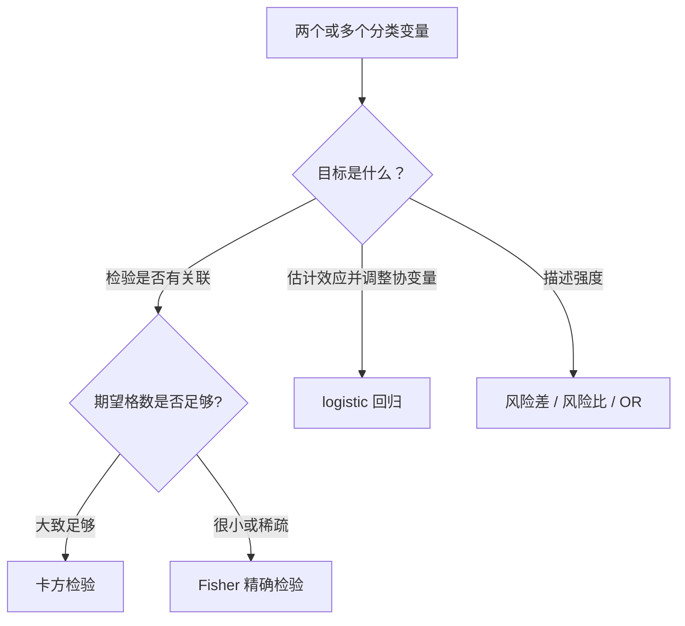

# 分类数据：先看计数，再谈关联

分类数据分析的原料是每一格有多少个观测，不是把类别编码成 1、2、3 后直接算均值。**先写清变量类型、分母和效应尺度，再选择卡方、Fisher 或 logistic 回归。**

## 列联表保留了问题的骨架

假设 200 名访客被随机展示两个页面，结果如下：

| 页面 | 购买 | 未购买 | 合计 |
|---|---:|---:|---:|
| A | 30 | 70 | 100 |
| B | 20 | 80 | 100 |
| 合计 | 50 | 150 | 200 |

A、B 的购买率分别是 30% 和 20%。先报告原始计数与比例——只给百分比会藏掉分母，只给计数又不方便比较不同分母。

## 卡方检验比较观察计数与独立时的期望计数

零假设是两个分类变量独立。第 $i$ 行、第 $j$ 列的期望计数为：

$$
E_{ij}=\frac{(\text{第 }i\text{ 行合计})(\text{第 }j\text{ 列合计})}{n}
$$

Pearson 卡方统计量为：

$$
X^2=\sum_i\sum_j\frac{(O_{ij}-E_{ij})^2}{E_{ij}}
$$

$r\times c$ 列联表在零假设下的自由度是 $(r-1)(c-1)$。$X^2$ 越大，观察计数与“独立”所预测的计数差得越远。

卡方近似依赖期望计数，而不是观察计数。常用经验检查是：没有期望格数小于 1，且至多 20% 的格子小于 5。它是近似质量的快检，不是自然定律。

!!! warning "显著不等于关联很强"
    样本很大时，微小偏离也能得到很小的 $p$ 值。检验后还要报告比例差、OR 或适合业务的效应量及置信区间。

## Fisher 精确检验适合稀疏的 2×2 表

Fisher 检验在固定行列边际后，用超几何分布计算当前表及更极端表出现的概率。它不依赖大样本卡方近似：

$$
P(A=a)=\frac{\binom{a+b}{a}\binom{c+d}{c}}{\binom{n}{a+c}}
$$

期望格数很小、样本稀疏或出现零格时，Fisher 通常比普通卡方近似稳妥。样本很大时它仍可用，但计算可能更慢，也可能因条件化而偏保守。

“精确”只描述零假设下概率的计算方式。它不能修复非随机抽样、混杂、测量错误或重复观测。

## 2×2 表至少报告一个绝对效应和一个相对效应

把处理组写成 $(a,b)$，对照组写成 $(c,d)$：

| | 事件 | 无事件 |
|---|---:|---:|
| 处理组 | $a$ | $b$ |
| 对照组 | $c$ | $d$ |

两组风险为 $p_1=a/(a+b)$、$p_0=c/(c+d)$。常见效应量是：

$$
RD=p_1-p_0,\qquad
RR=\frac{p_1}{p_0},\qquad
OR=\frac{a/b}{c/d}=\frac{ad}{bc}
$$

页面例子中：

$$
RD=0.10,\qquad RR=1.50,\qquad OR=\frac{30\times80}{70\times20}\approx1.71
$$

三者都正确，但问题不同。RD 表示每 100 名访客多 10 次购买；RR 表示风险是 1.5 倍；OR 表示购买 odds 是 1.71 倍。

结局很少见时 OR 近似 RR；结局常见时二者会明显分开。**不要把 OR 直接说成“概率提高了多少倍”。**

OR 的大样本区间常在 log 尺度上计算：

$$
\operatorname{SE}(\log \widehat{OR})
=\sqrt{\frac1a+\frac1b+\frac1c+\frac1d}
$$

$$
\log \widehat{OR}\pm z_{1-\alpha/2}\operatorname{SE}(\log \widehat{OR})
$$

最后对区间两端取指数，回到 OR 尺度。若某格为 0，公式会失效；不要机械加 0.5 后假装问题已经解决，应考虑精确方法或惩罚 logistic 回归。

## logistic 回归把二元结局和多个解释变量接起来

二元结局 $Y\in\{0,1\}$ 的 logistic 回归写成：

$$
\log\frac{P(Y=1\mid X)}{1-P(Y=1\mid X)}
=\beta_0+\beta_1X_1+\cdots+\beta_pX_p
$$

连续变量 $X_j$ 每增加 1 单位，在其他变量保持不变时，条件 OR 乘以 $e^{\beta_j}$。分类变量要选参考组，其系数表示相对该参考组的 log OR。

logistic 回归解决三类扩展：

- 同时纳入年龄、渠道等协变量，估计条件关联
- 加入交互项，检查一个变量的效应是否随另一个变量变化
- 输出每个对象的预测概率，而不只做总体关联检验

它不自动给出因果效应。纳入哪些协变量应来自研究设计和因果问题，不应只靠逐步回归或单变量 $p$ 值筛选。

!!! note "条件 OR 与粗 OR 可能不同"
    调整协变量后的 OR 是“其他变量相同”时的条件 OR。它与列联表直接算出的粗 OR 不是同一个 estimand；即使没有混杂，也可能因 OR 的 non-collapsibility 而不同。

## 模型假设藏在“每行独立”之外

使用卡方、Fisher 或普通 logistic 回归前，至少检查：

- 每个分析单位是否只贡献一次独立观测
- 类别是否互斥且穷尽，缺失是否被误当成普通类别
- 分母是否一致，是否存在抽样权重、分层或整群设计
- logistic 模型中连续变量与 logit 是否近似线性
- 是否有完全分离、极端稀疏类别或强共线性
- 研究设计是否支持把关联解释成因果

同一用户多次访问、同一门店内顾客相似时，普通标准误通常偏小。应按用户或门店聚类，或使用能表达相关结构的模型。

## 三个常见误区

1. 把类别编码后做相关系数——编码大小通常没有定量意义。
2. 因为卡方显著就逐格解释——先控制多重比较，再看标准化残差和预设对比。
3. 只报准确率或总体比例——类别不平衡会掩盖少数类表现，分组分母必须保留。

## 交付前检查清单

- [ ] 原始计数、行比例或列比例与分母都已报告
- [ ] 检验回答的是独立性、同质性还是拟合优度
- [ ] 期望格数支持卡方近似；否则使用精确或模拟方法
- [ ] 至少给出一个绝对效应、一个相对效应及其区间
- [ ] OR 没有被误写成风险比
- [ ] 重复观测、聚类、抽样权重和缺失机制已经处理
- [ ] logistic 系数已转换成可解释的 OR 或预测概率

**分类数据的核心不是选一条检验命令，而是让每一格的计数、分母和比较对象都说得清。**
