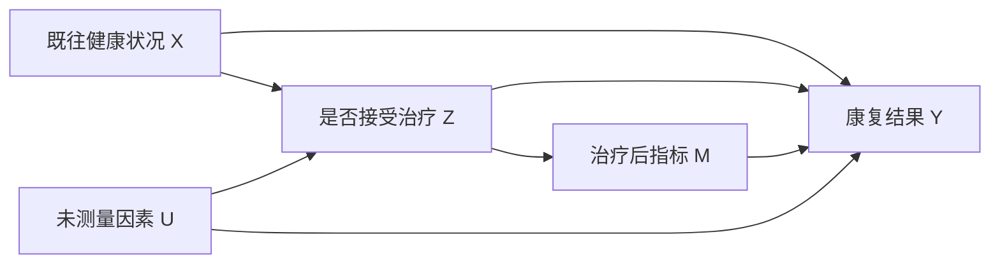

# 因果推断：先说明反事实，再谈方法

相关性描述变量一起变化；因果效应比较同一对象在不同处理下本会发生什么。**因果结论来自研究设计、假设与数据的组合，不来自某个回归系数的名字。**

## 因果问题是两个潜在结果之差

设单位 $i$ 接受处理时的结果为 $Y_i(1)$，不接受时为 $Y_i(0)$。个体处理效应是：

$$\tau_i=Y_i(1)-Y_i(0)$$

同一单位在同一时刻只能观察其中一个潜在结果。这就是因果推断的基本缺失数据问题。

总体平均处理效应（ATE）为：

$$\operatorname{ATE}=E[Y(1)-Y(0)]$$

对已接受处理者的平均效应（ATT）为：

$$\operatorname{ATT}=E[Y(1)-Y(0)\mid Z=1]$$

ATE 与 ATT 面向不同人群，数值可以不同。分析前必须先选 estimand。

## DAG 用来声明假设，不是从数据里自动读答案

$X$ 是处理前混杂变量；$M$ 是中介；$U$ 是未测量混杂。DAG 的箭头来自领域知识和时间顺序。它把需要哪些假设说出来，却不会证明这些假设为真。

三类变量要分清：

| 类型 | 处理时点 | 是否通常调整 |
|---|---|---|
| 混杂变量 | 处理前，同时影响处理和结果 | 为总效应识别通常要调整 |
| 中介变量 | 处理后，位于因果路径上 | 估总效应时通常不调整 |
| 碰撞变量 | 被两个变量共同影响 | 通常不调整，调整会打开偏差路径 |

“能预测结果”不是纳入控制变量的充分理由。控制变量应由因果结构决定。

## 从观察数据识别因果效应需要三条核心假设

一致性要求单位实际接受 $Z=z$ 时，观测结果等于 $Y(z)$。处理版本必须足够明确。

可交换性要求：

$$Y(z)\perp Z\mid X$$

给定处理前协变量 $X$ 后，处理分配像随机一样。观察数据里这意味着没有遗漏的重要混杂。

正值性要求：

$$0<P(Z=1\mid X=x)<1$$

每类协变量组合中都要同时存在处理和对照。若重症患者必定接受治疗，数据不能告诉我们重症患者不治疗会怎样。

还常假设单位之间没有干扰。若给一个人接种会改变他人的感染风险，单个单位的潜在结果不能只由自己的处理决定。

## 调整混杂有多条路，目标应一致

### 回归标准化

先拟合结果模型 $m_z(x)=E(Y\mid Z=z,X=x)$，再对所有样本的协变量分布取平均：

$$\widehat{\operatorname{ATE}} = \frac1n\sum_{i=1}^n [\hat m_1(X_i)-\hat m_0(X_i)]$$

模型必须能表示重要的非线性和交互。只读取线性回归中的处理系数，往往隐含了过强的共同效应假设。

### 倾向得分与加权

倾向得分为 $e(X)=P(Z=1\mid X)$。逆概率加权估计 ATE 的基本形式是：

$$\hat\tau_{\mathrm{IPW}} = \frac1n\sum_i \left[ \frac{Z_iY_i}{\hat e(X_i)} - \frac{(1-Z_i)Y_i}{1-\hat e(X_i)} \right]$$

极端倾向得分会制造巨大权重。应检查处理组与对照组的重叠、加权后协变量平衡和有效样本量。

### 匹配与双重稳健

匹配寻找协变量相近的处理与对照单位，常把目标人群改变为有共同支持的样本。必须报告谁被丢弃。

双重稳健方法组合处理模型和结果模型；两者中至少一个正确时可保持一致性。它不意味着可以同时粗糙地拟合两个错误模型。

## 准实验利用外生变化

| 方法 | 核心比较 | 关键假设 |
|---|---|---|
| 差分中的差分 | 处理组与对照组的前后变化之差 | 若无处理，两组趋势平行 |
| 回归不连续 | 阈值两侧紧邻单位 | 阈值附近除处理外连续，不能精确操纵评分 |
| 工具变量 | 工具造成的处理变化 | 工具相关、排除限制、独立性，常加单调性 |

两期差分中的差分可写为：

$$\hat\tau_{\mathrm{DiD}} = (\bar Y_{T,\text{后}}-\bar Y_{T,\text{前}}) - (\bar Y_{C,\text{后}}-\bar Y_{C,\text{前}})$$

政策前的多期数据可检查预趋势，但“预趋势不显著”不能证明未来平行趋势。

工具变量常识别的是被工具推动而改变处理状态者的局部平均处理效应（LATE），不是自动等于总体 ATE。

## 负向对照与敏感性分析负责找漏洞

安慰剂时间、安慰剂结果和负向对照可检查方法是否在不应出现效应处仍给出“效应”。它们发现问题很有用，却不能证明所有混杂已经消失。

敏感性分析应回答：未测量混杂需要多强，才能把结论推翻？不同合理模型、不同带宽、不同权重截断下，结论是否稳定？

## 一个可检查的例子

观察到培训组平均工资 12，未培训组为 10，原始差为 2。若培训组原本教育年限更高，这个 2 同时含培训效应和教育差异。

调整后若两组在教育、经验和既往工资上平衡，估计差为 0.8，结论应是：**在已测量混杂充分、正值性和一致性成立时，培训的估计效应为 0.8。** 不能把条件句删掉。

## 常见误区

- 加很多控制变量 → 不保证更接近因果；中介和碰撞变量会引入偏差
- 倾向得分模型 AUC 很高 → 预测分组好不代表协变量平衡好
- 匹配后直接用原始样本量 → 匹配改变依赖结构，标准误要跟着变
- 面板数据加固定效应 → 只能消除时间不变混杂，挡不住时间变化混杂
- 事件研究图处理前不显著 → 不等于平行趋势已经验证
- 机器学习很灵活 → 降低模型偏差不等于消除未测量混杂

## 因果分析检查清单

1. 处理、对照、结果、时间窗和目标人群是否定义清楚？
2. estimand 是 ATE、ATT、LATE 还是其他效应？
3. DAG 是否区分处理前混杂、中介和碰撞变量？
4. 一致性、可交换性、正值性和无干扰是否可信？
5. 是否检查共同支持、协变量平衡和极端权重？
6. 标准误是否匹配匹配、聚类、重复测量或政策层级？
7. 是否做安慰剂、替代规格和未测量混杂敏感性分析？

**因果推断最重要的产物不是一个数字，而是一条别人能检查的“假设 → 识别 → 估计 → 诊断”链。**
