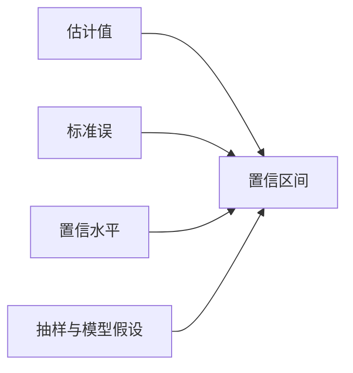

# 置信区间：给估计值配一把误差尺

置信区间不是“参数有 95% 概率在里面”。频率学派的参数固定，随机的是造区间的程序：**若重复抽样并重复造区间，约 95% 的区间会覆盖真值。**

## 通用骨架

许多区间都可以写成：

$$
\text{估计值}\pm
\text{临界值}\times\text{标准误}
$$

中间是位置，标准误是数据带来的波动，临界值决定覆盖率。

## 已知和未知总体方差

正态总体且 $\sigma$ 已知：

$$
\bar x\pm z_{1-\alpha/2}\frac{\sigma}{\sqrt n}
$$

$\sigma$ 未知时使用 t 区间：

$$
\bar x\pm t_{n-1,1-\alpha/2}\frac{s}{\sqrt n}
$$

95% 只是惯例。区间越高置信越宽；样本量越大区间越窄。

## 一次区间该怎样说

观察数据后，区间端点已固定。合适表述是：

> 使用该抽样与构造程序得到的 95% 置信区间为 $[a,b]$。

不合适表述是：

> 真值有 95% 概率落在 $[a,b]$。

若要直接给参数分配概率，需要贝叶斯后验与可信区间。

## 比例的 Wald 区间经常太草率

最熟悉的比例区间是：

$$
\hat p\pm z_{1-\alpha/2}
\sqrt{\frac{\hat p(1-\hat p)}{n}}
$$

它在样本小或 $\hat p$ 靠近 0、1 时覆盖率差，甚至给出小于 0 或大于 1 的端点。Wilson 区间通常更可靠：

$$
\frac{
\hat p+\frac{z^2}{2n}
\pm z\sqrt{\frac{\hat p(1-\hat p)}n+\frac{z^2}{4n^2}}
}{
1+\frac{z^2}{n}
}
$$

零成功不代表真实概率为零。此时精确二项区间或 Wilson 区间仍会给出正的上界。

## 两组均值差优先用 Welch 区间

独立两组不强求方差相等：

$$
(\bar x_1-\bar x_2)
\pm t_{\nu,1-\alpha/2}
\sqrt{\frac{s_1^2}{n_1}+\frac{s_2^2}{n_2}}
$$

自由度 $\nu$ 用 Welch–Satterthwaite 近似。默认用 Welch 通常比先做方差齐性检验再选方法更稳妥。

配对数据则对差值 $d_i=x_{i,\text{after}}-x_{i,\text{before}}$ 构造单样本区间：

$$
\bar d\pm t_{n-1,1-\alpha/2}\frac{s_d}{\sqrt n}
$$

## 区间宽度由四件事决定

- 置信水平：越高越宽
- 样本量：通常按 $1/\sqrt n$ 缩窄
- 数据变异：越大越宽
- 设计与模型：聚类、权重、重尾会改变标准误

若希望均值区间的半宽不超过 $E$，粗略样本量为：

$$
n\approx\left(\frac{z_{1-\alpha/2}\sigma}{E}\right)^2
$$

比例在未知 $p$ 时，用 $p=0.5$ 给最保守样本量：

$$
n\approx\frac{z_{1-\alpha/2}^2}{4E^2}
$$

这些公式只控制抽样误差，不覆盖无回答、测量误差和设计偏差。

## 置信区间和显著性检验是一对

对双侧检验 $H_0:\theta=\theta_0$，若 $\theta_0$ 不在 $100(1-\alpha)\%$ 置信区间内，则同层级检验拒绝 $H_0$。

但区间比二元结论多给两样东西：

- 效应大小可能落在哪些范围
- 数据是否也兼容“实际无关紧要”的小效应

## 转换参数时先在自然尺度上构造

比值、odds ratio 等参数分布偏斜，常在 log 尺度上造区间，再指数变换回来。例如：

$$
\log(\widehat{RR})\pm z\,\operatorname{SE}(\log\widehat{RR})
$$

回到原尺度后的区间通常不对称，这正符合比值不能小于 0 的约束。

## 区间没有包含哪些不确定性

常规置信区间只在指定抽样机制和模型下覆盖参数。它通常不自动包括：

- 抽样框遗漏和自选择
- 数据清洗规则的选择
- 多次尝试模型后的选择不确定性
- 测量误差与未观测混杂
- 错误的相关结构

**区间很窄只说明模型内的随机误差小，不保证问题问对、样本抽对、模型写对。**
