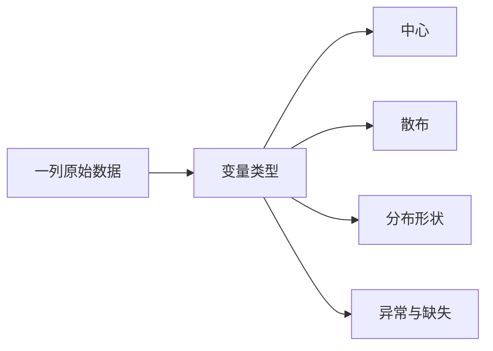

# 描述统计：先看分布，再报一个平均数

描述统计不是把数据压成几个数字。它要回答四件事：**中心在哪里、散布有多大、分布长什么样、哪些观测值得回头检查。** 一个均值通常不够。




## 变量类型决定能算什么

| 类型 | 例子 | 合适的摘要 |
|---|---|---|
| 名义变量 | 城市、渠道、血型 | 频数、比例、众数 |
| 有序变量 | 满意度 1–5、教育程度 | 频数、分位数、中位数 |
| 数值变量 | 身高、收入、时长 | 均值、中位数、标准差、分位数 |
| 时间变量 | 下单时间、故障日期 | 趋势、周期、间隔 |

编码成数字不等于数值变量。把“华北、华东、华南”编码成 1、2、3 后，均值 2 没有解释。

## 中心：均值和中位数回答不同问题

样本均值把所有观测都算进去：

$$
\bar x=\frac{1}{n}\sum_{i=1}^n x_i
$$

中位数是排序后位于中间的位置。均值适合近似对称、没有强异常值的数据；中位数对长尾和异常值更稳健。

例如收入为 $[5,6,6,7,100]$ 万元：

$$
\bar x=24.8,\qquad \operatorname{median}(x)=6
$$

均值回答“把总量平均分，每人多少”；中位数回答“一个典型位置在哪里”。不能因为中位数更好看就替换均值——先看问题要估总量结构还是典型个体。

## 散布：同一个均值可以对应完全不同的数据

样本方差与样本标准差为：

$$
s^2=\frac{1}{n-1}\sum_{i=1}^n(x_i-\bar x)^2,\qquad s=\sqrt{s^2}
$$

$n-1$ 来自用样本同时估计了 $\bar x$，只剩 $n-1$ 个自由度。标准差与原变量同单位；方差便于代数推导。

稳健的散布摘要是四分位距：

$$
\operatorname{IQR}=Q_3-Q_1
$$

变异系数 $\operatorname{CV}=s/\bar x$ 可比较量纲相同但均值不同的数据；均值接近 0 或可为负时不要用。

## 五数概括把位置和尾部一起交代

五数概括是：

$$
\min,\quad Q_1,\quad \operatorname{median},\quad Q_3,\quad \max
$$

箱线图常把低于 $Q_1-1.5\operatorname{IQR}$ 或高于 $Q_3+1.5\operatorname{IQR}$ 的点标成离群点。**这是筛查规则，不是删除规则。** 离群可能来自录入错误，也可能正是最重要的真实对象。

```echarts
{
  "title": {"text": "同均值，不同分布", "left": "center"},
  "tooltip": {},
  "xAxis": {"type": "value", "name": "数值"},
  "yAxis": {"type": "category", "data": ["集中", "分散"]},
  "series": [
    {"type": "scatter", "symbolSize": 12, "data": [[8,0],[9,0],[10,0],[11,0],[12,0],[2,1],[6,1],[10,1],[14,1],[18,1]]}
  ]
}
```

两组数据均值都是 10，第二组的不确定性却大得多。只报均值会把差别抹掉。

## 分布形状至少看三件事

- 对称还是偏斜：右偏分布通常有少量大值把均值向右拉
- 单峰还是多峰：多峰常暗示混合了不同子群
- 尾部多重：极端事件是否比正态分布更常出现

直方图受分箱宽度影响；密度图受平滑带宽影响。画图参数改变后结论若跟着大变，说明数据不足以支持精细形状判断。

## 标准化只换坐标，不改变排序

z-score 为：

$$
z_i=\frac{x_i-\bar x}{s}
$$

它表示观测离均值多少个标准差。标准化便于比较不同量纲的变量，但不把偏态数据变成正态，也不消除异常值。

## 两个变量要看联合关系

数值—数值先画散点图，再考虑相关系数；类别—数值按组画箱线图或小提琴图；类别—类别看列联表和条件比例。

Pearson 相关系数为：

$$
r=\frac{\sum_i(x_i-\bar x)(y_i-\bar y)}
{\sqrt{\sum_i(x_i-\bar x)^2\sum_i(y_i-\bar y)^2}}
$$

$r$ 只概括线性关系。$r=0$ 不代表没有关系，相关也不代表因果。极端点、分组结构和范围限制都可能改变它。

## 一份最低限度的数据体检

1. 每个变量的定义、单位和允许范围是什么？
2. 样本量、唯一值数和缺失率是多少？
3. 数值变量的分位数、均值和标准差是否互相讲得通？
4. 类别变量有没有拼写不同但含义相同的水平？
5. 分布是否偏斜、多峰、截断或堆在边界？
6. 异常值回到原始记录后是错误还是事实？
7. 分组后，整体结论是否反转？

**先画分布再选摘要；先解释数据质量，再解释小数点后的差异。**
