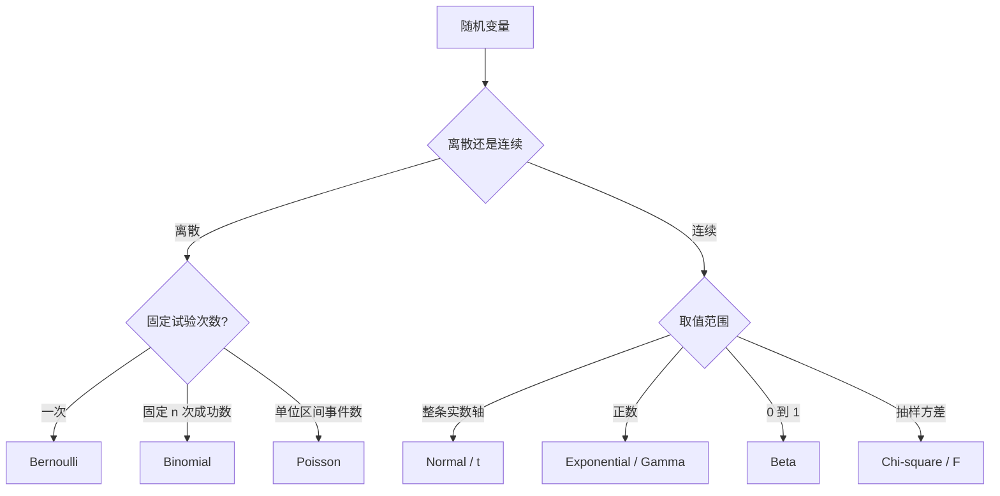

# 常见分布：先认数据生成机制，再认公式

选择分布先问“数据怎样产生”，不要先看曲线像不像。计数、等待时间、比例和极值有不同的支持集与机制。

## 一张分布地图



## Bernoulli 与 Binomial：成败和成功次数

$X\sim\operatorname{Bernoulli}(p)$：

$$
P(X=x)=p^x(1-p)^{1-x},\quad x\in\{0,1\}
$$

$$
E(X)=p,\qquad \operatorname{Var}(X)=p(1-p)
$$

$n$ 次独立、成功率固定的 Bernoulli 试验之和服从二项分布：

$$
X\sim\operatorname{Binomial}(n,p),\qquad
P(X=x)=\binom nxp^x(1-p)^{n-x}
$$

$$
E(X)=np,\qquad \operatorname{Var}(X)=np(1-p)
$$

用户之间相互影响、成功率随时间变，都会破坏二项假设并造成过度离散。

## Geometric 与 Negative Binomial：等到成功要多久

若每次独立且成功率为 $p$，直到第一次成功所需试验次数 $X$ 服从几何分布：

$$
P(X=x)=(1-p)^{x-1}p,\quad x=1,2,\ldots
$$

几何分布有无记忆性。负二项分布可描述等到第 $r$ 次成功的试验数，也常用于方差大于均值的计数数据。

## Hypergeometric：有限总体不放回抽样

总体容量 $N$，其中 $K$ 个“成功”，不放回抽 $n$ 个，成功数 $X$ 服从超几何分布：

$$
P(X=x)=\frac{\binom Kx\binom{N-K}{n-x}}{\binom Nn}
$$

它与二项分布的关键差别是抽取不独立。抽样比例很小时，二项分布可作为近似。

## Poisson：单位暴露量里的事件数

若事件独立发生、局部速率近似恒定：

$$
X\sim\operatorname{Poisson}(\lambda),\qquad
P(X=x)=e^{-\lambda}\frac{\lambda^x}{x!}
$$

$$
E(X)=\operatorname{Var}(X)=\lambda
$$

观测暴露量不同时，应建模速率并加入 offset。例如不同门店营业时长不同，不能直接比较故障数。

## Uniform 与 Normal：基准模型

连续均匀分布 $U(a,b)$ 在区间内密度恒定：

$$
f(x)=\frac{1}{b-a},\qquad
E(X)=\frac{a+b}{2}
$$

正态分布由位置 $\mu$ 与尺度 $\sigma$ 决定：

$$
f(x)=\frac{1}{\sigma\sqrt{2\pi}}
\exp\left[-\frac{(x-\mu)^2}{2\sigma^2}\right]
$$

标准化后 $Z=(X-\mu)/\sigma\sim N(0,1)$。正态适合许多小扰动相加的结果，不适合有硬边界、强偏态或极重尾的数据。

```echarts
{
  "title": {"text": "正态分布：尺度越大，曲线越宽", "left": "center"},
  "tooltip": {"trigger": "axis"},
  "xAxis": {"type": "value", "min": -5, "max": 5},
  "yAxis": {"type": "value"},
  "series": [
    {"name": "σ=1", "type": "line", "showSymbol": false, "data": [[-4,0.0001],[-3,0.0044],[-2,0.054],[-1,0.242],[0,0.399],[1,0.242],[2,0.054],[3,0.0044],[4,0.0001]]},
    {"name": "σ=2", "type": "line", "showSymbol": false, "data": [[-4,0.027],[-3,0.065],[-2,0.121],[-1,0.176],[0,0.199],[1,0.176],[2,0.121],[3,0.065],[4,0.027]]}
  ]
}
```

## Exponential 与 Gamma：正值等待时间

Poisson 过程相邻事件的等待时间服从指数分布：

$$
f(x)=\lambda e^{-\lambda x},\quad x\ge0,\qquad E(X)=1/\lambda
$$

指数分布也有无记忆性。Gamma 分布是更灵活的正值右偏分布，可描述等到多个事件的总等待时间。

## Beta：0 到 1 之间的概率

$$
f(p)\propto p^{\alpha-1}(1-p)^{\beta-1},\quad 0<p<1
$$

Beta 分布形状灵活，也是 Bernoulli/Binomial 成功率的共轭先验。$\alpha,\beta$ 都大时分布集中；都小于 1 时质量靠近 0 和 1。

## t、卡方和 F：推断中自然出现的分布

- t 分布：用样本标准差替代未知 $\sigma$ 后，标准化均值服从；尾部比正态更重
- 卡方分布：独立标准正态平方和；用于方差与列联表推断
- F 分布：两个独立卡方变量按自由度缩放后的比；用于方差比和方差分析

自由度增大时，t 分布趋近标准正态。

## 用支持集和均值—方差关系先排错

| 数据 | 首选候选 | 快速排错 |
|---|---|---|
| 0/1 结果 | Bernoulli | 是否独立、成功率是否稳定 |
| 固定次数的成功数 | Binomial | 是否存在过度离散 |
| 单位暴露量计数 | Poisson / Negative Binomial | 方差是否远大于均值 |
| 正值等待时间 | Exponential / Gamma | 风险率是否恒定 |
| 实数连续测量 | Normal / t | 是否偏态、重尾、有边界 |
| 概率或比例 | Beta | 是否包含精确的 0 或 1 |

**分布名是机制的缩写。先写出独立性、支持集和均值—方差关系，再决定它能不能用。**
