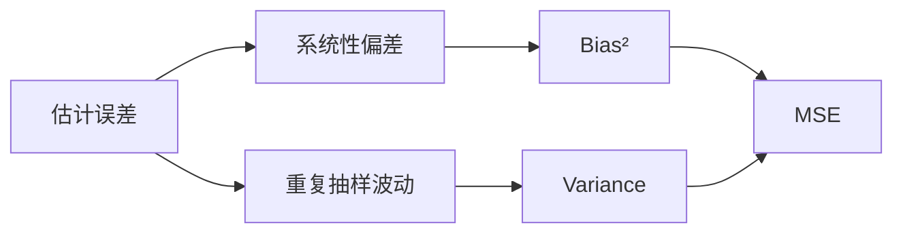

# 点估计：一个数怎样代表未知参数

点估计用样本计算一个数去猜总体参数。评价它不能只看这次猜得准不准，要看重复抽样中的**偏差、方差、均方误差和大样本行为**。

## 参数、估计量和估计值是三件事

- 参数 $\theta$：总体的固定未知量，如总体均值 $\mu$
- 估计量 $\hat\theta=T(X_1,\ldots,X_n)$：抽样前的随机变量
- 估计值：把这批数据代入估计量得到的具体数字

样本均值 $\bar X$ 是估计量；观察到 $\bar x=12.4$ 后，12.4 是估计值。

## 四把尺子评价估计量

偏差：

$$
\operatorname{Bias}(\hat\theta)=E(\hat\theta)-\theta
$$

方差：

$$
\operatorname{Var}(\hat\theta)=E[(\hat\theta-E\hat\theta)^2]
$$

均方误差：

$$
\operatorname{MSE}(\hat\theta)
=E[(\hat\theta-\theta)^2]
=\operatorname{Bias}(\hat\theta)^2+\operatorname{Var}(\hat\theta)
$$

一致性：$n\to\infty$ 时 $\hat\theta$ 依概率收敛到 $\theta$。无偏不等于好；稍有偏差但方差小的估计量，MSE 可能更低。

## 为什么样本方差除以 n−1

总体方差的自然样本版本若除以 $n$：

$$
\tilde s^2=\frac1n\sum_i(X_i-\bar X)^2
$$

它会系统性低估 $\sigma^2$。修正为：

$$
S^2=\frac1{n-1}\sum_i(X_i-\bar X)^2
$$

可得 $E(S^2)=\sigma^2$。因为残差满足 $\sum_i(X_i-\bar X)=0$，只有 $n-1$ 个可以自由变化。

## 矩估计：让样本矩对齐总体矩

若模型参数能由总体矩表示，就用样本矩替换。Poisson 分布满足 $E(X)=\lambda$，所以矩估计为：

$$
\hat\lambda_{\mathrm{MOM}}=\bar X
$$

矩估计通常易算，但不一定最有效，也可能给出参数空间外的值。

## 最大似然：找最能解释已观测数据的参数

独立观测的似然函数：

$$
L(\theta;x)=\prod_{i=1}^nf(x_i\mid\theta)
$$

常取对数：

$$
\ell(\theta)=\sum_{i=1}^n\log f(x_i\mid\theta)
$$

Bernoulli 数据中有 $k$ 次成功：

$$
L(p)=p^k(1-p)^{n-k}
$$

求导可得：

$$
\hat p_{\mathrm{MLE}}=\frac{k}{n}
$$

似然是参数的相对支持度，不是“参数为真的概率”。频率学派中参数固定，随机的是数据。

## 最大似然为什么常用

在正则条件下，MLE 通常具有：

- 一致性：样本增大后靠近真值
- 渐近正态：$\hat\theta$ 的分布可近似正态
- 渐近有效：大样本下方差达到 Cramér–Rao 下界
- 变换不变性：$g(\theta)$ 的 MLE 是 $g(\hat\theta)$

小样本、边界参数、不可识别模型或强错设时，这些性质可能失效。

## 充分统计量压缩数据而不丢参数信息

若给定统计量 $T(X)$ 后，样本的条件分布不再依赖 $\theta$，则 $T$ 对 $\theta$ 充分。

例如 Bernoulli 样本对 $p$ 的信息全部包含在成功次数 $\sum_iX_i$ 中。观测顺序对 $p$ 没有额外信息。

## 稳健估计用一点效率换抗污染能力

均值对极端值敏感，中位数的 breakdown point 更高。截尾均值、Huber M-estimator 等位于两者之间。

选择估计量要写清目标：

| 目标 | 常用估计 | 代价 |
|---|---|---|
| 总量平均分配 | 均值 | 对极端值敏感 |
| 典型位置 | 中位数 | 正态模型下效率略低 |
| 限制极端值影响 | 截尾均值 / M-estimator | 解释随规则变化 |
| 完整参数模型 | MLE | 依赖模型设定 |

## 估计完成后还欠一个不确定性

只报 $\hat\theta=2.3$ 不足以判断信息量。至少同时给出标准误或区间估计；再说明样本设计、模型假设和 estimand。

**点估计负责给出位置，不负责证明精确。一个估计值必须和它的抽样波动一起交付。**
