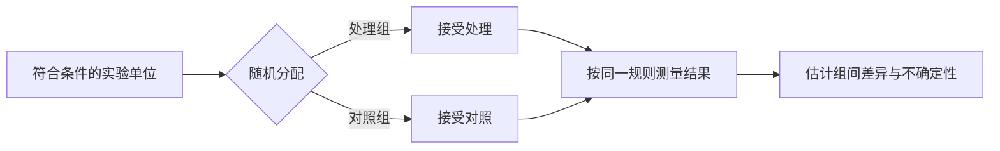

# 实验设计：先决定怎样产生证据

实验设计不是把两组均值拿来比较。它要在采集数据之前，把处理、对照、随机化和分析单位钉死。**设计负责创造可比性，统计模型只负责量化剩余的不确定性。**

## 先写 estimand，再安排实验

以“新推荐页是否提高 7 日留存”为例，先写清五件事：

| 对象 | 例子 |
|---|---|
| 实验单位 | 一个符合条件的新用户 |
| 处理 | 首次访问时展示新推荐页 |
| 对照 | 展示旧推荐页 |
| 结果变量 | 注册后 7 日内是否再次活跃 |
| estimand | 符合条件用户中，新页面相对旧页面的平均留存差 |

若结果变量、时间窗或人群在看过数据后才改变，实际检验的问题也变了。主指标、次指标、排除规则和停止规则应在实验前确定。

## 随机化切断系统性差异

随机分配使处理指示 $Z_i$ 与单位原有特征在概率意义上独立。样本有限时，两组仍可能偶然不平衡；这属于随机误差，不等于随机化失败。

最简单的平均处理效应估计量是：

$$
\widehat{\tau}
=
\bar Y_1-\bar Y_0
$$

$\bar Y_1$ 与 $\bar Y_0$ 分别是处理组和对照组的结果均值。随机化允许把这项差异解释为处理效应，而不只是相关性。

!!! warning "随机抽样和随机分组解决不同问题"
    随机抽样支持从样本推广到总体；随机分组支持处理组与对照组的因果比较。一个只招募志愿者的随机实验可以有内部效度，却未必代表全部用户。

## 对照、盲法和安慰剂各挡一种偏差

| 设计部件 | 主要防什么 |
|---|---|
| 同期对照 | 时间趋势、季节变化和共同冲击 |
| 安慰剂 | 期待效应与接受干预本身的影响 |
| 单盲 | 参与者因知道分组而改变行为 |
| 双盲 | 参与者和测量者的期待共同影响结果 |
| 标准化流程 | 两组受到不同测量、提醒或跟进 |

无法盲法不等于无法实验。此时应优先采用客观结果、统一测量流程，并记录共同干预和污染。

## 分层与区组提高精度

若设备类型强烈影响留存，可先按设备形成区组，再在每个区组内随机分组。区组不创造新的因果识别条件，但能减少结果的无关波动。

一个含区组固定效应的分析模型可写成：

$$
Y_{ib}=\alpha_b+\tau Z_{ib}+\varepsilon_{ib}
$$

$\alpha_b$ 吸收第 $b$ 个区组的基线差异，$\tau$ 是共同处理效应。分析必须识别设计中的区组，否则会丢掉设计带来的精度收益。

配对实验是区组大小等于 2 的特例。交叉实验让同一单位依次接受多个处理，适合效应可逆、洗脱期明确且病程或环境相对稳定的场景。

## 因子设计一次研究多个杠杆

$2\times2$ 因子实验同时随机化因素 $A$ 和 $B$：

| 组别 | $A$ | $B$ |
|---|---:|---:|
| 1 | 0 | 0 |
| 2 | 1 | 0 |
| 3 | 0 | 1 |
| 4 | 1 | 1 |

可用模型：

$$
Y=\beta_0+\beta_A A+\beta_B B+\beta_{AB}AB+\varepsilon
$$

$\beta_{AB}$ 描述交互作用。若交互明显，“$A$ 是否有效”没有脱离 $B$ 水平的单一答案。

## 分配单位决定有效样本量

个人接受处理时，个人通常是实验单位；若整家门店统一改版，门店才是实验单位。把门店内顾客当作独立随机化单位会产生伪重复。

整群实验的粗略设计效应是：

$$
\operatorname{DEFF}\approx1+(m-1)\rho
$$

$m$ 是每群平均观测数，$\rho$ 是群内相关。名义上有 10 万个用户，不代表有 10 万个独立实验单位。

## 功效分析把最小有意义效应变成样本量

设计阶段先给出显著性水平 $\alpha$、目标功效 $1-\beta$、结果波动和最小可检测效应。两组等样本量、比较均值时，可用近似式：

$$
n_{\text{每组}}
\approx
\frac{2\sigma^2(z_{1-\alpha/2}+z_{1-\beta})^2}{\delta^2}
$$

$\delta$ 越小，所需样本量按 $1/\delta^2$ 增长。功效不足时，“不显著”通常只表示证据不够，不表示两组等效。

提前反复查看 $p$ 值并在显著时停止，会抬高假阳性率。需要连续监测时，应预先使用 group sequential、alpha spending 或始终有效的推断方法。

## 分析应忠于随机分配

意向治疗分析（ITT）按最初随机分组比较，不因未使用产品、换组或依从性差而重分组。它保留随机化，回答“分配该策略”的效果。

符合方案分析只比较真正遵从方案的人，但遵从本身可能与动机、健康或能力有关。它不再自动具有随机化带来的可比性。

协变量调整可提高精度：

$$
Y_i=\alpha+\tau Z_i+\gamma^\top X_i+\varepsilon_i
$$

$X_i$ 应在处理前测量，并优先预先指定。标准误还要匹配随机化单位、区组和重复测量结构。

## 常见误区

- 两组基线 $p>0.05$ → 不证明“完全平衡”；更该看差异大小和设计是否执行正确
- 实验后删掉异常组 → 若规则受结果影响，会破坏原始随机比较
- 指标越多越保险 → 多重检验会增加偶然显著，需指定主指标或控制错误率
- 样本量大就能忽略污染 → 处理组与对照组互相影响会把 estimand 改掉
- 显著就值得上线 → 统计显著性不等于效应达到业务或临床阈值
- 实验无效就等于无效应 → 先看置信区间是否排除了有意义的效应

## 实验前检查清单

1. 实验单位、分配单位、分析单位是否一致或已正确建模？
2. estimand、人群、处理、对照、结果变量和时间窗是否写清？
3. 随机化、区组、分层和分配隐藏是否可复现？
4. 最小有意义效应、样本量、功效与停止规则是否预先确定？
5. 主指标、多重比较和排除规则是否预先确定？
6. 是否可能出现污染、干扰、失访、依从性差或跨组？
7. 分析是否保留随机化，并按设计计算标准误？

**好实验不是分析技巧多，而是让替代解释在数据产生之前就尽量无处可藏。**
