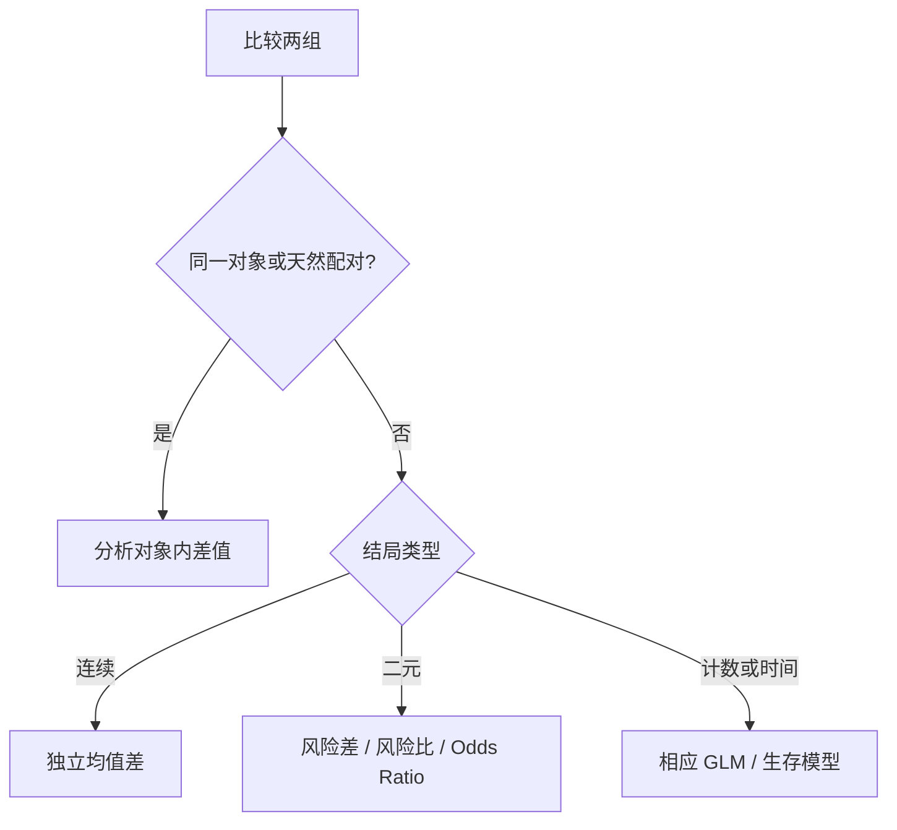

# 组间比较：独立、配对和比例不能混着算

“A 组是否优于 B 组”在统计上不是一种题。先判断观测如何配对、结局是什么类型，再决定估计量和标准误。

## 第一问永远是数据结构

## 两个独立均值：默认 Welch t

估计目标：

$$
\Delta=\mu_1-\mu_2,\qquad
\hat\Delta=\bar x_1-\bar x_2
$$

标准误：

$$
\operatorname{SE}(\hat\Delta)
=\sqrt{\frac{s_1^2}{n_1}+\frac{s_2^2}{n_2}}
$$

Welch 方法不要求两组方差相等，样本量不平衡时尤其重要。不要先做一个低功效的方差齐性检验，再根据其 p 值切换方法。

两组观测必须彼此独立。若一个用户贡献多行、用户位于同一门店或班级，普通标准误会过小。

## 配对比较：先算每对差值

设：

$$
d_i=x_{i,A}-x_{i,B}
$$

问题转成检验 $E(D)=0$。标准误为 $s_d/\sqrt n$。配对消除了稳定的个体差异，通常提高精度。

配对是否有价值取决于对内相关。把配对数据当独立会丢信息；把不相关对象强行配对则没有理论依据。

## 二元结局至少有三种效应尺度

设处理组风险 $p_1$，对照组风险 $p_0$。

风险差：

$$
RD=p_1-p_0
$$

风险比：

$$
RR=\frac{p_1}{p_0}
$$

优势比：

$$
OR=\frac{p_1/(1-p_1)}{p_0/(1-p_0)}
$$

当结局少见时 OR 近似 RR；结局常见时 OR 会比 RR 更远离 1，不能把二者混讲。

例：转化率从 10% 到 15%：

$$
RD=5\text{ 个百分点},\quad RR=1.5,\quad OR\approx1.59
$$

三者都对，但回答不同问题。实际决策通常还关心 number needed to treat：

$$
NNT=\frac{1}{|RD|}
$$

## 2×2 表把原始计数保留下来

| | 结局有 | 结局无 |
|---|---:|---:|
| 处理组 | $a$ | $b$ |
| 对照组 | $c$ | $d$ |

$$
\widehat{OR}=\frac{ad}{bc}
$$

样本足够时可用比例 z 检验或卡方检验；期望格数很小时用 Fisher 精确检验。Fisher 的“精确”是指零假设下概率计算精确，不代表研究设计没有偏差。

## 相对变化容易夸张，绝对变化不能省

从 1% 提高到 2% 可以说“增长 100%”，也可以说“增加 1 个百分点”。前者突出相对规模，后者对应每百人多 1 人。完整报告应同时给：

- 各组原始分母和事件数
- 各组比例
- 绝对差与区间
- 相对效应与区间

## 基线不平衡时不要比较各自前后 p 值

“处理组前后显著、对照组前后不显著”不代表两组变化显著不同。应直接检验组别与时间的交互，或比较变化量：

$$
(\bar x_{1,\text{后}}-\bar x_{1,\text{前}})
-
(\bar x_{0,\text{后}}-\bar x_{0,\text{前}})
$$

随机实验有连续基线测量时，常用 ANCOVA：

$$
Y_{\text{后}}=\beta_0+\beta_1T+\beta_2Y_{\text{前}}+\varepsilon
$$

它通常比直接比较变化量更精确。

## 比较前写清 estimand

同一句“处理效果”可能指：

- 所有随机分组对象的 intention-to-treat effect
- 实际接受处理者的 per-protocol effect
- 全体人群的平均效应
- 某类用户的条件效应
- 风险差、风险比或 odds ratio

数据分析方法不能替你选择目标。先写一句完整的 estimand，再计算。

**两组比较的难点不在 t 还是 z，而在谁和谁可比、观测是否独立、效应该落在哪个尺度上。**
