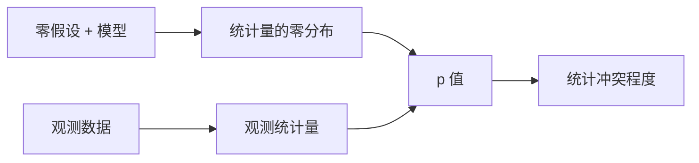

# 假设检验：p 值只衡量与零假设的冲突

假设检验把一个可反驳的零假设放在台上，问：**若零假设和分析假设都成立，当前或更极端的数据有多罕见？** 它不计算零假设为真的概率。

## 一次检验的六个部件

1. 写出 estimand 与零假设 $H_0$
2. 写出备择假设 $H_1$
3. 选择检验统计量
4. 在 $H_0$ 下得到统计量分布
5. 计算 p 值或临界区域
6. 把结论翻译回效应大小与实际问题

## p 值是什么

若统计量越大越反对 $H_0$，则：

$$
p=P_{H_0}(T\ge T_{\mathrm{obs}})
$$

双侧检验要把与 $H_0$ 同样或更冲突的两侧都算进去。p 值不是：

- $P(H_0\mid\text{data})$
- 结果由随机造成的概率
- 效应大小
- 研究可重复的概率

## 第一类和第二类错误

| 真实情况 | 不拒绝 $H_0$ | 拒绝 $H_0$ |
|---|---|---|
| $H_0$ 为真 | 正确 | 第一类错误，概率 $\alpha$ |
| $H_1$ 为真 | 第二类错误，概率 $\beta$ | 正确，功效 $1-\beta$ |

降低 $\alpha$、样本量不变时，通常会提高 $\beta$。没有免费的“更严格”。

功效取决于真实效应、样本量、噪声、显著性水平和检验方向。研究前做功效分析，应输入**最小实际重要效应**，不是猜一个方便达到显著的效应。

## 单侧还是双侧必须在看数据前决定

单侧检验把全部 $\alpha$ 放在一边，检测该方向更有力；代价是另一方向即使很大也不按预设规则显著。

只有当反方向效应在科学上等同于“无效”且事先声明，单侧才合理。看见结果方向后再改成单侧，会把第一类错误翻倍。

## 不拒绝不等于证明相等

$p>0.05$ 可能来自：

- 真正没有效应
- 样本太小
- 测量噪声太大
- 检验假设不合适

若目标是证明“差异小到可忽略”，要做等效性检验。先给出实际等效界值 $[-\Delta,\Delta]$，再用 two one-sided tests（TOST）检验整个区间是否落入该范围。

## 统计显著不等于实际重要

大样本能让极小效应得到很小 p 值。报告至少包括：

$$
\text{效应估计}+\text{置信区间}+\text{p 值}+\text{实际阈值}
$$

例如转化率提高 0.02 个百分点，即使 $p<0.001$，也可能抵不过上线成本。

## 多重比较会制造偶然显著

独立做 $m$ 个 $\alpha=0.05$ 检验，至少一次假阳性的概率为：

$$
1-(1-0.05)^m
$$

$m=20$ 时约为 64%。常用控制方法：

- Bonferroni：每个检验用 $\alpha/m$，控制 family-wise error rate
- Holm：逐步 Bonferroni，通常更有力
- Benjamini–Hochberg：控制 false discovery rate，适合大量探索

最好的防线仍是事先区分主要结局、次要结局和探索分析。

## 常见检验是一套同构问题

| 问题 | 常用方法 | 核心假设 |
|---|---|---|
| 单个均值与基准比较 | 单样本 t | 独立；小样本时近似正态 |
| 两个独立均值 | Welch t | 两组独立 |
| 配对前后差 | 配对 t | 差值独立 |
| 单个/两个比例 | 二项检验、比例检验 | Bernoulli 结构 |
| 类别是否关联 | 卡方 / Fisher | 独立计数 |
| 多组均值 | ANOVA / Welch ANOVA | 误差结构合适 |

## 可选停止会让 p 值失真

每收一点数据就检验，显著便停止，会使实际第一类错误超过 $\alpha$。解决办法是：

- 预先固定样本量
- 使用序贯检验与 alpha spending
- 明确写出中期分析次数和停止规则

## 一份不误读的结论模板

> 两组均值差估计为 2.1（95% CI 0.4–3.8，Welch t 检验 $p=0.016$）。数据与“均值完全相等”有冲突；区间显示真实差异可能很小，也可能达到预设的 3 单位实际阈值。

**p 值负责检验一个零点，不负责替你判断效应是否重要、研究是否可靠、结论是否能推广。**
