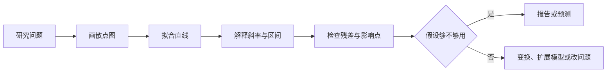

# 简单线性回归：一条线不只用来预测

简单线性回归用一条直线概括两个数值变量的平均关系。**斜率回答 $X$ 每增加一个单位时，$Y$ 的条件均值平均改变多少；它不自动回答因果问题。**



## 模型描述的是条件均值

对第 $i$ 个观测，模型写成：

$$
Y_i=\beta_0+\beta_1X_i+\varepsilon_i
$$

等价地，条件均值是：

$$
E(Y_i\mid X_i=x)=\beta_0+\beta_1x
$$

- $\beta_0$ 是 $X=0$ 时 $Y$ 的平均值
- $\beta_1$ 是 $X$ 增加 1 单位时 $Y$ 平均变化的量
- $\varepsilon_i$ 是直线没有解释的个体偏离

截距只有在 $X=0$ 有实际意义且接近数据范围时才值得解释。把 $X$ 中心化为 $X-\bar X$，截距就变成 $X$ 取样本均值时的预测均值。

## 最小二乘让残差平方和最小

给定拟合值与残差：

$$
\hat Y_i=b_0+b_1X_i,\qquad e_i=Y_i-\hat Y_i
$$

普通最小二乘选择 $b_0,b_1$，使残差平方和最小：

$$
\operatorname{SSE}=\sum_{i=1}^n e_i^2
$$

简单回归的解为：

$$
b_1=
\frac{\sum_i(X_i-\bar X)(Y_i-\bar Y)}
{\sum_i(X_i-\bar X)^2},
\qquad
b_0=\bar Y-b_1\bar X
$$

斜率也可写成 $b_1=r\,s_Y/s_X$。相关系数没有单位；斜率有“$Y$ 单位 / $X$ 单位”，换量纲会改变数值。

## $R^2$ 是样本内解释比例

总平方和分解为：

$$
\underbrace{\sum_i(Y_i-\bar Y)^2}_{\operatorname{SST}}
=
\underbrace{\sum_i(\hat Y_i-\bar Y)^2}_{\operatorname{SSR}}
+
\underbrace{\sum_i(Y_i-\hat Y_i)^2}_{\operatorname{SSE}}
$$

含截距的普通最小二乘下：

$$
R^2=\frac{\operatorname{SSR}}{\operatorname{SST}}
=1-\frac{\operatorname{SSE}}{\operatorname{SST}}
$$

$R^2$ 高不代表直线正确、预测误差小或关系有因果性；$R^2$ 低也不代表斜率没有实际意义。它只说明这条线在当前样本中解释了多少 $Y$ 的离均差平方。

## 斜率的不确定性来自残差和 $X$ 的信息量

若误差独立、均值为 0、方差恒为 $\sigma^2$，残差方差估计为：

$$
s^2=\frac{\operatorname{SSE}}{n-2}
$$

斜率标准误为：

$$
\operatorname{SE}(b_1)=
\frac{s}{\sqrt{\sum_i(X_i-\bar X)^2}}
$$

斜率的 $(1-\alpha)$ 置信区间是：

$$
b_1\pm t_{n-2,\,1-\alpha/2}\operatorname{SE}(b_1)
$$

检验 $H_0:\beta_1=0$ 使用 $t=b_1/\operatorname{SE}(b_1)$，自由度为 $n-2$。样本很大时，极小但无实际意义的斜率也可能显著——同时报告区间和业务尺度。

## 均值区间和个体预测区间不是一回事

在 $X=x_0$ 处，预测均值为 $\hat y_0=b_0+b_1x_0$。其标准误为：

$$
\operatorname{SE}_{\text{mean}}=
s\sqrt{\frac1n+
\frac{(x_0-\bar X)^2}{\sum_i(X_i-\bar X)^2}}
$$

新个体预测还包含自身误差：

$$
\operatorname{SE}_{\text{pred}}=
s\sqrt{1+\frac1n+
\frac{(x_0-\bar X)^2}{\sum_i(X_i-\bar X)^2}}
$$

所以预测区间总比同一点的均值置信区间宽。$x_0$ 越远离 $\bar X$，两种区间都越宽；跑出观测范围的外推尤其危险。

## 残差图决定直线能不能信

```echarts
{
  "title": {"text": "三种残差形状", "left": "center"},
  "tooltip": {},
  "grid": [
    {"left": "7%", "right": "69%", "top": 55, "bottom": 35},
    {"left": "38%", "right": "38%", "top": 55, "bottom": 35},
    {"left": "69%", "right": "7%", "top": 55, "bottom": 35}
  ],
  "xAxis": [
    {"gridIndex": 0, "type": "value", "name": "理想"},
    {"gridIndex": 1, "type": "value", "name": "弯曲"},
    {"gridIndex": 2, "type": "value", "name": "漏斗"}
  ],
  "yAxis": [
    {"gridIndex": 0, "type": "value", "min": -4, "max": 4},
    {"gridIndex": 1, "type": "value", "min": -4, "max": 4},
    {"gridIndex": 2, "type": "value", "min": -4, "max": 4}
  ],
  "series": [
    {"type": "scatter", "xAxisIndex": 0, "yAxisIndex": 0, "data": [[1,-1],[2,1],[3,-0.5],[4,0.7],[5,-0.8],[6,0.4],[7,0.9],[8,-0.7]]},
    {"type": "scatter", "xAxisIndex": 1, "yAxisIndex": 1, "data": [[1,3],[2,1],[3,-1],[4,-2],[5,-2],[6,-1],[7,1],[8,3]]},
    {"type": "scatter", "xAxisIndex": 2, "yAxisIndex": 2, "data": [[1,-0.2],[2,0.3],[3,-0.7],[4,1],[5,-1.4],[6,2],[7,-2.5],[8,3]]}
  ]
}
```

- 线性：残差对拟合值不应留下弧线或系统趋势
- 同方差：残差带宽不应随拟合值明显扩大或缩小
- 独立：时间、空间或同一对象内的残差不应成串相关
- 正态性：主要影响小样本区间与检验，不是拟合直线的前提
- 异常与影响：同时看标准化残差、杠杆值和 Cook 距离

高杠杆点的 $X$ 很极端；大残差点的 $Y$ 离直线远；影响点是删掉后会明显改变拟合的观测。三者不是同义词，也不能见到就删除。

!!! warning "稳健标准误只修正一部分问题"
    异方差稳健标准误可改善区间与检验，却不会把弯曲关系变直，也不会修复混杂、测量错误或外推。

## 一个可复核的解释模板

“在观测到的 $X$ 范围内，$X$ 每增加 1 单位，$Y$ 的平均值估计变化 $b_1$ 单位，95% CI 为 $[L,U]$。模型的样本内 $R^2$ 为某值；残差检查未见明显弯曲，但高值端方差稍大。”

这段话没有偷换成“$X$ 导致 $Y$”，也没有把 $p$ 值当效应大小。

## 常见误区

- 相关显著就说因果——混杂、反向因果和选择机制仍在
- 只报 $R^2$——读者不知道方向、量级和不确定性
- 在样本范围外延长直线——模型没有见过那里的关系
- 残差不正态就宣布回归无效——先判断推断目标和样本量
- 自动删除影响点——先核对数据，再报告敏感性分析
- 把均值置信区间当个体预测区间——后者多一个个体误差

## 交付前检查

1. 散点图是否支持“平均关系近似直线”？
2. 斜率的单位、方向和实际量级是否写清？
3. 区间是斜率区间、均值区间还是个体预测区间？
4. 残差是否有弯曲、漏斗、聚类或时间结构？
5. 结论是否由少数高杠杆点驱动？
6. 预测是否落在观测到的 $X$ 范围内？
7. 因果措辞是否有设计依据？

**先把线当作平均关系，再用残差检查这句平均话有没有撒谎。**
