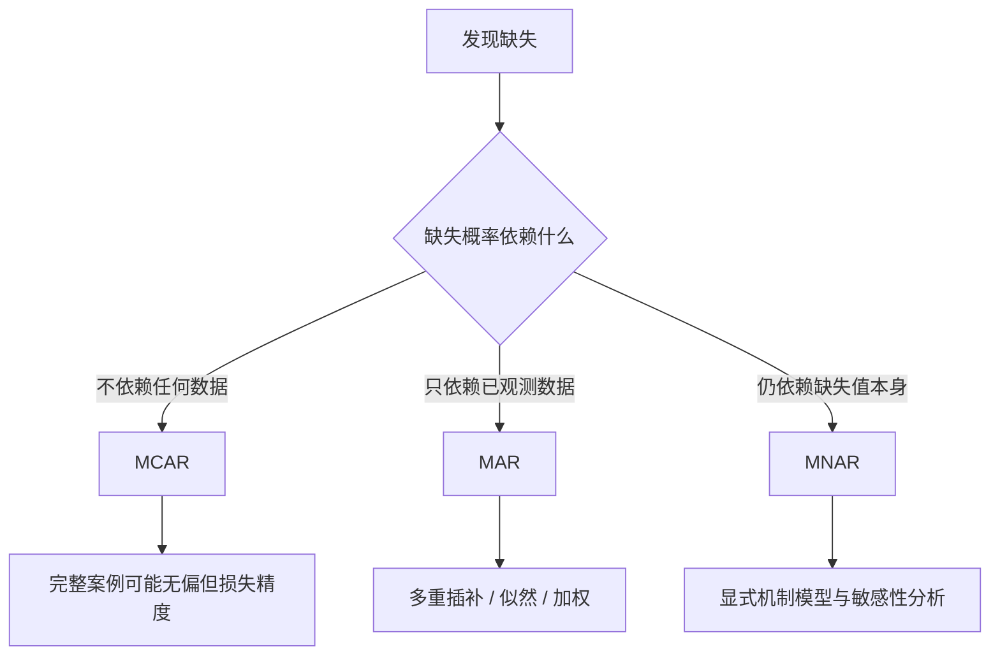
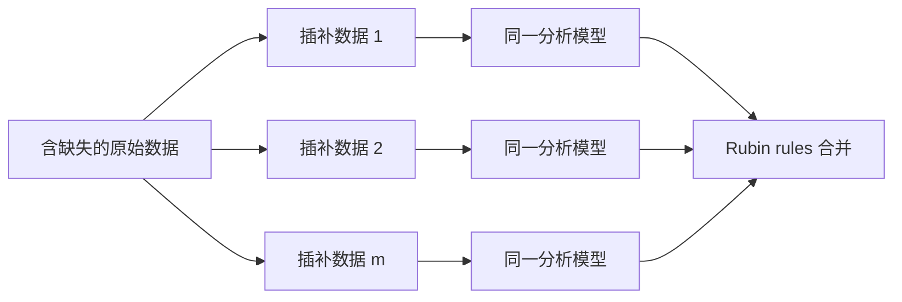

# 缺失数据：先解释为什么没观测到

缺失不是表格里的空白字符，而是一个数据生成过程。**处理方法取决于“缺失概率与什么有关”，不是取决于缺失比例看起来大不大。**
## 用缺失指示变量描述机制

令 $Y$ 是本应观测的变量，$R=1$ 表示已观测，$R=0$ 表示缺失。再把完整数据分成已观测部分 $Y_{\mathrm{obs}}$ 和缺失部分 $Y_{\mathrm{mis}}$。

三种机制是关于概率分布的假设：

### MCAR：完全随机缺失

$$P(R\mid Y_{\mathrm{obs}},Y_{\mathrm{mis}}) = P(R)$$

例子：一批问卷因随机运输事故丢失。完整案例仍可代表原样本，但有效样本量下降。

### MAR：随机缺失

$$P(R\mid Y_{\mathrm{obs}},Y_{\mathrm{mis}}) = P(R\mid Y_{\mathrm{obs}})$$

例子：高龄受访者更容易漏答收入，但年龄已完整记录。给定年龄后，缺失概率不再依赖未报告收入。

### MNAR：非随机缺失

给定已观测信息后，缺失概率仍与缺失值本身有关。例子：高收入者即使在同年龄、同职业内也更不愿报告收入。

MCAR、MAR、MNAR 不能只靠观测数据完全区分。机制判断需要采集流程、领域知识和敏感性分析。
## 第一步是画出缺失模式

先做三张表：

1. 每个变量的缺失数和缺失率
2. 每种缺失组合的频数
3. 缺失与已观测变量、处理组和结果代理变量的关系

还要核对特殊编码。`-9`、`999`、空字符串和“未适用”可能被错误当成真实值；结构性不适用也不等于随机缺失。

只报告“总体缺失 8%”不够。一个关键结果变量缺失 8%，与八十个变量各随机缺一点，分析后果完全不同。
## 完整案例分析要求比想象中强

完整案例分析删除任一分析变量缺失的行。它简单、可复现，但可能损失大量信息。

若用于回归，完整案例估计无偏的条件不一定要求全局 MCAR；更准确的条件取决于缺失如何与结果和协变量关联。但把“删掉就行”当默认做法，通常无法说明条件是否满足。

完整案例还可能改变目标人群。若老年人更常缺失，最终估计描述的是较年轻、数据完整的人。
## 单次填补低估不确定性

用均值、中位数或一次回归预测填补，会把猜测值当成真实观测：

- 边际方差被压小
- 变量间关系被扭曲
- 标准误通常偏小
- 填补模型的不确定性消失

缺失指示变量加常数填补在纯预测中有时有用，但不自动给出无偏的解释性或因果效应。

末次观测结转把后续值固定为最后一次观测，隐含“退出后不再变化”的强假设。纵向数据中通常不可信。
## 多重插补保留填补不确定性

多重插补生成 $m$ 份完整数据：

第 $j$ 份数据得到估计 $Q_j$ 和方差 $U_j$。合并估计为：

$$\bar Q=\frac1m\sum_{j=1}^m Q_j$$

插补内方差与插补间方差为：

$$\bar U=\frac1m\sum_j U_j,\qquad B=\frac1{m-1}\sum_j(Q_j-\bar Q)^2$$

总方差是：

$$T=\bar U+\left(1+\frac1m\right)B$$

第二项把“不同合理填补会给出不同答案”计入不确定性。

插补模型应包含分析模型中的结果、处理、协变量、交互和非线性项，还可加入与缺失或缺失值相关的辅助变量。插补必须发生在 bootstrap 或交叉验证的每个训练样本内部，不能先用全数据插补再评估预测。
## 似然与加权提供其他路线

在 MAR 和模型正确时，最大似然可直接利用每个单位已观测到的部分。线性混合模型常用于不平衡纵向数据，不需要把每条轨迹先补齐。

逆概率观测加权先估计 $\pi_i=P(R_i=1\mid X_i)$，再令已观测单位权重为：

$$w_i=\frac1{\hat\pi_i}$$

它把较难被观测到的单位放大。极端权重会增加方差，应检查重叠、截断策略和加权后平衡。

多重插补主要建模缺失值，加权主要建模观测机制。二者都依赖没有遗漏关键预测变量。
## MNAR 必须做敏感性分析

MNAR 无法仅靠已观测数据修复。常见做法包括：

- pattern-mixture：按缺失模式建模，再对未观测部分施加偏移
- selection model：联合建模结果与缺失概率
- delta adjustment：把 MAR 插补值统一上调或下调 $\delta$
- tipping point：寻找结论刚好翻转所需的偏移强度

例如把所有未观测收入的插补值增加 10%、20%、30%，观察均值差或回归系数何时改变方向。重点不是选一个“正确 $\delta$”，而是展示结论对不可验证假设的依赖。
## 缺失发生在结果、处理和协变量时问题不同

结果缺失主要削弱结果比较，并可能导致失访偏差。处理缺失会让暴露定义不清，不能只当普通协变量插补。协变量缺失既影响精度，也可能破坏混杂调整。

删失也不是一般缺失。生存分析中只知道事件时间超过某个点，应使用删失模型保留这条信息，不能把它当成普通空值。
## 常见误区

- 缺失率低于 5% 就可忽略 → 偏差取决于机制和位置，不只取决于比例
- 检验 MCAR 不显著就证明 MCAR → 低功效与未观测部分使这种证明不成立
- 插补次数固定用 5 次 → 缺失信息高时需要更多插补，并检查 Monte Carlo 误差
- 插补后只分析一份数据 → 丢掉插补间不确定性
- 把结果变量排除在插补模型外 → 常削弱变量关系并造成不相容
- 插补值看着合理就够了 → 还要检查分布、关系、收敛和最终估计的敏感性
## 缺失数据检查清单

1. 缺失编码、结构性不适用和真实缺失是否区分？
2. 是否报告变量缺失率、组合模式和退出时间？
3. 缺失机制在当前流程中为何可能是 MCAR、MAR 或 MNAR？
4. 所选方法的假设是否与 estimand 和分析模型相容？
5. 多重插补是否包含结果、处理、交互、非线性和辅助变量？
6. 插补、加权或似然模型的诊断是否完成？
7. 是否用 MNAR 情景或 tipping point 展示结论稳健性？

**缺失数据分析的目标不是把表格填满，而是让未观测部分带来的不确定性诚实地进入结论。**
