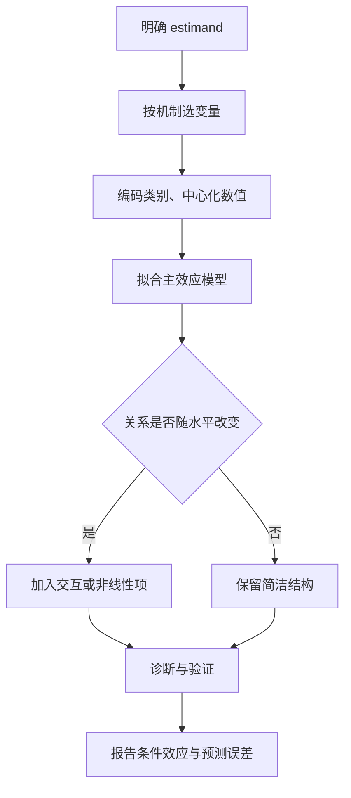

# 多元回归：系数是“其他变量不变时”的条件差异

多元线性回归把多个预测变量放进同一个条件均值模型。**每个系数都依赖模型里还有谁、变量怎么编码，以及“其他变量不变”是否真的有意义。**



## 矩阵公式把所有系数放在一起

含 $p$ 个预测变量的模型为：

$$
Y_i=\beta_0+\beta_1X_{i1}+\cdots+\beta_pX_{ip}+\varepsilon_i
$$

写成矩阵形式：

$$
\mathbf y=\mathbf X\boldsymbol\beta+\boldsymbol\varepsilon
$$

若设计矩阵 $\mathbf X$ 满列秩，普通最小二乘解为：

$$
\hat{\boldsymbol\beta}
=(\mathbf X^\mathsf T\mathbf X)^{-1}\mathbf X^\mathsf T\mathbf y
$$

在同方差、独立误差下：

$$
\widehat{\operatorname{Var}}(\hat{\boldsymbol\beta})
=s^2(\mathbf X^\mathsf T\mathbf X)^{-1},
\qquad
s^2=\frac{\operatorname{SSE}}{n-p-1}
$$

这条公式解释了两个事实：预测变量越缺少独立变化，系数越不稳定；参数越多，残差自由度越少。

## 系数解释必须钉住条件

对连续变量 $X_j$，$\beta_j$ 表示其他入模变量保持不变时，$X_j$ 增加 1 单位对应的 $Y$ 条件均值变化。

这个“保持不变”可能只是数学比较。例如年龄增加一年而工龄完全不变，在某些人群中很少发生。解释前要检查该比较是否落在数据支持的组合范围内。

类别变量通常用虚拟变量编码。若“渠道”有自然流量、广告、转介绍三类，以自然流量为参考组，则两个系数分别表示广告与转介绍相对参考组的条件均值差。**参考组改变会改系数写法，不会改变整套拟合值。**

## 加入控制变量不等于自动去除混杂

变量角色要由研究机制决定：

- 混杂变量：同时影响暴露与结果，通常需要控制
- 中介变量：位于暴露到结果的因果路径上，控制后 estimand 会改变
- 碰撞变量：由两个变量共同导致，控制它可能制造关联
- 精度变量：解释结果但不造成混杂，可缩小标准误

“把能拿到的变量都塞进去”不是控制混杂。若目标是因果效应，先画因果结构，再决定调整集；若目标是预测，则优先用样本外表现评价。

## 交互表示一个效应随另一个变量改变

含交互的模型：

$$
E(Y\mid X,Z)=\beta_0+\beta_1X+\beta_2Z+\beta_3XZ
$$

$X$ 的边际斜率为：

$$
\frac{\partial E(Y\mid X,Z)}{\partial X}
=\beta_1+\beta_3Z
$$

所以 $\beta_1$ 只是在 $Z=0$ 时的 $X$ 效应。把 $Z$ 中心化可让主效应落在更有意义的参考点。加入 $XZ$ 后，通常保留 $X$ 和 $Z$ 两个低阶项——层级原则让解释和坐标变换更稳定。

```echarts
{
  "title": {"text": "交互：X 的斜率随 Z 改变", "left": "center"},
  "tooltip": {"trigger": "axis"},
  "legend": {"top": 30, "data": ["Z 低", "Z 高"]},
  "xAxis": {"type": "value", "name": "X", "min": 0, "max": 10},
  "yAxis": {"type": "value", "name": "预测 Y"},
  "series": [
    {"name": "Z 低", "type": "line", "data": [[0,3],[2,4],[4,5],[6,6],[8,7],[10,8]], "showSymbol": false},
    {"name": "Z 高", "type": "line", "data": [[0,2],[2,4],[4,6],[6,8],[8,10],[10,12]], "showSymbol": false}
  ]
}
```

交互显著时，不要只报 $\beta_3$。报告几个有实际意义的 $Z$ 水平下的简单斜率或预测均值及其区间。

## 非线性项让“每增加一单位”不再恒定

二次模型写成：

$$
E(Y\mid X)=\beta_0+\beta_1X+\beta_2X^2
$$

此时局部斜率为 $\beta_1+2\beta_2X$。$\beta_1$ 只代表 $X=0$ 处的斜率，不能概括全范围。多项式高次项容易在边界剧烈摆动；需要灵活曲线时，可用 spline，并用图展示预测曲线与区间。

对数变换会改变解释：

| 模型 | 小变化下的近似解释 |
|---|---|
| $Y=\beta_0+\beta_1X$ | $X$ 加 1，$Y$ 加 $\beta_1$ |
| $\log Y=\beta_0+\beta_1X$ | $X$ 加 1，$Y$ 约变化 $100\beta_1\%$ |
| $Y=\beta_0+\beta_1\log X$ | $X$ 增加 1%，$Y$ 约变化 $0.01\beta_1$ |
| $\log Y=\beta_0+\beta_1\log X$ | $X$ 增加 1%，$Y$ 约变化 $\beta_1\%$ |

当 $\beta_1$ 不小时，半对数模型的精确百分比变化是 $100(e^{\beta_1}-1)\%$。

## 共线性放大标准误，不必破坏预测

共线性是预测变量之间高度线性相关。它让单个系数依赖少量独立信息，表现为：

- 系数标准误大、符号随样本或变量集改变
- 整体 $F$ 检验显著，单个 $t$ 检验却不稳定
- 样本内拟合尚可，但无法可靠拆分各变量贡献

对第 $j$ 个预测变量：

$$
\operatorname{VIF}_j=\frac{1}{1-R_j^2}
$$

$R_j^2$ 来自用其他预测变量回归 $X_j$。VIF 是诊断线索，不是机械删除阈值。若两个变量本就代表同一构念，可合成指标、预先选择或用 ridge；若它们是必需混杂变量，不应仅因 VIF 高就删除。

## 模型选择要服务于目标

用于解释时，变量与函数形式应尽量在看结果前由理论、设计和 estimand 决定。逐步回归反复试探同一数据，会让 $p$ 值偏乐观、系数不稳定。

用于预测时，把数据探索、调参和最终评估分开：


调整 $R^2$ 为：

$$
\bar R^2=
1-\frac{\operatorname{SSE}/(n-p-1)}
{\operatorname{SST}/(n-1)}
$$

它会惩罚无效变量，但仍是样本内指标。预测任务还要报告交叉验证 RMSE、MAE 或与业务损失一致的指标。

## 诊断要检查模型，也要检查数据结构

- 画残差对拟合值：查非线性与异方差
- 按时间、门店、用户画残差：查依赖与聚类
- 查杠杆值与 Cook 距离：找驱动系数的观测
- 比较删点前后结果：做敏感性分析，不静默删点
- 检查类别的稀疏水平：避免少数样本决定虚拟变量系数
- 检查缺失机制：完整案例分析可能改变目标人群
- 检查外推：多维空间里每个变量都在范围内，也可能是从未出现的组合

## 常见误区

- 系数变小就说原关系是假的——可能是混杂，也可能控制了中介
- 主效应不显著就删掉，但保留交互——破坏层级和可解释性
- VIF 高就逐个删变量——目标与变量角色比阈值重要
- 训练集 $R^2$ 高就说预测好——复杂模型必然更会贴训练数据
- 自动 stepwise 后照常解释 $p$ 值——选择过程已用过同一随机波动
- 标准化系数最大就叫“最重要”——量表、相关结构和目标都会改变排名

## 交付前检查

1. estimand 是预测、条件关联还是因果效应？
2. 每个变量为何进入模型，参考组是什么？
3. 连续变量的函数形式是否画图检查过？
4. 交互项是否配了具体水平下的预测或简单斜率？
5. 共线性是否让系数结论不稳定？
6. 标准误是否考虑异方差、聚类或重复测量？
7. 选择与评估是否使用了相互独立的信息？
8. 结论是否限制在数据支持的变量组合内？

**多元回归不是“控制得越多越可靠”；它是把研究问题翻译成一组明确的条件比较。**
