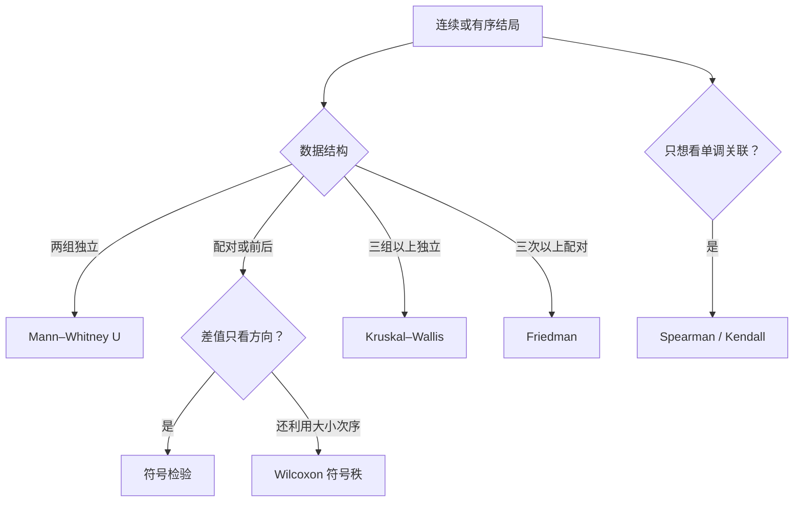

# 非参数方法：少依赖分布，不等于没有假设

非参数方法常把原始数值换成符号或秩，再比较位置或分布。它适合等级数据、明显偏态、离群值难以合理建模或样本很小时的稳健分析。**它少依赖正态分布，但仍依赖抽样、独立性、可交换性和研究设计。**

## 先问 estimand，再决定要不要排秩

非参数方法不是“正态性检验不显著时自动切换”的备用按钮。先写清目标：

- 比较均值——Welch t 或合适的回归仍可能直接回答问题
- 比较中位数——需要能识别中位数差的设计与方法
- 比较整个分布——秩检验可能更贴近问题
- 比较随机抽一人的相对大小——Mann–Whitney 的概率解释最直接

## Mann–Whitney U 比较两组观测的相对次序

合并两组数据并排序，给每个观测秩。若有并列值，使用平均秩。对第 1 组秩和 $R_1$：

$$
U_1=R_1-\frac{n_1(n_1+1)}2
$$

它可解释为跨组配对中，第 1 组观测大于第 2 组观测的次数，加上一半平局次数。概率效应量为：

$$
\hat A=P(X_1>X_2)+\frac12P(X_1=X_2)
=\frac{U_1}{n_1n_2}
$$

$\hat A=0.5$ 表示随机各抽一个时两者胜出的机会相同。它比只给 $p$ 值更容易解释。

!!! warning "Mann–Whitney 不总是中位数检验"
    它的零假设通常是两组分布相同。只有两组分布形状、离散程度相近，差异主要表现为平移时，才可把结果近似解释为位置或中位数差。

若一组更分散但中位数相同，Mann–Whitney 也可能检出差异。此时说“中位数显著不同”就是答非所问。

## 配对数据要在差值上工作

配对观测先计算：

$$
d_i=x_{i,\text{后}}-x_{i,\text{前}}
$$

符号检验只统计正差和负差。在连续且差值中位数为 0 的零假设下，正号个数服从二项分布：

$$
S_+\sim\operatorname{Binomial}(n,0.5)
$$

它几乎不使用差值大小，稳健但功效较低。大量零差值时，应预先说明如何处理平局。

Wilcoxon 符号秩检验给 $|d_i|$ 排秩，再按差值正负求秩和。它利用了大小次序，通常更有功效，但要求差值分布近似对称，且各对独立。

配对数据不能用 Mann–Whitney 代替符号秩检验——前者把两列当成独立样本，会丢掉对象内配对信息。

## 三组以上是同一逻辑的扩展

Kruskal–Wallis 检验把全部独立组的观测合并排秩，比较各组平均秩：

$$
H=\frac{12}{N(N+1)}
\sum_{j=1}^k\frac{R_j^2}{n_j}
-3(N+1)
$$

有并列秩时要做修正。拒绝零假设只说明至少一组分布不同，不指出哪两组不同。

事后比较要用 Dunn 等基于秩的方法，并调整多重比较。不要在总体检验显著后做一串未经调整的 Mann–Whitney 检验。

Friedman 检验用于同一对象在三个以上条件下的测量。它在每个对象内部排秩，保留了区组或重复测量结构。

## Spearman 和 Kendall 只抓单调关系

Spearman 相关是秩之间的 Pearson 相关：

$$
\rho_s=\operatorname{Corr}(\operatorname{rank}(X),\operatorname{rank}(Y))
$$

无并列秩时也可写成：

$$
\rho_s=1-\frac{6\sum_i d_i^2}{n(n^2-1)}
$$

Kendall $\tau$ 比较一致对与不一致对：

$$
\tau=\frac{C-D}{\binom n2}
$$

两者描述单调关联，不要求直线关系。U 形关系可能非常强，却得到接近 0 的秩相关；散点图仍然不能省。

## 小例子：中位数一样，结论却可能不同

两组评分：

$$
A=(1,5,5,5,9),\qquad B=(4,4,5,6,6)
$$

两组中位数都是 5，但 A 更分散。一个检验若识别到分布形状差异，不能被翻译成“中位数不同”。报告时应同时给：

- 每组样本量、中位数与四分位距
- 抖动散点、箱线图或经验分布
- 检验针对的零假设
- 概率效应量、Hodges–Lehmann 位置差或其他区间

## “非参数”不能回答的事

秩方法主动丢掉了原始单位和部分距离信息。它不能自动回答：

- 平均收入究竟相差多少元
- 药物让血压平均下降多少 mmHg
- 一个协变量如何改变原单位上的效应
- 复杂聚类、删失或缺失机制该如何处理
- 观察到的关联是否具有因果意义

若原单位上的效应是决策目标，可考虑稳健标准误、变换后的模型、分位数回归、广义线性模型或 bootstrap 区间。不要仅因有离群值就把科学问题换掉。

## 检验前检查假设

所有常见秩检验都要求抽样与测量过程可信。具体还要检查：

- 独立组内及组间观测是否独立
- 配对检验是否真的按同一对象或合理匹配形成对
- 等级尺度是否至少保留了有意义的顺序
- Mann–Whitney 是否被错误解释成中位数检验
- 符号秩检验的差值分布是否近似对称
- 并列值和零差值是否很多，软件使用了什么修正
- 多组事后比较是否控制了多重性

!!! tip "图先于检验"
    原始点、箱线图和经验分布能直接暴露偏态、离群值、平局和分布交叉。只看一个秩检验的 $p$ 值，会把这些差异压成同一个数字。

## 交付前检查清单

- [ ] 已写明比较均值、中位数、位置、分布还是随机胜出概率
- [ ] 独立样本、配对样本和重复测量没有混用
- [ ] 描述统计与图形保留了样本量和分布形状
- [ ] 报告了效应量与区间，不只报告 $p$ 值
- [ ] 并列、零差值和小样本采用了适当的精确或修正算法
- [ ] 多重比较已调整，事后分析与预设分析已区分
- [ ] 没把“少分布假设”写成“没有假设”

**非参数方法的价值是用较少的尺度和分布承诺回答一个更窄的问题；窄在哪里，必须在结果里说清。**
