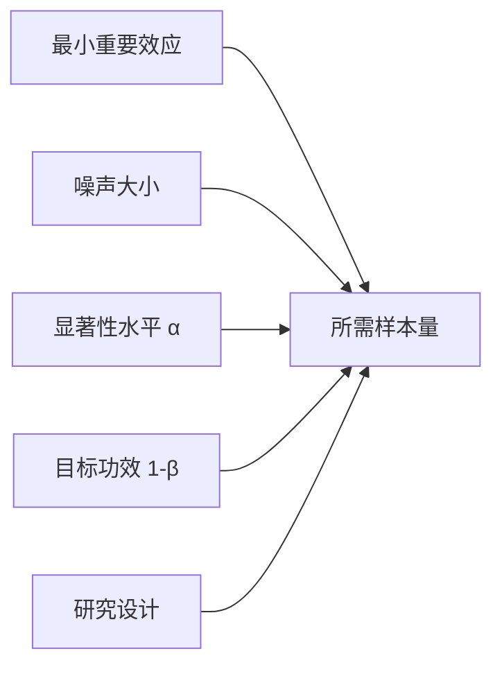

# 功效与样本量：研究开始前先定义多小算重要

样本量不是“越多越好”，也不能只由预算拍脑袋。设计时要把**最小实际重要效应、噪声、第一类错误和漏检风险**放进同一张账。

## 功效是在某个具体效应下拒绝零假设的概率

$$
\operatorname{Power}(\theta)
=P_\theta(\text{拒绝 }H_0)
=1-\beta(\theta)
$$

功效不是研究完成后给结果盖章的质量分。它是一个函数：真实效应不同，功效也不同。

## 五个量互相牵制

- 效应越小，所需样本越大
- 噪声越大，所需样本越大
- $\alpha$ 越小，所需样本越大
- 目标功效越高，所需样本越大
- 配对、分层和协变量若能解释噪声，可降低所需样本

## 先定最小实际重要效应

最小实际重要效应（minimum effect of interest, MEOI）是“再小就不值得改变决策”的效应。它应来自业务、临床、政策或成本边界，不应从历史数据里挑一个好达到的数字。

例如新流程每单节省 0.2 秒在统计上可检出，却不足以抵消开发成本；那么 0.2 秒不该成为设计目标。

## 两独立均值的粗略样本量

两组等样本量、共同标准差 $\sigma$、希望检测差异 $\Delta$，双侧检验可粗略写成每组：

$$
n\approx
\frac{2\sigma^2(z_{1-\alpha/2}+z_{1-\beta})^2}{\Delta^2}
$$

从公式能直接看到：

$$
n\propto\frac{\sigma^2}{\Delta^2}
$$

希望检测的效应缩小一半，样本量约变为四倍。

## 单个比例的精度设计

若目标是让比例 95% 区间半宽不超过 $E$：

$$
n\approx\frac{z_{0.975}^2p(1-p)}{E^2}
$$

$p$ 未知时用 $0.5$ 最保守。若从有限总体抽取较大比例、预计有无回答、采用整群抽样，还要分别做有限总体修正、膨胀无回答率和设计效应。

例如目标有效样本量 $n_0$，预计回答率 $r$：

$$
n_{\text{邀请}}\approx\frac{n_0}{r}
$$

## 聚类随机实验按设计效应膨胀

每群平均 $m$ 个单位、群内相关 $\rho$：

$$
\operatorname{DEFF}\approx1+(m-1)\rho
$$

个体随机设计需要 $n_0$ 时，粗略需要：

$$
n_{\text{cluster}}\approx n_0\times\operatorname{DEFF}
$$

群数比群内人数更关键。只有很少的群，即使总人数很多，群级效应仍难估准。

## 基线转化率和方差不能装作已知

历史数据给出的 $\sigma$、相关系数和基线比例本身也有不确定性。稳妥做法是：

- 用一个合理范围做敏感性分析
- 对关键参数取保守值
- 将流失、无效记录和多重比较计入
- 复杂设计用模拟而非硬套单一公式

## 期中偷看需要序贯设计

固定样本量检验假设只看一次。反复查看并在显著时停止会抬高假阳性率。需要提前选：

- group sequential design
- alpha spending function
- always-valid p-value / confidence sequence
- 贝叶斯停止规则及相应决策阈值

序贯设计可以提前成功或因无望而停止，但规则必须在看结果前写好。

## “观察功效”通常不提供新信息

把已观察效应代回功效公式得到 post hoc power，它几乎只是 p 值的单调变换：显著结果功效高，不显著结果功效低。它不能区分“真无效”与“样本不足”。

研究后应看：

- 效应估计
- 置信区间
- 区间相对实际阈值的位置
- 数据质量与假设

## 一份设计清单

1. 主要 estimand 和主要结局是否唯一且明确？
2. 最小实际重要效应由什么决策边界给出？
3. 方差、基线率、ICC 和流失率来自哪里？
4. 单侧/双侧、$\alpha$ 和目标功效是否事先确定？
5. 分层、配对、聚类和协变量是否进入计算？
6. 多个主要比较是否调整？
7. 是否会期中查看？停止规则是什么？
8. 最终样本量在悲观参数下是否仍够用？

**样本量计算不是为一个数字找公式；它是把研究值得检测什么、愿意承担哪类错误提前写清。**
