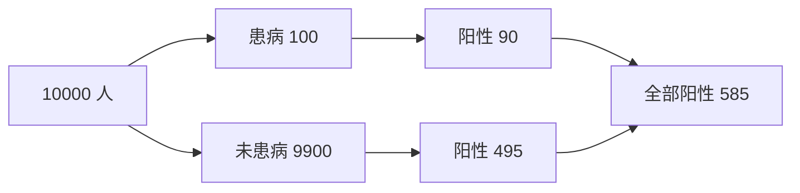

# 概率模型：把不确定性写成可计算的规则

概率模型不声称现实由公式生成。它用一组明确假设描述哪些结果可能出现、各有多大机会，再让统计推断可以检查。

## 样本空间、事件与概率

样本空间 $\Omega$ 包含一次随机过程的全部可能结果；事件 $A$ 是其中一个集合。概率满足：

$$
0\le P(A)\le1,\qquad P(\Omega)=1
$$

互斥事件 $A\cap B=\varnothing$ 时：

$$
P(A\cup B)=P(A)+P(B)
$$

一般情况下要减掉重复部分：

$$
P(A\cup B)=P(A)+P(B)-P(A\cap B)
$$

补事件给出 $P(A^c)=1-P(A)$。遇到“至少一次”，先算“一次也没有”通常更省力。

## 条件概率改变了参照总体

已知 $B$ 发生后，$A$ 的条件概率为：

$$
P(A\mid B)=\frac{P(A\cap B)}{P(B)}
$$

独立要求 $P(A\mid B)=P(A)$，等价于：

$$
P(A\cap B)=P(A)P(B)
$$

互斥和独立不是一回事。两个非零概率事件若互斥，一个发生就排除了另一个，反而不独立。

## 贝叶斯公式是倒转条件的记账法

$$
P(A\mid B)=
\frac{P(B\mid A)P(A)}
{P(B)}
$$

若 $A_1,\ldots,A_k$ 构成互斥且完备的划分：

$$
P(B)=\sum_jP(B\mid A_j)P(A_j)
$$

假设疾病患病率 1%，检测灵敏度 90%，假阳性率 5%。阳性后的患病概率不是 90%：

$$
P(D\mid +)=
\frac{0.90\times0.01}
{0.90\times0.01+0.05\times0.99}
\approx15.4\%
$$

基准率低时，少量假阳性也会淹没真阳性。

## 随机变量把结果映射成数

离散随机变量用概率质量函数 $p(x)=P(X=x)$；连续随机变量用密度 $f(x)$，区间概率是面积：

$$
P(a\le X\le b)=\int_a^b f(x)\,dx
$$

连续变量在单点的概率为 0；密度值可以大于 1，只要总面积为 1。

期望和方差为：

$$
E(X)=\sum_xxp(x)
$$

$$
\operatorname{Var}(X)=E[(X-E(X))^2]=E(X^2)-E(X)^2
$$

线性变换满足：

$$
E(aX+b)=aE(X)+b,\qquad
\operatorname{Var}(aX+b)=a^2\operatorname{Var}(X)
$$

无论是否独立，期望都可相加。方差相加还要处理协方差：

$$
\operatorname{Var}(X+Y)=\operatorname{Var}(X)+\operatorname{Var}(Y)+2\operatorname{Cov}(X,Y)
$$

## 大数定律与中心极限定理解决不同问题

大数定律说样本均值随 $n$ 增大趋近总体均值；中心极限定理说在适当条件下，标准化后的样本均值分布趋近正态：

$$
\frac{\bar X-\mu}{\sigma/\sqrt n}
\overset{d}{\longrightarrow}N(0,1)
$$

前者解释“为什么平均会稳定”，后者解释“稳定过程中的波动长什么样”。中心极限定理不保证原始数据近似正态；重尾、强依赖或方差不存在时也不能机械套用。

## 概率模型的三层检查

1. 随机对象是什么：一次用户转化、一天订单数，还是一个人的生存时间？
2. 哪些结构被假设：独立、同分布、固定成功率、固定方差？
3. 哪个现实机制会让假设失效：批次、季节、重复观测、选择偏差？

**模型不是现实的复印件；它是把假设暴露出来、允许计算也允许被数据推翻的工具。**
