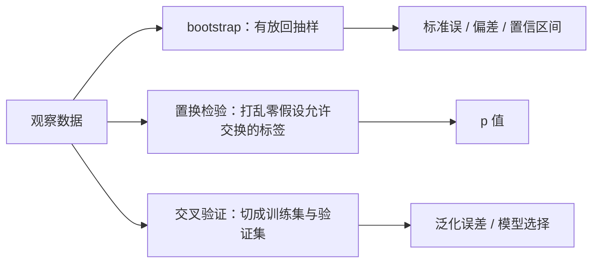
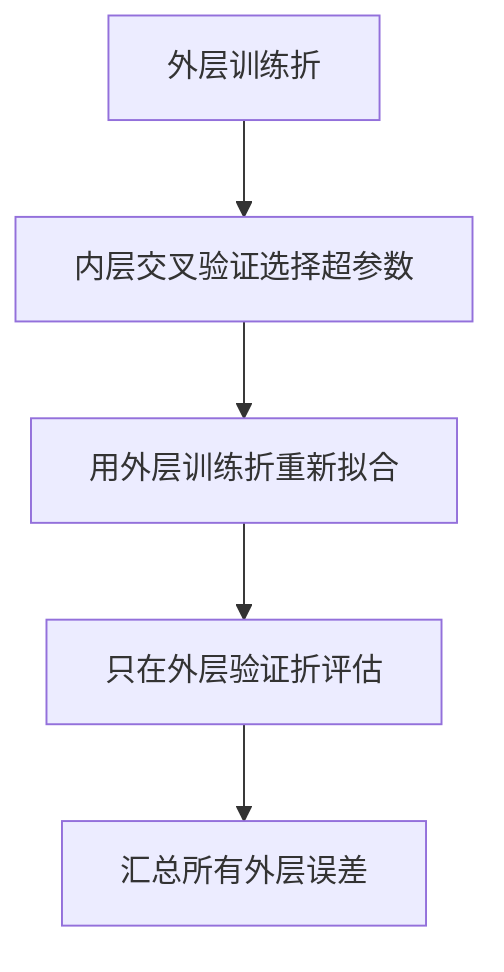

# 重抽样：用数据重建“如果再来一次”

重抽样不是一种单独的检验，而是一组反复重组数据的计算方法。bootstrap 近似估计量的抽样分布，置换检验近似零假设下的分布，交叉验证估计模型面对新数据的表现。**三者都在重复算，但“重复世界”的生成规则完全不同。**

## 先按问题选重抽样机制

| 方法 | 每次怎样重组 | 主要输出 | 核心条件 |
|---|---|---|---|
| bootstrap | 从观测单位有放回抽 $n$ 个 | 标准误、偏差、区间 | 样本能代表目标总体，重抽样单位正确 |
| 置换检验 | 在零假设允许的范围内打乱标签 | 零假设分布、$p$ 值 | 标签在零假设下可交换 |
| 交叉验证 | 轮流留出一部分，只用其余数据训练 | 样本外预测误差 | 划分模拟未来使用场景，无信息泄漏 |

## bootstrap 用经验分布替代未知总体

观测样本为 $x=(x_1,\ldots,x_n)$，统计量为 $\hat\theta=s(x)$。一次非参数 bootstrap：

1. 从 $x$ 中有放回抽取 $n$ 个观测，得到 $x^{*b}$。
2. 计算 $\hat\theta^{*b}=s(x^{*b})$。
3. 重复 $B$ 次，得到 bootstrap 分布。

bootstrap 标准误为：

$$
\widehat{\operatorname{SE}}_{\mathrm{boot}}=\sqrt{\frac{1}{B-1}\sum_{b=1}^{B}\left(\hat\theta^{*b}-\bar\theta^*\right)^2}
$$

其中 $\bar\theta^*=B^{-1}\sum_b\hat\theta^{*b}$。$B$ 只控制 Monte Carlo 噪声；把 $B$ 从 1,000 提到 100,000 不会修复原样本的偏差。

### 三种区间回答同一目标但近似不同

标准误区间：

$$
\hat\theta\pm z_{1-\alpha/2}
\widehat{\operatorname{SE}}_{\mathrm{boot}}
$$

百分位区间直接取 bootstrap 分布的分位数：

$$
\left[q_{\alpha/2}(\hat\theta^*),q_{1-\alpha/2}(\hat\theta^*)\right]
$$

BCa 区间进一步校正偏差和偏斜，通常比简单百分位区间稳妥，但实现更复杂。小样本、极端偏斜或边界参数下，任何 bootstrap 区间都要做覆盖率敏感性检查。

!!! warning "重抽样单位必须跟独立单位一致"
    同一用户有多行时不能逐行 bootstrap；门店内顾客相关时也不能把顾客当完全独立。应按用户、门店或原始抽样的 cluster 整块重抽。

时间序列不能任意逐点重抽，因为那会破坏自相关。常用 block bootstrap；区组长度要反映依赖范围。

## 置换检验生成的是零假设世界

两组均值差的观察统计量记为：

$$
T_{\mathrm{obs}}=\bar x_1-\bar x_0
$$

若零假设与随机分组设计允许交换组标签，就反复打乱标签并计算 $T^{*b}$。双侧 Monte Carlo $p$ 值可写成：

$$
p=\frac{1+\sum_{b=1}^{B}
I(|T^{*b}|\ge |T_{\mathrm{obs}}|)}
{B+1}
$$

分子、分母都加 1，避免有限次模拟得到不合理的 $p=0$。若枚举全部可能排列，就是精确随机化检验。

置换范围必须尊重设计：

- 配对实验——只在每一对内交换处理标签，或翻转差值符号
- 分层随机实验——只在层内置换
- cluster 随机实验——置换整个 cluster 的处理标签
- 时间数据——普通标签置换通常破坏时间结构

!!! note "可交换性比“分布自由”更关键"
    观察研究中，两组原本就可能因年龄、渠道等不同而不可交换。把标签随意打乱，构造出的零假设世界可能与研究设计不相容。

## bootstrap 区间与置换 p 值不要混成一件事

bootstrap 通常从经验分布重抽，保留数据中的组间差异，用来估计估计量会怎样波动。置换检验主动施加零假设，通过交换标签消除组别关联，用来判断观察统计量有多极端。

同一分析可以同时报告 bootstrap 区间和置换 $p$ 值，但两者的假设、重抽样方案与 estimand 必须分别写明。

## 交叉验证估计的是训练流程的样本外误差

$K$ 折交叉验证把数据分成 $K$ 份。第 $k$ 轮用其余 $K-1$ 份拟合模型，在第 $k$ 份计算损失：

$$
\widehat R_{\mathrm{CV}}=\frac1n\sum_{i=1}^nL\left(y_i,\hat f^{(-\operatorname{fold}(i))}(x_i)\right)
$$

每个验证预测都必须来自没有见过该观测的模型。预处理、缺失填补、特征选择、降维和调参也要放进每一折的训练流程。

### 调参和最终评估要分层

若用同一组交叉验证结果选择超参数，又把最小误差当最终性能，会产生选择乐观偏差。稳妥做法是 nested cross-validation：

数据划分要模拟部署：

- 同一用户多行——用 group K-fold，不能让同一用户跨训练与验证
- 预测未来——按时间前后切分，不能随机洗牌
- 类别极不平衡——分类任务可用 stratified K-fold 保持比例
- 空间或门店迁移——按空间块或门店留出，检验真正的外推

## 一个最小例子：三种方法各自回答什么

要比较 A、B 页面转化率并建立预测模型：

- bootstrap 用户级重抽——“转化率差的区间有多宽？”
- 在随机实验允许的范围内置换页面标签——“无处理效应时，这么大的差异有多反常？”
- 交叉验证整条建模流水线——“模型预测新用户时损失多大？”

把三种结果都叫“模型稳定性”会丢掉关键区别。报告应明确重抽样单位、重复次数、随机种子、统计量、划分规则和输出目标。

## 重抽样也救不了坏数据

重抽样默认现有数据包含目标世界的有效信息。以下问题不会因重复计算而消失：

- 覆盖偏差、无回答偏差和选择偏差
- 错误的独立单位或遗漏的 cluster
- 标签泄漏、未来信息进入训练集
- 样本极小，经验分布根本没有关键尾部
- 模型部署人群与训练样本发生分布漂移

参数边界、最大值、极端分位数等非光滑统计量也可能让普通 bootstrap 失效。此时要考虑参数 bootstrap、$m$ out of $n$ bootstrap、专用理论或模拟研究。

## 交付前检查清单

- [ ] 已写明是在估计区间、检验零假设还是评估预测
- [ ] 重抽样单位与原始独立单位一致
- [ ] 置换只发生在设计允许交换的范围内
- [ ] 交叉验证中的全部预处理都在训练折内拟合
- [ ] 调参与最终评估已分离，必要时使用 nested CV
- [ ] 时间、cluster、配对与分层结构没有被打散
- [ ] 报告重复次数、随机种子和 Monte Carlo 不确定性
- [ ] 没把大量重复当成修复偏差或小样本的办法

**重抽样的关键不是“重复很多次”，而是每次重组都忠实模拟你真正关心的那个世界。**
