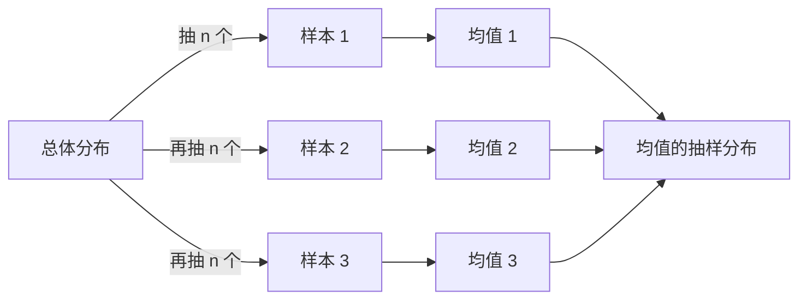
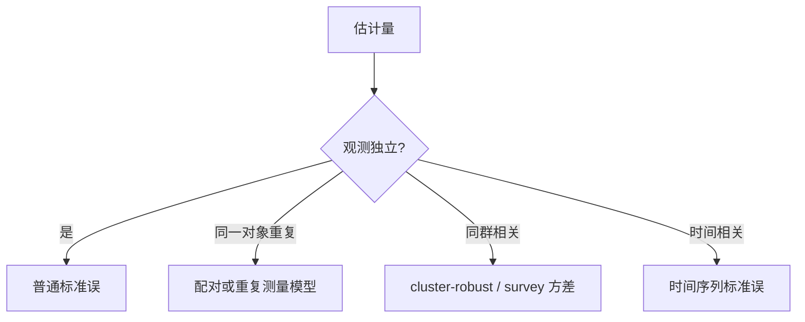

# 抽样分布：样本会变，统计量也会变

抽样分布不是样本中原始数据的分布。它描述**从同一总体反复抽样时，一个统计量会怎样波动**，是标准误、置信区间和检验的共同底座。

## 三种分布不要混

| 分布 | 随机对象 | 常见问题 |
|---|---|---|
| 总体分布 | 一个总体单位的值 $X$ | 个体值长什么样 |
| 样本分布 | 已观测的 $x_1,\ldots,x_n$ | 这批数据长什么样 |
| 抽样分布 | 统计量 $T(X_1,\ldots,X_n)$ | 换一批样本，统计量会怎样变 |

## 样本均值的期望与方差

独立同分布、总体均值 $\mu$、方差 $\sigma^2$ 时：

$$
E(\bar X)=\mu
$$

$$
\operatorname{Var}(\bar X)
=\operatorname{Var}\left(\frac1n\sum_iX_i\right)
=\frac{\sigma^2}{n}
$$

所以：

$$
\operatorname{SE}(\bar X)=\frac{\sigma}{\sqrt n}
$$

标准差描述个体差异，标准误描述估计量波动。数据本身不会因为样本量增大而更集中；均值的抽样分布会。

## 中心极限定理让均值可以近似正态

若观测独立同分布且方差有限：

$$
\frac{\bar X-\mu}{\sigma/\sqrt n}
\overset d\longrightarrow N(0,1)
$$

“$n\ge30$ 就正态”不是定理。所需样本量取决于偏态、尾部和依赖：

- 原总体正态：任意 $n$ 下样本均值都正态
- 轻度偏态：中等 $n$ 往往足够
- 极端偏态或重尾：可能需要很大 $n$
- 强相关、无限方差：普通中心极限定理可能失效

## 未知总体标准差带来 t 分布

现实中 $\sigma$ 通常未知，用样本标准差 $S$ 替代。总体正态时：

$$
T=\frac{\bar X-\mu}{S/\sqrt n}\sim t_{n-1}
$$

t 分布的尾部更厚，用来补偿估计 $\sigma$ 的额外不确定性。自由度增大后，$t$ 与标准正态越来越接近。

## 样本比例也是样本均值

令 $X_i\in\{0,1\}$ 表示成功，则：

$$
\hat p=\frac1n\sum_iX_i
$$

$$
E(\hat p)=p,\qquad
\operatorname{SE}(\hat p)=\sqrt{\frac{p(1-p)}{n}}
$$

当 $np$ 和 $n(1-p)$ 都不太小时，$\hat p$ 可近似正态。成功或失败很少时，应使用更可靠的二项区间，而不是机械套正态近似。

## 两个独立样本的差

两个独立均值之差：

$$
E(\bar X_1-\bar X_2)=\mu_1-\mu_2
$$

$$
\operatorname{SE}(\bar X_1-\bar X_2)
=\sqrt{\frac{\sigma_1^2}{n_1}+\frac{\sigma_2^2}{n_2}}
$$

两个比例之差同理：

$$
\operatorname{SE}(\hat p_1-\hat p_2)
=\sqrt{\frac{p_1(1-p_1)}{n_1}+\frac{p_2(1-p_2)}{n_2}}
$$

若两组来自同一对象的前后测量，它们不独立。此时应先求每个对象的差值，再对差值做单样本推断；把配对数据当独立样本会浪费配对信息。

## 标准误由设计和估计量共同决定

聚类、分层、加权、时间相关和重复测量都会改变抽样方差。常见的 $\sigma/\sqrt n$ 只属于独立同分布均值。

## 模拟能把抽样分布画出来

1. 指定一个总体模型。
2. 从中抽取 $n$ 个观测。
3. 计算统计量。
4. 重复很多次。
5. 查看统计量直方图的中心、散布和形状。

模拟可以检查近似是否靠谱，但它继承了你指定的总体模型。模型漏掉聚类或重尾，模拟也会过于乐观。

**原始数据的分布回答个体怎样不同；抽样分布回答结论换一批数据会怎样变。**
