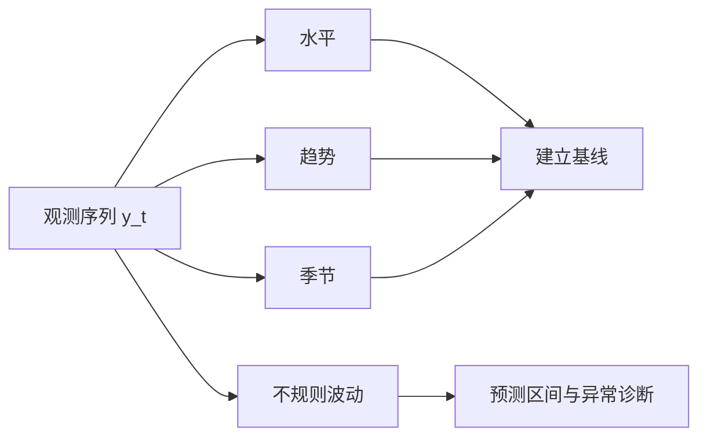

# 时间序列：顺序本身就是信息

时间序列不是多了一列日期的普通回归。相邻观测相关、未来不可用于过去、趋势和季节会改变基线。**建模前先尊重时间顺序，再讨论预测算法。**
## 先确认时间索引和预测任务

一个序列写作 $\{y_t\}_{t=1}^T$。开始前先回答：

| 问题 | 例子 |
|---|---|
| 频率 | 每小时、每天、每月 |
| 预测起点 | 每晚 24:00 |
| 预测跨度 | 未来 7 天 |
| 可用信息 | 预测起点前已产生的数据 |
| 评价尺度 | 单店、全区域或汇总销量 |

时间戳重复、时区切换、漏采样和聚合口径变化都能制造假模式。先把时间轴校准，再画图。
## 序列常由四类结构叠加

加法分解写作：

$$y_t=T_t+S_t+R_t$$

当季节波动随水平成比例增大时，乘法结构更合适：

$$y_t=T_tS_tR_t$$

对正值序列取对数，可把乘法关系转为加法关系。分解用于理解结构，不自动等于最终预测模型。
## 自相关让普通独立样本公式失效

滞后 $k$ 的自协方差与自相关为：

$$\gamma_k=\operatorname{Cov}(y_t,y_{t-k}),\qquad \rho_k=\frac{\gamma_k}{\gamma_0}$$

样本 ACF 展示不同滞后的线性相关。PACF 描述控制更短滞后后，$y_t$ 与 $y_{t-k}$ 的额外关系。

显著 ACF 不一定表示直接依赖。共同趋势会让许多滞后都高度相关；先处理趋势和季节，再解释剩余相关。
## 平稳性是模型假设，不是序列必须长得平

弱平稳要求均值不随时间变、方差有限且协方差只依赖滞后：

$$E(y_t)=\mu,\qquad \operatorname{Cov}(y_t,y_{t-k})=\gamma_k$$

ARMA 模型通常针对近似平稳序列。非平稳序列可尝试：

- 一阶差分：$\nabla y_t=y_t-y_{t-1}$
- 季节差分：$\nabla_s y_t=y_t-y_{t-s}$
- 对数或 Box-Cox 变换稳定方差
- 显式建模确定性趋势和季节

差分过度会增加噪声并制造负自相关。单位根检验也不是自动按钮；应结合图、领域机制和预测表现判断。
## 先建立朴素基线

任何复杂模型都应至少击败一个简单基线：

$$\hat y_{T+h\mid T}=y_T$$

这是随机游走式朴素预测。季节序列可用：

$$\hat y_{T+h\mid T}=y_{T+h-s}$$

若复杂模型赢不了“沿用上期”或“沿用去年同日”，问题常在特征、评估或任务定义，不在模型不够复杂。
## 指数平滑直接建模随时间变化的水平

简单指数平滑：

$$\ell_t=\alpha y_t+(1-\alpha)\ell_{t-1},\qquad \hat y_{t+h\mid t}=\ell_t$$

$0<\alpha<1$。$\alpha$ 大时更重视最近观测，响应快但更抖；$\alpha$ 小时更平滑。

Holt 方法加入趋势，Holt-Winters 再加入季节。它们适合水平、趋势和季节结构清楚的序列。
## ARIMA 用滞后解释差分后的依赖

AR($p$) 模型：

$$y_t=c+\phi_1y_{t-1}+\cdots+\phi_py_{t-p}+\varepsilon_t$$

MA($q$) 模型：

$$y_t=\mu+\varepsilon_t+\theta_1\varepsilon_{t-1}+\cdots+\theta_q\varepsilon_{t-q}$$

ARIMA($p,d,q$) 先做 $d$ 次差分，再用 ARMA 描述剩余相关。季节 ARIMA 还包含季节滞后与季节差分。

ACF、PACF 可帮助提出候选阶数，但不应只靠“截尾拖尾”机械选型。还要比较信息准则、滚动预测表现和残差诊断。
## 回归加入外生变量时要守住可用时间

动态回归可写为：

$$y_t=\beta^\top x_t+n_t$$

$n_t$ 再用 ARIMA 等模型描述。节假日、价格、天气可改善预测，但未来 $x_t$ 必须在预测时已知或另有预测。

把最终修订后的天气、事后统计口径或未来促销执行结果用于历史预测，会产生时间泄漏。

滞后特征、移动平均和标准化也必须只使用预测起点之前的数据。
## 评估必须按时间向前滚

随机打乱交叉验证会让未来信息进入训练。rolling origin 每次只用过去预测未来，并重复多个起点。

常见指标：

$$\operatorname{MAE}=\frac1n\sum_t|y_t-\hat y_t|$$

$$\operatorname{RMSE} = \sqrt{\frac1n\sum_t(y_t-\hat y_t)^2}$$

RMSE 更惩罚大误差。MAPE 在真实值接近 0 时会爆炸，也不适合含负值序列。指标要匹配决策成本。
## 预测区间要随跨度变宽

点预测只给中心。$h$ 步预测区间还要包含未来冲击和参数不确定性。通常 $h$ 越大，区间越宽。

区间校准可在滚动测试中检查：名义 90% 的区间是否约覆盖 90% 的未来观测？只看平均宽度不够，既要覆盖合理，也不能宽到失去决策价值。
## 残差应该像没有剩余结构的噪声

残差 $e_t=y_t-\hat y_{t\mid t-1}$ 应均值接近 0、没有明显自相关，并保持相对稳定的方差。

Ljung-Box 检验可检查一组滞后的剩余自相关。不显著不等于模型正确；还要看残差图、异常点、季节遗漏和结构突变。

预测误差非正态不一定破坏点预测，却会影响基于正态假设的区间。此时可考虑变换、稳健分布或重采样误差。
## 常见误区

- 相关系数高就能预测 → 同趋势序列可产生伪相关
- 训练误差最低就是最好 → 时间序列更容易过拟合，必须看未来窗口
- 随机划分训练测试 → 会泄漏未来结构
- ACF 某个滞后显著就有因果 → 自相关不是因果识别
- 自动 ARIMA 给出阶数就结束 → 仍要做残差、稳定性和滚动评估
- 异常点全部删除 → 它可能是业务事件，也可能改变未来基线
## 时间序列检查清单

1. 时间频率、时区、重复时间戳、缺口和聚合口径是否核对？
2. 预测起点、跨度、更新频率和当时可用信息是否写清？
3. 趋势、季节、方差变化、异常点和结构突变是否画图检查？
4. 是否建立朴素与季节朴素基线？
5. 变换、差分和模型阶数是否有可解释依据？
6. 评估是否使用滚动起点，并防止特征泄漏？
7. 残差、自相关、区间覆盖和不同阶段稳定性是否检查？

**时间序列预测的底线很简单：每一次历史评估，都必须真的站在当时，只看得到当时。**
