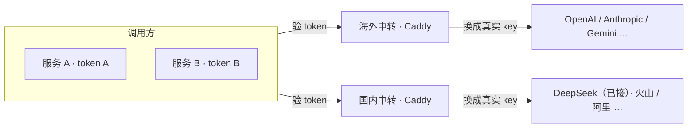

# 调 AI 接口不需要 new-api：Caddy 换个 header 就够了

[Agent 基础能力](../../skills/agent-io/index.md)里要接的能力，大多要调厂商 API。厂商一多，每个 Agent 都得配 n 家 key，换一次 key 要改 n 个地方。所以在自己域名下放一个中转：**Agent 只拿一个网关 token，真实 key 只存在中转服务器上。**

!!! success "DeepSeek 已上线，其余厂商还没搭"
    2026-10-01 在国内中转机上接好了 DeepSeek：Caddy 验网关 token、换成真实 key、SSE 流式原样转发，[验收](#acceptance)全部通过。Agent 端怎么调，见[调用 DeepSeek](../../skills/agent-io/reference/deepseek.md)。

    现在只有一个调用方 `personal`，统计的是每天的请求次数和状态码，不是 token 用量，也不是账单。设计里的「每个调用方一个 token、单独撤销、分别统计」还没做，见[还没做](#todo)。

- [中转做三件事](#what)
- [DeepSeek：配置全在 /etc/caddy](#deepseek)
- [装 Caddy：验版本，也验来源](#install)
- [厂商 key 和网关 token 分开放](#secrets)
- [先用装上的版本校验，再加载](#validate)
- [验收：发真实请求](#acceptance)
- [排障：服务器正常，电脑打不开](#dns)
- [key 放哪](#keys)
- [只换 header 不够的厂商](#limits)
- [还没做](#todo)



## 中转做三件事 { #what }

- 检查调用方的 token——每个调用方一个，单独发放、单独撤销，日志里分得清每次请求来自谁。现在只有一个调用方
- 删掉调用方的 token，换成真实 key，原样转给厂商
- 按日期 × 调用方 × 厂商记每日请求次数。现在只按日期分

## 透明转发就够：key 只在请求头和握手里

HTTP 和 SSE 流式的每个请求都自带 key，换掉 header 就行。WebSocket 只有开头握手是一次 HTTP 请求，key 就在握手里——换完之后是一根透明管道，数据帧原样来回，中转不用管里面是什么。

各家官方 SDK 都能改 base_url，所以 Agent 代码一行不改：`OPENAI_BASE_URL` 指到中转，`OPENAI_API_KEY` 填网关 token。token 放在各家 SDK 本来就发 key 的那个 header 里——OpenAI 是 `Authorization: Bearer`，Anthropic 是 `x-api-key`，Gemini 是 `x-goog-api-key`。

选 Caddy 不选 nginx：WebSocket 自动透传，`text/event-stream` 自动实时转发，默认不限读超时和上传大小，HTTPS 上游的 Host 从 v2.11 起自动改写，证书自动签。这几样 nginx 都要手动配——漏一样就是 SSE 攒着不吐、推理模型 60 秒被掐、传音频报 413。

!!! note "为什么不用 new-api"
    可以但没必要

## DeepSeek：配置全在 /etc/caddy { #deepseek }

国内中转机跑的是 Ubuntu 26.04 + Caddy v2.11.4，对外地址是 `https://deepseek-proxy.liuhetian.work/v1`，OpenAI 兼容。

**网关的配置只放在 `/etc/caddy`。** 唯一的例外是 systemd 的 drop-in，因为 systemd 只读自己目录下的文件：

| 文件 | 内容 | 来源 |
|---|---|---|
| `/etc/caddy/Caddyfile` | 原有的几个静态站，末尾一行 `import /etc/caddy/sites-enabled/*.caddy` | 手写 |
| `/etc/caddy/sites-enabled/deepseek.caddy` | 一家厂商一个文件：验 token、换 key、转发、过滤日志 | 本站下载 |
| `/etc/caddy/deepseek-proxy.env` | `DEEPSEEK_API_KEY` 和 `DEEPSEEK_GATEWAY_TOKEN` 两行，root 所有，权限 0600 | 手写 |
| `/etc/systemd/system/caddy.service.d/gateway.conf` | 让 systemd 读上面的 env 文件，并去掉 `--environ` | 本站下载 |

另外两个文件由 Caddy 自己写，不算配置：

- `/var/log/caddy/deepseek-proxy/access.json`：访问日志，只剩时间和状态码。满 10 MiB 轮转，留 30 份，最多 90 天。
- `/var/lib/caddy/.config/caddy/autosave.json`：Caddy 把展开后的配置存在这里，里面有明文 key，见[分开放](#secrets)一节。

验收、统计用的脚本不放在服务器上，用的时候从本站下载。装机时家目录里留下的东西都不是配置，Caddy 不读，验收通过后可以删：

- `~/deepseek-proxy-client.env`：当时的安装脚本顺手生成的「给调用方抄的配置」（`OPENAI_BASE_URL` 加 token）。现在 token 由用户手动写进 Agent 的 `.env`，这个文件没有用处，里面也还是改之前的旧 token。
- `~/deepseek-proxy-upload/`、`~/caddy-maintenance/`：安装和升级时的工作目录，有当时的脚本和升级记录。

`assets/gateway/` 里的 `deepseek.caddy`、`gateway.conf`、`verify.py`、`stats.py`、`audit.py` 是 2026-10-01 从这台机器原样拷来的，sha256 和机器上的一致。

??? abstract "`assets/gateway/deepseek.caddy`"

    ```text
    --8<-- "posts/ai-assistant/assets/gateway/deepseek.caddy"
    ```

- `@authorized` 要求 `Authorization` 整串精确匹配网关 token。不匹配的请求，包括直接拿 DeepSeek key 来的，都落到最后那个 `handle`，返回 401。
- 401 的响应体是 OpenAI 格式的错误 JSON，并带 `WWW-Authenticate: Bearer`，SDK 能直接解析出 message。
- `header_up Host api.deepseek.com`：最初装的是 2.6.2，必须显式改 Host；升到 2.11.4 后留着也没坏处。
- 换 key 只有 `header_up Authorization` 这一行。`header_up -Proxy-Authorization` 把调用方可能带着的代理凭证去掉，不往上游送。
- `flush_interval -1`：收到就立刻往回写。Caddy 对 `text/event-stream` 本来就会这样做，写明了就不依赖版本行为。
- `log` 用 `format filter` 删掉 `request`（里面有请求头、URL、客户端 IP）、`resp_headers` 等字段，每条记录只剩 `level`、`ts`、`logger`、`msg`、`status`。key、token、聊天内容都进不了日志。

??? abstract "`assets/gateway/gateway.conf`（systemd drop-in）"

    ```ini
    --8<-- "posts/ai-assistant/assets/gateway/gateway.conf"
    ```

### 重建一台 { #rebuild }

先把域名的 A 记录指到新机器，安全组放行 80/443（证书靠这两个端口签发），再按[开发环境第 6 步](dev-env.md#caddy)装好 Caddy。之后在机器上照下面五步做：

```bash
# 1. 凭证：手写两行，root 所有，0600
sudo install -m 600 /dev/null /etc/caddy/deepseek-proxy.env
sudoedit /etc/caddy/deepseek-proxy.env
#   DEEPSEEK_API_KEY=sk-…
#   DEEPSEEK_GATEWAY_TOKEN=自己定的 token

# 2. 站点配置和 systemd drop-in
W=https://wiki.liuhetian.work/posts/ai-assistant/assets/gateway
sudo curl -fsSL --create-dirs -o /etc/caddy/sites-enabled/deepseek.caddy $W/deepseek.caddy
sudo curl -fsSL --create-dirs -o /etc/systemd/system/caddy.service.d/gateway.conf $W/gateway.conf
grep -qxF 'import /etc/caddy/sites-enabled/*.caddy' /etc/caddy/Caddyfile \
    || echo 'import /etc/caddy/sites-enabled/*.caddy' | sudo tee -a /etc/caddy/Caddyfile >/dev/null

# 3. 日志目录归 caddy 用户
sudo install -d -m 700 -o caddy -g caddy /var/log/caddy/deepseek-proxy

# 4. 校验通过再重启；drop-in 改了 ExecStart，要先 daemon-reload
sudo -u caddy env -i HOME=/var/lib/caddy PATH=/usr/bin:/bin \
    caddy validate --config /etc/caddy/Caddyfile --adapter caddyfile
sudo systemctl daemon-reload && sudo systemctl restart caddy

# 5. 验收
curl -fsSO $W/verify.py && sudo python3 verify.py
```

- 2026-10-01 在全新的 `ubuntu:26.04` 容器里装好 Caddy 后跑过第 1 到 4 步（第 2 步改用本地文件），校验输出 `Valid configuration`，文件权限和属主都与上表一致。容器里没有 systemd，重启和第 5 步只能在真机上验。
- 域名写死在 `deepseek.caddy` 第一行和 `verify.py` 里，换域名时两处一起改，Agent 那边的 `DEEPSEEK_BASE_URL` 也要跟着改。

## 装 Caddy：验版本，也验来源 { #install }

Caddy 是底层能力，用 apt 装，不用 docker。装法和脚本见[开发环境第 6 步](dev-env.md#caddy)，这次踩到的坑都已经写进那个脚本：

- **官方源没加上，apt 照样装上 Ubuntu 的 2.6.2，而且不报错。** 下载失败后，`curl | tee` 留下了 0 字节的源文件和公钥。装完要同时看 `caddy version`、`apt-cache policy caddy` 和 `systemctl is-active caddy`。
- **网络问题和签名问题分开处理。** GitHub 下载超时，用 SOCKS5 代理解决；官方源的 `EXPKEYSIG` 是 Cloudsmith 用过期子钥签的名，挂代理、关校验都解决不了。最后用 GitHub 上的官方 `.deb`，核对校验值后从 2.6.2 升到 2.11.4。官方 apt 源先改名停用，要恢复自动升级得等它修好。
- **升级前先用新版本校验现有配置。** 把新 `.deb` 解包，用里面的 `caddy` 对现有配置跑一遍 `validate`，通过了再装。装之前把配置和证书打包备份，验收不过就装回旧包。

## 厂商 key 和网关 token 分开放 { #secrets }

| 凭证 | 放在哪 | 谁能读 |
|---|---|---|
| DeepSeek key | 中转机 `/etc/caddy/deepseek-proxy.env` | root（0600）；systemd 启动 Caddy 时注入 |
| 网关 token | 同一个 env 文件；Agent 那边由用户手动写进 `.env` 的 `MY_API_KEY` | Agent 只拿这一个 |

- **客户端只拿网关 token。** 调用方就算直接拿 DeepSeek key 来访问，也是 401，因为网关只认网关 token。
- **token 自己定，手写进 env 文件。** 改了 token，要同步改每个 Agent `.env` 里的 `MY_API_KEY`，不然旧 token 立刻就是 401。
- **去掉 `--environ`。** 官方 unit 里是 `caddy run --environ`，启动时会把整个环境打进 journal，key 也就进了日志。drop-in 先写一行空的 `ExecStart=` 清掉原命令，再写一条不带 `--environ` 的。
- **`{$…}` 在加载配置时就展开了。** Caddyfile 里没有 key，但 Caddy 会把展开后的 JSON 存到 `/var/lib/caddy/.config/caddy/autosave.json`，里面是明文。这个文件保持 0600，管理 API 只监听 `127.0.0.1:2019`；`caddy adapt` 的输出、`curl localhost:2019/config/` 的结果都别贴到别处。
- **日志只剩时间和状态码**，过滤规则见[上一节](#deepseek)。[`audit.py`](assets/gateway/audit.py) 检查最近 30 分钟的 journal 里有没有 key 和 token，以及 `autosave.json` 是不是 0600。

??? abstract "`assets/gateway/audit.py`"

    ```python
    --8<-- "posts/ai-assistant/assets/gateway/audit.py"
    ```

## 先用装上的版本校验，再加载 { #validate }

照着最新文档抄的配置，不一定能在装上的版本里跑。这次碰到两个例子：2.6.2 不会自动改写 HTTPS 上游的 Host，得显式写 `header_up Host`；在新版能通过的日志写法，在 2.6.2 上校验失败。所以改完配置，先用机器上装的那个 `caddy` 校验，通过了再加载：

```bash
sudo -u caddy env -i HOME=/var/lib/caddy PATH=/usr/bin:/bin \
    caddy validate --config /etc/caddy/Caddyfile --adapter caddyfile
# 最后一行是 Valid configuration 才继续
sudo systemctl reload caddy     # 改了 Caddyfile
sudo systemctl restart caddy    # 改了 env 文件
```

- **用 `caddy` 用户跑。** 日志文件还不存在时，用 root 跑 validate 会以 root 身份把它建出来，权限 0600，运行中的 Caddy 就写不进去了。2026-10-01 在全新容器里对比过：caddy 用户建出来的文件属主是 caddy，root 建出来的属主是 root。
- **`env -i` 清空环境。** `{$…}` 会展开成空串，语法检查照样做，报错信息里也带不出 key。2026-10-01 在中转机上这样跑，输出 `Valid configuration`。

## 验收：发真实请求 { #acceptance }

`systemctl is-active` 只能说明进程还活着。要发真实请求，才算验收：

| 请求 | 应该看到 |
|---|---|
| 不带 token | 401，OpenAI 格式的错误 JSON，带 `WWW-Authenticate: Bearer` |
| 错的 token | 401 |
| 直接拿 DeepSeek key | 401 |
| `/v1/models`、`/models` | 200，返回模型列表 |
| 普通聊天 | 200，`choices[0].message.content` 有内容 |
| 流式聊天（`stream: true`） | `text/event-stream`，逐块收到，以 `data: [DONE]` 结尾 |
| 访问日志、journal | 搜不到 key 和 token；日志记录里没有 `request`、`resp_headers` |
| env 文件 | 权限 0600 |

[`verify.py`](assets/gateway/verify.py) 会把这些全跑一遍：`sudo python3 verify.py`。它会发两次短聊天，普通、流式各一次，每次最多 16 token。

浏览器直接打开 `https://deepseek-proxy.liuhetian.work/v1/models`，看到 401 是正常的，因为浏览器没带 token。2026-10-01 用命令行访问，看到的是：

```text
$ curl -i https://deepseek-proxy.liuhetian.work/v1/models
HTTP/2 401
alt-svc: h3=":443"; ma=2592000
content-type: application/json
server: Caddy
www-authenticate: Bearer
content-length: 88
date: Thu, 01 Oct 2026 11:45:38 GMT

{"error":{"message":"A valid gateway token is required.","type":"authentication_error"}}
```

Agent 端脚本也把错 token、没 token 这些情况测了一遍，见[调用 DeepSeek](../../skills/agent-io/reference/deepseek.md#errors)。

??? abstract "`assets/gateway/verify.py`"

    ```python
    --8<-- "posts/ai-assistant/assets/gateway/verify.py"
    ```

## 排障：服务器正常，电脑打不开 { #dns }

换过域名或改过解析之后，本机可能还缓存着旧 IP：在服务器上 curl 一切正常，自己电脑就是打不开。这时比较三个地方的 IP：

```bash
# 1. 本机解析（走系统缓存）
getent hosts deepseek-proxy.liuhetian.work                  # Linux
dscacheutil -q host -a name deepseek-proxy.liuhetian.work   # macOS
# Windows PowerShell：Resolve-DnsName deepseek-proxy.liuhetian.work

# 2. 权威 DNS（绕过所有缓存）
dig +short NS liuhetian.work
dig +short @veronica.dnspod.net deepseek-proxy.liuhetian.work   # 换成上一行查到的任意一个

# 3. 实际连上的 IP
curl -sv https://deepseek-proxy.liuhetian.work/v1/models 2>&1 | grep -i 'connected to'
```

- 三处一致，并且都是中转机的 IP：问题不在 DNS，接着查安全组、证书和 Caddy 日志。
- 本机和权威 DNS 不一致：清本机的 DNS 缓存。Linux 用 `sudo resolvectl flush-caches`，macOS 用 `sudo dscacheutil -flushcache; sudo killall -HUP mDNSResponder`，Windows 用 `ipconfig /flushdns`。浏览器还有自己的缓存，Chrome 在 `chrome://net-internals/#dns` 里清。
- curl 显示连的是 `127.0.0.1` 之类的代理地址：请求走了代理，域名也由代理去解析。先关掉代理再比。

## key 放哪 { #keys }

厂商 key 和每个调用方的网关 token，用 `scripts/age-seal.sh` 加密成 `age:…`，打码写在这一节。换网关机时打开本页解锁，照抄进网关机上 Caddy 读的环境变量文件。密文为什么能公开放、风险落在哪，见[打码：key 和小字都以密文写进 wiki](../wiki-tech/age-mosaic.md)。

- **写进来之前，先在厂商控制台给这个 key 设好用量上限**：密文公开在站上，口令万一被猜中，损失也有顶
- **一个 key 一行**，写成环境变量的样子，解锁后整段能直接贴进环境变量文件：`DEEPSEEK_API_KEY=age:…`（`age:…` 换成 `age-seal.sh` 打印的整串）
- 换 key 就重跑一次 `age-seal.sh`，替换那一行；旧 key 记得去控制台作废

DeepSeek 的 key 和网关 token 还没写进来，现在只存在中转机的 env 文件里。

## 只换 header 不够的厂商 { #limits }

- key 在 query 里：Gemini 的 `?key=`，Live API 的 WebSocket 常这么传——Caddy 用 `uri query` 改写，还能做
- 要签名：即梦走火山引擎的 HMAC 签名，AWS Bedrock 是 SigV4，腾讯云 API 3.0 是 TC3——签名覆盖 host 和请求体，只换 header 签名就失效
- 令牌会过期：可灵要用 AK/SK 自签短期 JWT，Vertex AI 的 OAuth token 一小时过期

后两类 Caddy 做不了——要么换一家用固定 key 的（腾讯混元、阿里百炼、火山方舟都有 Bearer key 的 OpenAI 兼容接口），要么在 Caddy 后面挂一小段代码负责签名。

## 还没做 { #todo }

- **多调用方**：每个调用方一个 token、单独撤销、分别统计，都还没做。现在只有 `personal` 一个 token；日志里不留请求信息，也就分不出请求来自谁。要分，得在鉴权通过后把调用方的名字写进日志字段。[`stats.py`](assets/gateway/stats.py) 已经按 `caller` 字段分组，没有这个字段的记录算作 `personal`。
- **统计只有次数**：`stats.py` 按上海时间的日期，数总请求、成功、401 和其他错误。401 里既有网关拒绝的，也有上游拒绝的；客户端中途断开时记下的状态码，也不代表计费结果。token 用量看每次响应里的 `usage`，花了多少钱看 DeepSeek 余额（`/user/balance`，也就是 Agent 端脚本的 `balance` 命令）。
- **官方 apt 源停用中**：等 Cloudsmith 换回有效签名，按[开发环境第 6 步](dev-env.md#caddy)恢复，Caddy 才能随 apt 自动升级。
- **海外中转**还没接任何厂商（OpenAI、Anthropic、Gemini）。
- 还没定的三件事：
    - 每项能力用哪家厂商——决定上一节的例外会不会碰上，也就决定 Caddy 够不够
    - 语音要不要实时对话——要就走 WebSocket，得确认所选厂商的 key 在握手里；只是整段转写、一次性合成，普通 HTTP 就够
    - 两个调用方各是什么服务、各要哪些能力，要不要限制某个调用方只能用部分厂商

??? abstract "`assets/gateway/stats.py`"

    ```python
    --8<-- "posts/ai-assistant/assets/gateway/stats.py"
    ```
