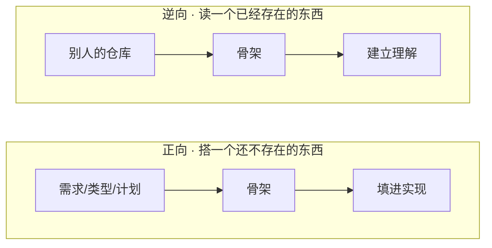

# 用 AI 生成代码骨架：搭新项目和读旧仓库的同一把工具

背景是做一个自定义礼包资源管理平台，管理模版（里面的视频资源，视频位置等）、可售卖道具信息配置等。

步骤是：
1. 先文字描述需求，让ai制作纯html前端
2. 经过多次调整加功能之后，感觉功能基本上完整了（也感觉改起来有点问题，可能是文件过大），然后让ai切换成react
3. 途中有遇到一个前端编辑功能难以准确描述（涉及以7.5rem为标准控制），让ai从react中导出为独立html，请同事帮忙修复，然后又拿回来作为依据修改react
4. 前端继续调整之后，差不多作为一个完整的需求文档了，但是前端使用的接口字段对象类型还没有约束（后面看起来全是不规范的），输出一个后端开发注意事项文档
5. 下一步提出让ai制作一个fastapi骨架，里面保留所有的函数名字，函数的docstring，import关系，模型定义（pydantic和sqlmodel）
6. 人来阅读骨架，让ai进行一些调整，然后把变更写在骨架里（包括文字说明）
7. 让ai以后端backend的内容为准（功能和模型定义），进行开发，并且接入web

第五步中，没让 AI 直接把后端写出来，而是让它先生成一个**骨架**：目录、文件、函数名都齐全，函数体一律不实现，只写注释说明这个函数该干什么、对齐前端哪个动作、要避开哪个坑。

出来的东西可读性好得出乎意料，于是想到反过来一个念头：**这个动作能不能反过来用？** 拿 AI 去啃一个别人的、我不熟的仓库，也让它生成这样一个骨架，是不是就能快速读懂它？

之前遇到一个问题，就是AI写了一个大仓库，读起来的成本比较高，感觉失去了对一个项目的控制，所以感觉原来的做法有点不对，今天感觉到，是跳了一个步骤，骨架应该是自己来控制，因为代码量是可控的，编辑起来也容易，不会牵一发动全身。

## 骨架长什么样

先说清楚"骨架"到底指什么。它是一份能通过语法检查、能被工具解析、但**不会真正运行出结果**的代码：

- **结构是真的**：目录布局、文件划分、类和函数的签名、import 关系、类型定义——全部照真实成品来。
- **行为是假的**：函数体是一段 docstring 加一个 `...`，用注释描述"应该做什么"，而不是真去做。

比如后端那条最复杂的 pipeline 提交接口，骨架里是这样的：

```python
@router.post("/pipeline/{kind}", response_model=PipelineSubmitOut, status_code=201)
async def submit_pipeline(kind: Kind, primary: UploadFile, ...) -> PipelineSubmitOut:
    """提交一次完整 pipeline。委托 services.pipelines.submit()：

    1. 所有上传文件先走 storage.save_upload()（落盘 + OSS + files 表）拿 sha256
    2. 创建 resource：v1 占位版本（url 空、params = 默认值），用户生成后进抽屉调位置
    3. 按 PIPELINES[kind] 建 jobs（pending）：dual 有 secondary → tri 管线，否则 SAM …
    ...
    """
    ...
```

有意思的是里面有一层是**完整实现、不是骨架**的：类型定义。8 种资源各自的参数模型、请求响应体、数据库表——这些我让 AI 全部写实，因为类型是契约，是后面所有实现都要对着的靶子。骨架阶段就能把 `openapi.json` 导出来、把 TypeScript 类型生成出来给前端用。**这个分界本身就是第一个信号：结构和类型可以当真，行为只是一段说明。**

## 两个方向，两种风险



正向是我实际做的：从需求出发，搭一个尚不存在的后端。逆向是我想试的：从已有代码出发，反推一张地图来读懂它。听起来是同一种产物，但有一个东西被悄悄翻转了——**信任的方向。**

!!! warning "骨架里 docstring 的身份，两个方向下完全不同"
    - **正向**：docstring 是**指令**。"这个函数要落盘、要传 OSS、要对齐前端的 `SAVE_AS_NEW_VERSION`"——它定义的是将要被构建的东西，天然为真。写错了，你在实现时就会撞见。
    - **逆向**：docstring 是**断言**。"这个函数校验了 X、这里做了去重"——它是 AI 对现有代码的**转述**，可能是错的，而且是那种读起来同样权威、你却很难当场识破的错。

逆向骨架最危险的地方就在这：它把 AI 的不确定性，洗成了一段干净、整齐、看着很可信的话。源码里那句含糊的条件判断、那个没处理的边界，到了骨架里变成一句笃定的"处理了 XXX 情况"。**你以为拿到的是一张忠实的结构快照，其实是一份不标注置信度的解读。**

## 逆向：什么能信，什么不能

这不是说逆向不能用，而是要分清它给你的两类信息：

| 信息 | 性质 | 能不能信 |
|---|---|---|
| 目录布局、文件划分、函数签名、类型、调用关系 | **结构**，可机械提取、可验证 | 能。这是一张好用的导航图 |
| "这个函数做了什么"的 docstring | **行为**，靠解读、会幻觉 | 当假设，不当结论 |

一段代码真正要命的东西，恰恰在骨架丢掉的地方：边界条件、提前返回、那个"为什么这里有个特判"、错误处理。骨架有代码的**形**，只有摘要的**实**。你要找 bug、要判断能不能动某处、要理解一段绕人的逻辑时，它给你的正好是被删掉的那部分。

所以逆向骨架的正确用法是**导航图，不是替身**。让它安全的三条纪律：

1. **每条行为描述都带 `file:line`**，让每个断言都能一键跳回源码核对。这几乎是逆向骨架能不能用的分水岭。
2. **它是索引，永远指回真实源码**，不能存下来过几周当成 ground truth。
3. **结构可信，行为待验证**——把 docstring 里"它做了什么"当成待核对的假设。

## 继续开发时，骨架的注释要不要留

回到正向。我把骨架填成真实现的过程里，冒出一个很实际的问题：这些 docstring 要不要留着？

答案是**留知识，不留形式**——因为骨架的注释其实是两种东西混在一起的，它们在代码写完后的命运正好相反。

一种是**"该干什么"的步骤说明**（上面那个 pipeline 接口里的"1. 落盘 2. 建 resource 3. 建 jobs"）。这是脚手架。等你把代码真写进去，代码本身就是这个答案，注释退化成在复述下一行。更糟的是它会**烂**：哪天有人把顺序调了、没同步改这段散文，注释就开始撒谎。骨架本身不会烂（它没有代码可漂移），但一段"留下来的半截步骤注释"从代码被改动那一刻起就开始漂。

另一种是**代码本身表达不出来的约束和取舍**，这种要留，而且很值钱。后端类型层里有个真例子——参数模型的字段名故意混用了两种命名风格：

```python
"""⚠️ 命名故意「混搭」：anchor 系用 snake_case（char_width…），
其余用 camelCase（depthThreshold / bgId…）。这不是笔误 —— Pydantic 字段名
必须与前端 TS 类型完全一致，生成出来的 TS 才能和 types.ts 无缝互换。"""
```

这句必须留。它防的是未来某个人（包括未来的 AI）好心把命名"修正"整齐、结果把前后端的类型契约搞崩。这种知识你盯着这个文件看再久也推不出来——它活在另一个仓库里、活在一个已经做过的决定里。

!!! tip "一个判断该删该留的标准"
    读完注释，再读代码：**如果光看代码也能得到同样的信息，就砍掉；如果这条信息你无论怎么盯着本文件都推不出来（它在别的仓库、在运行时事实、在一个被否掉的方案里），就留。**

还有更进一步的一招：凡是能变成**检查**的约束，别停在注释。"类型必须和前端对齐"这句话，与其当注释，不如就是一条 `Pydantic → openapi.json → 生成 TS` 的流水线加一个测试——能悄悄烂掉的注释，永远不如会大声报错的检查。

## 什么时候用它，什么时候别用

骨架不是万能钥匙，它适合的场景其实挺窄：

- **适合**：中等规模、分层清晰、你想先抓整体架构的仓库。用它建一张地图，再钻进真实代码。
- **不适合「我要在哪改这一处」**：直接做一次定向的调用链追踪更快，别为一个点铺开整张图。
- **不适合完整 onboarding**：架构综述加调用图的信息密度更高，也更诚实——它不会假装自己是代码。

骨架是这几者之间的中间态。它最大的价值其实不是那个**文件**，而是 AI 为了生成它而做的那次通读和归纳。文件只是这次阅读的一种呈现，而且是恰好带点危险的那种——因为它太像代码了，容易让人忘了它不是。

## 一份 checklist

- [ ] 正向搭项目：先让 AI 出骨架（结构 + 签名 + docstring 说明），**类型层要求写实**，其余留空
- [ ] 骨架阶段就把类型/接口契约固化下来（导 `openapi.json`、生成前端类型），让实现有靶子
- [ ] 逆向读仓库：要求**每条行为描述带 `file:line`**，把骨架当导航图不当替身
- [ ] 逆向骨架里的行为描述一律当假设，落地前跳回源码核对
- [ ] 填实现时，"步骤说明"类注释随代码写完而删；"约束/取舍"类注释保留
- [ ] 能变成测试/类型/断言的约束，就别留成注释
- [ ] 选对工具：改一处用追踪、全面 onboarding 用架构综述、抓分层才用骨架

## 两个方向，一句话

**正向的骨架是一份 spec，spec 的活儿在代码存在的那一刻就干完了；逆向的骨架是一张地图，地图永远不能代替你亲自走一遍地形。** 同一把工具，握法不同：正向你信它，因为它定义未来；逆向你查它，因为它转述现在。

---

??? abstract "正向骨架实例：pipeline 路由（signatures + docstring 说明 + `...`）"

    ```python
    --8<-- "posts/ai-code-skeleton/assets/pipeline-route.py"
    ```

??? abstract "写实的类型层实例：8 种资源的参数模型（这一层不是骨架，是完整实现）"

    ```python
    --8<-- "posts/ai-code-skeleton/assets/params.py"
    ```
