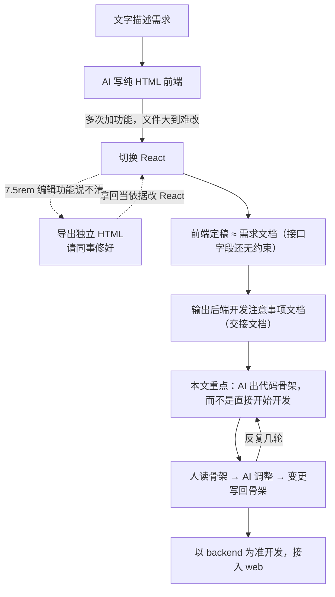
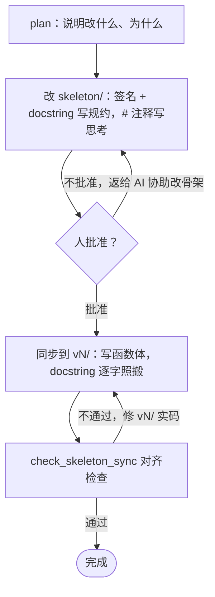

# 用 AI 生成代码骨架：搭新项目和读旧仓库的同一把工具

## 背景故事

背景是做一个自定义礼包资源管理平台，管理模版（里面的视频资源，视频位置等）、可售卖道具信息配置等。

开发流程比较舒服，整理实际流程：


```mermaid
graph TD
    A[文字描述需求] --> B[AI 写纯 HTML 前端]
    B -->|多次加功能，文件大到难改| C[切换 React]
    C -.->|7.5rem 编辑功能说不清| X[导出独立 HTML<br/>请同事修好]
    X -.->|拿回当依据改 React| C
    C --> D["前端定稿 ≈ 需求文档（接口字段还无约束）"]
    D --> E[输出后端开发注意事项文档（交接文档）]
    E --> F["本文重点：AI 出代码骨架，而不是直接开始开发"]
    F --> G[人读骨架 → AI 调整 → 变更写回骨架]
    G -->|反复几轮| F
    G --> H[以 backend 为准开发，接入 web]
```

出骨架那步，没让 AI 直接把后端写出来，而是让它先生成一个**骨架**：目录、文件、函数名都齐全，函数体一律不实现，只写注释说明这个函数该干什么、对齐前端哪个动作、要避开哪个坑。

中间的骨架使得项目开发多了一步人可以控制的阶段，从而没那么失控。骨架这个中间态的好处很多，自己写代码的时候，因为代码量是可控的，编辑起来也容易，不会牵一发动全身。读代码的时候也可以比较详细看到项目结构（直接看readme感觉不容易阅读进去）。想法其实和现在最流行的harness engineering是异曲同工的。

开发结束后，突然还回想起到之前有项目AI直接一下子写了一大堆，造成无法阅读，于是想到如果把这个想法反过来，也可以使用骨架来帮助阅读一个大仓库，于是有了本文记录借助骨架技巧，正向做开发，反向做阅读。

## 骨架长什么样

骨架是一份能通过语法检查、能被工具解析、但**不会真正运行**的代码：

- **结构是真的**：目录布局、文件划分、函数签名、import 关系、类型定义，全部照真实成品来。
- **行为是假的**：函数体只有一段 docstring 加一个 `...`，用文字描述"该做什么"。

docstring 要铺满每一层：**文件开头一段模块 docstring 讲清这个文件的职责和边界，函数 docstring 讲清这个函数该干什么**。这样光靠目录树 + 每个文件的头几行，就能把整个项目读个大概。

例如一个文件长这样：

```python
"""简单一句话概括本文件职责（来自哪个需求文档）。

两句话的更详细解释
"""

@router.post("/pipeline/{kind}", response_model=PipelineSubmitOut, status_code=201)
async def foo(kind: Kind, primary: UploadFile, ...) -> PipelineSubmitOut:
    """本函数作用：

    两句话更详细解释
    """
    ...
```

唯一的例外是**类型层，要求写实**：8 种资源的参数模型、请求响应体、数据库表全部完整实现。类型是契约，是后面所有实现要对着的靶子——骨架阶段就能导出 `openapi.json`、生成前端 TS 类型。配置加载、表定义同理，副本整文件照搬。

一句话分界：**契约当真，行为留空。**

!!! tip "函数作用精细程度"
    AI喜欢把函数的返回数据长什么样、有哪几个字段，写进 docstring，一条条列出来，看着很完备，但是信息过于冗余了，尽量通过定义的类型来传达返回数据结构，而不是再写一遍。这里的文字很宝贵。


## 骨架开发时

### 新增注释

除了基本的规约docstring，还有很多的开发时候的想法和思考，可能是一些方案选择或者个人口味、比如一些change，不能全部放在docstring里，所以可以用`#` 注释来记录思考

两种注释语法，两种命运。判据一句话：**使用者需要的 → docstring；实现者 / 考古需要的 → `#` 注释。**

- **docstring**：职责、参数/返回语义、调用方必须遵守的约束——骨架与副本**逐字一致**。
- **`#` 注释**：`[源:]`/`[新:]` 标记、设计理由、踩坑日期、实现草图——**只留骨架**，不带进副本。
"该干什么"的步骤说明（上面 pipeline 里的"1. 落盘 2. 建 resource 3. 建 jobs"）随代码写完而删——代码本身就是答案，留着只会在下次改动后开始撒谎。

总之注释里放的更多是代码推不出来的约束和取舍

判据里的"使用者"未必是人。比如 MCP tool 的 docstring 会通过 `tools/list` **原文下发给消费方 LLM**——它是运行时 prompt，不是文档。这时判据要再收严一档：**由代码保证的事实不要写**。"仅限某某游戏""只能查当前玩家"这类限制由服务端 auth 在代码层过滤保证，能看到这个 tool 的 LLM 必然已经通过筛选，写了是噪音甚至误导；docstring 只留用途、何时选用、转述注意，机制说明照旧下沉 `#` 注释。所以写 docstring 前先问一句：**这段字的读者是谁**——人、AI 会话、还是运行时 prompt，答案不同内容完全不同。


!!! tip "骨架不需要覆盖测试代码"
    因为测试代码的重要性相对更低，而且比较繁杂，因此为了保持骨架的可阅读性，所以进行取舍，骨架中不放tests/目录，也就是pytest的代码。

!!! tip "从老代码平移契约时，先做减法"
    骨架不一定从零设计，也可能从老项目平移（比如把一块功能拆成独立服务）。AI 会把老代码的每句注释、每层抽象忠实搬过来，包括新上下文里已经不成立的：给早已不存在的旧数据留的兼容逻辑、只剩一个实现却还端着的基类继承树。**平移 ≠ 搬运**，骨架期是做这个减法的唯一时机——每句 docstring、每层抽象带着新上下文重审一遍："这句话在新项目里还成立吗"。进了实装再删就是破坏契约，得走全套变更流程。


!!! tip "该删该留的标准"
    读完注释再读代码：**光看代码也能得到同样的信息，就砍掉；这条信息无论怎么盯着本文件都推不出来（它在别的仓库、在运行时事实、在一个被否掉的方案里），就留。**

    ``` python
    """各 kind 的 params 类型 —— 与前端 types.ts 逐字段对齐（权威源在前端），字段名一字不改。"""
    # 为什么命名「混搭」：anchor 系用 snake_case（char_width…，沿线上 template_config），
    # 其余用 camelCase（depthThreshold / bgId…）。这不是笔误 —— Pydantic 字段名
    # 必须与 TS 完全一致，生成出来的 TS 才能和 types.ts 无缝互换。
    ```

    未来某个人（包括未来的 AI）会好心把命名"修正"整齐、搞崩前后端契约——这种知识盯着本文件看再久也推不出来，不写下来就等着被改掉。写的位置照旧按分界拆：**"字段名一字不改"是规约，进模块 docstring；"为什么长成混搭样"是考古，下沉 `#` 注释。** 不用担心 `#` 没人看——改字段名是设计变更，蓝图先行 + 整文件同步检查逼着改的人必先打开骨架里的这个文件。

!!! tip "例外"
    对于fastmcp这种特殊情况，函数的docstring会参与运算，交接给下游的客户端，那么需要优先满足客户端的使用。


### 蓝图先行

开工不直接在骨架上改，而是复制一份出去，两个目录角色固定：

| 目录 | 角色 | 纪律 |
|---|---|---|
| `skeleton/` | 设计蓝图 / 规约源头 | **只读**；改设计先改这里 |
| `vN/`（复制出的副本） | 实装工作区 | 所有开发在这里 |

改接口的流程永远是蓝图先行：人不批准就返给 AI 改骨架；批准落地后检查不过，修的是 `vN/` 的实码：


```mermaid
graph TD
    P["plan：说明改什么、为什么"] --> S["改 skeleton/：签名 + docstring 写规约，# 注释写思考"]
    S --> A{人批准？}
    A -->|不批准，返给 AI 协助改骨架| S
    A -->|批准| V["同步到 vN/：写函数体，docstring 逐字照搬"]
    V --> C["check_skeleton_sync 对齐检查"]
    C -->|不通过，修 vN/ 实码| V
    C -->|通过| Done([完成])
```

控制点就是骨架：它小到人能通读，改起来不牵一发动全身；AI 在副本里写多少行，都不影响你手里握着的那张图。

同一个函数在两边长什么样：

=== "骨架（skeleton/）"

    ```python
    def get_pushable_packages(...) -> list[CustomIap]:
        """pay2 侧应可见的**全部**礼包；每次推送必须列全，不能只推增量。"""  # (1)
        # 2026-07-12 dev 实测：单推 1 条会硬删该角色其余在售礼包（audience 全量替换）
        ...
    ```

    1. 规约：使用者需要的约束，写进 docstring，两边**逐字一致**。下一行的 `#` 注释是踩坑理由——思考，只活在骨架里。

=== "副本（vN/，实装后）"

    ```python
    def get_pushable_packages(...) -> list[CustomIap]:
        """pay2 侧应可见的**全部**礼包；每次推送必须列全，不能只推增量。"""  # (1)
        stmt = select(CustomIap).where(CustomIap.status == "on_sale")
        return session.exec(stmt).all()
    ```

    1. docstring 逐字照搬（对齐检查盯着）；`# 2026-07-12` 那行思考没带过来——想知道"为什么必须列全"，回骨架考古。


### 搭建配套：CLAUDE.md、检查脚本、交接文档

开发结束后，未来肯定还会继续维护，所以还需要几样配套：

#### CLAUDE.md

为了让规范注入agent，需要写入CLAUDE.md

- **CLAUDE.md**：最简，每次 AI 会话自动加载，只放"这个目录是什么 + 四步工作流 + 三条硬规则"，短到不可能被略读。

??? abstract "骨架仓库的 CLAUDE.md 全文"

    ```markdown
    --8<-- "posts/ai-code-skeleton/assets/skeleton-claude.md"
    ```

#### 检查脚本

为了避免漂移，还需要从代码层面进行检查，所以需要一个脚本检查是否对齐，可以在 CLAUDE.md 里面记录检查方式。

`check_skeleton_sync.py` 母本放在 `skeleton/scripts/`，随骨架复制进每个工作副本，在哪个副本里运行就比对哪个：实码文件整文件文本比对，其余文件做"结构投影"比对——模块/类/函数存在性、函数签名、docstring 逐字（`#` 注释天然被 AST 丢弃，正好只比规约不比思考）；`_` 开头私有 helper 允许副本多出。

??? abstract "`check_skeleton_sync.py` 全文（240 行，规则详见文件头 docstring）"

    ```python
    --8<-- "posts/ai-code-skeleton/assets/check_skeleton_sync.py"
    ```

#### 交接文档

骨架本身只承载"是什么"，还有三样东西装不下，塞进代码注释也不合适：

- **背景**：为什么做这次改动、中途否掉过哪些方案（决策链比结论值钱）
- **注意事项**：按踩坑代价排序的不变量（比如"tool 签名永不出现 user_id"这种一破就出事故的）
- **后续要做的**：顺序即依赖的 TODO，交付时哪些做了哪些没做

所以交付物是三件套：`skeleton/` + `CLAUDE.md` + `交接.md`。三份材料读者不同：骨架给评审契约的人，CLAUDE.md 给每次会话的 AI，交接文档给未来接手的人（包括未来的 AI 会话），谁也替不了谁。


---

??? abstract "正向骨架实例：pipeline 路由（signatures + docstring 说明 + `...`）"

    ```python
    --8<-- "posts/ai-code-skeleton/assets/pipeline-route.py"
    ```

??? abstract "写实的类型层实例：8 种资源的参数模型（这一层不是骨架，是完整实现）"

    ```python
    --8<-- "posts/ai-code-skeleton/assets/params.py"
    ```


## 骨架阅读法

**正向的骨架是一份 spec，spec 的活儿在代码存在的那一刻就干完了；逆向的骨架是一张地图，地图永远不能代替你亲自走一遍地形。** 而让骨架活下来当蓝图，它就成了你和 AI 之间的合同——你在骨架里握设计权，AI 在副本里干实装的活，对齐检查当公证人。


一般是用于阅读学习别人的代码或者AI的大生成。

目前还在实践中，所以未来再写。
