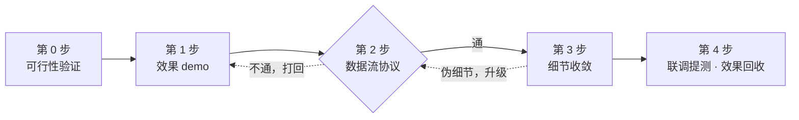

# AI 时代的产品经理：从点子到提测的完整复盘

我做算法。但组里没有 PM，外部对接的沟通压到了算法岗身上——AI 时代岗位融合的一个具体表现是：**会写代码的人被要求同时会画产品图、会做 demo、会开跨岗会议、会汇报进度**。

第一次完整接下这个活：一个 SLG 手游的个性化礼包推送系统，BI 生成礼包 → 平台通知 → 客户端红点 → H5 WebView 展示购买，四个团队（BI / 平台后端 / 客户端 / H5 前端）协作，从 6 月中旬的点子到 7 月中旬联调、预计第 5 周提测。这篇是拿着仓库里的 PRD、changelog、会议纪要逐条对出来的复盘——我最初凭记忆写的心路是三步，对完发现实际是五步，其中两步是我当时"顺手做了但没意识到是独立步骤"的。

## 一张图：五步框架



注意两条虚线：**数据流不通会打回 demo 重来**，**细节里也会翻出数据流问题打回第 2 步**。这两条回边是全流程最容易被低估的部分。

## 第 0 步：可行性验证——"意义"的另一半

我最初的心路里把"背景和意义"全记在了 demo 头上，复盘时才发现漏了半条腿：立项时说服大家的其实是**回测数据 + demo** 两样东西。demo 回答"长什么样"，回测回答"凭什么值得做"——我们的推荐算法先有 20 棵决策树通过回测（lift 5~13x），项目计划第一页就把它列为关键前提。

这一步我漏记，是因为它对算法岗是"顺手就有"的。但如果换一个不做算法的人来当 PM，这一步必须显式安排：**产物是一页回测结论，先于（或伴随）demo 存在**。

## 第 1 步：效果 demo——把画面感变成看得见的东西

有了点子，脑子里立刻有"玩家用起来的画面"。这一步就是把画面感变成别人看得见的东西：结合游戏截图画出来，做成可点的 H5 demo。

一个复盘时才看清的隐藏成本：**demo 的"效果好"是有素材工时的**。为了让礼包页有质感，背后做了抠图、深度图、图标整理一整条素材管线，工作量不比页面本身小。下次评估 demo 工期时要把素材算进去。

## 第 2 步：数据流协议——看不见的大坑

礼包从哪里创建、发送到哪里、主动 push 还是被动 pull、是否共用同一个数据库。这一步是整个项目最深的坑，它有三个特点：

!!! warning "数据流的三个特点"
    1. **第一版几乎必然是错的。** 我们的激活机制第一版设计成"生成 → 推送"两步状态机，一次会议就被整体推翻，改成"生成即生效"——状态字段、索引、通知时序全部重写。
    2. **链路不通就全重来。** 错的不是某个字段，而是"这条链路根本走不通"，于是前面的 demo 假设和后面讨论过的细节一起作废。
    3. **没有中间产物，没法汇报进度。** 今天平台确认一个字段、明天推翻一个方案，全是谈判性进展，群里文字刷过去就没了。leader 问进度，只能说"在对齐"。

第三点的解法见下面「用卡片汇报进度」一节——它值得单独成章。前两点的教训：

**教训一：第一次大会就把 demo 和数据流协议初版一起摊开。** demo 讲背景和意义，协议初版让所有相关方——尤其是**每个数据来源方**——当场确认链路通不通。协议第一版肯定有很多问题，所以更要早点摊开给大家看，而不是自己憋到"觉得对了"再拿出来。

**教训二：光开一次会不够，跨方字段要有 owner + deadline + 追踪。** 我们当时其实做对了一半：项目计划里把"数据源选型、内容字段定义、通信方式"列成了带 deadline 的阻塞决策项。但没有跟踪闭环——平台侧三个字段的确认实际谈了三轮、拖了一周多才落地。对方的排期不受你控制，所以每个跨方字段/接口要落成一张清单：**谁给、什么时候给、现在什么状态**，每次沟通后更新。

这一步的产物：一张链路图 + 一份带 owner 和状态的接口字段清单。

## 第 3 步：细节收敛——先分类，再批量

数据流定下来之后才轮到细节。这次复盘对我原来的认识有一个重要修正：**"流程确认前不必讨论细节"这条规则，只对一半的细节成立。**

### 细节两分法

- **伪细节：涉及状态、链路、鉴权、资金的，要立刻升级回第 2 步。** 实例：支付完成后回跳页面的防重复下单，看起来是个前端细节，实际前后改了三版方案——先是"组件类/跳转类支付分别拍板"，再是"URL 回跳 + 弹窗确认"，最后改成"回调到客户端、客户端再拉起 WebView"——每一版都反过来修改了回调地址、鉴权链路和 SDK 职责。它从头到尾就是个数据流问题，只是穿着细节的衣服。
- **展示类细节：批量后置。** 角标换不换行、标题最多几行、长文案渐隐、横屏怎么缩——这类我们一次会议批量拍掉 14 条，之后零反复。

判断标准就一条：**这个细节改了之后，接口或数据结构要不要跟着改？** 要，就是伪细节，马上升级；不要，进小本本攒着。

### 批量讨论的三原则

前端同学是细节问题的大产地，约他们一次性批量提，简单讨论后用小本本记下来，再用 QA 或卡片的形式沉淀成会议纪要。细节不能在群里一个一个讨论，拿出来的东西必须满足：

!!! tip "三原则：结果 + 批量 + 分层"
    - **结果**：拿到会上的必须是「讨论过的结论」。即便没解决，也是"讨论之后没解决"，而不是某个人临时想到、还没讨论的问题。
    - **批量**：一次性攒够多个问题再过；别每想到一个就 @ 一次。
    - **分层**：问题足够多时分层级——阻塞项 > 影响体验 > 纯优化 > 未来讨论。

## 第 4 步：联调提测与效果回收

我最初的心路停在细节确定，但 PM 的闭环还有后半程，这里只记三条：

- **排期会滑，滑的原因要复盘。** 我们的里程碑计划 vs 实际大约滑了一周，主因就是上面两条回边：伪细节反复改方案 + 跨方字段谈判轮次比预期多。下次排期给"谈判轮次"留 buffer。
- **打点第一阶段就做。** 13 个埋点覆盖页面生命周期、互动、购买全流程，通道走 H5 → 平台 → 数据部。没有打点，上线后"效果回收"无从谈起。
- **为 AB 提前留口子。** 入口 icon 一期所有玩家用同一张图，但实现上做成从 BI 透传 URL——多花半天，换来后面 AB 个性化入口不用动客户端。验收标准也要场景化地提前写死（新玩家多久看到红点、购买后补位多久出现），上线指标提前定（购买率相对基线的倍数）。

## 用卡片汇报进度

这是第 2 步"没法汇报进度"的解法，也是这套流程里最值得单独拿出来讲的实践。

### 困境

数据流阶段的进展是谈判性的：结论散在会议、群聊和口头承诺里。用文档汇报没人看，用群消息汇报会被刷走，不汇报则一两周"没有产出"。

### 解法：changelog 卡片

用一份 markdown changelog 做**唯一源头**，每次跨方讨论出了结论，就把结论写成一个新版本号的条目，再渲染成一张 PNG 卡片发群。卡片的解剖结构：

```text
┌────────────────────────────────────────────┐
│  变更速览 · CHANGELOG            （深色头部）│
│  项目名称                                    │
│  日期 | v0.4.6 → v0.4.7 | 5 项变更 | 一句话状态│
├────────────────────────────────────────────┤
│  一、状态接口   （按域分区：供给/交易/展示…）  │
│   [1] 结论式标题            [标签: 落定]      │
│       两三行说明，关键词加粗                  │
│  二、支付流程                                │
│   [2] 结论式标题            [标签: 待决项落定]│
│  三、…                                      │
│   [5] 待办事项（黄色卡片）    [标签: 待处理]   │
│  四、整体进度                                │
│   本周 → 下周 → 下下周   （三段时间轴）       │
│   剩余联调清单 | 本次新增清单 （标签链）       │
├────────────────────────────────────────────┤
│  页脚：项目 · 版本 · 日期        （深色收尾）  │
└────────────────────────────────────────────┘
```

实物长这样——一张实际发到群里的进度卡片（内容已脱敏）：

<figure markdown>
  { width="680" }
  <figcaption>头部一句话状态、按域分区、编号 + 结论式标题 + 状态标签、黄色待办、时间轴 + 下周清单，一屏讲完</figcaption>
</figure>

### 卡片的三条纪律

1. **每条是结论，不是问题。** 和细节三原则同源：标题写"跳转类支付：回调到客户端"，而不是"讨论了支付回调"。没拍板的就明确挂"进行中 / 待处理"标签——待办也是一种结论。
2. **待决策项显式打勾。** 上一版卡片留的坑（比如"鉴权方案调研中"），这一版落定了就写"上一版待决策项可打勾"。版本之间形成闭环叙事，读的人能看到坑被一个个填掉——这就是进度本身。
3. **一次讨论一张卡，当天发，别攒。** 卡片同时是会议纪要、进度汇报、版本历史三份东西，攒到周报再发就三样都不是了。我们最密集的一周发了四张。

纪律 2 的实物：上一张卡片结尾挂着的黄色待调研项，在下一张卡片里变成了标题旁的「待决策项落定」标签——两张卡放在一起，进度不言自明。

<figure markdown>
  
  <figcaption>v0.4.6 卡片的结尾：坑先挂出来，标明「未拍板 · 调研中」</figcaption>
</figure>

<figure markdown>
  
  <figcaption>v0.4.7 卡片：方案落定，顺手把上一版的坑打勾</figcaption>
</figure>

### 工作流

全程 AI 化，一张卡几分钟：

```text
markdown changelog（源头，进 git）
   → AI 按固定视觉风格生成 HTML
   → headless 浏览器截成 1600px 宽 PNG
   → 发群
```

风格第一张卡定死（深色头部、分区、编号徽章、状态标签、黄色待办、时间轴），之后每张只换内容不换皮——读的人扫一眼就知道"哪里有新结论、哪里还有坑"。改文案时只改 markdown 和 HTML，重跑截图即可。

## 下一次的 checklist

- [ ] 立项先攒齐"意义"的两条腿：回测/数据结论 + 效果 demo
- [ ] demo 工期把素材管线算进去
- [ ] 首次大会同时过 demo + 数据流协议初版，每条链路当场逐个 confirm
- [ ] 跨方字段/接口落成清单：owner + deadline + 状态，每次沟通后更新
- [ ] 细节先分类：会改接口或数据结构的，立刻升级回数据流；其余进小本本
- [ ] 展示类细节攒 5~10 条批量拍，QA 卡片沉淀（结果 / 批量 / 分层）
- [ ] 每次跨方结论当天出 changelog 卡片，待决策项打勾闭环
- [ ] 排期给"字段谈判轮次"留 buffer
- [ ] 打点、验收场景、上线指标在提测前写死；AB 的口子在一期实现里预留

## AI 能在这里帮什么忙

把五步和 AI 工具能力对齐：

| 阶段 | AI 能替代或加速的动作 |
|---|---|
| 0 可行性 | 跑回测脚本、把结果整理成一页结论 |
| 1 效果 demo | 截图 + 描述直接生成可点原型，分钟级出稿，聊天式修改；素材抠图/生成也是 AI 管线 |
| 2 数据流 | 喂给它已知的系统信息，让它画 mermaid 链路图并**主动追问缺失的链路**（"A → B 是什么协议？延迟多少？"） |
| 3 细节 QA | 小本本里堆积的问题喂给 AI，按三原则自动分层，生成纪要草稿 |
| 4 进度卡片 | changelog markdown → HTML → PNG 整条流水线，风格锁定后每张卡几分钟 |

算法岗被推去做 PM 的另一面是：**AI 也把 PM 的入门门槛拉低了。** demo、链路图、进度卡片这些原本吃美术和画图工具的产物，现在是"讲清楚 → 让 AI 出稿 → 自己改"的三分钟流程——岗位融合和工具升级是同一件事的两面。这篇复盘所依据的 PRD、changelog 和卡片，本身也全是和 AI 结对维护出来的。
