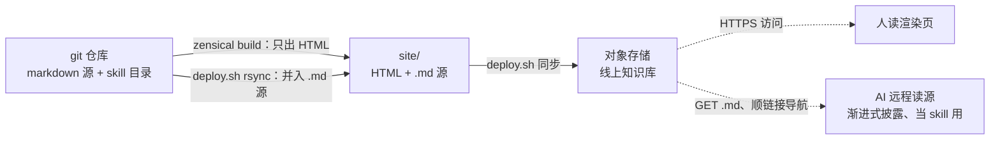
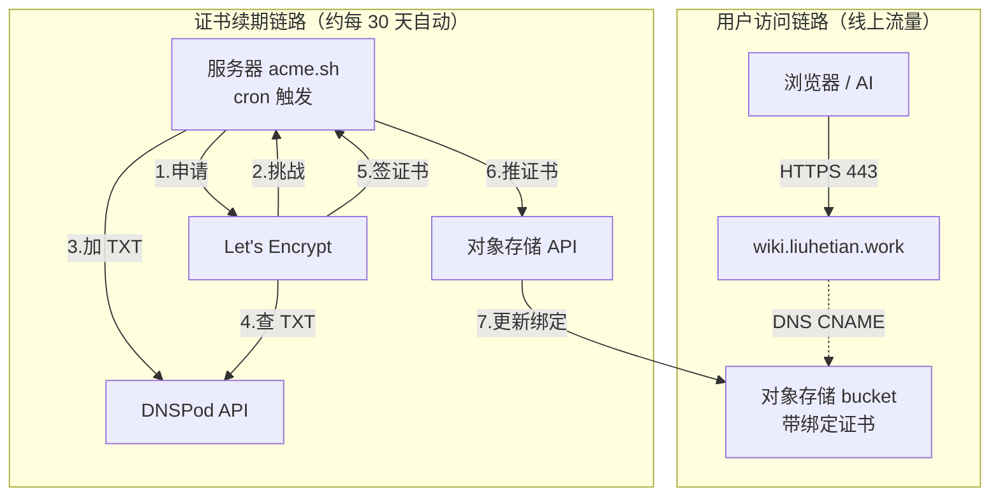

# 用对象存储部署 AI 友好的个人知识库

本文记录本wiki知识库的定位设计和部署过程，围绕以下两点：

- **对 AI 友好** —— 构建产物不只有给人看的 HTML，还有一份随线上一起发布的 markdown 源。给 AI 一个 [URL](https://wiki.liuhetian.work/index.md)，就可以用markdown格式读取知识库里记录的想法和知识，对于复杂的互相引用结构，ai也能顺着相对链接一层层读进去，实现渐进式披露，从而把整个 wiki 当**远程 skill** 用。
- **托管在对象存储上** —— 我终于意识到别人的静态网站都不部署在自己的服务器，用服务器部署带宽慢，服务器到期还要迁移实在是不方便，心血来潮部署好后慢慢忘掉，已经搞丢了好多原来做的小网页。

**本文重点AI 友好仍然是建立在人读的基础之上的锦上添花**。所以本文先把"AI 友好"立成一个可检验的标准，再讲为什么、然后是设计与选型；至于具体怎么部署落地，因为强依赖腾讯云、篇幅也长，另拆成一篇[实操手册](reference/deploy.md)。静态站点生成器选的是 Zensical[^zensical]，一个rust重写的mkdocs + material主题，对象存储用的是腾讯云 COS。

## 什么算"对 AI 友好"：五个可检验的问题 { #标准 }

全文的一切选择都围绕"对 AI 友好"，而这个词太容易说成口号，所以开篇先定义为一组**可检验的问题** —— 后文每个设计、每次选型，都对着这张表交代。注意第一条"人可读"：它严格说不属于"AI 友好"，却是整件事不沦为平凡解的前提 —— 如果只伺候 AI，裸发一堆 `.md` 就完了，谈不上 wiki。所以对 AI 友好 = 在人可读的前提下，再解决后面四个问题：

| 问题 | 达标线 |
|---|---|
| **人可读** | 有给人的渲染视图：排版、导航、mermaid 架构图、表格都正常呈现，人愿意直接阅读 |
| **可获取** | 网络能通（特别是要方便国内网络），一个裸 GET 就能 200 |
| **AI 可读** | GET 到的是 markdown 纯文本，不是 HTML，节约token消耗 |
| **可寻址** | 页内引用本身就是可拼接的相对 URL，顺引用自动走到对方；**不限 md** —— 被引用的 `.py` / `.sh` 等文件同样拼得到真身，零潜规则 |
| **单源** | 人的视图和 AI 的视图由同一份源机械生成，**绝不双写** |

这套标准的判别力，在于几种现成方案各卡在**不同的条**上：

| 方案 | 卡在哪 |
|---|---|
| 只发 HTML 的普通站点 | 未能实现：AI 可读 |
| 把仓库推上 GitHub、AI 直读 raw 链接 | 未能实现：人可读（没有渲染视图）＋ 可获取（rate limit、bot 403、国内不通或者不稳定） |
| llms.txt 生态[^llmstxt]（pydantic / uv 实测） | 未能实现：可寻址 —— 页内链接被改写指回渲染页，图断了（[下文实测](#llmstxt)） |
| 用自己的服务器部署 | 未能实现：网速慢，人读和ai获取都难受 |


## 背景：个人 wiki 正在变成刚需 { #背景 }

为什么 2026 年还要自己搭 wiki？因为"维护 wiki"这件事的成本被 AI 改写了。

Karpathy 在 2026 年 4 月发过一份只有 75 行的 gist —— [llm-wiki](https://gist.github.com/karpathy/442a6bf555914893e9891c11519de94f)[^karpathy]，讲他怎么用 LLM agent 维护个人知识库。整个体系只有三个部件：

!!! note "llm-wiki 的三个部件"

    === "`raw/` 原始材料"

        输入层，**不可变** —— 原始材料进来就原样保存、不再修改，是 LLM 加工的原料。

    === "`wiki/` 知识网络"

        产出层 —— LLM 读完 `raw/`，把要点整合进这里的 markdown 网络，交叉引用、索引、旧结论的更新全由它维护。

    === "`CLAUDE.md` 约定"

        规矩层 —— 一份约定文档，告诉 LLM 材料怎么进、wiki 怎么组织、更新时要守什么规矩。

其实这里也藏了一点从低级原始数据到中级中间过程再到最终高级结果接口的的演化过程和想法[完整项目](../prediction-loop.md)，可以参考里面。

回到wiki主题上，他的想法是人只管选材料、提问题，wiki 全部由 LLM 写和维护 —— 一个研究主题他攒到了上百篇、几十万字，自己没直接写过一个字。文中解释"为什么这事现在成立了"：

> The tedious part of maintaining a knowledge base is not the reading or the thinking — it's the bookkeeping. [...] Humans abandon wikis because the maintenance burden grows faster than the value. LLMs don't get bored, don't forget to update a cross-reference, and can touch 15 files in one pass. The wiki stays maintained because the cost of maintenance is near zero.

人弃掉自己的 wiki 从来不是因为懒，而是**维护负担的增速快过价值的增速** —— 每多一篇笔记，要更新的交叉引用、要核对的旧结论、要重排的索引都在变多，迟早入不敷出。LLM 把这项边际成本压到近零之后，个人 wiki 第一次从"迟早荒废的工程"变成**能复利的资产**。这就是"现在人人需要自己的知识库"的底层原因——不是知识变多了，是维护第一次变得免费了。

他还给了一个很准的类比：

> Obsidian is the IDE; the LLM is the programmer; the wiki is the codebase.

注意这个闭环停在哪：Obsidian、本地 git 仓库 —— **这是"维护端"的故事**。wiki 被 LLM 写出来之后怎么被*用*，他的答案还是同一台电脑前的那个人和那个 agent。本文的想法是接在他的文章之后：**wiki整理好后，只需要一份额外的原文同步，就可以把这个wiki发布成便于AI阅读消费的带 URL 的 markdown 源**，让任何的AI客户端根据链接直接读、也可以顺链接阅读，实现 skill 一样的渐进式披露。相当于有了维护端，还可以接上消费端。

??? abstract "原文存档：`llm-wiki.md`（clone 自 gist，2026-07-03）"

    真身在本文 [`assets/llm-wiki.md`](assets/llm-wiki.md)，随 wiki 一起发布、线上有独立 URL 可直接 GET。以下为原文：

    ```markdown
    --8<-- "posts/cos-wiki-deploy/assets/llm-wiki.md"
    ```

## 设计：一颗语法糖，两个约定 { #设计 }

这是这个知识库跟普通博客最不一样的地方，也是标题里那半句的由来。所谓"AI 友好"不是加了什么 AI 功能，而是**线上保留 markdown 源、让 AI 顺着 URL 一层层读进去**。实现它也不靠插件（llms.txt 系插件偏重[^mkdocs-llms]，我的场景用不上完整实现，差别见[下文实测](#llmstxt)），只靠 deploy.sh 里一行 rsync 的语法糖：**把 `docs/` 源树原样镜像进构建产物，跟 HTML 一起发布**。

这行 rsync 为什么够用、又为什么不跟 HTML 打架，得看 `zensical build` 这步：它把 `docs/` 里每个 `.md` 渲染成 HTML（`use_directory_urls` 让 `foo.md` 落到 `foo/index.html`，非 md 文件原样搬、软链还解引用成真身），但**只产 HTML、不留一个 `.md` 源**。所以"线上保留 md 源"这半件事 build 帮不上，正好留给那行 rsync 补；而 `foo.md` 这个 key 又被 build 空着（页面占的是 `foo/index.html`），补进来的源和 HTML 同域不撞 —— 人访问 `/foo/` 拿 HTML，AI 访问 `/foo.md` 拿同一份源。

对照[开头立的标准](#标准)，五条就此各就各位：

| 标准 | 靠什么 | 怎么落地 |
|---|---|---|
| 人可读 | Zensical | 渲染出 HTML 站点，排版、导航、mermaid、表格齐全 |
| 可获取 | 托管（见[选型](#选型)） | 对象存储直出，裸 GET 即 200 |
| AI 可读 | 语法糖 | `wiki.liuhetian.work/index.md`、`.../skills/fastapi/reference/rag.md` 直接 GET 到纯 markdown，不用 clone、不用爬 HTML |
| 单源 | 语法糖 | 人看渲染页、AI 读同名 `.md`，两个视图同出一份源，不存在双写 |
| 可寻址 | 语法糖 + MkDocs 写作约定 | 源文件本来就用相对路径互引（`reference/rag.md`），镜像保持源树结构，链接不经改写就是合法 URL |

其中"可寻址"正是渐进式披露的骨架：AI 从入口 `/index.md` 进，按 URL 相对规则一跳跳往下拼，自己就能走到任意深处 —— Claude skill 的渐进式披露（入口只给索引 + 链接，用到哪层才展开哪层），原样搬到远程 HTTP 上。实测过：一个没有任何先验知识的 AI，只给它 `/index.md`，三跳（首页 → FastAPI 入口 → RAG 子页）就找到了"fastapi 里怎么用 rag"。

语法糖解决"读得到"，读到的东西长什么样，由两个写作约定决定 —— 也是渐进式披露的两级：

- **结构即 skill**：整个 `docs/skills/` 按 [Anthropic 官方 skill 标准目录](https://platform.claude.com/docs/en/agents-and-tools/agent-skills/best-practices)组织（`index.md` + `reference/` + `assets/`），跟 `~/.claude/skills/` 一一对应。AI 顺 URL 读到的目录形态，就是它熟悉的 skill 形态 —— **整个 wiki 可以直接当远程 skill 喂给 Claude Code**；哪怕一篇还没资格独立成 skill 的普通文章（比如你正在读的这篇），只要是 `docs/` 下的 `.md`，同样有 URL、能被顺链跟随 —— **写文章 = 顺手就喂了 AI**。
- **代码即引用，真身可远程取**：文章里的代码用 `--8<--` snippet 引用仓库里的**真实文件**，构建时注入 HTML（文档跟实际跑的代码**永不脱节**）；真身软链进文章 `assets/`、随源一起发布 —— 这是披露的最深一级：AI 顺 URL 一路走到底，取到的是最新的 `deploy.sh`、证书脚本本身，"可寻址"就此覆盖到非 md 文件。

!!! note "nav 随便重排，链接图纹丝不动 —— 两套信息架构是解耦的"
    一个容易担心的点：`mkdocs.yml` 里的 `nav` 哪天重新分组、改名、排序，会不会把 AI 的导航弄断？**不会，因为 nav 根本不在 AI 的链路上。** MkDocs 的规则是：页面路径 —— HTML 和 md 源都一样 —— 只由 `docs/` 里的**文件位置**决定；`nav` 只控制给人看的导航树（分组、排序、显示名），是纯"策展层"。本站就是活例子：导航里"工作口味"这个分组在磁盘上并不存在，`docs/` 里只有 `skills/fastapi/...` —— 人看到的是策展后的目录，AI 走的是 `skills/fastapi/index.md → reference/rag.md` 这张由文件位置 + 相对引用织出来的图。所以给人重排门面随便折腾，md 互引一根都不断；真正动图的操作只有**挪文件** —— 链接跟着文件树走，这也正是下文"源树镜像能让链接图天然闭合"的同一个原因。

### 和 llms.txt 的对比 { #llmstxt }

llms.txt 提案解决的是普通网站从 html 到 md 的问题，本文场景起点已经是 md、也天然有 md 之间的相对位置，一行 rsync 已经把**内容层**的活干完了。但 llms.txt 还有一层功能 rsync 没覆盖：**它是不知情 AI 爬虫的约定入口**（Perplexity、AI 搜索器等按约定去 `/llms.txt` 找站点结构，类比 `robots.txt` / `sitemap.xml`），这个"发现层"的价值不能白让。

所以本站也做了兼容，做法尽可能省：**让 `docs/index.md` 本身按 llms.txt 规范写**（H1 用站点名 / 首段 blockquote 做 summary / H2 分区带链接列表 / 链接一律指 `.md`），build 时一句 `cp site/index.md site/llms.txt` 复制成 llms.txt 端点。**写作时只维护 index.md 一份** —— 人访问 `/` 拿渲染 HTML，AI 访问 `/llms.txt` 或 `/index.md` 拿同一份 markdown 源。

清单粒度这一步走**规范作者 Jeremy Howard 的原意** —— 他在提案原文里用词是 "curated overview / most pertinent links"，并明确把 sitemap.xml"太大装不下 LLM context 窗口、含大量无关信息"当反例。本站首页只列 8 条精选顶级入口，AI 顺相对链接自己往下钻，正是他心目中的形态。这跟主流 mkdocs 站（uv 53 条、pydantic 95 条把整份 nav 摊平到 llms.txt）不同 —— 后者其实是规范作者反对的 sitemap 路线，只是插件生态默认从 nav 全量派生，路径依赖形成了主流。对本 wiki 而言，"精选入口 + AI 顺链接下钻" 也正好是上文语法糖那一节已经确立的"渐进式披露"哲学，选精选路线跟自身设计天然合拍。

??? abstract "原文存档：`llms-txt.md`（clone 自 llmstxt.org/index.md，2026-07-06）"

    真身在本文 [`assets/llms-txt.md`](assets/llms-txt.md)，随 wiki 一起发布、线上有独立 URL 可直接 GET。以下为原文：

    ````markdown
    --8<-- "posts/cos-wiki-deploy/assets/llms-txt.md"
    ````

所以本文建立标准，然后证明一个小语法糖能实现所要的需求，顺便再用一句 `cp` 兼容了 llms.txt 协议的"发现层"入口，最后再加上写作规范优化和工程层面部署的经验，构成了本篇文章的全部创新点。

### 部署在远程，比 clone 到本地强在哪

- **最新版本**：每次读到的是最新版本，对skill会不断优化很重要
- **图片渲染效果人可以看**：同一套内容，AI 读 `.md` 源，人看渲染页 —— mermaid 架构图、表格、截图全渲染出来。对**设计类 skill**（系统架构、页面布局、视觉规范）帮助很大，而且不止图：连**可交互的 HTML 单页**都能嵌进文章直接玩 —— 纯客户端的自包含 SPA（比如一个 React demo）丢进 `assets/` 随 wiki 一起发布，iframe 同域嵌入，人玩交互效果、AI 读同一 URL 下未压缩的源码，规矩与活例见[写作规范·嵌入交互单页](../../skills/writing/mkdocs-wiki/index.md#iframe-demo)。




一句话：**人访问渲染页，AI 顺着 URL 读同一套 markdown 源、一层层自己走进去 —— 一个部署在对象存储上、远程可导航的 skill 知识库；成体系的 skill 目录和普通的单篇博客，它承载得一样好。** 更进一步，源本身在 git 里版本化，AI 读完还能改一改、一行 `./deploy.sh` 重新发布。

## 选型：为什么是对象存储，而不是服务器 { #选型 }

因为对象存储没有带宽问题，也不担心服务器过期（维护成本低）。


整体架构是两条完全分开的链路 —— 这是理解整个方案的关键：



**服务器只在续期链路里出现**，用户访问完全不经过它。

## 落地：跑起来 { #落地 }

选型和设计都定了，剩下是把它真正跑起来——建 bucket、绑自定义域名、HTTPS 自动续期，以及完整代码和一次性安装命令。这部分实操较长、且强依赖腾讯云 COS（强制下载、CNAME、证书 hook 这些坑都在里面），单独拆成了一篇手册：

**→ [腾讯云 COS + acme.sh：部署实操手册](reference/deploy.md)**

如果你只想看"为什么这么设计"，读到这里就够了；要照着搭一套，顺链接进手册。


[^zensical]: [Zensical](https://zensical.org/) —— Material for MkDocs 团队的下一代静态站点生成器，Rust 内核 + 兼容 `mkdocs.yml`。
[^karpathy]: [karpathy/llm-wiki.md](https://gist.github.com/karpathy/442a6bf555914893e9891c11519de94f) —— "A pattern for building personal knowledge bases using LLMs."，2026-04。本文 `assets/` 存档了 2026-07-03 clone 的版本。
[^llmstxt]: [The /llms.txt file](https://llmstxt.org/)（Jeremy Howard，2024-09-03）· [Answer.AI 发布博文](https://www.answer.ai/posts/2024-09-03-llmstxt.html)。本文 `assets/` 存档了 2026-07-06 clone 的版本（取自 llmstxt.org/index.md）。
[^mkdocs-llms]: 插件如 [mkdocs-llms-source](https://github.com/TimChild/mkdocs-llms-source)（把原始 .md 源复制进构建产物并生成 llms.txt）、[pawamoy/mkdocs-llmstxt](https://github.com/pawamoy/mkdocs-llmstxt)。FastAPI 的状态见 [typer discussion #1114](https://github.com/fastapi/typer/discussions/1114)（2025-01 发起 "make docs LLM friendly"，至本文更新时无维护者回应）。
