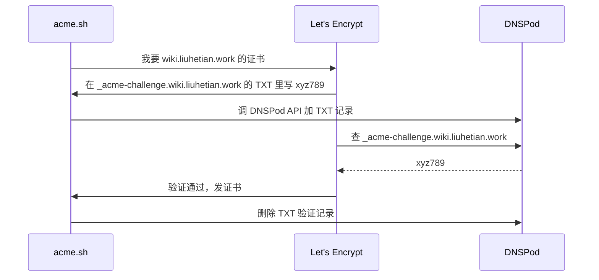
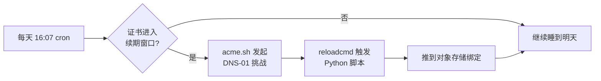

# 腾讯云 COS + acme.sh：部署实操手册

!!! abstract "这是落地篇"
    本篇是[《用对象存储部署 AI 友好的个人知识库》](../index.md)的实操手册。主文讲清楚了**为什么这么设计**——可检验的 AI 友好标准、一颗 rsync 语法糖、两个写作约定，以及为什么选对象存储而非服务器；本篇把它**跑起来**：从建 bucket、绑域名，到 HTTPS 自动续期，再到完整代码与一次性安装命令。腾讯云 COS 特有的坑（强制下载、CNAME、证书 hook）都收在这里。

    [← 回到主文：设计与选型](../index.md)

## 落地 { #落地 }

### 第一步：建 bucket

腾讯云控制台 → 对象存储 → 创建 bucket（其他家对象存储同理）：

- 名称：随便起，比如 `wiki-1307341066`
- 访问权限：**公有读私有写**
- **地域**：这里有个**关键选择**（详见后面"强制下载"一节）：

=== "海外区域"

    `ap-hongkong`、`ap-singapore` 等 —— 无强制下载、不需备案，最省事。

=== "国内区域（本文路线）"

    `ap-shanghai`、`ap-chengdu` 等 —— 国内访问快，但默认强制下载，必须绑中国大陆 ICP 备案的域名才能解除。

建好后：

- 基础配置 → 静态网站 → **启用**
- 索引文档：`index.html`
- 错误文档：`404.html`

### 第二步：本地 Zensical 项目

```bash
mkdir wiki && cd wiki
uv init --no-readme
uv add zensical
mkdir docs
echo "# 首页" > docs/index.md
```

最简 `mkdocs.yml`（仅用来跑通，真实配置见文末完整版）：

```yaml
site_name: 我的知识库
theme:
  name: material
  language: zh
nav:
  - 首页: index.md
```

构建 + 预览：

```bash
uv run zensical build   # 产物在 site/
uv run zensical serve   # 本地预览 http://127.0.0.1:8000
```

### 第三步：deploy.sh —— 一次构建，两个视图 { #第三步 }

这一步是"AI 友好"从设计变成现实的地方，值得多说几句。

Zensical 本身**没有**"把 markdown 源保留进构建产物"的功能 —— 命令只有 `build` / `serve`，没有插件钩子，官方 roadmap 未来一年也没这个计划[^roadmap]。所以这一层是 `deploy.sh` 自己实现的，核心四步：

```bash
rm -rf site && uv run zensical build    # 1. 干净构建 —— HTML 视图 (1)
rsync -am --include='*/' --include='*.md' --exclude='*' docs/ site/  # 2. md 源镜像进 site/ —— AI 视图 (2)
coscmd upload -rs --delete -y ./ /      # 3. site/ 整体镜像到桶根，顺手清掉桶里陈旧文件
coscmd upload -r --include '*.md' \
    -H 'Content-Type: text/markdown; charset=utf-8' ./ /  # 4. 修 .md 的 Content-Type (3)
```

1. **先 `rm -rf site` 再 build 不能省**：第 3 步 `--delete` 以 `site/` 为准做全量镜像，本地残留的旧文件会"保护"桶里的陈旧内容不被清掉。
2. **`.md` 和 `.html` 的 key 不冲突**：`use_directory_urls` 下页面渲染成 `/x/index.html`，源是 `/x.md`，天然错开 —— md 源镜像进 `site/` 不会覆盖任何 HTML。
3. **这一步不能省**：coscmd 默认把 `.md` 传成 `application/octet-stream`，浏览器会直接下载而不是显示 —— 对"给 AI/人直接读源"这个用途是致命的。

装 `coscmd`（腾讯云 COS 的命令行；其他家换成对应 CLI，如 `aws s3 sync`、`rclone`）：

```bash
uv add --dev coscmd
```

凭证写 `.env`（**记得加进 `.gitignore`**，模板见文末）。完整脚本见文末 [`deploy.sh`](#完整代码) snippet —— 引用的就是仓库里真跑的那份。

!!! warning "踩坑：别让 `uv run --directory` 把整个项目传上去"
    最早我写的是 `cd site && uv run --directory .. coscmd upload -rs ./ /`，但 `uv run --directory` 会把工作目录切回项目根，导致 coscmd 把整个项目（**包括 `.venv/` 和 `.env`！**）都往对象存储传。**绝对不能这样写**。正确做法是 `cd` 进 `site/` 后直接用绝对路径调用 venv 里的 coscmd。

!!! tip "AI 友好这层跟 zensical 无关，怎么升级都不怕"
    复制 md 源、镜像上传、修 Content-Type 这三件事**零 zensical 依赖** —— 哪怕以后 Zensical 大改、甚至换回 MkDocs 或别的生成器，这层照常工作。真正依赖 zensical 的只有渲染层（snippets 等 pymdownx 扩展），版本锁在 `uv.lock` 里不会自动升，升级前本地 build 验证即可。

### 第四步：踩坑 —— 国内 bucket 的强制下载

第一次访问 bucket 默认域名时，**浏览器直接把 HTML 当成文件下载**。`curl -I` 看到响应正常：

```
HTTP/1.1 200 OK
Content-Type: text/html
```

但 `curl -i`（GET）看到 GET 请求多了两行：

```
Content-Disposition: attachment
x-cos-force-download: true
```

这是腾讯云为了响应监管"未备案不能搭网站"的策略：**国内区域 bucket 通过 `*.myqcloud.com` 域名访问 HTML 一律强制下载**，跟 bucket 配置无关。解除方式只有：

- **绑定中国大陆 ICP 备案过的自定义域名**，通过那个域名访问就豁免
- 或换到海外区域 bucket

我选了"绑备案域名"。

!!! note "换别家对象存储就没这道坎"
    这条是国内对象存储特有的监管策略。用 Cloudflare R2 / AWS S3 这类海外服务直接绑自定义域名就没有强制下载问题 —— 但国内访问速度和备案是另一笔账。

### 第五步：绑定自定义域名

前提：`liuhetian.work` 已经 ICP 备案。注意备案对象是**主域** `liuhetian.work`，不是 `www.liuhetian.work`，所有子域（`wiki`、`api` 等）自动覆盖。

绑定要做**两件事**，缺一不可 —— 这是我反复踩坑的关键：

**其一，在控制台添加自定义源站域名**。控制台 → bucket → 域名与传输管理 → **自定义源站域名 → 添加**：

- 域名：`wiki.liuhetian.work`
- **源站类型**：必须选 **静态网站源站**（不是默认源站！否则访问 `/` 会触发 ListBucket API，返回 `AccessDenied`）
- 是否启用 HTTPS：先关，证书后面再补

保存后，控制台会展示一个 **CNAME 目标**：

```
wiki-1307341066.cos.ap-chengdu.myqcloud.com
```

**其二，在 DNSPod 加一条 CNAME 记录**：

| 主机 | 类型 | 值 |
|---|---|---|
| `wiki` | CNAME | `wiki-1307341066.cos.ap-chengdu.myqcloud.com` |

等 5-30 分钟节点同步，访问 `http://wiki.liuhetian.work/` 不会再有强制下载头。

容易绕进去的几个概念：

!!! warning "CNAME 目标 和 源站类型 是独立的两件事"
    **CNAME 目标始终是 `<bucket>.cos.<region>.myqcloud.com` 这一个值**，不管"源站类型"选什么，腾讯云给的 CNAME 目标都不变。

    "源站类型"是后台的逻辑配置，决定 COS 接到请求后**按什么模式处理**：

    - **默认源站**：API 模式，访问 `/` 等于 ListBucket，匿名 → 403 AccessDenied
    - **静态网站源站**：把请求映射到 `index.html`，访问 `/` 直接出首页

    两个开关分别在两个地方配，**都要对**才行。我最早只改了 DNS 没改"源站类型"，结果一直 AccessDenied。

!!! info "为什么 CNAME 不能指 `cos-website.*` 域名"
    `<bucket>.cos.<region>.myqcloud.com` 是 COS 主入口，所有 bucket 路由都从这里进；`<bucket>.cos-website.<region>.myqcloud.com` 是辅助域名，**只在你直接用这个域名访问时**走静态网站模式，**后台不接受作为自定义 CNAME 目标**。腾讯云在主入口查 Host 头 → 查后台"该域名绑了哪个 bucket、什么模式" → 按那个模式处理。

!!! tip "push 上传走的根本不是自定义域名"
    coscmd / SDK 推内容时，URL 永远是 `<bucket>.cos.<region>.myqcloud.com`（API 域名 + SigV4 签名），跟 `wiki.liuhetian.work` 无关。**push 走 API 域名，访问走自定义域名，两条独立链路**。试图用自定义域名做 PUT 会被拒（自定义域名走静态网站模式，不接受写鉴权）。

### 第六步：HTTPS 自动化（重头戏）

证书有两种来源：

| 方案 | 有效期 | 续期方式 |
|---|---|---|
| 腾讯云免费 DV 证书 | **3 个月**（不是 1 年） | 控制台手动点"快速续期" + 手动重新绑定 |
| **Let's Encrypt + acme.sh** | **45 天**（2026 年 5 月起；此前是 90 天[^le-45]） | **acme.sh 自带 cron，全自动** |

我选 Let's Encrypt + acme.sh。但有个意外：

!!! warning "acme.sh 没有内置腾讯云 hook"
    acme.sh 的 80 个 deploy hook 里有阿里云 CDN、七牛云，但**没有任何腾讯云产品**。意味着"签证书"是自动的，但"把证书推到 COS"要自己写脚本。换成有内置 hook 的服务商（如 Cloudflare）这一步能省掉。

**acme.sh + DNS-01 挑战**。首次配置全部封装在 [`deploy-cert/install.sh`](#完整代码)（见文末 snippet），核心是这两条 —— 切 CA + 用 DNSPod 插件做 DNS-01（其他 DNS 服务商对应换插件名[^acme-dns]）：

```bash
~/.acme.sh/acme.sh --set-default-ca --server letsencrypt
# DP_Id / DP_Key 来自 .env；其他 DNS 服务商对应换插件名
~/.acme.sh/acme.sh --issue --dns dns_dp -d wiki.liuhetian.work --keylength ec-256
```

**DNS-01 挑战是什么**：



实质上是临时在 `liuhetian.work` 下创建一个四级子域名 `_acme-challenge.wiki.liuhetian.work` 的 TXT 记录，记录值就是 Let's Encrypt 出的题。验证完立刻删。

为什么必须 DNS-01 不能 HTTP-01：HTTP-01 要求域名指向的 80 端口能放挑战文件，但 `wiki.liuhetian.work` 指向的是对象存储，不是我们能控制的 web 服务器。

**自己写 hook 推证书到 COS**。完整脚本见文末 [`deploy-cert/deploy_cert_to_cos.py`](#完整代码) snippet。它从 acme.sh 注入的环境变量读证书路径，调一个 API 把证书绑到自定义域名，关键就是这个调用：

```python hl_lines="4-7"
client.put_bucket_domain_certificate(
    Bucket=os.environ["COS_BUCKET"],
    DomainCertificateConfiguration={
        "CertificateInfo": {                    # (1)
            "CertType": "CustomCert",
            "CustomCert": {"Cert": cert, "PrivateKey": key},
        },
        "DomainList": [{"DomainName": os.environ["COS_DOMAIN"]}],
    },
)
```

1. **重要**：`CertificateInfo` 这一层包装绝对不能漏。我第一版按 Python SDK 测试文件示例写少了这层，腾讯云返回 `InvalidArgument`。真正的 XML 结构以 Go SDK 测试代码为准[^cos-go-sdk]。

**注册 acme.sh reloadcmd**。`install.sh` 最后把"读 `.env` → 设环境变量 → 跑 Python 推证书"这串命令注册成 acme.sh 的 `--reloadcmd`。acme.sh 把它存到 `~/.acme.sh/wiki.liuhetian.work_ecc/wiki.liuhetian.work.conf`，**每次续期成功后自动跑**。

### 第七步：从此不用管 —— 自动续期循环

acme.sh 装的时候自动加了 cron：

```cron
7 16 * * * "/home/lht/.acme.sh"/acme.sh --cron --home "/home/lht/.acme.sh" > /dev/null
```

每天 16:07 跑一次：



45 天证书约每 30 天自动续一次。**你不需要做任何事** —— 2026 年 5 月 Let's Encrypt 把默认有效期从 90 天缩到 45 天[^le-45]，acme.sh 不用改任何配置，自己跟着缩短了续期间隔。

## 认知：值得单独记下来的几件事 { #认知 }

### DNS 记录"值"是什么

DNS 不是"动作"，是个 key-value 表，查表得到值：

| 记录类型 | 值 |
|---|---|
| A | IPv4 地址（`43.134.81.54`）|
| AAAA | IPv6 地址 |
| **CNAME** | 另一个域名（`xxx.cos.ap-chengdu.myqcloud.com`）|
| **TXT** | 任意字符串（ACME 挑战值 `PpWCFq...`、SPF、DMARC 等用这个）|
| MX | 邮件服务器 |
| NS | 权威 DNS 服务器 |

ACME 挑战必须用 TXT，因为挑战值是随机字符串 —— 既不是 IP 也不是域名。

### 服务器只是 runner，不参与流量

这个方案里我的服务器（`43.134.81.54`）从头到尾不在用户请求链路上。它只是个"定时跑续期脚本的机器"，跟 GitHub Actions runner 完全等价。未来想换成 GitHub Actions，Python 脚本能直接复用，只是触发方式从 cron 换成 workflow。

### Content-Disposition 头是 GET 才加

腾讯云的 `x-cos-force-download` 只在 GET 请求时追加，HEAD 请求看不到。所以验证 bucket 是否被国内强制下载策略影响，必须 `curl -i`（发 GET），不能只 `curl -I`（HEAD）。

## 未来展望
未来如果延伸到更复杂的情况，比如协助用户真的安装一些东西（比如一个skill)，这种复杂脚本，可能需要借助本仓库的github地址，脚本里进行clone，从而拿到一些目录并执行。

## 总成本 { #成本 }

| 项 | 成本 |
|---|---|
| 对象存储存储 + 流量 | 个人知识库流量基本免费 |
| 域名 | 已有，不算 |
| 证书 | Let's Encrypt 免费 |
| acme.sh | 开源 |
| 服务器 | 已有，且只跑 cron |
| 配置时间 | 第一次约 1 小时（含踩坑）|

后续维护：**0**。证书进入续期窗口后 acme.sh 自动续 + 自动推到对象存储。一年之内不需要登录控制台。

## 完整代码 { #完整代码 }

下面用 `--8<--` 折叠展示各文件原文 —— 引用的是**本文 `assets/` 里的真身**（`assets/` 里是指向仓库根的 symlink，源文件只一处、不双写；build 时把真身内容注入 HTML，也拷一份到 `assets/` 供直接下载）。

!!! tip "对 AI 友好"
    真身都在仓库根（含 `deploy-cert/`）。如果你是直接读 git 仓库的 AI，无需展开本节 —— 打开仓库根对应文件即最新版。

!!! warning "唯一例外：`mkdocs.yml` 无法软链进 docs"
    实测 Zensical 对 `docs/` 里出现的 `.yml` / `.yaml` 极其敏感 —— 哪怕改名软链进去都会搅乱路由、让文章"消失"（build 报 `page does not exist`）。所以 `mkdocs.yml` 只能靠 snippets 从项目根引用：HTML 视图完整可见、跟真身不脱节，但**线上没有它的独立 URL** —— 本 wiki 唯一的例外，已接受。`.toml` / `.py` / `.sh` / `.gitignore` 软链都正常。

??? note "项目结构（一览）"

    ```text
    zensical-wiki/
    ├── docs/                               ← 唯一内容源，连同 .md 全部随线上发布
    │   ├── index.md
    │   ├── posts/
    │   │   ├── index.md                    ← 文章栏目着陆页
    │   │   ├── cos-wiki-deploy/            ← 本文（index.md 概览 + reference/ 手册 + 共享 assets/）
    │   │   │   ├── index.md                ← 概览：标准 / 背景 / 设计 / 选型
    │   │   │   ├── reference/
    │   │   │   │   └── deploy.md            ← 落地实操手册（本页）
    │   │   │   └── assets/                 ← 运行文件放软链（真身在仓库根，不双写）
    │   │   │       ├── deploy.sh           → ../../../../deploy.sh
    │   │   │       ├── install.sh          → ../../../../deploy-cert/install.sh
    │   │   │       ├── deploy_cert_to_cos.py → ../../../../deploy-cert/deploy_cert_to_cos.py
    │   │   │       ├── pyproject.toml      → ../../../../pyproject.toml
    │   │   │       ├── llm-wiki.md         ← 外部资料存档（真身，非软链）
    │   │   │       └── llms-txt.md         ← 外部资料存档（真身，非软链）
    │   │   └── wiki-build-log.md           ← 建站手记
    │   └── skills/<skill>/                 ← 同样 index.md + reference/ + assets/
    ├── deploy-cert/                        ← SSL 证书续期（真身）
    │   ├── deploy_cert_to_cos.py
    │   └── install.sh
    ├── mkdocs.yml · deploy.sh · pyproject.toml · .gitignore   ← 仓库根真身
    └── .env                                ← 凭证（不入版本控制）
    ```

??? abstract "`mkdocs.yml` — Zensical 站点配置"

    ```yaml
    --8<-- "mkdocs.yml"
    ```

??? abstract "`.gitignore` — 关键排除项"

    ```text
    --8<-- ".gitignore"
    ```

??? abstract "`deploy.sh` — 构建 + 同步两个视图到对象存储"

    ```bash
    --8<-- "posts/cos-wiki-deploy/assets/deploy.sh"
    ```

??? abstract "`deploy-cert/install.sh` — 首次配置 acme.sh + 注册 hook"

    ```bash
    --8<-- "posts/cos-wiki-deploy/assets/install.sh"
    ```

??? abstract "`deploy-cert/deploy_cert_to_cos.py` — acme.sh 调用的证书推送脚本"

    ```python
    --8<-- "posts/cos-wiki-deploy/assets/deploy_cert_to_cos.py"
    ```

??? abstract "`pyproject.toml` — uv 依赖清单"

    ```toml
    --8<-- "posts/cos-wiki-deploy/assets/pyproject.toml"
    ```

    其中 `coscmd` 会带来 `cos-python-sdk-v5` 作为传递依赖，这是 `deploy_cert_to_cos.py` 用到的。

??? abstract "`.env` 模板 — 凭证占位（绝对不要 commit）"

    ```bash
    # ----- 对象存储（腾讯云 COS）：部署内容 + 给证书 hook 用 -----
    COS_BUCKET=wiki-1307341066
    COS_APPID=1307341066
    COS_REGION=ap-chengdu
    COS_SECRET_ID=AKID...你的 SecretId
    COS_SECRET_KEY=你的 SecretKey
    COS_DOMAIN=wiki.liuhetian.work

    # ----- acme.sh：自动 SSL 证书 -----
    ACME_EMAIL=you@example.com

    # DNSPod API Token：去 https://console.dnspod.cn/account/token 创建后填
    DP_Id=...
    DP_Key=...
    ```

## 一次性安装命令（拷下来直接跑）

```bash
# 1. 项目初始化
mkdir wiki && cd wiki
uv init --no-readme
uv add zensical
uv add --dev coscmd

# 2. 把上面所有文件写好 + 填好 .env

# 3. 首次部署内容
./deploy.sh

# 4. 首次配置 SSL 自动化
./deploy-cert/install.sh
```

之后每次写完文章只跑 `./deploy.sh` 一行，两个视图（HTML + md 源）同时更新，证书永久无需操心。

[^roadmap]: [Zensical roadmap](https://zensical.org/about/roadmap/) —— 未来 12 个月聚焦模块系统（2026 初开放）、组件系统、CommonMark、搜索等，未涉及 markdown 源输出 / llms.txt。
[^le-45]: [Let's Encrypt - Decreasing Certificate Lifetimes to 45 Days](https://letsencrypt.org/2025/12/02/from-90-to-45/) —— 官方公告，2026 年 5 月 13 日起默认证书有效期从 90 天缩短到 45 天。
[^acme-dns]: [acme.sh DNS API 列表](https://github.com/acmesh-official/acme.sh/wiki/dnsapi) —— 各家 DNS 服务商对应的 acme.sh 插件名（Cloudflare/阿里云/AWS Route53 等都有）。
[^cos-go-sdk]: [腾讯云 COS Go SDK 测试代码](https://github.com/tencentyun/cos-go-sdk-v5/blob/master/bucket_domain_test.go) —— `BucketPutDomainCertificateOptions` 的标准结构体定义，明确给出了 `CertificateInfo` → `CertType` + `CustomCert` 的嵌套层级。
