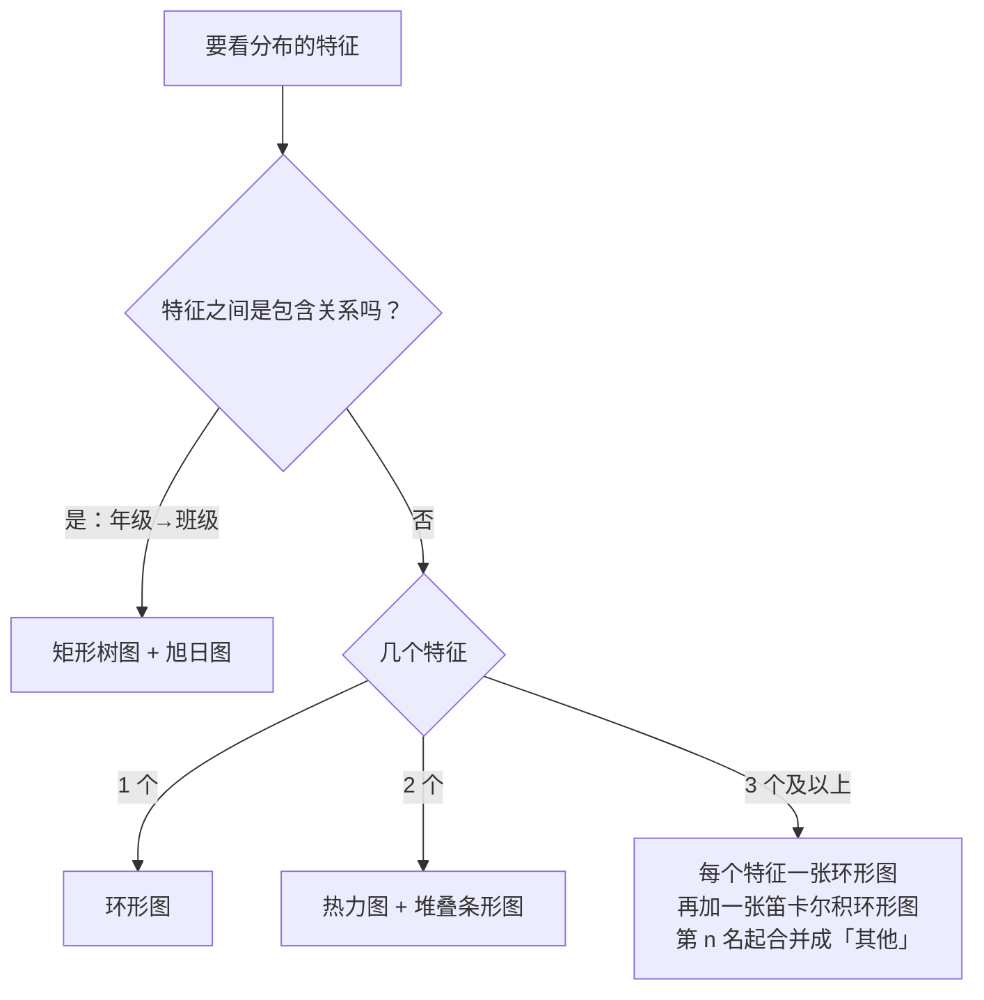

# 单维度分布：什么情况画什么图

单维度分布只回答一个问题：**这批数据按某几个标签分组以后，每一组有多少**。值用的是 count（人次）或 nunique（人数）这类外延量，能加总、能算份额，所以可以画成扇区、面积或者堆叠。均分这类内涵量放到[联合分析](cross-analysis.md)里讲。

用什么图，只看两件事：



下面每一节的顺序都一样：pandas 代码 → pivot 结果 → 图 → 怎么读。所有代码共用这段开头，数据是 [`scores.csv`](../assets/data-analysis/scores.csv)：

```python
import pandas as pd

df = pd.read_csv("scores.csv")
# 定序特征显式给顺序，不然按字符串排：「高三」排到「高二」前面，「不及格」排到「优」前面
df["分数段"] = pd.Categorical(df["分数段"], ["优", "良", "及格", "不及格"])
df["科目"] = pd.Categorical(df["科目"], ["语文", "数学", "英语"])
df["年级"] = pd.Categorical(df["年级"], ["高一", "高二", "高三"])
df["班级"] = pd.Categorical(df["班级"], df["班级"].unique())  # CSV 里已按年级排好
```

## 一个特征：环形图

```python
pt = df.pivot_table(index="分数段", aggfunc="size", observed=False)
```

| 分数段 | 人次 |
|:--|--:|
| 优 | 122 |
| 良 | 214 |
| 及格 | 429 |
| 不及格 | 66 |

```echarts
{
  "height": 340,
  "tooltip": {"trigger": "item", "formatter": "{b}：{c} 人次（{d}%）"},
  "legend": {"bottom": 0},
  "series": [{"type": "pie", "radius": ["42%", "65%"], "center": ["50%", "45%"], "label": {"formatter": "{b}\n{d}%"}, "data": [{"name": "优", "value": 122, "itemStyle": {"color": "#2e7d32"}}, {"name": "良", "value": 214, "itemStyle": {"color": "#1976d2"}}, {"name": "及格", "value": 429, "itemStyle": {"color": "#f9a825"}}, {"name": "不及格", "value": 66, "itemStyle": {"color": "#c62828"}}]}]
}
```

- 只有一个特征时，关心的是**各部分占整体几成**，这正是扇区擅长表达的；中间挖空，比实心饼图更容易比较相邻扇区的弧长
- 这里数的是人次：一个学生三科各算一次。全校 277 人，831 人次，一半多落在「及格」，不及格占 7.9%
- 分数段是**定序**特征，顺序要显式告诉 pandas（开头那段 `pd.Categorical`），否则表和图都会按字符串排成「不及格、优、及格、良」

## 两个平级特征：热力图 + 堆叠条形图 { #two-features }

两个特征能交叉，前提是它们是**同一个个体的两个属性**：一个学生既有语文成绩，也有英语成绩，交叉才能回答「语文优的人，英语怎么样」。长表里语文和英语藏在「科目」这一列的值里，所以先转宽，一人一行，三科的分数各占一列；然后**每一科按自己的标准分箱**：语文沿用优、良、及格、不及格四档，英语只分好、差两档（80 分为界）。两条轴的刻度不一样，正好提醒你这是两个不同的特征在交叉，而不是同一个「分数段」在三科上重复。语文段和英语段没有包含关系，四个语文档各自都可能配上两个英语档，组合就是 4 × 2 的笛卡尔积：

```python
wide = df.pivot(index=["班级", "姓名"], columns="科目", values="分数").reset_index()  # 转宽：一人一行，三科三列
bins = {  # 每一科自己的分箱标准，标签从低到高；数学的三档下一节用
    "语文": ([0, 60, 80, 90, 101], ["不及格", "及格", "良", "优"]),
    "数学": ([0, 60, 90, 101], ["没学会", "普通人", "天才"]),
    "英语": ([0, 80, 101], ["差", "好"]),
}
for subj, (edges, labels) in bins.items():
    wide[subj + "段"] = pd.cut(wide[subj], edges, right=False, labels=labels)

pt = wide.pivot_table(index="语文段", columns="英语段", aggfunc="size", observed=False)
```

| 语文段＼英语段 | 差 | 好 |
|:--|--:|--:|
| 不及格 | 18 | 0 |
| 及格 | 115 | 13 |
| 良 | 28 | 56 |
| 优 | 2 | 45 |

转宽以后一人一行，`size` 数出来的就是**人数**（277），不再是人次。`pd.cut` 的标签按从低到高给，所以这一节和下一节的表、轴都是从低到高。热力图把这张表原样涂色，看的是**哪一格最深、哪片区域是空的**：

```echarts
{
  "height": 340,
  "tooltip": {"position": "top"},
  "grid": {"left": 70, "right": 30, "top": 30, "bottom": 90},
  "xAxis": {"type": "category", "name": "英语段", "nameLocation": "middle", "nameGap": 28, "data": ["差", "好"], "splitArea": {"show": true}},
  "yAxis": {"type": "category", "name": "语文段", "data": ["不及格", "及格", "良", "优"], "splitArea": {"show": true}},
  "visualMap": {"min": 0, "max": 115, "calculable": true, "orient": "horizontal", "left": "center", "bottom": 0, "inRange": {"color": ["#f7fbff", "#08306b"]}},
  "series": [{"type": "heatmap", "label": {"show": true}, "data": [[0, 0, 18], [1, 0, 0], [0, 1, 115], [1, 1, 13], [0, 2, 28], [1, 2, 56], [0, 3, 2], [1, 3, 45]]}]
}
```

堆叠条形图看的是**每一行怎么拆开**。拿谁当纵轴，要看你想比较什么；在代码里只是 `pt` 和 `pt.T` 的区别：

=== "纵轴 = 语文段"

    ```echarts
    {
      "height": 300,
      "tooltip": {"trigger": "axis", "axisPointer": {"type": "shadow"}},
      "legend": {"top": 0},
      "grid": {"left": 70, "right": 30, "top": 40, "bottom": 30},
      "xAxis": {"type": "value"},
      "yAxis": {"type": "category", "name": "语文段", "data": ["不及格", "及格", "良", "优"]},
      "series": [{"name": "英语 差", "type": "bar", "stack": "总量", "emphasis": {"focus": "series"}, "data": [18, 115, 28, 2], "itemStyle": {"color": "#c62828"}}, {"name": "英语 好", "type": "bar", "stack": "总量", "emphasis": {"focus": "series"}, "data": [0, 13, 56, 45], "itemStyle": {"color": "#2e7d32"}}]
    }
    ```

=== "纵轴 = 英语段"

    ```echarts
    {
      "height": 260,
      "tooltip": {"trigger": "axis", "axisPointer": {"type": "shadow"}},
      "legend": {"top": 0},
      "grid": {"left": 70, "right": 30, "top": 40, "bottom": 30},
      "xAxis": {"type": "value"},
      "yAxis": {"type": "category", "name": "英语段", "data": ["差", "好"]},
      "series": [{"name": "语文 不及格", "type": "bar", "stack": "总量", "emphasis": {"focus": "series"}, "data": [18, 0], "itemStyle": {"color": "#c62828"}}, {"name": "语文 及格", "type": "bar", "stack": "总量", "emphasis": {"focus": "series"}, "data": [115, 13], "itemStyle": {"color": "#f9a825"}}, {"name": "语文 良", "type": "bar", "stack": "总量", "emphasis": {"focus": "series"}, "data": [28, 56], "itemStyle": {"color": "#1976d2"}}, {"name": "语文 优", "type": "bar", "stack": "总量", "emphasis": {"focus": "series"}, "data": [2, 45], "itemStyle": {"color": "#2e7d32"}}]
    }
    ```

- 两张图用的是同一张表，热力图适合找极值格和空白区，堆叠条形图适合比较每一行的构成
- 深色从左下走到右上：语文不及格的 18 人英语全差，语文及格的 128 人里 115 人英语差，语文优的 47 人里 45 人英语好。「良」是分水岭，56 比 28，从这一档起英语好的开始占多数。语文和英语高度同向（分数本身的相关系数 0.89）
- 右下角是 0，左上角只有 2：语文不及格而英语好的人不存在，语文优而英语差的只有 2 个。两条轴的刻度不一样，对角线照样看得出来 —— 笛卡尔积不要求两个特征用同一套类别
- 点堆叠条形图的图例，可以把某一档隐藏，剩下的部分会重新堆叠

!!! warning "科目 × 分数段 不算两个特征"
    长表不转宽，直接 `df.pivot_table(index="科目", columns="分数段", aggfunc="size")` 也能出一张 3 × 4 的表：

    | 科目 | 优 | 良 | 及格 | 不及格 |
    |:--|--:|--:|--:|--:|
    | 语文 | 47 | 84 | 128 | 18 |
    | 数学 | 28 | 63 | 163 | 23 |
    | 英语 | 47 | 67 | 138 | 25 |

    但「科目」是 melt 出来的列，每个学生在三行里各出现一次，行与行之间没有共同的个体。这张表只是三条一维分布并排（每行合计都是 277），能说「数学及格最多、优最少，是三科里最难的一科」，却没有对角线可看 —— 涂成热力图，看到的只是三科各自的难度。它该画成三张环形图或一张分组条形图。它之所以看起来像交叉表，是因为 CSV 里的「分数段」三科用的是同一套标准；一旦每科按自己的标准分箱，这张表连列名都对不齐，就再也摆不出来了。同理，「科目」单独一列数出来永远是三等分，只能当**数据体检**用：哪天不是三等分了，说明有人缺考，或者数据漏了。

## 三个及以上：先逐个拆开看，再看组合 { #merge-tail }

再加上数学，就变成语文 × 数学 × 英语三个平级特征，三条轴各有各的刻度：语文四档、数学三档（天才、普通人、没学会）、英语两档。直接画 4 × 3 × 2 = 24 格的交叉，人读不过来。所以先每个特征单独画一张环形图：

```python
for col in ["语文段", "数学段", "英语段"]:
    print(wide.pivot_table(index=col, aggfunc="size", observed=False))
```

=== "语文段"

    | 语文段 | 人数 |
    |:--|--:|
    | 不及格 | 18 |
    | 及格 | 128 |
    | 良 | 84 |
    | 优 | 47 |

    ```echarts
    {
      "height": 300,
      "tooltip": {"trigger": "item", "formatter": "{b}：{c} 人（{d}%）"},
      "legend": {"bottom": 0},
      "series": [{"type": "pie", "radius": ["42%", "65%"], "center": ["50%", "45%"], "label": {"formatter": "{b}\n{d}%"}, "data": [{"name": "不及格", "value": 18, "itemStyle": {"color": "#c62828"}}, {"name": "及格", "value": 128, "itemStyle": {"color": "#f9a825"}}, {"name": "良", "value": 84, "itemStyle": {"color": "#1976d2"}}, {"name": "优", "value": 47, "itemStyle": {"color": "#2e7d32"}}]}]
    }
    ```

=== "数学段"

    | 数学段 | 人数 |
    |:--|--:|
    | 没学会 | 23 |
    | 普通人 | 226 |
    | 天才 | 28 |

    ```echarts
    {
      "height": 300,
      "tooltip": {"trigger": "item", "formatter": "{b}：{c} 人（{d}%）"},
      "legend": {"bottom": 0},
      "series": [{"type": "pie", "radius": ["42%", "65%"], "center": ["50%", "45%"], "label": {"formatter": "{b}\n{d}%"}, "data": [{"name": "没学会", "value": 23, "itemStyle": {"color": "#c62828"}}, {"name": "普通人", "value": 226, "itemStyle": {"color": "#f9a825"}}, {"name": "天才", "value": 28, "itemStyle": {"color": "#2e7d32"}}]}]
    }
    ```

=== "英语段"

    | 英语段 | 人数 |
    |:--|--:|
    | 差 | 163 |
    | 好 | 114 |

    ```echarts
    {
      "height": 300,
      "tooltip": {"trigger": "item", "formatter": "{b}：{c} 人（{d}%）"},
      "legend": {"bottom": 0},
      "series": [{"type": "pie", "radius": ["42%", "65%"], "center": ["50%", "45%"], "label": {"formatter": "{b}\n{d}%"}, "data": [{"name": "差", "value": 163, "itemStyle": {"color": "#c62828"}}, {"name": "好", "value": 114, "itemStyle": {"color": "#2e7d32"}}]}]
    }
    ```

三张图的档位各不相同，这是各科自己分箱的结果。数学的「天才」28 人和「没学会」23 人差不多多，两头都是少数，中间的「普通人」占了八成。

然后看组合。把三列标签拼成一列组合标签，数的是每种组合的人数：

```python
combo = wide.pivot_table(index=["语文段", "数学段", "英语段"], aggfunc="size", observed=False)
combo.index = combo.index.map("-".join)  # 三列标签拼成一列组合标签
combo = combo.sort_values(ascending=False)
```

??? note "展开：全部 24 种组合"

    | 语文-数学-英语 | 人数 |
    |:--|--:|
    | 及格-普通人-差 | 100 |
    | 良-普通人-好 | 48 |
    | 优-普通人-好 | 27 |
    | 良-普通人-差 | 27 |
    | 优-天才-好 | 18 |
    | 及格-没学会-差 | 14 |
    | 及格-普通人-好 | 13 |
    | 不及格-没学会-差 | 9 |
    | 不及格-普通人-差 | 9 |
    | 良-天才-好 | 8 |
    | 优-普通人-差 | 2 |
    | 良-天才-差 | 1 |
    | 及格-天才-差 | 1 |
    | 不及格-没学会-好 | 0 |
    | 不及格-普通人-好 | 0 |
    | 不及格-天才-差 | 0 |
    | 不及格-天才-好 | 0 |
    | 及格-没学会-好 | 0 |
    | 及格-天才-好 | 0 |
    | 良-没学会-差 | 0 |
    | 良-没学会-好 | 0 |
    | 优-没学会-差 | 0 |
    | 优-没学会-好 | 0 |
    | 优-天才-差 | 0 |

24 个扇区的环形图没法读，所以**按频次排序以后，第 n 名起全部合并成「其他」**（这里 n = 10）：

```python
def merge_tail(s, n=10):
    """已按频次降序排好；第 n 名起全部并成「其他」"""
    return pd.concat([s.iloc[:n - 1], pd.Series({"其他": s.iloc[n - 1:].sum()})])

merged = merge_tail(combo)
```

| 语文-数学-英语 | 人数 |
|:--|--:|
| 及格-普通人-差 | 100 |
| 良-普通人-好 | 48 |
| 优-普通人-好 | 27 |
| 良-普通人-差 | 27 |
| 优-天才-好 | 18 |
| 及格-没学会-差 | 14 |
| 及格-普通人-好 | 13 |
| 不及格-没学会-差 | 9 |
| 不及格-普通人-差 | 9 |
| 其他 | 12 |

```echarts
{
  "height": 380,
  "tooltip": {"trigger": "item", "formatter": "{b}：{c} 人（{d}%）"},
  "series": [{"type": "pie", "radius": ["40%", "68%"], "label": {"formatter": "{b} {d}%"}, "data": [{"name": "及格-普通人-差", "value": 100}, {"name": "良-普通人-好", "value": 48}, {"name": "优-普通人-好", "value": 27}, {"name": "良-普通人-差", "value": 27}, {"name": "优-天才-好", "value": 18}, {"name": "及格-没学会-差", "value": 14}, {"name": "及格-普通人-好", "value": 13}, {"name": "不及格-没学会-差", "value": 9}, {"name": "不及格-普通人-差", "value": 9}, {"name": "其他", "value": 12, "itemStyle": {"color": "#9e9e9e"}}]}]
}
```

- 组合不是包含关系，所以这里只能画环形图，不能画旭日图 —— 旭日图的内圈在暗示「语文段包含数学段」，可数学段并不属于某个语文档
- 「及格-普通人-差」一种组合就有 100 人，占 36%：三科都在中间档的学生是主流。往上是「良-普通人-好」「优-普通人-好」，往下是「及格-没学会-差」「不及格-没学会-差」，三科一起升、一起降
- 24 种组合里 11 种是 0，全是「一科顶、一科底」的反向组合：语文优而数学没学会、语文不及格而数学天才，一个人都没有。`observed=False` 把它们留在表里，0 本身就是信息：这些组合不是没数到，是根本不存在
- 三条轴一条四档、一条三档、一条两档，组合标签照样拼得出来。笛卡尔积只要求每个特征有自己的一组类别，不要求各特征的类别一样多、叫法一样
- 「其他」只有 12 人，占 4%。这里尾巴不长，n = 10 绰绰有余；换成几十个城市 × 上百种商品，尾巴会比任何一个头部组合都大，那才是必须合并的场景

## 有包含关系：矩形树图 + 旭日图

年级和班级是包含关系：一个班只属于一个年级。这时候要数**人数**，所以按姓名去重（`nunique`），不是数行：

```python
pt = df.pivot_table(index=["年级", "班级"], values="姓名", aggfunc="nunique", observed=True)
```

| 年级 | 班级 | 人数 |
|:--|:--|--:|
| 高一 | 高一1班 | 48 |
| 高一 | 高一2班 | 28 |
| 高一 | 高一3班 | 36 |
| 高二 | 高二1班 | 22 |
| 高二 | 高二2班 | 42 |
| 高三 | 高三1班 | 38 |
| 高三 | 高三2班 | 30 |
| 高三 | 高三3班 | 33 |

注意这里是 `observed=True`。如果写成 `observed=False`，pandas 会把 3 个年级 × 8 个班做成笛卡尔积，得到 24 行，其中 16 行是「高一 × 高三2班」这种根本不存在的组合。**平级特征要保留空组合，包含关系要去掉空组合** —— [目录页](index.md)里说「组合标签的两种关系会影响可视化」，落到代码上就是这一个参数。

包含关系天然是一棵树，所以用画树的图：

=== "矩形树图"

    ```echarts
    {
      "height": 380,
      "tooltip": {"formatter": "{b}：{c} 人"},
      "series": [{"type": "treemap", "name": "全校", "data": [{"name": "高一", "children": [{"name": "高一1班", "value": 48}, {"name": "高一2班", "value": 28}, {"name": "高一3班", "value": 36}]}, {"name": "高二", "children": [{"name": "高二1班", "value": 22}, {"name": "高二2班", "value": 42}]}, {"name": "高三", "children": [{"name": "高三1班", "value": 38}, {"name": "高三2班", "value": 30}, {"name": "高三3班", "value": 33}]}], "roam": false, "sort": null, "breadcrumb": {"show": true}, "upperLabel": {"show": true, "height": 24, "formatter": "{b}  {c} 人"}, "label": {"formatter": "{b}\n{c} 人"}, "levels": [{"itemStyle": {"borderColor": "#fff", "borderWidth": 0, "gapWidth": 4}, "upperLabel": {"show": false}}, {"itemStyle": {"borderColor": "#fff", "borderWidth": 4, "gapWidth": 2}}, {"itemStyle": {"borderColor": "#fff", "borderWidth": 2, "gapWidth": 2}}]}]
    }
    ```

=== "旭日图"

    ```echarts
    {
      "height": 400,
      "tooltip": {"formatter": "{b}：{c} 人"},
      "series": [{"type": "sunburst", "data": [{"name": "高一", "children": [{"name": "高一1班", "value": 48}, {"name": "高一2班", "value": 28}, {"name": "高一3班", "value": 36}]}, {"name": "高二", "children": [{"name": "高二1班", "value": 22}, {"name": "高二2班", "value": 42}]}, {"name": "高三", "children": [{"name": "高三1班", "value": 38}, {"name": "高三2班", "value": 30}, {"name": "高三3班", "value": 33}]}], "radius": ["15%", "90%"], "sort": null, "label": {"rotate": "radial"}, "levels": [{}, {"r0": "15%", "r": "50%", "label": {"rotate": 0}}, {"r0": "50%", "r": "90%"}]}]
    }
    ```

- 两张图表达的是同一件事：面积（或弧长）= 人数，每个班严格落在它的年级里面。矩形树图更方便比较面积，旭日图更方便看层级
- 矩形树图点一个年级会钻进去，看这个年级内部各班的占比；点上方的面包屑可以退回全校
- 面积只能是外延量。把各班均分拿来当面积，高一的面积就成了「三个班的均分相加」，这个数没有意义

继续往下看各班的分数段分布、均分和离散程度，就是[联合分析](cross-analysis.md)的事了。
