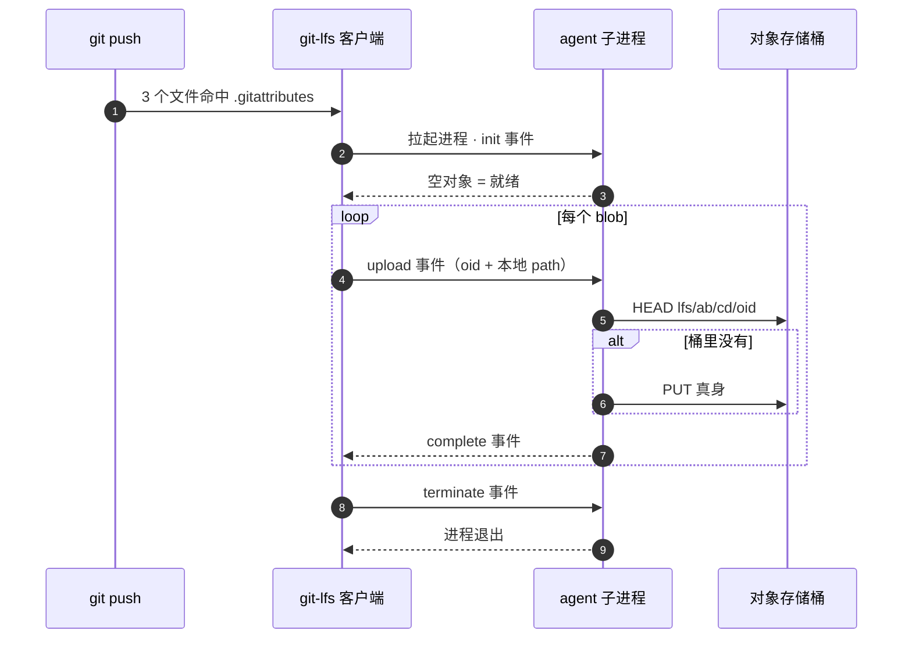

# 用自己的对象存储做 git-lfs 后端：不起服务，只要一个脚本

git-lfs 的存储后端是可插拔的 —— 不必买 GitHub 的 LFS 配额，也不必自建 LFS server。写一个 **standalone custom transfer agent** 就能把二进制真身指向自己的对象存储桶：git 在 push/pull 时把它当子进程拉起，stdin/stdout 上聊四种 JSON 事件，用完即退。**没有常驻进程，不监听端口，不需要域名和证书。**

本站就这么跑着，agent 是 140 行 Python，凭证复用项目 `.env`，零新依赖。这篇把机制、协议和可迁移的部分提炼出来；本站为什么走到这一步、以及具体的桶划分，在[部署实操手册 · 资源备份](cos-wiki-deploy/reference/deploy.md#媒体备份)。

## 为什么二进制不该进 git

git 的存储模型假设内容可 diff。图片、视频、字体、min.js 都不满足 —— 改一个像素就在历史里躺一份全量，而且**永远删不掉**（除非重写历史）。仓库只会单向变胖。

git-lfs 换掉的正是这一层：git 里只留一百来字节的指针文本，真身放外面。

```text
version https://git-lfs.github.com/spec/v1
oid sha256:4d7a214614ab2935c943f9e0ff69d22eadbb8f32b1258daaa5e2ca24d17e2393
size 12345
```

指针照常参与 commit、diff、merge、checkout —— **版本控制的语义完好，只是内容被挪到了别处**。别处在哪，由 transfer agent 说了算。

## 机制：standalone agent 把 LFS server 一起跳过了

git-lfs 默认的路子是两段：客户端先向 LFS API（`https://<host>/<repo>.git/info/lfs`）发 batch 请求，服务端回一批预签名 URL，客户端再照着 URL 传。这条路要有服务、有域名、有鉴权。

**custom transfer agent** 换掉的是第二段"传"。而配上 `lfs.standalonetransferagent` 之后，**第一段 batch 请求也一并跳过** —— git-lfs 不再联系任何服务端，把活儿整个交给本地程序：



**agent 是子进程不是服务**：push 完就死，不占内存、不用守护、不用 systemd。

## 协议：四种事件，JSON-lines

一行一个 JSON，stdin 进 stdout 出。全部协议就这四种事件（定义见 git-lfs 仓库的 [`docs/custom-transfers.md`](https://github.com/git-lfs/git-lfs/blob/main/docs/custom-transfers.md)）：

| 事件 | git-lfs → agent | agent → git-lfs |
|---|---|---|
| `init` | `operation`（upload/download）、`concurrent` 等一次性参数 | `{}` 表示就绪；失败回 `{"error":{"code":…,"message":…}}` |
| `upload` | `oid`、`size`、`path` —— **真身已经在本地这个路径上** | `{"event":"complete","oid":…}` |
| `download` | `oid`、`size` —— **没有 path，落盘是 agent 的活** | `{"event":"complete","oid":…,"path":"<落盘路径>"}` |
| `terminate` | 无字段 | 不回，直接退出 |

upload 和 download 的**不对称**是这套协议最容易读漏的地方：上传时 git-lfs 把真身准备好了，agent 只管读走；下载时 agent 要自己写出文件、把路径报回去，git-lfs 再把这个文件**移**进 `.git/lfs/objects`。

"移"是 rename 不是 copy —— 直接决定了临时文件该落在哪，见下面的坑。

## 实现：agent 只是个哑搬运工

难的部分 git-lfs 客户端全包了：并发、本地缓存（`.git/lfs/objects`）、sha256 完整性校验、增量判断（哪些 blob 需要传）。agent 剩下的活只有"把这个 oid 存进桶 / 从桶里取出来"。

四个设计点值得单独说。

### 内容寻址：sha256 分两级目录

```python
def key(self, oid):
    # 内容寻址：sha256 前两级做目录，避免单层百万对象
    return f"{self.prefix}/{oid[:2]}/{oid[2:4]}/{oid}"
```

oid 就是文件内容的 sha256，git-lfs 直接给。用它当 key 白送三个性质：**去重**（同一张图出现在几篇文章、几个历史版本里，桶里只有一份）、**幂等**（重复 push 秒过）、**全历史可还原**（桶只增不减，checkout 任意旧 commit，当时的图原样回来）。

分两级目录是给对象存储的控制台和批量工具留活路 —— 百万对象平铺在单层前缀下，列举会很难受。

### 上传前先 HEAD

内容寻址下 oid 相同则内容必然相同，所以桶里已有就直接回 complete，不重传。git-lfs 自己也会算增量，但它的判断基于本地状态；HEAD 一次是站在桶这边的兜底 —— 换台机器、重置历史、重复 push 都不会白传。

### 下载的临时文件必须跟仓库同一个文件系统

git-lfs 拿到 agent 报的 path 之后是 **rename** 进 `.git/lfs/objects`。临时文件落在 `/tmp` 而仓库在另一块盘上，rename 直接失败（`EXDEV: cross-device link`），而且报错信息不会指向真正的原因。

所以 agent 先问 git 要 `.git` 的绝对路径，把临时文件落在 `.git/lfs/tmp/`：

```python
gitdir = subprocess.check_output(
    ["git", "rev-parse", "--absolute-git-dir"], text=True
).strip()
self.tmpdir = Path(gitdir) / "lfs" / "tmp"
```

### 不用管并发

agent 串行读 stdin 就行。git-lfs 的并发是**多开几个 agent 进程**，不是往一个进程里塞多个请求。所以不需要线程、不需要锁，一个 `for line in sys.stdin` 到底。

代价是进度条：agent 可以选择不发 `progress` 事件，于是 push 时显示 `0 B/s`。传输本身正常，只是没人报数。

??? abstract "`scripts/lfs-cos-agent.py` —— 完整 agent（~140 行，腾讯云 COS 后端）"

    ```python
    --8<-- "scripts/lfs-cos-agent.py"
    ```

## 接入：三行 git config

```bash
git lfs install --local
git config lfs.customtransfer.cos.path "$PROJECT_DIR/.venv/bin/python"
git config lfs.customtransfer.cos.args "$PROJECT_DIR/scripts/lfs-cos-agent.py lfs"
git config lfs.standalonetransferagent cos
```

`cos` 只是自取的 agent 名字，三处对上即可。`path` 指解释器、`args` 第一项指脚本，是为了不依赖 shebang 和 PATH —— 虚拟环境里的 Python 直接点名。

**这几行只能落本地 git config，写不进仓库里的 `.lfsconfig`。** git-lfs 出于安全不从仓库读 agent 路径 —— 否则 clone 一个陌生仓库就等于执行它指定的任意程序。代价是每台机器、每个 clone 要跑一次接入脚本；收益是 clone 别人的仓库永远不会被静默拉起程序。这笔账值。

哪些文件走 LFS 由 `.gitattributes` 划定，这个是随仓库走的：

```text
*.png  filter=lfs diff=lfs merge=lfs -text
*.woff2 filter=lfs diff=lfs merge=lfs -text
docs/vendor/echarts/** filter=lfs diff=lfs merge=lfs -text
```

分界线不是"大小"，是**文本性**：diff 有意义的进 git（md、svg、代码），diff 无意义的进 LFS（位图、视频、字体、第三方 min.js）。规则写好之后加新文件零操作，`git add` 自动接管。

??? abstract "`scripts/setup-lfs.sh` —— 每个 clone 一次性接入"

    ```bash
    --8<-- "scripts/setup-lfs.sh"
    ```

### 新机器三步

```bash
GIT_LFS_SKIP_SMUDGE=1 git clone <repo> && cd <repo>
bash scripts/setup-lfs.sh     # 把 agent 注册进这个 clone 的 git config
git lfs pull                  # 还原全部真身
```

第一步的 `GIT_LFS_SKIP_SMUDGE=1` 不是可选项：clone 的那一刻 agent 还没注册，git-lfs 会去联系默认后端（GitHub 的 LFS 服务）然后扑空 —— 那边从来没收到过这些对象。跳过 smudge 让 clone 先拿到指针，接入之后再 `git lfs pull` 一次取回。

## 换成 S3 / MinIO / R2 / OSS

只有三个调用碰 SDK，其余都是协议层，一行不用改：

| 动作 | 腾讯云 `qcloud_cos` | `boto3`（S3 / MinIO / R2） |
|---|---|---|
| 存在性 | `client.object_exists(Bucket, Key)` | `head_object`，捕 `ClientError` 的 404 |
| 上传 | `upload_file(Bucket, Key, LocalFilePath)` | `upload_file(Filename, Bucket, Key)` |
| 下载 | `download_file(Bucket, Key, DestFilePath)` | `download_file(Bucket, Key, Filename)` |

任何提供"存在性 + 上传 + 下载"三件套的存储都能当后端 —— 换成 WebDAV、NAS 挂载点甚至另一台机器的 rsync 目标，协议这边完全无感。

## 这套方案不适合谁

- **要给不持钥的人开放协作**：agent 直接拿密钥读写桶，凡是碰媒体的机器都得有密钥。真要开放，得把存储层搬进一个签发预签名 URL 的 LFS Batch API 服务 —— 升级路径是平滑的（三个存储调用原样搬过去），但那就重新变成"要起服务"了。
- **要压存储成本**：内容寻址的桶只增不减，历史版本永久保留。这既是"全历史可还原"的来源，也是账单的来源。
- **历史里已经躺着大文件**：换 agent 只管新增。旧的胖历史得 `git lfs migrate` 或者重置历史才能瘦下来。

多机分发建议开子账号（腾讯云 CAM / AWS IAM），只授权这一个桶的读写，主密钥不离开主机。

纯文字协作者倒是零成本：`GIT_LFS_SKIP_SMUDGE=1` clone 之后**不需要任何密钥**，工作区里图片是指针文本，md 照常编辑、照常 push —— 只是本地看不了图。

---

活例是本站自己：全部图片、视频、字体和第三方 vendor 真身都走这条链路，GitHub 上只有文本和指针。演进过程（塞 git → 手动镜像 → 现在这套）和它带来的写作链路变化，见[部署实操手册 · 资源备份](cos-wiki-deploy/reference/deploy.md#媒体备份)与[建站手记](cos-wiki-deploy/reference/wiki-build-log.md)。
